Contents
========

* [PRA2601 > Adafruit RGB Matrix Shield PCB](#pra2601--adafruit-rgb-matrix-shield-pcb)
	* [Schematic](#schematic)
	* [PCB](#pcb)
	* [Interactive BOM](#interactive-bom)
	* [OOMP Parts](#oomp-parts)
	* [Images](#images)
	* [Tags](#tags)
  
![][im]
# PRA2601 > Adafruit RGB Matrix Shield PCB

- ID: PROJ-ADAF-2601-STAN-01
- Hex ID: PRA2601
- Name: Adafruit 2601
- Description: Adafruit 2601
- Long Link: [http://oom.lt/PROJ-ADAF-2601-STAN-01](http://oom.lt/PROJ-ADAF-2601-STAN-01)
- Short Link: [http://oom.lt/PRA2601](http://oom.lt/PRA2601)

## Schematic
  
[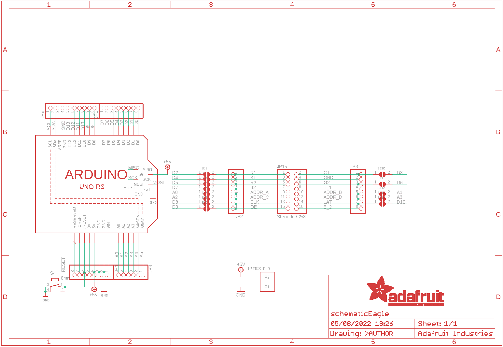](eagleSchemImage.png)
## PCB
  
[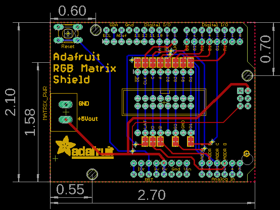](eagleImage.png)
## Interactive BOM

- Interactive BOM page: [ibom.html](https://htmlpreview.github.io/?https://github.com/oomlout/oomlout_OOMP_projects/blob/main/PROJ-ADAF-2601-STAN-01/kicad/bom/ibom.html)

## OOMP Parts
  

|OOMP ID|Name|Identifier|
| :---: | :---: | :---: |
|[HEAD-I01-X-PI08-01](https://github.com/oomlout/oomlout_OOMP_parts/tree/main/HEAD-I01-X-PI08-01/)|[2.54 mm 8 Pin Header](https://github.com/oomlout/oomlout_OOMP_parts/tree/main/HEAD-I01-X-PI08-01/)|[JP1, JP2, JP3, JP4](https://github.com/oomlout/oomlout_OOMP_parts/tree/main/HEAD-I01-X-PI08-01/)|
|[HEAD-I01-X-PI10-01](https://github.com/oomlout/oomlout_OOMP_parts/tree/main/HEAD-I01-X-PI10-01/)|[2.54 mm 10 Pin Header](https://github.com/oomlout/oomlout_OOMP_parts/tree/main/HEAD-I01-X-PI10-01/)|[JP6](https://github.com/oomlout/oomlout_OOMP_parts/tree/main/HEAD-I01-X-PI10-01/)|
|[HEAD-I01-X-PI06-01](https://github.com/oomlout/oomlout_OOMP_parts/tree/main/HEAD-I01-X-PI06-01/)|[2.54 mm 6 Pin Header](https://github.com/oomlout/oomlout_OOMP_parts/tree/main/HEAD-I01-X-PI06-01/)|[JP8](https://github.com/oomlout/oomlout_OOMP_parts/tree/main/HEAD-I01-X-PI06-01/)|
|HEAD-I01-X-PI2X08-01||JP15|
|UNMATCHED-UNMATCHED-X-UNMATCHED-01||MATRIX_PWR, S4, U$41|

## Images
  
  

|bominteractivefront|bominteractiveback|kicadPcb3d|kicadPcb3dFront|kicadPcb3dBack|kicadSchem|eagleImage|eagleSchemImage|pcbdraw|pcbdrawback|
| :---: | :---: | :---: | :---: | :---: | :---: | :---: | :---: | :---: | :---: |
|[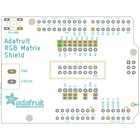](bomFront.png)|[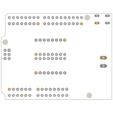](bomBack.png)|[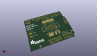](kicadPcb3d.png)|[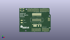](kicadPcb3dFront.png)|[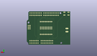](kicadPcb3dBack.png)|[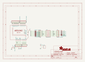](kicadSchem.png)|[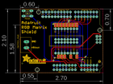](eagleImage.png)|[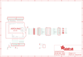](eagleSchemImage.png)|[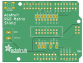](pcbdraw.png)|[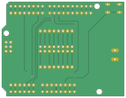](pcbdrawBack.png)|

## Tags

- hexID: PRA2601
- oompType: PROJ
- oompSize: ADAF
- oompColor: 2601
- oompDesc: STAN
- oompIndex: 01
- oompName: Adafruit RGB Matrix Shield PCB
- sources: All source files from https://github.com/adafruit/Adafruit-RGB-Matrix-Shield-PCB (source licence details in srcLicense.md)
- linkBuyPage: http://www.adafruit.com/products/2601
- oompID: PROJ-ADAF-2601-STAN-01
- oompParts: JP1,HEAD-I01-X-PI08-01
- oompParts: JP2,HEAD-I01-X-PI08-01
- oompParts: JP3,HEAD-I01-X-PI08-01
- oompParts: JP4,HEAD-I01-X-PI08-01
- oompParts: JP6,HEAD-I01-X-PI10-01
- oompParts: JP8,HEAD-I01-X-PI06-01
- oompParts: JP15,HEAD-I01-X-PI2X08-01
- oompParts: MATRIX_PWR,UNMATCHED-UNMATCHED-X-UNMATCHED-01
- oompParts: S4,UNMATCHED-UNMATCHED-X-UNMATCHED-01
- oompParts: U$41,UNMATCHED-UNMATCHED-X-UNMATCHED-01
- rawParts: JP1,,PINHD-1X8CLEANBIG,1X08-CLEANBIG,PIN HEADER,,,,,
- rawParts: JP2,,HEADER-1X876MIL,1X08_ROUND_76,PIN HEADER,,,,,
- rawParts: JP3,,HEADER-1X876MIL,1X08_ROUND_76,PIN HEADER,,,,,
- rawParts: JP4,,PINHD-1X8CLEANBIG,1X08-CLEANBIG,PIN HEADER,,,,,
- rawParts: JP6,,HEADER-1X1070MIL,1X10_ROUND70,PIN HEADER,,,,,
- rawParts: JP8,,PINHD-1X6CB,1X06-CLEANBIG,PIN HEADER,,,,,
- rawParts: JP15,Shrouded 2x8,HEADER-2X8_SHROUDED,2X08_SHROUDED,,,,,,
- rawParts: MATRIX_PWR,PINHEAD,PINHEAD,TERMBLOCK508,,,,,,
- rawParts: S4,6mm,10-XX,B3F-10XX,OMRON SWITCH,,B3F-1000,176432,36M3542,
- rawParts: SJ1,,SOLDERJUMPERCLOSED,SOLDERJUMPER_CLOSEDWIRE,SMD Solder JUMPER,,,,,
- rawParts: SJ2,,SOLDERJUMPERCLOSED,SOLDERJUMPER_CLOSEDWIRE,SMD Solder JUMPER,,,,,
- rawParts: SJ3,,SOLDERJUMPERCLOSED,SOLDERJUMPER_CLOSEDWIRE,SMD Solder JUMPER,,,,,
- rawParts: SJ4,,SOLDERJUMPERCLOSED,SOLDERJUMPER_CLOSEDWIRE,SMD Solder JUMPER,,,,,
- rawParts: SJ5,,SOLDERJUMPERCLOSED,SOLDERJUMPER_CLOSEDWIRE,SMD Solder JUMPER,,,,,
- rawParts: SJ6,,SOLDERJUMPERCLOSED,SOLDERJUMPER_CLOSEDWIRE,SMD Solder JUMPER,,,,,
- rawParts: SJ7,,SOLDERJUMPERCLOSED,SOLDERJUMPER_CLOSEDWIRE,SMD Solder JUMPER,,,,,
- rawParts: SJ8,,SOLDERJUMPERCLOSED,SOLDERJUMPER_CLOSEDWIRE,SMD Solder JUMPER,,,,,
- rawParts: SJ9,,SOLDERJUMPERCLOSED,SOLDERJUMPER_CLOSEDWIRE,SMD Solder JUMPER,,,,,
- rawParts: SJ10,,SOLDERJUMPERCLOSED,SOLDERJUMPER_CLOSEDWIRE,SMD Solder JUMPER,,,,,
- rawParts: SJ12,,SOLDERJUMPERCLOSED,SOLDERJUMPER_CLOSEDWIRE,SMD Solder JUMPER,,,,,
- rawParts: SJ13,,SOLDERJUMPERCLOSED,SOLDERJUMPER_CLOSEDWIRE,SMD Solder JUMPER,,,,,
- rawParts: SJ14,,SOLDERJUMPERCLOSED,SOLDERJUMPER_CLOSEDWIRE,SMD Solder JUMPER,,,,,
- rawParts: U$41,ARDUINO_R3_ICSP_NODIM,ARDUINO_R3_ICSP_NODIM,ARDUINOR3_ICSP_NODIM,,,,,,

[im]: kicadPcb3d_450.png
