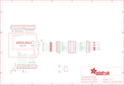

Contents
========

* [PRA2601 > Adafruit](#pra2601--adafruit)
	* [Schematic](#schematic)
	* [Interactive BOM](#interactive-bom)
	* [OOMP Parts](#oomp-parts)
	* [Images](#images)
	* [Tags](#tags)
  
![][im]
# PRA2601 > Adafruit

- ID: PROJ-ADAF-2601-STAN-01
- Hex ID: PRA2601
- Name: Adafruit
- Description: Adafruit
- Long Link: [http://oom.lt/PROJ-ADAF-2601-STAN-01](http://oom.lt/PROJ-ADAF-2601-STAN-01)
- Long Link: [http://oom.lt/PRA2601](http://oom.lt/PRA2601)

## Schematic
  
![][schem]
## Interactive BOM

- Interactive BOM page: [ibom.html](https://htmlpreview.github.io/?https://github.com/oomlout/oomlout_OOMP_projects/blob/main/PROJ-ADAF-2601-STAN-01/kicad/bom/ibom.html)

## OOMP Parts
  

|OOMP Parts|
| :---: |
|JP1,UNMATCHED-UNMATCHED-UNMATCHED-UNMATCHED-UNMATCHED,JP1,,PINHD-1X8CLEANBIG,1X08-CLEANBIG,PIN HEADER,,,,,|
|JP2,UNMATCHED-UNMATCHED-UNMATCHED-UNMATCHED-UNMATCHED,JP2,,HEADER-1X876MIL,1X08_ROUND_76,PIN HEADER,,,,,|
|JP3,UNMATCHED-UNMATCHED-UNMATCHED-UNMATCHED-UNMATCHED,JP3,,HEADER-1X876MIL,1X08_ROUND_76,PIN HEADER,,,,,|
|JP4,UNMATCHED-UNMATCHED-UNMATCHED-UNMATCHED-UNMATCHED,JP4,,PINHD-1X8CLEANBIG,1X08-CLEANBIG,PIN HEADER,,,,,|
|JP6,UNMATCHED-UNMATCHED-UNMATCHED-UNMATCHED-UNMATCHED,JP6,,HEADER-1X1070MIL,1X10_ROUND70,PIN HEADER,,,,,|
|JP8,UNMATCHED-UNMATCHED-UNMATCHED-UNMATCHED-UNMATCHED,JP8,,PINHD-1X6CB,1X06-CLEANBIG,PIN HEADER,,,,,|
|JP15,UNMATCHED-UNMATCHED-UNMATCHED-UNMATCHED-UNMATCHED,JP15,Shrouded 2x8,HEADER-2X8_SHROUDED,2X08_SHROUDED,,,,,,|
|MATRIX_PWR,UNMATCHED-UNMATCHED-UNMATCHED-UNMATCHED-UNMATCHED,MATRIX_PWR,PINHEAD,PINHEAD,TERMBLOCK508,,,,,,|
|S4,UNMATCHED-UNMATCHED-UNMATCHED-UNMATCHED-UNMATCHED,S4,6mm,10-XX,B3F-10XX,OMRON SWITCH,,B3F-1000,176432,36M3542,|
|SJ1,UNMATCHED-UNMATCHED-UNMATCHED-UNMATCHED-UNMATCHED,SJ1,,SOLDERJUMPERCLOSED,SOLDERJUMPER_CLOSEDWIRE,SMD Solder JUMPER,,,,,|
|SJ2,UNMATCHED-UNMATCHED-UNMATCHED-UNMATCHED-UNMATCHED,SJ2,,SOLDERJUMPERCLOSED,SOLDERJUMPER_CLOSEDWIRE,SMD Solder JUMPER,,,,,|
|SJ3,UNMATCHED-UNMATCHED-UNMATCHED-UNMATCHED-UNMATCHED,SJ3,,SOLDERJUMPERCLOSED,SOLDERJUMPER_CLOSEDWIRE,SMD Solder JUMPER,,,,,|
|SJ4,UNMATCHED-UNMATCHED-UNMATCHED-UNMATCHED-UNMATCHED,SJ4,,SOLDERJUMPERCLOSED,SOLDERJUMPER_CLOSEDWIRE,SMD Solder JUMPER,,,,,|
|SJ5,UNMATCHED-UNMATCHED-UNMATCHED-UNMATCHED-UNMATCHED,SJ5,,SOLDERJUMPERCLOSED,SOLDERJUMPER_CLOSEDWIRE,SMD Solder JUMPER,,,,,|
|SJ6,UNMATCHED-UNMATCHED-UNMATCHED-UNMATCHED-UNMATCHED,SJ6,,SOLDERJUMPERCLOSED,SOLDERJUMPER_CLOSEDWIRE,SMD Solder JUMPER,,,,,|
|SJ7,UNMATCHED-UNMATCHED-UNMATCHED-UNMATCHED-UNMATCHED,SJ7,,SOLDERJUMPERCLOSED,SOLDERJUMPER_CLOSEDWIRE,SMD Solder JUMPER,,,,,|
|SJ8,UNMATCHED-UNMATCHED-UNMATCHED-UNMATCHED-UNMATCHED,SJ8,,SOLDERJUMPERCLOSED,SOLDERJUMPER_CLOSEDWIRE,SMD Solder JUMPER,,,,,|
|SJ9,UNMATCHED-UNMATCHED-UNMATCHED-UNMATCHED-UNMATCHED,SJ9,,SOLDERJUMPERCLOSED,SOLDERJUMPER_CLOSEDWIRE,SMD Solder JUMPER,,,,,|
|SJ10,UNMATCHED-UNMATCHED-UNMATCHED-UNMATCHED-UNMATCHED,SJ10,,SOLDERJUMPERCLOSED,SOLDERJUMPER_CLOSEDWIRE,SMD Solder JUMPER,,,,,|
|SJ12,UNMATCHED-UNMATCHED-UNMATCHED-UNMATCHED-UNMATCHED,SJ12,,SOLDERJUMPERCLOSED,SOLDERJUMPER_CLOSEDWIRE,SMD Solder JUMPER,,,,,|
|SJ13,UNMATCHED-UNMATCHED-UNMATCHED-UNMATCHED-UNMATCHED,SJ13,,SOLDERJUMPERCLOSED,SOLDERJUMPER_CLOSEDWIRE,SMD Solder JUMPER,,,,,|
|SJ14,UNMATCHED-UNMATCHED-UNMATCHED-UNMATCHED-UNMATCHED,SJ14,,SOLDERJUMPERCLOSED,SOLDERJUMPER_CLOSEDWIRE,SMD Solder JUMPER,,,,,|
|U$41,UNMATCHED-UNMATCHED-UNMATCHED-UNMATCHED-UNMATCHED,U$41,ARDUINO_R3_ICSP_NODIM,ARDUINO_R3_ICSP_NODIM,ARDUINOR3_ICSP_NODIM,,,,,,|

## Images
  
  

|kicadPcb3d|kicadPcb3dFront|kicadPcb3dBack|eagleImage|eagleSchemImage|
| :---: | :---: | :---: | :---: | :---: |
||||||

## Tags

- hexID: PRA2601
- oompType: PROJ
- oompSize: ADAF
- oompColor: 2601
- oompDesc: STAN
- oompIndex: 01
- oompName: Adafruit RGB Matrix Shield PCB
- sources: All source files from https://github.com/adafruit/Adafruit-RGB-Matrix-Shield-PCB (source licence details in srcLicense.md)
- linkBuyPage: http://www.adafruit.com/products/2601
- oompID: PROJ-ADAF-2601-STAN-01
- oompParts: JP1,UNMATCHED-UNMATCHED-UNMATCHED-UNMATCHED-UNMATCHED
- oompParts: JP2,UNMATCHED-UNMATCHED-UNMATCHED-UNMATCHED-UNMATCHED
- oompParts: JP3,UNMATCHED-UNMATCHED-UNMATCHED-UNMATCHED-UNMATCHED
- oompParts: JP4,UNMATCHED-UNMATCHED-UNMATCHED-UNMATCHED-UNMATCHED
- oompParts: JP6,UNMATCHED-UNMATCHED-UNMATCHED-UNMATCHED-UNMATCHED
- oompParts: JP8,UNMATCHED-UNMATCHED-UNMATCHED-UNMATCHED-UNMATCHED
- oompParts: JP15,UNMATCHED-UNMATCHED-UNMATCHED-UNMATCHED-UNMATCHED
- oompParts: MATRIX_PWR,UNMATCHED-UNMATCHED-UNMATCHED-UNMATCHED-UNMATCHED
- oompParts: S4,UNMATCHED-UNMATCHED-UNMATCHED-UNMATCHED-UNMATCHED
- oompParts: SJ1,UNMATCHED-UNMATCHED-UNMATCHED-UNMATCHED-UNMATCHED
- oompParts: SJ2,UNMATCHED-UNMATCHED-UNMATCHED-UNMATCHED-UNMATCHED
- oompParts: SJ3,UNMATCHED-UNMATCHED-UNMATCHED-UNMATCHED-UNMATCHED
- oompParts: SJ4,UNMATCHED-UNMATCHED-UNMATCHED-UNMATCHED-UNMATCHED
- oompParts: SJ5,UNMATCHED-UNMATCHED-UNMATCHED-UNMATCHED-UNMATCHED
- oompParts: SJ6,UNMATCHED-UNMATCHED-UNMATCHED-UNMATCHED-UNMATCHED
- oompParts: SJ7,UNMATCHED-UNMATCHED-UNMATCHED-UNMATCHED-UNMATCHED
- oompParts: SJ8,UNMATCHED-UNMATCHED-UNMATCHED-UNMATCHED-UNMATCHED
- oompParts: SJ9,UNMATCHED-UNMATCHED-UNMATCHED-UNMATCHED-UNMATCHED
- oompParts: SJ10,UNMATCHED-UNMATCHED-UNMATCHED-UNMATCHED-UNMATCHED
- oompParts: SJ12,UNMATCHED-UNMATCHED-UNMATCHED-UNMATCHED-UNMATCHED
- oompParts: SJ13,UNMATCHED-UNMATCHED-UNMATCHED-UNMATCHED-UNMATCHED
- oompParts: SJ14,UNMATCHED-UNMATCHED-UNMATCHED-UNMATCHED-UNMATCHED
- oompParts: U$41,UNMATCHED-UNMATCHED-UNMATCHED-UNMATCHED-UNMATCHED
- rawParts: JP1,,PINHD-1X8CLEANBIG,1X08-CLEANBIG,PIN HEADER,,,,,
- rawParts: JP2,,HEADER-1X876MIL,1X08_ROUND_76,PIN HEADER,,,,,
- rawParts: JP3,,HEADER-1X876MIL,1X08_ROUND_76,PIN HEADER,,,,,
- rawParts: JP4,,PINHD-1X8CLEANBIG,1X08-CLEANBIG,PIN HEADER,,,,,
- rawParts: JP6,,HEADER-1X1070MIL,1X10_ROUND70,PIN HEADER,,,,,
- rawParts: JP8,,PINHD-1X6CB,1X06-CLEANBIG,PIN HEADER,,,,,
- rawParts: JP15,Shrouded 2x8,HEADER-2X8_SHROUDED,2X08_SHROUDED,,,,,,
- rawParts: MATRIX_PWR,PINHEAD,PINHEAD,TERMBLOCK508,,,,,,
- rawParts: S4,6mm,10-XX,B3F-10XX,OMRON SWITCH,,B3F-1000,176432,36M3542,
- rawParts: SJ1,,SOLDERJUMPERCLOSED,SOLDERJUMPER_CLOSEDWIRE,SMD Solder JUMPER,,,,,
- rawParts: SJ2,,SOLDERJUMPERCLOSED,SOLDERJUMPER_CLOSEDWIRE,SMD Solder JUMPER,,,,,
- rawParts: SJ3,,SOLDERJUMPERCLOSED,SOLDERJUMPER_CLOSEDWIRE,SMD Solder JUMPER,,,,,
- rawParts: SJ4,,SOLDERJUMPERCLOSED,SOLDERJUMPER_CLOSEDWIRE,SMD Solder JUMPER,,,,,
- rawParts: SJ5,,SOLDERJUMPERCLOSED,SOLDERJUMPER_CLOSEDWIRE,SMD Solder JUMPER,,,,,
- rawParts: SJ6,,SOLDERJUMPERCLOSED,SOLDERJUMPER_CLOSEDWIRE,SMD Solder JUMPER,,,,,
- rawParts: SJ7,,SOLDERJUMPERCLOSED,SOLDERJUMPER_CLOSEDWIRE,SMD Solder JUMPER,,,,,
- rawParts: SJ8,,SOLDERJUMPERCLOSED,SOLDERJUMPER_CLOSEDWIRE,SMD Solder JUMPER,,,,,
- rawParts: SJ9,,SOLDERJUMPERCLOSED,SOLDERJUMPER_CLOSEDWIRE,SMD Solder JUMPER,,,,,
- rawParts: SJ10,,SOLDERJUMPERCLOSED,SOLDERJUMPER_CLOSEDWIRE,SMD Solder JUMPER,,,,,
- rawParts: SJ12,,SOLDERJUMPERCLOSED,SOLDERJUMPER_CLOSEDWIRE,SMD Solder JUMPER,,,,,
- rawParts: SJ13,,SOLDERJUMPERCLOSED,SOLDERJUMPER_CLOSEDWIRE,SMD Solder JUMPER,,,,,
- rawParts: SJ14,,SOLDERJUMPERCLOSED,SOLDERJUMPER_CLOSEDWIRE,SMD Solder JUMPER,,,,,
- rawParts: U$41,ARDUINO_R3_ICSP_NODIM,ARDUINO_R3_ICSP_NODIM,ARDUINOR3_ICSP_NODIM,,,,,,

[im]: kicadPcb3d_450.png
[schem]: eagleSchemImage.png
