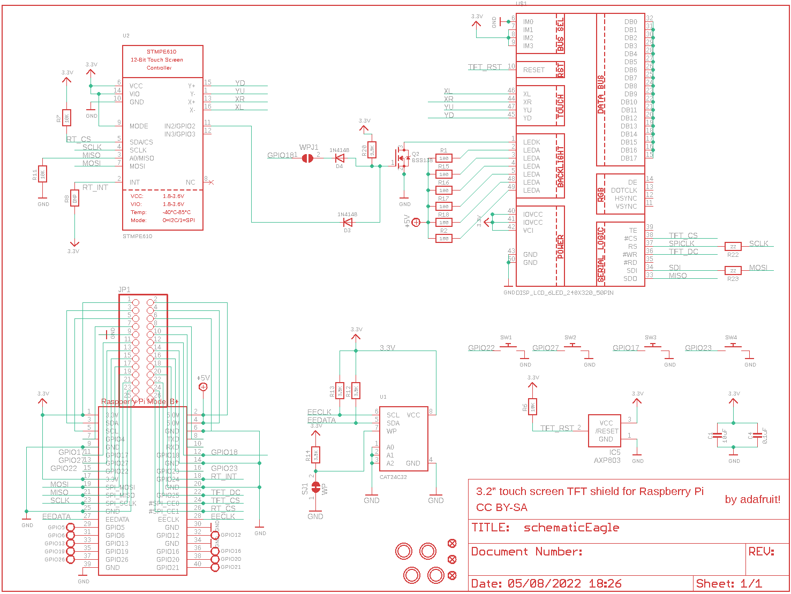
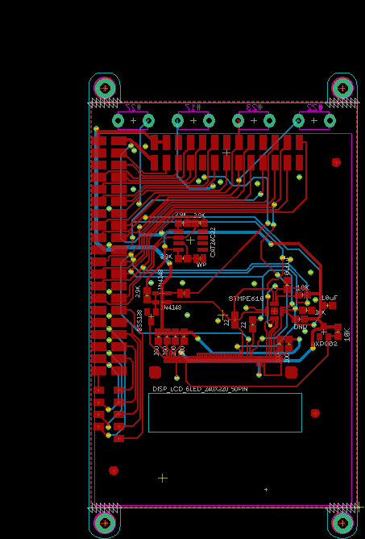
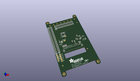
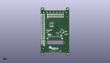
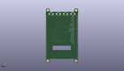
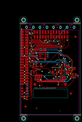
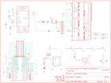

Contents
========

* [PRA2616 > Adafruit PiTFT Plus 3.2 PCB](#pra2616--adafruit-pitft-plus-32-pcb)
	* [Schematic](#schematic)
	* [PCB](#pcb)
	* [Interactive BOM](#interactive-bom)
	* [OOMP Parts](#oomp-parts)
	* [Images](#images)
	* [Tags](#tags)
  
![][im]
# PRA2616 > Adafruit PiTFT Plus 3.2 PCB

- ID: PROJ-ADAF-2616-STAN-01
- Hex ID: PRA2616
- Name: Adafruit
- Description: Adafruit
- Long Link: [http://oom.lt/PROJ-ADAF-2616-STAN-01](http://oom.lt/PROJ-ADAF-2616-STAN-01)
- Short Link: [http://oom.lt/PRA2616](http://oom.lt/PRA2616)

## Schematic
  

## PCB
  

## Interactive BOM

- Interactive BOM page: [ibom.html](https://htmlpreview.github.io/?https://github.com/oomlout/oomlout_OOMP_projects/blob/main/PROJ-ADAF-2616-STAN-01/kicad/bom/ibom.html)

## OOMP Parts
  

|OOMP Parts|
| :---: |
|[C1 CAPC-0805-X-UF10-V10 SMD (0805) 10 uF Capacitor (Ceramic) 10v](https://github.com/oomlout/oomlout_OOMP_parts/tree/main/CAPC-0805-X-UF10-V10/)|
|C4 C4,CAPC-0805-X-UF1D-01|
|[D3 DIOD-S323-X-K4148-01 SMD (SOD-323) Diode](https://github.com/oomlout/oomlout_OOMP_parts/tree/main/DIOD-S323-X-K4148-01/)|
|[D4 DIOD-S323-X-K4148-01 SMD (SOD-323) Diode](https://github.com/oomlout/oomlout_OOMP_parts/tree/main/DIOD-S323-X-K4148-01/)|
|GPIO5 GPIO5,UNMATCHED-UNMATCHED-X-UNMATCHED-01|
|GPIO6 GPIO6,UNMATCHED-UNMATCHED-X-UNMATCHED-01|
|GPIO12 GPIO12,UNMATCHED-UNMATCHED-X-UNMATCHED-01|
|GPIO13 GPIO13,UNMATCHED-UNMATCHED-X-UNMATCHED-01|
|GPIO16 GPIO16,UNMATCHED-UNMATCHED-X-UNMATCHED-01|
|GPIO19 GPIO19,UNMATCHED-UNMATCHED-X-UNMATCHED-01|
|GPIO20 GPIO20,UNMATCHED-UNMATCHED-X-UNMATCHED-01|
|GPIO21 GPIO21,UNMATCHED-UNMATCHED-X-UNMATCHED-01|
|GPIO26 GPIO26,UNMATCHED-UNMATCHED-X-UNMATCHED-01|
|IC5 IC5,UNMATCHED-SO23-X-UNMATCHED-01|
|JP1 JP1,HEAD-I01-X-UNMATCHED-01|
|[Q2 MOSN-SO23-X-KBSS138-01 SMD (SOT-23) BSS138 N-Ch. MOSFET](https://github.com/oomlout/oomlout_OOMP_parts/tree/main/MOSN-SO23-X-KBSS138-01/)|
|[R1 RESE-0805-X-O101-01 SMD (0805) 100 Ohm Resistor](https://github.com/oomlout/oomlout_OOMP_parts/tree/main/RESE-0805-X-O101-01/)|
|[R2 RESE-0805-X-O101-01 SMD (0805) 100 Ohm Resistor](https://github.com/oomlout/oomlout_OOMP_parts/tree/main/RESE-0805-X-O101-01/)|
|[R6 RESE-0805-X-O103-01 SMD (0805) 10k Ohm Resistor](https://github.com/oomlout/oomlout_OOMP_parts/tree/main/RESE-0805-X-O103-01/)|
|[R7 RESE-0805-X-O103-01 SMD (0805) 10k Ohm Resistor](https://github.com/oomlout/oomlout_OOMP_parts/tree/main/RESE-0805-X-O103-01/)|
|R8 R8,RESE-0805-X-UNMATCHED-01|
|[R11 RESE-0805-X-O103-01 SMD (0805) 10k Ohm Resistor](https://github.com/oomlout/oomlout_OOMP_parts/tree/main/RESE-0805-X-O103-01/)|
|R12 R12,RESE-0805-X-O392-01|
|R13 R13,RESE-0805-X-O392-01|
|R14 R14,RESE-0805-X-O392-01|
|[R15 RESE-0805-X-O101-01 SMD (0805) 100 Ohm Resistor](https://github.com/oomlout/oomlout_OOMP_parts/tree/main/RESE-0805-X-O101-01/)|
|[R16 RESE-0805-X-O101-01 SMD (0805) 100 Ohm Resistor](https://github.com/oomlout/oomlout_OOMP_parts/tree/main/RESE-0805-X-O101-01/)|
|[R17 RESE-0805-X-O101-01 SMD (0805) 100 Ohm Resistor](https://github.com/oomlout/oomlout_OOMP_parts/tree/main/RESE-0805-X-O101-01/)|
|[R18 RESE-0805-X-O101-01 SMD (0805) 100 Ohm Resistor](https://github.com/oomlout/oomlout_OOMP_parts/tree/main/RESE-0805-X-O101-01/)|
|R20 R20,RESE-0805-X-O392-01|
|[R22 RESE-0805-X-O220-01 SMD (0805) 22 Ohm Resistor](https://github.com/oomlout/oomlout_OOMP_parts/tree/main/RESE-0805-X-O220-01/)|
|[R23 RESE-0805-X-O220-01 SMD (0805) 22 Ohm Resistor](https://github.com/oomlout/oomlout_OOMP_parts/tree/main/RESE-0805-X-O220-01/)|
|RPI1 RPI1,UNMATCHED-UNMATCHED-X-UNMATCHED-01|
|SW1 SW1,UNMATCHED-UNMATCHED-X-UNMATCHED-01|
|SW2 SW2,UNMATCHED-UNMATCHED-X-UNMATCHED-01|
|SW3 SW3,UNMATCHED-UNMATCHED-X-UNMATCHED-01|
|SW4 SW4,UNMATCHED-UNMATCHED-X-UNMATCHED-01|
|U$1 U$1,UNMATCHED-UNMATCHED-X-UNMATCHED-01|
|U1 U1,UNMATCHED-UNMATCHED-X-UNMATCHED-01|
|U2 U2,UNMATCHED-UNMATCHED-X-UNMATCHED-01|

## Images
  
  

|kicadPcb3d|kicadPcb3dFront|kicadPcb3dBack|eagleImage|eagleSchemImage|
| :---: | :---: | :---: | :---: | :---: |
||||||

## Tags

- hexID: PRA2616
- oompType: PROJ
- oompSize: ADAF
- oompColor: 2616
- oompDesc: STAN
- oompIndex: 01
- oompName: Adafruit PiTFT Plus 3.2 PCB
- sources: All source files from https://github.com/adafruit/Adafruit-PiTFT-Plus-3.2-PCB (source licence details in srcLicense.md)
- linkBuyPage: http://www.adafruit.com/products/2616
- oompID: PROJ-ADAF-2616-STAN-01
- oompParts: C1,CAPC-0805-X-UF10-V10
- oompParts: C4,CAPC-0805-X-UF1D-01
- oompParts: D3,DIOD-S323-X-K4148-01
- oompParts: D4,DIOD-S323-X-K4148-01
- oompParts: GPIO5,UNMATCHED-UNMATCHED-X-UNMATCHED-01
- oompParts: GPIO6,UNMATCHED-UNMATCHED-X-UNMATCHED-01
- oompParts: GPIO12,UNMATCHED-UNMATCHED-X-UNMATCHED-01
- oompParts: GPIO13,UNMATCHED-UNMATCHED-X-UNMATCHED-01
- oompParts: GPIO16,UNMATCHED-UNMATCHED-X-UNMATCHED-01
- oompParts: GPIO19,UNMATCHED-UNMATCHED-X-UNMATCHED-01
- oompParts: GPIO20,UNMATCHED-UNMATCHED-X-UNMATCHED-01
- oompParts: GPIO21,UNMATCHED-UNMATCHED-X-UNMATCHED-01
- oompParts: GPIO26,UNMATCHED-UNMATCHED-X-UNMATCHED-01
- oompParts: IC5,UNMATCHED-SO23-X-UNMATCHED-01
- oompParts: JP1,HEAD-I01-X-UNMATCHED-01
- oompParts: Q2,MOSN-SO23-X-KBSS138-01
- oompParts: R1,RESE-0805-X-O101-01
- oompParts: R2,RESE-0805-X-O101-01
- oompParts: R6,RESE-0805-X-O103-01
- oompParts: R7,RESE-0805-X-O103-01
- oompParts: R8,RESE-0805-X-UNMATCHED-01
- oompParts: R11,RESE-0805-X-O103-01
- oompParts: R12,RESE-0805-X-O392-01
- oompParts: R13,RESE-0805-X-O392-01
- oompParts: R14,RESE-0805-X-O392-01
- oompParts: R15,RESE-0805-X-O101-01
- oompParts: R16,RESE-0805-X-O101-01
- oompParts: R17,RESE-0805-X-O101-01
- oompParts: R18,RESE-0805-X-O101-01
- oompParts: R20,RESE-0805-X-O392-01
- oompParts: R22,RESE-0805-X-O220-01
- oompParts: R23,RESE-0805-X-O220-01
- oompParts: RPI1,UNMATCHED-UNMATCHED-X-UNMATCHED-01
- oompParts: SW1,UNMATCHED-UNMATCHED-X-UNMATCHED-01
- oompParts: SW2,UNMATCHED-UNMATCHED-X-UNMATCHED-01
- oompParts: SW3,UNMATCHED-UNMATCHED-X-UNMATCHED-01
- oompParts: SW4,UNMATCHED-UNMATCHED-X-UNMATCHED-01
- oompParts: U$1,UNMATCHED-UNMATCHED-X-UNMATCHED-01
- oompParts: U1,UNMATCHED-UNMATCHED-X-UNMATCHED-01
- oompParts: U2,UNMATCHED-UNMATCHED-X-UNMATCHED-01
- rawParts: C1,10uF,CAP_CERAMIC0805-NOOUTLINE,0805-NO,Ceramic Capacitors,,
- rawParts: C4,0.1uF,CAP_CERAMIC0805-NOOUTLINE,0805-NO,Ceramic Capacitors,,
- rawParts: D3,1N4148,DIODESOD-323,SOD-323,Diode,,
- rawParts: D4,1N4148,DIODESOD-323,SOD-323,Diode,,
- rawParts: GPIO5,,TESTPOINT1.5X2.0MM_NOCREAM,PAD-1.5X2.0,Test Point,,
- rawParts: GPIO6,,TESTPOINT1.5X2.0MM_NOCREAM,PAD-1.5X2.0,Test Point,,
- rawParts: GPIO12,,TESTPOINT1.5X2.0MM_NOCREAM,PAD-1.5X2.0,Test Point,,
- rawParts: GPIO13,,TESTPOINT1.5X2.0MM_NOCREAM,PAD-1.5X2.0,Test Point,,
- rawParts: GPIO16,,TESTPOINT1.5X2.0MM_NOCREAM,PAD-1.5X2.0,Test Point,,
- rawParts: GPIO19,,TESTPOINT1.5X2.0MM_NOCREAM,PAD-1.5X2.0,Test Point,,
- rawParts: GPIO20,,TESTPOINT1.5X2.0MM_NOCREAM,PAD-1.5X2.0,Test Point,,
- rawParts: GPIO21,,TESTPOINT1.5X2.0MM_NOCREAM,PAD-1.5X2.0,Test Point,,
- rawParts: GPIO26,,TESTPOINT1.5X2.0MM_NOCREAM,PAD-1.5X2.0,Test Point,,
- rawParts: IC5,AXP803,AXP083-SAG,SOT23,,,
- rawParts: JP1,,HEADER-2X13-SMT,2X13_SMT_MALE,,,
- rawParts: Q2,BSS138,MOSFET-NWIDE,SOT23-WIDE,N-Channel Mosfet,,
- rawParts: R1,100,RESISTOR0805_NOOUTLINE,0805-NO,Resistors,,
- rawParts: R2,100,RESISTOR0805_NOOUTLINE,0805-NO,Resistors,,
- rawParts: R6,10K,RESISTOR0805_NOOUTLINE,0805-NO,Resistors,,
- rawParts: R7,10K,RESISTOR0805_NOOUTLINE,0805-NO,Resistors,,
- rawParts: R8,DNP,RESISTOR0805_NOOUTLINE,0805-NO,Resistors,,
- rawParts: R11,10K,RESISTOR0805_NOOUTLINE,0805-NO,Resistors,,
- rawParts: R12,3.9K,RESISTOR0805_NOOUTLINE,0805-NO,Resistors,,
- rawParts: R13,3.9K,RESISTOR0805_NOOUTLINE,0805-NO,Resistors,,
- rawParts: R14,3.9K,RESISTOR0805_NOOUTLINE,0805-NO,Resistors,,
- rawParts: R15,100,RESISTOR0805_NOOUTLINE,0805-NO,Resistors,,
- rawParts: R16,100,RESISTOR0805_NOOUTLINE,0805-NO,Resistors,,
- rawParts: R17,100,RESISTOR0805_NOOUTLINE,0805-NO,Resistors,,
- rawParts: R18,100,RESISTOR0805_NOOUTLINE,0805-NO,Resistors,,
- rawParts: R20,3.9K,RESISTOR0805_NOOUTLINE,0805-NO,Resistors,,
- rawParts: R22,22,RESISTOR0805_NOOUTLINE,0805-NO,Resistors,,
- rawParts: R23,22,RESISTOR_0805MP,_0805MP,Resistors,,
- rawParts: RPI1,RASPBERRYPI_BPLUS_SMT,RASPBERRYPI_BPLUS_SMT,RASPBERRYPI_BPLUS_SHIELD_SMT,,,
- rawParts: SJ1,WP,SOLDERJUMPER_CLOSED,SOLDERJUMPER_CLOSEDWIRE,Solder Jumper - Closed,,
- rawParts: SW1,,SWITCH_PUSHBUTTONEVQ-PE,TACT_PANA-EVQ,Buttons,,
- rawParts: SW2,,SWITCH_PUSHBUTTONEVQ-PE,TACT_PANA-EVQ,Buttons,,
- rawParts: SW3,,SWITCH_PUSHBUTTONEVQ-PE,TACT_PANA-EVQ,Buttons,,
- rawParts: SW4,,SWITCH_PUSHBUTTONEVQ-PE,TACT_PANA-EVQ,Buttons,,
- rawParts: U$1,DISP_LCD_6LED_240X320_50PIN,DISP_LCD_6LED_240X320_50PIN,TFT_3.2IN_240X320_50PIN,,,
- rawParts: U$10,FIDUCIAL,FIDUCIAL,FIDUCIAL_1MM,Fiducial Alignment Points,EXCLUDE,
- rawParts: U$11,FIDUCIAL,FIDUCIAL,FIDUCIAL_1MM,Fiducial Alignment Points,EXCLUDE,
- rawParts: U$15,MOUNTINGHOLE2.5_THICK,MOUNTINGHOLE2.5_THICK,MOUNTINGHOLE_2.5_PLATED_THICK,Mounting Hole,EXCLUDE,
- rawParts: U$16,MOUNTINGHOLE2.5_THICK,MOUNTINGHOLE2.5_THICK,MOUNTINGHOLE_2.5_PLATED_THICK,Mounting Hole,EXCLUDE,
- rawParts: U$17,MOUNTINGHOLE2.5_THICK,MOUNTINGHOLE2.5_THICK,MOUNTINGHOLE_2.5_PLATED_THICK,Mounting Hole,EXCLUDE,
- rawParts: U$18,FIDUCIAL,FIDUCIAL,FIDUCIAL_1MM,Fiducial Alignment Points,EXCLUDE,
- rawParts: U$20,MOUNTINGHOLE2.5_THICK,MOUNTINGHOLE2.5_THICK,MOUNTINGHOLE_2.5_PLATED_THICK,Mounting Hole,EXCLUDE,
- rawParts: U1,CAT24C32,EEPROM_I2C_SOIC8_GENERIC,SOIC8_150MIL,Note: The same pinout is used for many I2C EEPROMs in SOIC8(150mil) from a variety of manufacturers and in various sizes.,,
- rawParts: U2,STMPE610,STMPE610,QFN16_3MM,STMPE610 - 12-Bit Touch Screen Controller,,
- rawParts: WPJ1,,SOLDERJUMPERCLOSED,SOLDERJUMPER_CLOSEDWIRE,SMD Solder JUMPER,,

[im]: kicadPcb3d_450.png
