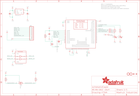

Contents
========

* [PRA2633 > Adafruit Bluefruit LE SPI Friend PCB](#pra2633--adafruit-bluefruit-le-spi-friend-pcb)
	* [Schematic](#schematic)
	* [PCB](#pcb)
	* [Interactive BOM](#interactive-bom)
	* [OOMP Parts](#oomp-parts)
	* [Images](#images)
	* [Tags](#tags)
  
![][im]
# PRA2633 > Adafruit Bluefruit LE SPI Friend PCB

- ID: PROJ-ADAF-2633-STAN-01
- Hex ID: PRA2633
- Name: Adafruit
- Description: Adafruit
- Long Link: [http://oom.lt/PROJ-ADAF-2633-STAN-01](http://oom.lt/PROJ-ADAF-2633-STAN-01)
- Short Link: [http://oom.lt/PRA2633](http://oom.lt/PRA2633)

## Schematic
  

## PCB
  

## Interactive BOM

- Interactive BOM page: [ibom.html](https://htmlpreview.github.io/?https://github.com/oomlout/oomlout_OOMP_projects/blob/main/PROJ-ADAF-2633-STAN-01/kicad/bom/ibom.html)

## OOMP Parts
  

|OOMP Parts|
| :---: |
|CAPC-UNMATCHED-X-UF1-01 C1|
|[CAPC-0805-X-UF10-V10  SMD (0805) 10 uF Capacitor (Ceramic) 10v  C3](https://github.com/oomlout/oomlout_OOMP_parts/tree/main/CAPC-0805-X-UF10-V10/)|
|CAPC-UNMATCHED-X-UF10-01 C4|
|[LEDS-0805-R-STAN-01  SMD (0805) Red LED  D1](https://github.com/oomlout/oomlout_OOMP_parts/tree/main/LEDS-0805-R-STAN-01/)|
|[LEDS-0805-L-STAN-01  SMD (0805) Blue LED  D2](https://github.com/oomlout/oomlout_OOMP_parts/tree/main/LEDS-0805-L-STAN-01/)|
|[DIOD-S323-X-K4148-01  SMD (SOD-323) Diode  D3](https://github.com/oomlout/oomlout_OOMP_parts/tree/main/DIOD-S323-X-K4148-01/)|
|UNMATCHED-SO23-X-UNMATCHED-01 IC1|
|[HEAD-I01-X-PI09-01  2.54 mm 9 Pin Header  JP2](https://github.com/oomlout/oomlout_OOMP_parts/tree/main/HEAD-I01-X-PI09-01/)|
|[MOSN-SO23-X-KBSS138-01  SMD (SOT-23) BSS138 N-Ch. MOSFET  Q1](https://github.com/oomlout/oomlout_OOMP_parts/tree/main/MOSN-SO23-X-KBSS138-01/)|
|[RESE-0805-X-O202-01  SMD (0805) 2k Ohm Resistor  R1, R2](https://github.com/oomlout/oomlout_OOMP_parts/tree/main/RESE-0805-X-O202-01/)|
|RESE-0805-X-O1003-01 R3, R4, R5|
|UNMATCHED-UNMATCHED-X-UNMATCHED-01 U1, Y1|
|[VREG-SO235-X-KMIC5225-V33D  SMD (SOT-23-5) MIC5225 Voltage Regulator 3.3v  U2](https://github.com/oomlout/oomlout_OOMP_parts/tree/main/VREG-SO235-X-KMIC5225-V33D/)|

## Images
  
  

|kicadPcb3d|kicadPcb3dFront|kicadPcb3dBack|eagleImage|eagleSchemImage|
| :---: | :---: | :---: | :---: | :---: |
||||||

## Tags

- hexID: PRA2633
- oompType: PROJ
- oompSize: ADAF
- oompColor: 2633
- oompDesc: STAN
- oompIndex: 01
- oompName: Adafruit Bluefruit LE SPI Friend PCB
- sources: All source files from https://github.com/adafruit/Adafruit-Bluefruit-LE-SPI-Friend-PCB (source licence details in srcLicense.md)
- linkBuyPage: http://www.adafruit.com/products/2633
- oompID: PROJ-ADAF-2633-STAN-01
- oompParts: C1,CAPC-UNMATCHED-X-UF1-01
- oompParts: C3,CAPC-0805-X-UF10-V10
- oompParts: C4,CAPC-UNMATCHED-X-UF10-01
- oompParts: D1,LEDS-0805-R-STAN-01
- oompParts: D2,LEDS-0805-L-STAN-01
- oompParts: D3,DIOD-S323-X-K4148-01
- oompParts: IC1,UNMATCHED-SO23-X-UNMATCHED-01
- oompParts: JP2,HEAD-I01-X-PI09-01
- oompParts: Q1,MOSN-SO23-X-KBSS138-01
- oompParts: R1,RESE-0805-X-O202-01
- oompParts: R2,RESE-0805-X-O202-01
- oompParts: R3,RESE-0805-X-O1003-01
- oompParts: R4,RESE-0805-X-O1003-01
- oompParts: R5,RESE-0805-X-O1003-01
- oompParts: U1,UNMATCHED-UNMATCHED-X-UNMATCHED-01
- oompParts: U2,VREG-SO235-X-KMIC5225-V33D
- oompParts: Y1,UNMATCHED-UNMATCHED-X-UNMATCHED-01
- rawParts: C1,1uF,CAP_CERAMIC0805_10MGAP,0805_10MGAP,Ceramic Capacitors,,
- rawParts: C3,10uF,CAP_CERAMIC0805-NOOUTLINE,0805-NO,Ceramic Capacitors,,
- rawParts: C4,10uF,CAP_CERAMIC0805_10MGAP,0805_10MGAP,Ceramic Capacitors,,
- rawParts: D1,RED,LED0805_NOOUTLINE,CHIPLED_0805_NOOUTLINE,LED,,
- rawParts: D2,BLUE,LED0805_NOOUTLINE,CHIPLED_0805_NOOUTLINE,LED,,
- rawParts: D3,1N4148,DIODESOD-323,SOD-323,Diode,,
- rawParts: FID1,FIDUCIAL,FIDUCIAL,FIDUCIAL_1MM,Fiducial Alignment Points,EXCLUDE,
- rawParts: FID3,FIDUCIAL,FIDUCIAL,FIDUCIAL_1MM,Fiducial Alignment Points,EXCLUDE,
- rawParts: IC1,74LVC2G34DBVR,74LVC2G34DBVR,SOT23-6,,,
- rawParts: JP2,,HEADER-1X970MIL,1X09_ROUND_70,PIN HEADER,,
- rawParts: Q1,BSS138,MOSFET-NWIDE,SOT23-WIDE@1,N-Channel Mosfet,,
- rawParts: R1,2K,RESISTOR_0805MP,_0805MP,Resistors,,
- rawParts: R2,2K,RESISTOR_0805MP,_0805MP,Resistors,,
- rawParts: R3,100K,RESISTOR0805_NOOUTLINE,0805-NO,Resistors,,
- rawParts: R4,100K,RESISTOR0805_NOOUTLINE,0805-NO,Resistors,,
- rawParts: R5,100K,RESISTOR_0805MP,_0805MP,Resistors,,
- rawParts: TP1,SWCLK,TESTPOINT1.5X2.0MM_NOCREAM,PAD-1.5X2.0,Test Point,,
- rawParts: TP2,SWDIO,TESTPOINT1.5X2.0MM_NOCREAM,PAD-1.5X2.0,Test Point,,
- rawParts: TP3,FCTRST,TESTPOINT1.5X2.0MM_NOCREAM,PAD-1.5X2.0,Test Point,,
- rawParts: U$28,MOUNTINGHOLE2.5,MOUNTINGHOLE2.5,MOUNTINGHOLE_2.5_PLATED,Mounting Hole,EXCLUDE,
- rawParts: U$29,MOUNTINGHOLE2.5,MOUNTINGHOLE2.5,MOUNTINGHOLE_2.5_PLATED,Mounting Hole,EXCLUDE,
- rawParts: U1,32KB NRF51822,NRF51822_MODULE_MDBT40,BLE_MODULE_RAYTAC_MDBT40,nRF51822 Bluetooth Low Energy Module,,
- rawParts: U2,MIC5225-3.3,VREG_SOT23-5,SOT23-5,SOT23-5 Fixed Voltage Regulators,,
- rawParts: VTREF,THREEV,TESTPOINT1.5X2.0MM_NOCREAM,PAD-1.5X2.0,Test Point,,
- rawParts: Y1,32.768kHz (535-9166-2-ND),CRYSTAL2.0X6.0_32.768,CRYSTAL_CYL_2X6MM_SMT,Crystals,,

[im]: kicadPcb3d_450.png
