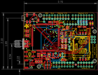
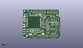
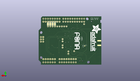
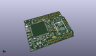

Contents
========

* [PROJ-ADAF-2636-STAN-01>Adafruit FONA808 Shield PCB](#proj-adaf-2636-stan-01adafruit-fona808-shield-pcb)
	* [Images](#images)
	* [Interactive BOM](#interactive-bom)
	* [Tags](#tags)
  
![][im]
# PROJ-ADAF-2636-STAN-01>Adafruit FONA808 Shield PCB

- ID: PROJ-ADAF-2636-STAN-01
- Hex ID: PRA2636
- Name: Adafruit FONA808 Shield PCB
- Description: 

## Images
  
  

|eagleImage|kicadPcb3dFront|kicadPcb3dBack|kicadPcb3d|
| :---: | :---: | :---: | :---: |
|||||

## Interactive BOM

- Interactive BOM page: [ibom.html](kicad/bom/ibom.html)

## Tags

- hexID: PRA2636
- oompType: PROJ
- oompSize: ADAF
- oompColor: 2636
- oompDesc: STAN
- oompIndex: 01
- oompName: Adafruit FONA808 Shield PCB
- sources: All source files from https://github.com/adafruit/Adafruit-FONA808-Shield-PCB (source licence details in srcLicense.md)
- linkBuyPage: http://www.adafruit.com/products/2636
- oompID: PROJ-ADAF-2636-STAN-01
- oompParts: C1,UNMATCHED-UNMATCHED-UNMATCHED-UNMATCHED-UNMATCHED
- oompParts: C2,UNMATCHED-UNMATCHED-UNMATCHED-UNMATCHED-UNMATCHED
- oompParts: C5,UNMATCHED-UNMATCHED-UNMATCHED-UNMATCHED-UNMATCHED
- oompParts: C6,UNMATCHED-UNMATCHED-UNMATCHED-UNMATCHED-UNMATCHED
- oompParts: C7,UNMATCHED-UNMATCHED-UNMATCHED-UNMATCHED-UNMATCHED
- oompParts: C9,UNMATCHED-UNMATCHED-UNMATCHED-UNMATCHED-UNMATCHED
- oompParts: C11,UNMATCHED-UNMATCHED-UNMATCHED-UNMATCHED-UNMATCHED
- oompParts: C14,UNMATCHED-UNMATCHED-UNMATCHED-UNMATCHED-UNMATCHED
- oompParts: C15,UNMATCHED-UNMATCHED-UNMATCHED-UNMATCHED-UNMATCHED
- oompParts: C16,UNMATCHED-UNMATCHED-UNMATCHED-UNMATCHED-UNMATCHED
- oompParts: C17,UNMATCHED-UNMATCHED-UNMATCHED-UNMATCHED-UNMATCHED
- oompParts: CHRG,UNMATCHED-UNMATCHED-UNMATCHED-UNMATCHED-UNMATCHED
- oompParts: CN2,UNMATCHED-UNMATCHED-UNMATCHED-UNMATCHED-UNMATCHED
- oompParts: D1,UNMATCHED-UNMATCHED-UNMATCHED-UNMATCHED-UNMATCHED
- oompParts: D2,UNMATCHED-UNMATCHED-UNMATCHED-UNMATCHED-UNMATCHED
- oompParts: D3,UNMATCHED-UNMATCHED-UNMATCHED-UNMATCHED-UNMATCHED
- oompParts: D4,UNMATCHED-UNMATCHED-UNMATCHED-UNMATCHED-UNMATCHED
- oompParts: D5,UNMATCHED-UNMATCHED-UNMATCHED-UNMATCHED-UNMATCHED
- oompParts: D6,UNMATCHED-UNMATCHED-UNMATCHED-UNMATCHED-UNMATCHED
- oompParts: D7,UNMATCHED-UNMATCHED-UNMATCHED-UNMATCHED-UNMATCHED
- oompParts: D8,UNMATCHED-UNMATCHED-UNMATCHED-UNMATCHED-UNMATCHED
- oompParts: D9,UNMATCHED-UNMATCHED-UNMATCHED-UNMATCHED-UNMATCHED
- oompParts: DONE,UNMATCHED-UNMATCHED-UNMATCHED-UNMATCHED-UNMATCHED
- oompParts: DTR,UNMATCHED-UNMATCHED-UNMATCHED-UNMATCHED-UNMATCHED
- oompParts: IC1,UNMATCHED-UNMATCHED-UNMATCHED-UNMATCHED-UNMATCHED
- oompParts: JP1,UNMATCHED-UNMATCHED-UNMATCHED-UNMATCHED-UNMATCHED
- oompParts: JP2,UNMATCHED-UNMATCHED-UNMATCHED-UNMATCHED-UNMATCHED
- oompParts: JP3,UNMATCHED-UNMATCHED-UNMATCHED-UNMATCHED-UNMATCHED
- oompParts: JP4,UNMATCHED-UNMATCHED-UNMATCHED-UNMATCHED-UNMATCHED
- oompParts: JP5,UNMATCHED-UNMATCHED-UNMATCHED-UNMATCHED-UNMATCHED
- oompParts: JP6,UNMATCHED-UNMATCHED-UNMATCHED-UNMATCHED-UNMATCHED
- oompParts: JP7,UNMATCHED-UNMATCHED-UNMATCHED-UNMATCHED-UNMATCHED
- oompParts: JP10,UNMATCHED-UNMATCHED-UNMATCHED-UNMATCHED-UNMATCHED
- oompParts: L2,UNMATCHED-UNMATCHED-UNMATCHED-UNMATCHED-UNMATCHED
- oompParts: M1,UNMATCHED-UNMATCHED-UNMATCHED-UNMATCHED-UNMATCHED
- oompParts: NETSTAT,UNMATCHED-UNMATCHED-UNMATCHED-UNMATCHED-UNMATCHED
- oompParts: PPS,UNMATCHED-UNMATCHED-UNMATCHED-UNMATCHED-UNMATCHED
- oompParts: PWM,UNMATCHED-UNMATCHED-UNMATCHED-UNMATCHED-UNMATCHED
- oompParts: PWRSTAT,UNMATCHED-UNMATCHED-UNMATCHED-UNMATCHED-UNMATCHED
- oompParts: Q1,UNMATCHED-UNMATCHED-UNMATCHED-UNMATCHED-UNMATCHED
- oompParts: R1,UNMATCHED-UNMATCHED-UNMATCHED-UNMATCHED-UNMATCHED
- oompParts: R2,UNMATCHED-UNMATCHED-UNMATCHED-UNMATCHED-UNMATCHED
- oompParts: R3,UNMATCHED-UNMATCHED-UNMATCHED-UNMATCHED-UNMATCHED
- oompParts: R4,UNMATCHED-UNMATCHED-UNMATCHED-UNMATCHED-UNMATCHED
- oompParts: R5,UNMATCHED-UNMATCHED-UNMATCHED-UNMATCHED-UNMATCHED
- oompParts: R6,UNMATCHED-UNMATCHED-UNMATCHED-UNMATCHED-UNMATCHED
- oompParts: SJ1,UNMATCHED-UNMATCHED-UNMATCHED-UNMATCHED-UNMATCHED
- oompParts: SJ2,UNMATCHED-UNMATCHED-UNMATCHED-UNMATCHED-UNMATCHED
- oompParts: SJ3,UNMATCHED-UNMATCHED-UNMATCHED-UNMATCHED-UNMATCHED
- oompParts: SJ4,UNMATCHED-UNMATCHED-UNMATCHED-UNMATCHED-UNMATCHED
- oompParts: SJ5,UNMATCHED-UNMATCHED-UNMATCHED-UNMATCHED-UNMATCHED
- oompParts: SJ6,UNMATCHED-UNMATCHED-UNMATCHED-UNMATCHED-UNMATCHED
- oompParts: SW1,UNMATCHED-UNMATCHED-UNMATCHED-UNMATCHED-UNMATCHED
- oompParts: SW2,UNMATCHED-UNMATCHED-UNMATCHED-UNMATCHED-UNMATCHED
- oompParts: TP1,UNMATCHED-UNMATCHED-UNMATCHED-UNMATCHED-UNMATCHED
- oompParts: U2,UNMATCHED-UNMATCHED-UNMATCHED-UNMATCHED-UNMATCHED
- oompParts: U3,UNMATCHED-UNMATCHED-UNMATCHED-UNMATCHED-UNMATCHED
- oompParts: X1,UNMATCHED-UNMATCHED-UNMATCHED-UNMATCHED-UNMATCHED
- oompParts: X3,UNMATCHED-UNMATCHED-UNMATCHED-UNMATCHED-UNMATCHED
- oompParts: X4,UNMATCHED-UNMATCHED-UNMATCHED-UNMATCHED-UNMATCHED
- oompParts: X6,UNMATCHED-UNMATCHED-UNMATCHED-UNMATCHED-UNMATCHED
- rawParts: C1,10µF,CAP_CERAMIC0805-NOOUTLINE,0805-NO,Ceramic Capacitors,,,,,,,
- rawParts: C2,33pF,CAP_CERAMIC0805-NOOUTLINE,0805-NO,Ceramic Capacitors,,,,,,,
- rawParts: C5,10pF,CAP_CERAMIC0805-NOOUTLINE,0805-NO,Ceramic Capacitors,,,,,,,
- rawParts: C6,33pF,CAP_CERAMIC0805-NOOUTLINE,0805-NO,Ceramic Capacitors,,,,,,,
- rawParts: C7,100uF,C-USC1210,C1210,CAPACITOR, American symbol,,,,,,,
- rawParts: C9,10uF,CAP_CERAMIC0805-NOOUTLINE,0805-NO,Ceramic Capacitors,,,,,,,
- rawParts: C11,10uF,CAP_CERAMIC0805-NOOUTLINE,0805-NO,Ceramic Capacitors,,,,,,,
- rawParts: C14,33pF,CAP_4PACK1206,RESPACK_4X0603,,,,,,,,
- rawParts: C15,10pF,CAP_4PACK1206,RESPACK_4X0603,,,,,,,,
- rawParts: C16,33pF,CAP_4PACK1206,RESPACK_4X0603,,,,,,,,
- rawParts: C17,10pF,CAP_4PACK1206,RESPACK_4X0603,,,,,,,,
- rawParts: CHRG,ORANGE,LED0805_NOOUTLINE,CHIPLED_0805_NOOUTLINE,LED,,,,,,,
- rawParts: CN2,JSTPH,JST_2PIN,JSTPH2,JST 2-Pin Right-Angle Connector,,,,,,,
- rawParts: D1,MMSZ5231BT1G,DIODE-ZENERSOD123,SOD-123,Zener Diode,,,,,,,
- rawParts: D2,SMF05C,TVSARRAY_5LANE,SOT363,Voltage Transient Suppressor Array,,,,,,,
- rawParts: D3,1N4148,DIODESOD-323,SOD-323,Diode,,,,,,,
- rawParts: D4,1N4148,DIODESOD-323,SOD-323,Diode,,,,,,,
- rawParts: D5,1N4148,DIODESOD-323,SOD-323,Diode,,,,,,,
- rawParts: D6,1N4148,DIODESOD-323,SOD-323,Diode,,,,,,,
- rawParts: D7,1N4148,DIODESOD-323,SOD-323,Diode,,,,,,,
- rawParts: D8,MBR120,DIODE-SCHOTTKYSOD-123,SOD-123,,,,,,,,
- rawParts: D9,1N4148,DIODESOD-323,SOD-323,Diode,,,,,,,
- rawParts: DONE,GREEN,LED0805_NOOUTLINE,CHIPLED_0805_NOOUTLINE,LED,,,,,,,
- rawParts: DTR,,PINHD-1X1CB,1X01-CLEANBIG,Pin header 1x1 for 0.1 spacing,,,,,,,
- rawParts: FID1,FIDUCIAL,FIDUCIAL,FIDUCIAL_1MM,Fiducial Alignment Points,EXCLUDE,,,,,,
- rawParts: FID2,FIDUCIAL,FIDUCIAL,FIDUCIAL_1MM,Fiducial Alignment Points,EXCLUDE,,,,,,
- rawParts: FID3,FIDUCIAL,FIDUCIAL,FIDUCIAL_1MM,Fiducial Alignment Points,EXCLUDE,,,,,,
- rawParts: IC1,74VHCT125PW,74ABT125PW,TSSOP14,Quad bus BUFFER, 3-state,,,,,,,
- rawParts: JP1,,HEADER-1X2ROUND,1X02_ROUND,PIN HEADER,,,,,,,
- rawParts: JP2,,HEADER-1X2ROUND,1X02_ROUND,PIN HEADER,,,,,,,
- rawParts: JP3,BUZZ,HEADER-1X2ROUND,1X02_ROUND,PIN HEADER,,,,,,,
- rawParts: JP4,,HEADER-1X1070MIL,1X10_ROUND70,PIN HEADER,,,,,,,
- rawParts: JP5,,HEADER-1X876MIL,1X08_ROUND_76,PIN HEADER,,,,,,,
- rawParts: JP6,,HEADER-1X876MIL,1X08_ROUND_76,PIN HEADER,,,,,,,
- rawParts: JP7,,HEADER-1X676MIL,1X06_ROUND_76,PIN HEADER,,,,,,,
- rawParts: JP10,,HEADER-1X870MIL,1X08_ROUND_70,PIN HEADER,,,,,,,
- rawParts: L2,33nH,INDUCTOR_0805MP,_0805MP,Inductors,,,,,,,
- rawParts: M1,ARDUINO_R3_ICSP_NODIM,ARDUINO_R3_ICSP_NODIM,ARDUINOR3_ICSP_NODIM,,,,,,,,
- rawParts: NETSTAT,BLUE,LED0805_NOOUTLINE,CHIPLED_0805_NOOUTLINE,LED,,,,,,,
- rawParts: PPS,,PINHD-1X1CB,1X01-CLEANBIG,Pin header 1x1 for 0.1 spacing,,,,,,,
- rawParts: PWM,,PINHD-1X1CB,1X01-CLEANBIG,Pin header 1x1 for 0.1 spacing,,,,,,,
- rawParts: PWRSTAT,GREEN,LED0805_NOOUTLINE,CHIPLED_0805_NOOUTLINE,LED,,,,,,,
- rawParts: Q1,DTC143ZUAT106,MUN2211T1-NPN_DRIVER-SC59-BEC,SC59-BEC,NPN Bias Resistor Transistor,,,,,,,
- rawParts: R1,470,RESISTOR0805_NOOUTLINE,0805-NO,Resistors,,,,,,,
- rawParts: R2,1K,RESISTOR0805_NOOUTLINE,0805-NO,Resistors,,,,,,,
- rawParts: R3,2K,RESISTOR0805_NOOUTLINE,0805-NO,Resistors,,,,,,,
- rawParts: R4,1K,RESISTOR0805_NOOUTLINE,0805-NO,Resistors,,,,,,,
- rawParts: R5,1K,RESISTOR0805_NOOUTLINE,0805-NO,Resistors,,,,,,,
- rawParts: R6,10K,RESISTOR0805_NOOUTLINE,0805-NO,Resistors,,,,,,,
- rawParts: SJ1,,SOLDERJUMPER_2WAY,SOLDERJUMPER_2WAY_OPEN_NOPASTE,2-Way Solder Jumper,,,,,,,
- rawParts: SJ2,,SOLDERJUMPER_CLOSED,SOLDERJUMPER_CLOSEDWIRE,Solder Jumper - Closed,,,,,,,
- rawParts: SJ3,,SOLDERJUMPER_CLOSED,SOLDERJUMPER_CLOSEDWIRE,Solder Jumper - Closed,,,,,,,
- rawParts: SJ4,,SOLDERJUMPER_CLOSED,SOLDERJUMPER_CLOSEDWIRE,Solder Jumper - Closed,,,,,,,
- rawParts: SJ5,,SOLDERJUMPER_CLOSED,SOLDERJUMPER_CLOSEDWIRE,Solder Jumper - Closed,,,,,,,
- rawParts: SJ6,,SOLDERJUMPER_CLOSED,SOLDERJUMPER_CLOSEDWIRE,Solder Jumper - Closed,,,,,,,
- rawParts: SJ7,,SOLDERJUMPER,SOLDERJUMPER_ARROW_NOPASTE,SMD Solder JUMPER,EXCLUDE,,,,,,
- rawParts: SW1,EVQQ2,SWITCH_TACT_SMT,EVQ-Q2,SMT Tact Switches,,,,,,,
- rawParts: SW2,EG1390,SWITCH_DPDTEG1390,EG1390,Switch - DPDT,,,,,,,
- rawParts: TP1,TPTP11R,TPTP11R,TP11R,Test pad,,,,,,,
- rawParts: U2,MCP73831T-2ACI/OT,MCP73831/2,SOT23-5,MCP73831/2 LIPO Charger,,,,,,,
- rawParts: U3,SIM808,GSM_SIM808_LITERAL,SIM900_SMT,SIM808 GSM Module,,,,,,,
- rawParts: X1,uFL,SMACONNECTOR_EDGE_UFL,SMA_EDGELAUNCH_UFL,SMA Connector,,,,,,,
- rawParts: X3,uFL,ANTENNA_U.FL,U.FL,U.FL Antenna Connector,,,,,,,
- rawParts: X4,4UCONN_18510,AUDIO_3.5MMJACK_4POL,4UCONN_18510,Footprint courtesy Morten Hjerde (Riftlabs.com),,,,,,,
- rawParts: X6,SIM_LOCKAMPHENOL,SIM_LOCKAMPHENOL,C707_10M006_512_2,C707A SIMLOCK® 2.5 mm with wide solder tails,,,,unknown,unknown,,

[im]: kicadPcb3d_450.png
