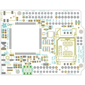
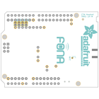
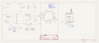
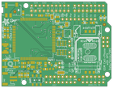
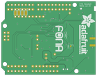

Contents
========

* [PRA2636 > Adafruit FONA808 Shield PCB](#pra2636--adafruit-fona808-shield-pcb)
	* [Schematic](#schematic)
	* [PCB](#pcb)
	* [Interactive BOM](#interactive-bom)
	* [OOMP Parts](#oomp-parts)
	* [Images](#images)
	* [Tags](#tags)
  
![][im]
# PRA2636 > Adafruit FONA808 Shield PCB

- ID: PROJ-ADAF-2636-STAN-01
- Hex ID: PRA2636
- Name: Adafruit
- Description: Adafruit
- Long Link: [http://oom.lt/PROJ-ADAF-2636-STAN-01](http://oom.lt/PROJ-ADAF-2636-STAN-01)
- Short Link: [http://oom.lt/PRA2636](http://oom.lt/PRA2636)

## Schematic
  

## PCB
  

## Interactive BOM

- Interactive BOM page: [ibom.html](https://htmlpreview.github.io/?https://github.com/oomlout/oomlout_OOMP_projects/blob/main/PROJ-ADAF-2636-STAN-01/kicad/bom/ibom.html)

## OOMP Parts
  

|OOMP ID|Name|Identifier|
| :---: | :---: | :---: |
|CAPC-0805-X-UNMATCHED-01||C1|
|CAPC-0805-X-PF33-01||C2, C6|
|CAPC-0805-X-PF10-01||C5|
|CAPX-UNMATCHED-X-UF100-01||C7|
|[CAPC-0805-X-UF10-V10](https://github.com/oomlout/oomlout_OOMP_parts/tree/main/CAPC-0805-X-UF10-V10/)|[SMD (0805) 10 uF Capacitor (Ceramic) 10v](https://github.com/oomlout/oomlout_OOMP_parts/tree/main/CAPC-0805-X-UF10-V10/)|[C9, C11](https://github.com/oomlout/oomlout_OOMP_parts/tree/main/CAPC-0805-X-UF10-V10/)|
|CAPC-06038-X-PF33-01||C14, C16|
|CAPC-06038-X-PF10-01||C15, C17|
|LEDS-0805-O-STAN-01||CHRG|
|UNMATCHED-UNMATCHED-X-UNMATCHED-01||CN2, IC1, M1, Q1, SW2, TP1, U3, X4, X6|
|DIOD-S123-X-UNMATCHED-01||D1|
|DIOD-SO363-X-UNMATCHED-01||D2|
|[DIOD-S323-X-K4148-01](https://github.com/oomlout/oomlout_OOMP_parts/tree/main/DIOD-S323-X-K4148-01/)|[SMD (SOD-323) Diode](https://github.com/oomlout/oomlout_OOMP_parts/tree/main/DIOD-S323-X-K4148-01/)|[D3, D4, D5, D6, D7, D9](https://github.com/oomlout/oomlout_OOMP_parts/tree/main/DIOD-S323-X-K4148-01/)|
|[DIOD-S123-X-KMBR120-01](https://github.com/oomlout/oomlout_OOMP_parts/tree/main/DIOD-S123-X-KMBR120-01/)|[SMD (SOD-123) MBR120 Diode](https://github.com/oomlout/oomlout_OOMP_parts/tree/main/DIOD-S123-X-KMBR120-01/)|[D8](https://github.com/oomlout/oomlout_OOMP_parts/tree/main/DIOD-S123-X-KMBR120-01/)|
|[LEDS-0805-G-STAN-01](https://github.com/oomlout/oomlout_OOMP_parts/tree/main/LEDS-0805-G-STAN-01/)|[SMD (0805) Green LED](https://github.com/oomlout/oomlout_OOMP_parts/tree/main/LEDS-0805-G-STAN-01/)|[DONE, PWRSTAT](https://github.com/oomlout/oomlout_OOMP_parts/tree/main/LEDS-0805-G-STAN-01/)|
|HEAD-I01-X-PI01-01||DTR, PPS, PWM|
|[HEAD-I01-X-PI02-01](https://github.com/oomlout/oomlout_OOMP_parts/tree/main/HEAD-I01-X-PI02-01/)|[2.54 mm 2 Pin Header](https://github.com/oomlout/oomlout_OOMP_parts/tree/main/HEAD-I01-X-PI02-01/)|[JP1, JP2, JP3](https://github.com/oomlout/oomlout_OOMP_parts/tree/main/HEAD-I01-X-PI02-01/)|
|[HEAD-I01-X-PI10-01](https://github.com/oomlout/oomlout_OOMP_parts/tree/main/HEAD-I01-X-PI10-01/)|[2.54 mm 10 Pin Header](https://github.com/oomlout/oomlout_OOMP_parts/tree/main/HEAD-I01-X-PI10-01/)|[JP4](https://github.com/oomlout/oomlout_OOMP_parts/tree/main/HEAD-I01-X-PI10-01/)|
|[HEAD-I01-X-PI08-01](https://github.com/oomlout/oomlout_OOMP_parts/tree/main/HEAD-I01-X-PI08-01/)|[2.54 mm 8 Pin Header](https://github.com/oomlout/oomlout_OOMP_parts/tree/main/HEAD-I01-X-PI08-01/)|[JP5, JP6, JP10](https://github.com/oomlout/oomlout_OOMP_parts/tree/main/HEAD-I01-X-PI08-01/)|
|[HEAD-I01-X-PI06-01](https://github.com/oomlout/oomlout_OOMP_parts/tree/main/HEAD-I01-X-PI06-01/)|[2.54 mm 6 Pin Header](https://github.com/oomlout/oomlout_OOMP_parts/tree/main/HEAD-I01-X-PI06-01/)|[JP7](https://github.com/oomlout/oomlout_OOMP_parts/tree/main/HEAD-I01-X-PI06-01/)|
|UNMATCHED-0805-X-UNMATCHED-01||L2|
|[LEDS-0805-L-STAN-01](https://github.com/oomlout/oomlout_OOMP_parts/tree/main/LEDS-0805-L-STAN-01/)|[SMD (0805) Blue LED](https://github.com/oomlout/oomlout_OOMP_parts/tree/main/LEDS-0805-L-STAN-01/)|[NETSTAT](https://github.com/oomlout/oomlout_OOMP_parts/tree/main/LEDS-0805-L-STAN-01/)|
|[RESE-0805-X-O471-01](https://github.com/oomlout/oomlout_OOMP_parts/tree/main/RESE-0805-X-O471-01/)|[SMD (0805) 470 Ohm Resistor](https://github.com/oomlout/oomlout_OOMP_parts/tree/main/RESE-0805-X-O471-01/)|[R1](https://github.com/oomlout/oomlout_OOMP_parts/tree/main/RESE-0805-X-O471-01/)|
|[RESE-0805-X-O102-01](https://github.com/oomlout/oomlout_OOMP_parts/tree/main/RESE-0805-X-O102-01/)|[SMD (0805) 1k Ohm Resistor](https://github.com/oomlout/oomlout_OOMP_parts/tree/main/RESE-0805-X-O102-01/)|[R2, R4, R5](https://github.com/oomlout/oomlout_OOMP_parts/tree/main/RESE-0805-X-O102-01/)|
|[RESE-0805-X-O202-01](https://github.com/oomlout/oomlout_OOMP_parts/tree/main/RESE-0805-X-O202-01/)|[SMD (0805) 2k Ohm Resistor](https://github.com/oomlout/oomlout_OOMP_parts/tree/main/RESE-0805-X-O202-01/)|[R3](https://github.com/oomlout/oomlout_OOMP_parts/tree/main/RESE-0805-X-O202-01/)|
|[RESE-0805-X-O103-01](https://github.com/oomlout/oomlout_OOMP_parts/tree/main/RESE-0805-X-O103-01/)|[SMD (0805) 10k Ohm Resistor](https://github.com/oomlout/oomlout_OOMP_parts/tree/main/RESE-0805-X-O103-01/)|[R6](https://github.com/oomlout/oomlout_OOMP_parts/tree/main/RESE-0805-X-O103-01/)|
|[BUTA-6060-X-STAN-01](https://github.com/oomlout/oomlout_OOMP_parts/tree/main/BUTA-6060-X-STAN-01/)|[SMD (6060) Pushbutton (Tactile)](https://github.com/oomlout/oomlout_OOMP_parts/tree/main/BUTA-6060-X-STAN-01/)|[SW1](https://github.com/oomlout/oomlout_OOMP_parts/tree/main/BUTA-6060-X-STAN-01/)|
|UNMATCHED-SO235-X-UNMATCHED-01||U2|
|CAPX-UNMATCHED-X-NF100-01||X1, X3|

## Images
  
  

|bominteractivefront|bominteractiveback|kicadPcb3d|kicadPcb3dFront|kicadPcb3dBack|kicadSchem|eagleImage|eagleSchemImage|pcbdraw|pcbdrawback|
| :---: | :---: | :---: | :---: | :---: | :---: | :---: | :---: | :---: | :---: |
|||||||||||

## Tags

- hexID: PRA2636
- oompType: PROJ
- oompSize: ADAF
- oompColor: 2636
- oompDesc: STAN
- oompIndex: 01
- oompName: Adafruit FONA808 Shield PCB
- sources: All source files from https://github.com/adafruit/Adafruit-FONA808-Shield-PCB (source licence details in srcLicense.md)
- linkBuyPage: http://www.adafruit.com/products/2636
- oompID: PROJ-ADAF-2636-STAN-01
- oompParts: C1,CAPC-0805-X-UNMATCHED-01
- oompParts: C2,CAPC-0805-X-PF33-01
- oompParts: C5,CAPC-0805-X-PF10-01
- oompParts: C6,CAPC-0805-X-PF33-01
- oompParts: C7,CAPX-UNMATCHED-X-UF100-01
- oompParts: C9,CAPC-0805-X-UF10-V10
- oompParts: C11,CAPC-0805-X-UF10-V10
- oompParts: C14,CAPC-06038-X-PF33-01
- oompParts: C15,CAPC-06038-X-PF10-01
- oompParts: C16,CAPC-06038-X-PF33-01
- oompParts: C17,CAPC-06038-X-PF10-01
- oompParts: CHRG,LEDS-0805-O-STAN-01
- oompParts: CN2,UNMATCHED-UNMATCHED-X-UNMATCHED-01
- oompParts: D1,DIOD-S123-X-UNMATCHED-01
- oompParts: D2,DIOD-SO363-X-UNMATCHED-01
- oompParts: D3,DIOD-S323-X-K4148-01
- oompParts: D4,DIOD-S323-X-K4148-01
- oompParts: D5,DIOD-S323-X-K4148-01
- oompParts: D6,DIOD-S323-X-K4148-01
- oompParts: D7,DIOD-S323-X-K4148-01
- oompParts: D8,DIOD-S123-X-KMBR120-01
- oompParts: D9,DIOD-S323-X-K4148-01
- oompParts: DONE,LEDS-0805-G-STAN-01
- oompParts: DTR,HEAD-I01-X-PI01-01
- oompParts: IC1,UNMATCHED-UNMATCHED-X-UNMATCHED-01
- oompParts: JP1,HEAD-I01-X-PI02-01
- oompParts: JP2,HEAD-I01-X-PI02-01
- oompParts: JP3,HEAD-I01-X-PI02-01
- oompParts: JP4,HEAD-I01-X-PI10-01
- oompParts: JP5,HEAD-I01-X-PI08-01
- oompParts: JP6,HEAD-I01-X-PI08-01
- oompParts: JP7,HEAD-I01-X-PI06-01
- oompParts: JP10,HEAD-I01-X-PI08-01
- oompParts: L2,UNMATCHED-0805-X-UNMATCHED-01
- oompParts: M1,UNMATCHED-UNMATCHED-X-UNMATCHED-01
- oompParts: NETSTAT,LEDS-0805-L-STAN-01
- oompParts: PPS,HEAD-I01-X-PI01-01
- oompParts: PWM,HEAD-I01-X-PI01-01
- oompParts: PWRSTAT,LEDS-0805-G-STAN-01
- oompParts: Q1,UNMATCHED-UNMATCHED-X-UNMATCHED-01
- oompParts: R1,RESE-0805-X-O471-01
- oompParts: R2,RESE-0805-X-O102-01
- oompParts: R3,RESE-0805-X-O202-01
- oompParts: R4,RESE-0805-X-O102-01
- oompParts: R5,RESE-0805-X-O102-01
- oompParts: R6,RESE-0805-X-O103-01
- oompParts: SW1,BUTA-6060-X-STAN-01
- oompParts: SW2,UNMATCHED-UNMATCHED-X-UNMATCHED-01
- oompParts: TP1,UNMATCHED-UNMATCHED-X-UNMATCHED-01
- oompParts: U2,UNMATCHED-SO235-X-UNMATCHED-01
- oompParts: U3,UNMATCHED-UNMATCHED-X-UNMATCHED-01
- oompParts: X1,CAPX-UNMATCHED-X-NF100-01
- oompParts: X3,CAPX-UNMATCHED-X-NF100-01
- oompParts: X4,UNMATCHED-UNMATCHED-X-UNMATCHED-01
- oompParts: X6,UNMATCHED-UNMATCHED-X-UNMATCHED-01
- rawParts: C1,10µF,CAP_CERAMIC0805-NOOUTLINE,0805-NO,Ceramic Capacitors,,,,,,,
- rawParts: C2,33pF,CAP_CERAMIC0805-NOOUTLINE,0805-NO,Ceramic Capacitors,,,,,,,
- rawParts: C5,10pF,CAP_CERAMIC0805-NOOUTLINE,0805-NO,Ceramic Capacitors,,,,,,,
- rawParts: C6,33pF,CAP_CERAMIC0805-NOOUTLINE,0805-NO,Ceramic Capacitors,,,,,,,
- rawParts: C7,100uF,C-USC1210,C1210,CAPACITOR, American symbol,,,,,,,
- rawParts: C9,10uF,CAP_CERAMIC0805-NOOUTLINE,0805-NO,Ceramic Capacitors,,,,,,,
- rawParts: C11,10uF,CAP_CERAMIC0805-NOOUTLINE,0805-NO,Ceramic Capacitors,,,,,,,
- rawParts: C14,33pF,CAP_4PACK1206,RESPACK_4X0603,,,,,,,,
- rawParts: C15,10pF,CAP_4PACK1206,RESPACK_4X0603,,,,,,,,
- rawParts: C16,33pF,CAP_4PACK1206,RESPACK_4X0603,,,,,,,,
- rawParts: C17,10pF,CAP_4PACK1206,RESPACK_4X0603,,,,,,,,
- rawParts: CHRG,ORANGE,LED0805_NOOUTLINE,CHIPLED_0805_NOOUTLINE,LED,,,,,,,
- rawParts: CN2,JSTPH,JST_2PIN,JSTPH2,JST 2-Pin Right-Angle Connector,,,,,,,
- rawParts: D1,MMSZ5231BT1G,DIODE-ZENERSOD123,SOD-123,Zener Diode,,,,,,,
- rawParts: D2,SMF05C,TVSARRAY_5LANE,SOT363,Voltage Transient Suppressor Array,,,,,,,
- rawParts: D3,1N4148,DIODESOD-323,SOD-323,Diode,,,,,,,
- rawParts: D4,1N4148,DIODESOD-323,SOD-323,Diode,,,,,,,
- rawParts: D5,1N4148,DIODESOD-323,SOD-323,Diode,,,,,,,
- rawParts: D6,1N4148,DIODESOD-323,SOD-323,Diode,,,,,,,
- rawParts: D7,1N4148,DIODESOD-323,SOD-323,Diode,,,,,,,
- rawParts: D8,MBR120,DIODE-SCHOTTKYSOD-123,SOD-123,,,,,,,,
- rawParts: D9,1N4148,DIODESOD-323,SOD-323,Diode,,,,,,,
- rawParts: DONE,GREEN,LED0805_NOOUTLINE,CHIPLED_0805_NOOUTLINE,LED,,,,,,,
- rawParts: DTR,,PINHD-1X1CB,1X01-CLEANBIG,Pin header 1x1 for 0.1 spacing,,,,,,,
- rawParts: FID1,FIDUCIAL,FIDUCIAL,FIDUCIAL_1MM,Fiducial Alignment Points,EXCLUDE,,,,,,
- rawParts: FID2,FIDUCIAL,FIDUCIAL,FIDUCIAL_1MM,Fiducial Alignment Points,EXCLUDE,,,,,,
- rawParts: FID3,FIDUCIAL,FIDUCIAL,FIDUCIAL_1MM,Fiducial Alignment Points,EXCLUDE,,,,,,
- rawParts: IC1,74VHCT125PW,74ABT125PW,TSSOP14,Quad bus BUFFER, 3-state,,,,,,,
- rawParts: JP1,,HEADER-1X2ROUND,1X02_ROUND,PIN HEADER,,,,,,,
- rawParts: JP2,,HEADER-1X2ROUND,1X02_ROUND,PIN HEADER,,,,,,,
- rawParts: JP3,BUZZ,HEADER-1X2ROUND,1X02_ROUND,PIN HEADER,,,,,,,
- rawParts: JP4,,HEADER-1X1070MIL,1X10_ROUND70,PIN HEADER,,,,,,,
- rawParts: JP5,,HEADER-1X876MIL,1X08_ROUND_76,PIN HEADER,,,,,,,
- rawParts: JP6,,HEADER-1X876MIL,1X08_ROUND_76,PIN HEADER,,,,,,,
- rawParts: JP7,,HEADER-1X676MIL,1X06_ROUND_76,PIN HEADER,,,,,,,
- rawParts: JP10,,HEADER-1X870MIL,1X08_ROUND_70,PIN HEADER,,,,,,,
- rawParts: L2,33nH,INDUCTOR_0805MP,_0805MP,Inductors,,,,,,,
- rawParts: M1,ARDUINO_R3_ICSP_NODIM,ARDUINO_R3_ICSP_NODIM,ARDUINOR3_ICSP_NODIM,,,,,,,,
- rawParts: NETSTAT,BLUE,LED0805_NOOUTLINE,CHIPLED_0805_NOOUTLINE,LED,,,,,,,
- rawParts: PPS,,PINHD-1X1CB,1X01-CLEANBIG,Pin header 1x1 for 0.1 spacing,,,,,,,
- rawParts: PWM,,PINHD-1X1CB,1X01-CLEANBIG,Pin header 1x1 for 0.1 spacing,,,,,,,
- rawParts: PWRSTAT,GREEN,LED0805_NOOUTLINE,CHIPLED_0805_NOOUTLINE,LED,,,,,,,
- rawParts: Q1,DTC143ZUAT106,MUN2211T1-NPN_DRIVER-SC59-BEC,SC59-BEC,NPN Bias Resistor Transistor,,,,,,,
- rawParts: R1,470,RESISTOR0805_NOOUTLINE,0805-NO,Resistors,,,,,,,
- rawParts: R2,1K,RESISTOR0805_NOOUTLINE,0805-NO,Resistors,,,,,,,
- rawParts: R3,2K,RESISTOR0805_NOOUTLINE,0805-NO,Resistors,,,,,,,
- rawParts: R4,1K,RESISTOR0805_NOOUTLINE,0805-NO,Resistors,,,,,,,
- rawParts: R5,1K,RESISTOR0805_NOOUTLINE,0805-NO,Resistors,,,,,,,
- rawParts: R6,10K,RESISTOR0805_NOOUTLINE,0805-NO,Resistors,,,,,,,
- rawParts: SJ1,,SOLDERJUMPER_2WAY,SOLDERJUMPER_2WAY_OPEN_NOPASTE,2-Way Solder Jumper,,,,,,,
- rawParts: SJ2,,SOLDERJUMPER_CLOSED,SOLDERJUMPER_CLOSEDWIRE,Solder Jumper - Closed,,,,,,,
- rawParts: SJ3,,SOLDERJUMPER_CLOSED,SOLDERJUMPER_CLOSEDWIRE,Solder Jumper - Closed,,,,,,,
- rawParts: SJ4,,SOLDERJUMPER_CLOSED,SOLDERJUMPER_CLOSEDWIRE,Solder Jumper - Closed,,,,,,,
- rawParts: SJ5,,SOLDERJUMPER_CLOSED,SOLDERJUMPER_CLOSEDWIRE,Solder Jumper - Closed,,,,,,,
- rawParts: SJ6,,SOLDERJUMPER_CLOSED,SOLDERJUMPER_CLOSEDWIRE,Solder Jumper - Closed,,,,,,,
- rawParts: SJ7,,SOLDERJUMPER,SOLDERJUMPER_ARROW_NOPASTE,SMD Solder JUMPER,EXCLUDE,,,,,,
- rawParts: SW1,EVQQ2,SWITCH_TACT_SMT,EVQ-Q2,SMT Tact Switches,,,,,,,
- rawParts: SW2,EG1390,SWITCH_DPDTEG1390,EG1390,Switch - DPDT,,,,,,,
- rawParts: TP1,TPTP11R,TPTP11R,TP11R,Test pad,,,,,,,
- rawParts: U2,MCP73831T-2ACI/OT,MCP73831/2,SOT23-5,MCP73831/2 LIPO Charger,,,,,,,
- rawParts: U3,SIM808,GSM_SIM808_LITERAL,SIM900_SMT,SIM808 GSM Module,,,,,,,
- rawParts: X1,uFL,SMACONNECTOR_EDGE_UFL,SMA_EDGELAUNCH_UFL,SMA Connector,,,,,,,
- rawParts: X3,uFL,ANTENNA_U.FL,U.FL,U.FL Antenna Connector,,,,,,,
- rawParts: X4,4UCONN_18510,AUDIO_3.5MMJACK_4POL,4UCONN_18510,Footprint courtesy Morten Hjerde (Riftlabs.com),,,,,,,
- rawParts: X6,SIM_LOCKAMPHENOL,SIM_LOCKAMPHENOL,C707_10M006_512_2,C707A SIMLOCK® 2.5 mm with wide solder tails,,,,unknown,unknown,,

[im]: kicadPcb3d_450.png
