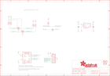

Contents
========

* [PRA2651 > Adafruit](#pra2651--adafruit)
	* [Schematic](#schematic)
	* [Interactive BOM](#interactive-bom)
	* [OOMP Parts](#oomp-parts)
	* [Images](#images)
	* [Tags](#tags)
  
![][im]
# PRA2651 > Adafruit

- ID: PROJ-ADAF-2651-STAN-01
- Hex ID: PRA2651
- Name: Adafruit
- Description: Adafruit
- Long Link: [http://oom.lt/PROJ-ADAF-2651-STAN-01](http://oom.lt/PROJ-ADAF-2651-STAN-01)
- Short Link: [http://oom.lt/PRA2651](http://oom.lt/PRA2651)

## Schematic
  

## Interactive BOM

- Interactive BOM page: [ibom.html](https://htmlpreview.github.io/?https://github.com/oomlout/oomlout_OOMP_projects/blob/main/PROJ-ADAF-2651-STAN-01/kicad/bom/ibom.html)

## OOMP Parts
  

|OOMP Parts|
| :---: |
|C1,CAPC-0805-X-UF10-V10,C1,10uF,CAP_CERAMIC0805-NOOUTLINE,0805-NO,Ceramic Capacitors,,|
|C3,CAPC-0805-X-UF10-V10,C3,10uF,CAP_CERAMIC0805-NOOUTLINE,0805-NO,Ceramic Capacitors,,|
|D2,DIOD-S323-X-K4148-01,D2,1N4148,DIODESOD-323,SOD-323,Diode,,|
|JP2,HEAD-I01-X-PI07-01,JP2,,HEADER-1X770MIL,1X07_ROUND_70,PIN HEADER,,|
|Q3,MOSN-SO23-X-KBSS138-01,Q3,BSS138,MOSFET-NWIDE,SOT23-WIDE,N-Channel Mosfet,,|
|Q4,MOSN-SO23-X-KBSS138-01,Q4,BSS138,MOSFET-NWIDE,SOT23-WIDE,N-Channel Mosfet,,|
|R1,RESE-0805-X-O103-01,R1,10K,RESISTOR0805_NOOUTLINE,0805-NO,Resistors,,|
|R2,RESE-0805-X-O103-01,R2,10K,RESISTOR0805_NOOUTLINE,0805-NO,Resistors,,|
|R4,RESE-0805-X-O103-01,R4,10K,RESISTOR_0805MP,_0805MP,Resistors,,|
|R7,RESE-0805-X-O103-01,R7,10K,RESISTOR0805_NOOUTLINE,0805-NO,Resistors,,|
|R8,RESE-0805-X-O103-01,R8,10K,RESISTOR0805_NOOUTLINE,0805-NO,Resistors,,|
|U1,UNMATCHED-UNMATCHED-X-UNMATCHED-01,U$5,FIDUCIAL,FIDUCIAL,FIDUCIAL_1MM,Fiducial Alignment Points,EXCLUDE,|
|U2,VREG-SO235-X-KMIC5225-V33D,U$7,MOUNTINGHOLE2.0,MOUNTINGHOLE2.0,MOUNTINGHOLE_2.0_PLATED,Mounting Hole,EXCLUDE,|

## Images
  
  

|kicadPcb3d|kicadPcb3dFront|kicadPcb3dBack|eagleImage|eagleSchemImage|
| :---: | :---: | :---: | :---: | :---: |
||||||

## Tags

- hexID: PRA2651
- oompType: PROJ
- oompSize: ADAF
- oompColor: 2651
- oompDesc: STAN
- oompIndex: 01
- oompName: Adafruit BMP280 Breakout PCB
- sources: All source files from https://github.com/adafruit/Adafruit-BMP280-Breakout-PCB (source licence details in srcLicense.md)
- linkBuyPage: http://www.adafruit.com/products/2651
- oompID: PROJ-ADAF-2651-STAN-01
- oompParts: C1,CAPC-0805-X-UF10-V10
- oompParts: C3,CAPC-0805-X-UF10-V10
- oompParts: D2,DIOD-S323-X-K4148-01
- oompParts: JP2,HEAD-I01-X-PI07-01
- oompParts: Q3,MOSN-SO23-X-KBSS138-01
- oompParts: Q4,MOSN-SO23-X-KBSS138-01
- oompParts: R1,RESE-0805-X-O103-01
- oompParts: R2,RESE-0805-X-O103-01
- oompParts: R4,RESE-0805-X-O103-01
- oompParts: R7,RESE-0805-X-O103-01
- oompParts: R8,RESE-0805-X-O103-01
- oompParts: U1,UNMATCHED-UNMATCHED-X-UNMATCHED-01
- oompParts: U2,VREG-SO235-X-KMIC5225-V33D
- rawParts: C1,10uF,CAP_CERAMIC0805-NOOUTLINE,0805-NO,Ceramic Capacitors,,
- rawParts: C3,10uF,CAP_CERAMIC0805-NOOUTLINE,0805-NO,Ceramic Capacitors,,
- rawParts: D2,1N4148,DIODESOD-323,SOD-323,Diode,,
- rawParts: JP2,,HEADER-1X770MIL,1X07_ROUND_70,PIN HEADER,,
- rawParts: Q3,BSS138,MOSFET-NWIDE,SOT23-WIDE,N-Channel Mosfet,,
- rawParts: Q4,BSS138,MOSFET-NWIDE,SOT23-WIDE,N-Channel Mosfet,,
- rawParts: R1,10K,RESISTOR0805_NOOUTLINE,0805-NO,Resistors,,
- rawParts: R2,10K,RESISTOR0805_NOOUTLINE,0805-NO,Resistors,,
- rawParts: R4,10K,RESISTOR_0805MP,_0805MP,Resistors,,
- rawParts: R7,10K,RESISTOR0805_NOOUTLINE,0805-NO,Resistors,,
- rawParts: R8,10K,RESISTOR0805_NOOUTLINE,0805-NO,Resistors,,
- rawParts: U$5,FIDUCIAL,FIDUCIAL,FIDUCIAL_1MM,Fiducial Alignment Points,EXCLUDE,
- rawParts: U$7,MOUNTINGHOLE2.0,MOUNTINGHOLE2.0,MOUNTINGHOLE_2.0_PLATED,Mounting Hole,EXCLUDE,
- rawParts: U$8,MOUNTINGHOLE2.0,MOUNTINGHOLE2.0,MOUNTINGHOLE_2.0_PLATED,Mounting Hole,EXCLUDE,
- rawParts: U$15,FIDUCIAL,FIDUCIAL,FIDUCIAL_1MM,Fiducial Alignment Points,EXCLUDE,
- rawParts: U1,BME280,BME280,BME280,BME280 - Environmental Sensor (I2C + SPI),,
- rawParts: U2,MIC5225-3.3,VREG_SOT23-5,SOT23-5,SOT23-5 Fixed Voltage Regulators,,

[im]: kicadPcb3d_450.png
