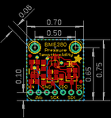
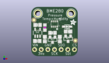
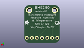
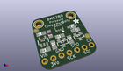

Contents
========

* [PROJ-ADAF-2652-STAN-01>Adafruit BME280 Breakout PCB](#proj-adaf-2652-stan-01adafruit-bme280-breakout-pcb)
	* [Images](#images)
	* [Interactive BOM](#interactive-bom)
	* [OOMP Parts](#oomp-parts)
	* [Tags](#tags)
  
![][im]
# PROJ-ADAF-2652-STAN-01>Adafruit BME280 Breakout PCB

- ID: PROJ-ADAF-2652-STAN-01
- Hex ID: PRA2652
- Name: Adafruit BME280 Breakout PCB
- Description: 

## Images
  
  

|eagleImage|kicadPcb3dFront|kicadPcb3dBack|kicadPcb3d|
| :---: | :---: | :---: | :---: |
|||||

## Interactive BOM

- Interactive BOM page: [ibom.html](kicad/bom/ibom.html)

## OOMP Parts
  

|OOMP Parts|
| :---: |
|CAPC-0805-X-UNMATCHED-01, C1, 2.2859999999999996, 5.842, 0,C1, 10uF, 0805-NO, microbuilder, (0.09, 0.23), R0|
|CAPC-0805-X-UNMATCHED-01, C3, 2.413, 12.065, 0,C3, 10uF, 0805-NO, microbuilder, (0.095, 0.475), R0|
|UNMATCHED-UNMATCHED-X-UNMATCHED-01, D2, 13.716, 11.43, 180,D2, 1N4148, SOD-323, microbuilder, (0.54, 0.45), R180|
|<table><tr><td></td><td> JP2</td><td>[HEAD-I01-X-PI07-01 2.54 mm 7 Pin Header](https://github.com/oomlout/oomlout_OOMP_parts/tree/main/HEAD-I01-X-PI07-01/)</td><td>[H07](https://github.com/oomlout/oomlout_OOMP_parts/tree/main/HEAD-I01-X-PI07-01/)</td></tr></table>|
|UNMATCHED-UNMATCHED-X-UNMATCHED-01, Q3, 8.128, 6.35, 180,Q3, BSS138, SOT23-WIDE, microbuilder, (0.32, 0.25), R180|
|UNMATCHED-UNMATCHED-X-UNMATCHED-01, Q4, 14.097000000000001, 6.731, 180,Q4, BSS138, SOT23-WIDE, microbuilder, (0.555, 0.265), R180|
|<table><tr><td></td><td> R1</td><td>[RESE-0805-X-O103-01 SMD (0805) 10k Ohm Resistor](https://github.com/oomlout/oomlout_OOMP_parts/tree/main/RESE-0805-X-O103-01/)</td><td>[R85103](https://github.com/oomlout/oomlout_OOMP_parts/tree/main/RESE-0805-X-O103-01/)</td></tr></table>|
|<table><tr><td></td><td> R2</td><td>[RESE-0805-X-O103-01 SMD (0805) 10k Ohm Resistor](https://github.com/oomlout/oomlout_OOMP_parts/tree/main/RESE-0805-X-O103-01/)</td><td>[R85103](https://github.com/oomlout/oomlout_OOMP_parts/tree/main/RESE-0805-X-O103-01/)</td></tr></table>|
|<table><tr><td></td><td> R4</td><td>[RESE-0805-X-O103-01 SMD (0805) 10k Ohm Resistor](https://github.com/oomlout/oomlout_OOMP_parts/tree/main/RESE-0805-X-O103-01/)</td><td>[R85103](https://github.com/oomlout/oomlout_OOMP_parts/tree/main/RESE-0805-X-O103-01/)</td></tr></table>|
|<table><tr><td></td><td> R7</td><td>[RESE-0805-X-O103-01 SMD (0805) 10k Ohm Resistor](https://github.com/oomlout/oomlout_OOMP_parts/tree/main/RESE-0805-X-O103-01/)</td><td>[R85103](https://github.com/oomlout/oomlout_OOMP_parts/tree/main/RESE-0805-X-O103-01/)</td></tr></table>|
|<table><tr><td></td><td> R8</td><td>[RESE-0805-X-O103-01 SMD (0805) 10k Ohm Resistor](https://github.com/oomlout/oomlout_OOMP_parts/tree/main/RESE-0805-X-O103-01/)</td><td>[R85103](https://github.com/oomlout/oomlout_OOMP_parts/tree/main/RESE-0805-X-O103-01/)</td></tr></table>|
|UNMATCHED-UNMATCHED-X-UNMATCHED-01, U1, 8.889999999999999, 12.446, 270,U1, BME280, BME280, microbuilder, (0.35, 0.49), R270|
|UNMATCHED-UNMATCHED-X-UNMATCHED-01, U2, 2.413, 9.017, 0,U2, MIC5225-3.3, SOT23-5, microbuilder, (0.095, 0.355), R0|

## Tags

- hexID: PRA2652
- oompType: PROJ
- oompSize: ADAF
- oompColor: 2652
- oompDesc: STAN
- oompIndex: 01
- oompName: Adafruit BME280 Breakout PCB
- sources: All source files from https://github.com/adafruit/Adafruit-BME280-Breakout-PCB (source licence details in srcLicense.md)
- linkBuyPage: http://www.adafruit.com/products/2652
- oompID: PROJ-ADAF-2652-STAN-01
- oompPart: CAPC-0805-X-UNMATCHED-01, C1, 2.2859999999999996, 5.842, 0
- oompPart: CAPC-0805-X-UNMATCHED-01, C3, 2.413, 12.065, 0
- oompPart: UNMATCHED-UNMATCHED-X-UNMATCHED-01, D2, 13.716, 11.43, 180
- oompPart: HEAD-I01-X-PI07-01, JP2, 8.889999999999999, 2.54, 0
- oompPart: UNMATCHED-UNMATCHED-X-UNMATCHED-01, Q3, 8.128, 6.35, 180
- oompPart: UNMATCHED-UNMATCHED-X-UNMATCHED-01, Q4, 14.097000000000001, 6.731, 180
- oompPart: RESE-0805-X-O103-01, R1, 14.097000000000001, 9.524999999999999, 0
- oompPart: RESE-0805-X-O103-01, R2, 8.128, 9.017, 0
- oompPart: RESE-0805-X-O103-01, R4, 5.206999999999999, 11.049, 270
- oompPart: RESE-0805-X-O103-01, R7, 5.206999999999999, 6.604, 90
- oompPart: RESE-0805-X-O103-01, R8, 10.921999999999999, 6.604, 90
- oompPart: SKIP-UNMATCHED-X-UNMATCHED-01, U$5, 1.016, 13.97, 0
- oompPart: SKIP-UNMATCHED-X-UNMATCHED-01, U$7, 2.54, 16.509999999999998, 0
- oompPart: SKIP-UNMATCHED-X-UNMATCHED-01, U$8, 15.239999999999998, 16.509999999999998, 0
- oompPart: SKIP-UNMATCHED-X-UNMATCHED-01, U$15, 16.891, 5.968999999999999, 0
- oompPart: UNMATCHED-UNMATCHED-X-UNMATCHED-01, U1, 8.889999999999999, 12.446, 270
- oompPart: UNMATCHED-UNMATCHED-X-UNMATCHED-01, U2, 2.413, 9.017, 0
- rawPart: C1, 10uF, 0805-NO, microbuilder, (0.09, 0.23), R0
- rawPart: C3, 10uF, 0805-NO, microbuilder, (0.095, 0.475), R0
- rawPart: D2, 1N4148, SOD-323, microbuilder, (0.54, 0.45), R180
- rawPart: JP2, 1X07_ROUND_70, microbuilder, (0.35, 0.1), R0
- rawPart: Q3, BSS138, SOT23-WIDE, microbuilder, (0.32, 0.25), R180
- rawPart: Q4, BSS138, SOT23-WIDE, microbuilder, (0.555, 0.265), R180
- rawPart: R1, 10K, 0805-NO, microbuilder, (0.555, 0.375), R0
- rawPart: R2, 10K, 0805-NO, microbuilder, (0.32, 0.355), R0
- rawPart: R4, 10K, _0805MP, microbuilder, (0.205, 0.435), R270
- rawPart: R7, 10K, 0805-NO, microbuilder, (0.205, 0.26), R90
- rawPart: R8, 10K, 0805-NO, microbuilder, (0.43, 0.26), R90
- rawPart: U$5, FIDUCIAL, FIDUCIAL_1MM, microbuilder, (0.04, 0.55), R0
- rawPart: U$7, MOUNTINGHOLE2.0, MOUNTINGHOLE_2.0_PLATED, microbuilder, (0.1, 0.65), R0
- rawPart: U$8, MOUNTINGHOLE2.0, MOUNTINGHOLE_2.0_PLATED, microbuilder, (0.6, 0.65), R0
- rawPart: U$15, FIDUCIAL, FIDUCIAL_1MM, microbuilder, (0.665, 0.235), R0
- rawPart: U1, BME280, BME280, microbuilder, (0.35, 0.49), R270
- rawPart: U2, MIC5225-3.3, SOT23-5, microbuilder, (0.095, 0.355), R0

[im]: kicadPcb3d_450.png
