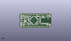
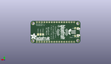
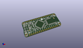

Contents
========

* [PROJ-ADAF-2661-STAN-01>Adafruit Bluefruit LE Micro PCB](#proj-adaf-2661-stan-01adafruit-bluefruit-le-micro-pcb)
	* [Images](#images)
	* [Interactive BOM](#interactive-bom)
	* [OOMP Parts](#oomp-parts)
	* [Tags](#tags)
  
![][im]
# PROJ-ADAF-2661-STAN-01>Adafruit Bluefruit LE Micro PCB

- ID: PROJ-ADAF-2661-STAN-01
- Hex ID: PRA2661
- Name: Adafruit Bluefruit LE Micro PCB
- Description: 

## Images
  
  

|eagleImage|kicadPcb3dFront|kicadPcb3dBack|kicadPcb3d|
| :---: | :---: | :---: | :---: |
|||||

## Interactive BOM

- Interactive BOM page: [ibom.html](kicad/bom/ibom.html)

## OOMP Parts
  

|OOMP Parts|
| :---: |
|CAPC-0805-X-UNMATCHED-01, C2, 37.083999999999996, 18.415, 180,C2, 1uF, 0805-NO, microbuilder, (1.46, 0.725), R180|
|CAPC-0805-X-UNMATCHED-01, C6, 11.05399999, 16.549999919999998, 0,C6, 10uF, _0805MP, microbuilder, (0.43519685, 0.6515748), R0|
|CAPC-0805-X-UNMATCHED-01, C7, 31.800999897999997, 18.144000034, 0,C7, 10uF, 0805-NO, microbuilder, (1.25200787, 0.71433071), R0|
|CAPC-0805-X-UNMATCHED-01, C8, 14.082000029999998, 15.426999879999999, 90,C8, 10uF, 0805-NO, microbuilder, (0.55440945, 0.6073622), R90|
|CAPC-0805-X-UNMATCHED-01, C9, 14.57459366, 5.483200108, 90,C9, 1uF, 0805-NO, microbuilder, (0.5738029, 0.21587402), R90|
|CAPC-UNMATCHED-X-NF100-V50, C10, 17.330971941999998, 5.73265935, 135,C10, 0.1uF, 0805_10MGAP, microbuilder, (0.68232173, 0.22569525), R135|
|<table><tr><td></td><td> C14</td><td>[CAPC-0805-X-NF100-V50 SMD (0805) 100 nF Capacitor (Ceramic) 50v](https://github.com/oomlout/oomlout_OOMP_parts/tree/main/CAPC-0805-X-NF100-V50/)</td><td>[C85N100](https://github.com/oomlout/oomlout_OOMP_parts/tree/main/CAPC-0805-X-NF100-V50/)</td></tr></table>|
|<table><tr><td></td><td> C15</td><td>[CAPC-0805-X-NF100-V50 SMD (0805) 100 nF Capacitor (Ceramic) 50v](https://github.com/oomlout/oomlout_OOMP_parts/tree/main/CAPC-0805-X-NF100-V50/)</td><td>[C85N100](https://github.com/oomlout/oomlout_OOMP_parts/tree/main/CAPC-0805-X-NF100-V50/)</td></tr></table>|
|UNMATCHED-UNMATCHED-X-UNMATCHED-01, D1, 48.641, 17.399, 270,D1, RED, CHIPLED_0805_NOOUTLINE, microbuilder, (1.915, 0.685), R270|
|UNMATCHED-UNMATCHED-X-UNMATCHED-01, D2, 48.513999999999996, 5.334, 270,D2, BLUE, CHIPLED_0805_NOOUTLINE, microbuilder, (1.91, 0.21), R270|
|UNMATCHED-UNMATCHED-X-UNMATCHED-01, D3, 8.001, 14.604999999999999, 270,D3, MBR120, SOD-123, microbuilder, (0.315, 0.575), R270|
|UNMATCHED-UNMATCHED-X-UNMATCHED-01, D4, 10.795, 18.541999999999998, 180,D4, MBR120, SOD-123, microbuilder, (0.425, 0.73), R180|
|UNMATCHED-UNMATCHED-X-UNMATCHED-01, IC1, 22.86, 11.557, 45,IC1, ATMEGA32U4-AU, TQFP44, adaprog, (0.9, 0.455), R45|
|<table><tr><td></td><td> JP1</td><td>[HEAD-I01-X-PI16-01 2.54 mm 16 Pin Header](https://github.com/oomlout/oomlout_OOMP_parts/tree/main/HEAD-I01-X-PI16-01/)</td><td>[H16](https://github.com/oomlout/oomlout_OOMP_parts/tree/main/HEAD-I01-X-PI16-01/)</td></tr></table>|
|<table><tr><td></td><td> JP3</td><td>[HEAD-I01-X-PI16-01 2.54 mm 16 Pin Header](https://github.com/oomlout/oomlout_OOMP_parts/tree/main/HEAD-I01-X-PI16-01/)</td><td>[H16](https://github.com/oomlout/oomlout_OOMP_parts/tree/main/HEAD-I01-X-PI16-01/)</td></tr></table>|
|LEDS-UNMATCHED-X-UNMATCHED-01, L, 2.6450000439999997, 17.359000079999998, 90,L, RED, CHIPLED_0805_NOOUTLINE, microbuilder, (0.10413386, 0.6834252), R90|
|UNMATCHED-UNMATCHED-X-UNMATCHED-01, PWR, 2.426999972, 5.577000021999999, 90,PWR, GREEN, CHIPLED_0805_NOOUTLINE, microbuilder, (0.09555118, 0.21956693), R90|
|RESE-0805-X-UNMATCHED-01, R1, 44.323, 18.541999999999998, 0,R1, 2.2K, 0805-NO, microbuilder, (1.745, 0.73), R0|
|RESE-0805-X-UNMATCHED-01, R4, 8.854000072, 11.030000037999999, 0,R4, 22, 0805-NO, microbuilder, (0.34858268, 0.43425197), R0|
|RESE-0805-X-UNMATCHED-01, R5, 8.911787612, 9.259687602, 0,R5, 22, 0805-NO, microbuilder, (0.35085778, 0.36455463), R0|
|RESE-0805-X-UNMATCHED-01, R6, 6.421000112, 4.325999983999999, 0,R6, 2.2K, 0805-NO, microbuilder, (0.25279528, 0.17031496), R0|
|RESE-0805-X-UNMATCHED-01, R7, 6.35, 18.668999999999997, 180,R7, 2.2K, 0805-NO, microbuilder, (0.25, 0.735), R180|
|RESE-0805-X-UNMATCHED-01, R10, 44.449999999999996, 4.571999999999999, 0,R10, 2.2K, 0805-NO, microbuilder, (1.75, 0.18), R0|
|UNMATCHED-UNMATCHED-X-UNMATCHED-01, SW1, 10.795, 6.35, 180,SW1, SPST_TACT-KMR2, KMR2, adafruit, (0.425, 0.25), R180|
|UNMATCHED-UNMATCHED-X-UNMATCHED-01, U1, 41.65599999999999, 11.43, 270,U1, MBT40, BLE_MODULE_RAYTAC_MDBT40, microbuilder, (1.64, 0.45), R270|
|UNMATCHED-UNMATCHED-X-UNMATCHED-01, U2, 11.049, 13.843, 270,U2, MIC5225-3.3, SOT23-5, microbuilder, (0.435, 0.545), R270|
|UNMATCHED-UNMATCHED-X-UNMATCHED-01, X3, 4.444999999999999, 11.43, 270,X3, microUSB, 4UCONN_20329, microbuilder, (0.175, 0.45), R270|
|UNMATCHED-UNMATCHED-X-UNMATCHED-01, Y1, 28.448, 5.715, 225,Y1, 8MHz, RESONATOR-SMD, SparkFun, (1.12, 0.225), R225|

## Tags

- hexID: PRA2661
- oompType: PROJ
- oompSize: ADAF
- oompColor: 2661
- oompDesc: STAN
- oompIndex: 01
- oompName: Adafruit Bluefruit LE Micro PCB
- sources: All source files from https://github.com/adafruit/Adafruit-Bluefruit-LE-Micro-PCB (source licence details in srcLicense.md)
- linkBuyPage: http://www.adafruit.com/products/2661
- oompID: PROJ-ADAF-2661-STAN-01
- oompPart: CAPC-0805-X-UNMATCHED-01, C2, 37.083999999999996, 18.415, 180
- oompPart: CAPC-0805-X-UNMATCHED-01, C6, 11.05399999, 16.549999919999998, 0
- oompPart: CAPC-0805-X-UNMATCHED-01, C7, 31.800999897999997, 18.144000034, 0
- oompPart: CAPC-0805-X-UNMATCHED-01, C8, 14.082000029999998, 15.426999879999999, 90
- oompPart: CAPC-0805-X-UNMATCHED-01, C9, 14.57459366, 5.483200108, 90
- oompPart: CAPC-UNMATCHED-X-NF100-V50, C10, 17.330971941999998, 5.73265935, 135
- oompPart: CAPC-0805-X-NF100-V50, C14, 14.1974062, 11.6078, 90
- oompPart: CAPC-0805-X-NF100-V50, C15, 16.424999915999997, 18.187999945999998, 180
- oompPart: UNMATCHED-UNMATCHED-X-UNMATCHED-01, D1, 48.641, 17.399, 270
- oompPart: UNMATCHED-UNMATCHED-X-UNMATCHED-01, D2, 48.513999999999996, 5.334, 270
- oompPart: UNMATCHED-UNMATCHED-X-UNMATCHED-01, D3, 8.001, 14.604999999999999, 270
- oompPart: UNMATCHED-UNMATCHED-X-UNMATCHED-01, D4, 10.795, 18.541999999999998, 180
- oompPart: UNMATCHED-UNMATCHED-X-UNMATCHED-01, IC1, 22.86, 11.557, 45
- oompPart: HEAD-I01-X-PI16-01, JP1, 25.4, 1.27, 180
- oompPart: HEAD-I01-X-PI16-01, JP3, 25.4, 21.59, 0
- oompPart: LEDS-UNMATCHED-X-UNMATCHED-01, L, 2.6450000439999997, 17.359000079999998, 90
- oompPart: UNMATCHED-UNMATCHED-X-UNMATCHED-01, PWR, 2.426999972, 5.577000021999999, 90
- oompPart: RESE-0805-X-UNMATCHED-01, R1, 44.323, 18.541999999999998, 0
- oompPart: RESE-0805-X-UNMATCHED-01, R4, 8.854000072, 11.030000037999999, 0
- oompPart: RESE-0805-X-UNMATCHED-01, R5, 8.911787612, 9.259687602, 0
- oompPart: RESE-0805-X-UNMATCHED-01, R6, 6.421000112, 4.325999983999999, 0
- oompPart: RESE-0805-X-UNMATCHED-01, R7, 6.35, 18.668999999999997, 180
- oompPart: RESE-0805-X-UNMATCHED-01, R10, 44.449999999999996, 4.571999999999999, 0
- oompPart: UNMATCHED-UNMATCHED-X-UNMATCHED-01, SW1, 10.795, 6.35, 180
- oompPart: SKIP-UNMATCHED-X-UNMATCHED-01, TP1, 43.18, 8.889999999999999, M0
- oompPart: SKIP-UNMATCHED-X-UNMATCHED-01, TP2, 40.64, 8.889999999999999, M0
- oompPart: SKIP-UNMATCHED-X-UNMATCHED-01, TP3, 38.099999999999994, 8.889999999999999, M0
- oompPart: SKIP-UNMATCHED-X-UNMATCHED-01, U$6, 48.26, 20.32, 0
- oompPart: SKIP-UNMATCHED-X-UNMATCHED-01, U$24, 48.513999999999996, 2.2859999999999996, 0
- oompPart: SKIP-UNMATCHED-X-UNMATCHED-01, U$31, 2.54, 20.32, 270
- oompPart: SKIP-UNMATCHED-X-UNMATCHED-01, U$32, 2.54, 2.54, 270
- oompPart: SKIP-UNMATCHED-X-UNMATCHED-01, U$34, 7.238999999999999, 7.492999999999999, 270
- oompPart: SKIP-UNMATCHED-X-UNMATCHED-01, U$35, 45.386200058, 13.976999986000001, 270
- oompPart: UNMATCHED-UNMATCHED-X-UNMATCHED-01, U1, 41.65599999999999, 11.43, 270
- oompPart: UNMATCHED-UNMATCHED-X-UNMATCHED-01, U2, 11.049, 13.843, 270
- oompPart: SKIP-UNMATCHED-X-UNMATCHED-01, X1, 3.429, 11.43, M270
- oompPart: UNMATCHED-UNMATCHED-X-UNMATCHED-01, X3, 4.444999999999999, 11.43, 270
- oompPart: UNMATCHED-UNMATCHED-X-UNMATCHED-01, Y1, 28.448, 5.715, 225
- rawPart: C2, 1uF, 0805-NO, microbuilder, (1.46, 0.725), R180
- rawPart: C6, 10uF, _0805MP, microbuilder, (0.43519685, 0.6515748), R0
- rawPart: C7, 10uF, 0805-NO, microbuilder, (1.25200787, 0.71433071), R0
- rawPart: C8, 10uF, 0805-NO, microbuilder, (0.55440945, 0.6073622), R90
- rawPart: C9, 1uF, 0805-NO, microbuilder, (0.5738029, 0.21587402), R90
- rawPart: C10, 0.1uF, 0805_10MGAP, microbuilder, (0.68232173, 0.22569525), R135
- rawPart: C14, 0.1uF, 0805-NO, microbuilder, (0.558953, 0.457), R90
- rawPart: C15, 0.1uF, 0805-NO, microbuilder, (0.64665354, 0.71606299), R180
- rawPart: D1, RED, CHIPLED_0805_NOOUTLINE, microbuilder, (1.915, 0.685), R270
- rawPart: D2, BLUE, CHIPLED_0805_NOOUTLINE, microbuilder, (1.91, 0.21), R270
- rawPart: D3, MBR120, SOD-123, microbuilder, (0.315, 0.575), R270
- rawPart: D4, MBR120, SOD-123, microbuilder, (0.425, 0.73), R180
- rawPart: IC1, ATMEGA32U4-AU, TQFP44, adaprog, (0.9, 0.455), R45
- rawPart: JP1, 1X16_ROUND, microbuilder, (1, 0.05), R180
- rawPart: JP3, 1X16_ROUND, microbuilder, (1, 0.85), R0
- rawPart: L, RED, CHIPLED_0805_NOOUTLINE, microbuilder, (0.10413386, 0.6834252), R90
- rawPart: PWR, GREEN, CHIPLED_0805_NOOUTLINE, microbuilder, (0.09555118, 0.21956693), R90
- rawPart: R1, 2.2K, 0805-NO, microbuilder, (1.745, 0.73), R0
- rawPart: R4, 22, 0805-NO, microbuilder, (0.34858268, 0.43425197), R0
- rawPart: R5, 22, 0805-NO, microbuilder, (0.35085778, 0.36455463), R0
- rawPart: R6, 2.2K, 0805-NO, microbuilder, (0.25279528, 0.17031496), R0
- rawPart: R7, 2.2K, 0805-NO, microbuilder, (0.25, 0.735), R180
- rawPart: R10, 2.2K, 0805-NO, microbuilder, (1.75, 0.18), R0
- rawPart: SW1, SPST_TACT-KMR2, KMR2, adafruit, (0.425, 0.25), R180
- rawPart: TP1, SWCLK, PAD-1.5X2.0, microbuilder, (1.7, 0.35), MR0
- rawPart: TP2, SWDIO, PAD-1.5X2.0, microbuilder, (1.6, 0.35), MR0
- rawPart: TP3, SWDIO, PAD-1.5X2.0, microbuilder, (1.5, 0.35), MR0
- rawPart: U$6, MOUNTINGHOLE2.5, MOUNTINGHOLE_2.5_PLATED, microbuilder, (1.9, 0.8), R0
- rawPart: U$24, MOUNTINGHOLE2.5, MOUNTINGHOLE_2.5_PLATED, microbuilder, (1.91, 0.09), R0
- rawPart: U$31, MOUNTINGHOLE2.5, MOUNTINGHOLE_2.5_PLATED, microbuilder, (0.1, 0.8), R270
- rawPart: U$32, MOUNTINGHOLE2.5, MOUNTINGHOLE_2.5_PLATED, microbuilder, (0.1, 0.1), R270
- rawPart: U$34, FIDUCIAL, FIDUCIAL_1MM, microbuilder, (0.285, 0.295), R270
- rawPart: U$35, FIDUCIAL, FIDUCIAL_1MM, microbuilder, (1.78685827, 0.55027559), R270
- rawPart: U1, MBT40, BLE_MODULE_RAYTAC_MDBT40, microbuilder, (1.64, 0.45), R270
- rawPart: U2, MIC5225-3.3, SOT23-5, microbuilder, (0.435, 0.545), R270
- rawPart: X1, JSTPH, JSTPH2, microbuilder, (0.135, 0.45), MR270
- rawPart: X3, microUSB, 4UCONN_20329, microbuilder, (0.175, 0.45), R270
- rawPart: Y1, 8MHz, RESONATOR-SMD, SparkFun, (1.12, 0.225), R225

[im]: kicadPcb3d_450.png
