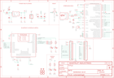

Contents
========

* [PRA2661 > Adafruit Bluefruit LE Micro PCB](#pra2661--adafruit-bluefruit-le-micro-pcb)
	* [Schematic](#schematic)
	* [PCB](#pcb)
	* [Interactive BOM](#interactive-bom)
	* [OOMP Parts](#oomp-parts)
	* [Images](#images)
	* [Tags](#tags)
  
![][im]
# PRA2661 > Adafruit Bluefruit LE Micro PCB

- ID: PROJ-ADAF-2661-STAN-01
- Hex ID: PRA2661
- Name: Adafruit
- Description: Adafruit
- Long Link: [http://oom.lt/PROJ-ADAF-2661-STAN-01](http://oom.lt/PROJ-ADAF-2661-STAN-01)
- Short Link: [http://oom.lt/PRA2661](http://oom.lt/PRA2661)

## Schematic
  

## PCB
  

## Interactive BOM

- Interactive BOM page: [ibom.html](https://htmlpreview.github.io/?https://github.com/oomlout/oomlout_OOMP_projects/blob/main/PROJ-ADAF-2661-STAN-01/kicad/bom/ibom.html)

## OOMP Parts
  

|OOMP Parts|
| :---: |
|C2 C2,CAPC-0805-X-UF1-01|
|[C6 CAPC-0805-X-UF10-V10 SMD (0805) 10 uF Capacitor (Ceramic) 10v](https://github.com/oomlout/oomlout_OOMP_parts/tree/main/CAPC-0805-X-UF10-V10/)|
|[C7 CAPC-0805-X-UF10-V10 SMD (0805) 10 uF Capacitor (Ceramic) 10v](https://github.com/oomlout/oomlout_OOMP_parts/tree/main/CAPC-0805-X-UF10-V10/)|
|[C8 CAPC-0805-X-UF10-V10 SMD (0805) 10 uF Capacitor (Ceramic) 10v](https://github.com/oomlout/oomlout_OOMP_parts/tree/main/CAPC-0805-X-UF10-V10/)|
|C9 C9,CAPC-0805-X-UF1-01|
|C10 C10,CAPC-UNMATCHED-X-UF1D-01|
|C14 C14,CAPC-0805-X-UF1D-01|
|C15 C15,CAPC-0805-X-UF1D-01|
|[D1 LEDS-0805-G-STAN-01 SMD (0805) Green LED](https://github.com/oomlout/oomlout_OOMP_parts/tree/main/LEDS-0805-G-STAN-01/)|
|[D2 LEDS-0805-G-STAN-01 SMD (0805) Green LED](https://github.com/oomlout/oomlout_OOMP_parts/tree/main/LEDS-0805-G-STAN-01/)|
|[D3 DIOD-S123-X-KMBR120-01 SMD (SOD-123) MBR120 Diode](https://github.com/oomlout/oomlout_OOMP_parts/tree/main/DIOD-S123-X-KMBR120-01/)|
|[D4 DIOD-S123-X-KMBR120-01 SMD (SOD-123) MBR120 Diode](https://github.com/oomlout/oomlout_OOMP_parts/tree/main/DIOD-S123-X-KMBR120-01/)|
|IC1 IC1,UNMATCHED-UNMATCHED-X-UNMATCHED-01|
|[JP1 HEAD-I01-X-PI16-01 2.54 mm 16 Pin Header](https://github.com/oomlout/oomlout_OOMP_parts/tree/main/HEAD-I01-X-PI16-01/)|
|[JP3 HEAD-I01-X-PI16-01 2.54 mm 16 Pin Header](https://github.com/oomlout/oomlout_OOMP_parts/tree/main/HEAD-I01-X-PI16-01/)|
|[L LEDS-0805-G-STAN-01 SMD (0805) Green LED](https://github.com/oomlout/oomlout_OOMP_parts/tree/main/LEDS-0805-G-STAN-01/)|
|[PWR LEDS-0805-G-STAN-01 SMD (0805) Green LED](https://github.com/oomlout/oomlout_OOMP_parts/tree/main/LEDS-0805-G-STAN-01/)|
|[R1 RESE-0805-X-O222-01 SMD (0805) 2.2k Ohm Resistor](https://github.com/oomlout/oomlout_OOMP_parts/tree/main/RESE-0805-X-O222-01/)|
|[R4 RESE-0805-X-O220-01 SMD (0805) 22 Ohm Resistor](https://github.com/oomlout/oomlout_OOMP_parts/tree/main/RESE-0805-X-O220-01/)|
|[R5 RESE-0805-X-O220-01 SMD (0805) 22 Ohm Resistor](https://github.com/oomlout/oomlout_OOMP_parts/tree/main/RESE-0805-X-O220-01/)|
|[R6 RESE-0805-X-O222-01 SMD (0805) 2.2k Ohm Resistor](https://github.com/oomlout/oomlout_OOMP_parts/tree/main/RESE-0805-X-O222-01/)|
|[R7 RESE-0805-X-O222-01 SMD (0805) 2.2k Ohm Resistor](https://github.com/oomlout/oomlout_OOMP_parts/tree/main/RESE-0805-X-O222-01/)|
|[R10 RESE-0805-X-O222-01 SMD (0805) 2.2k Ohm Resistor](https://github.com/oomlout/oomlout_OOMP_parts/tree/main/RESE-0805-X-O222-01/)|
|SW1 SW1,UNMATCHED-UNMATCHED-X-UNMATCHED-01|
|TP1 TP1,UNMATCHED-UNMATCHED-X-UNMATCHED-01|
|TP2 TP2,UNMATCHED-UNMATCHED-X-UNMATCHED-01|
|TP3 TP3,UNMATCHED-UNMATCHED-X-UNMATCHED-01|
|U1 U1,UNMATCHED-UNMATCHED-X-UNMATCHED-01|
|[U2 VREG-SO235-X-KMIC5225-V33D SMD (SOT-23-5) MIC5225 Voltage Regulator 3.3v](https://github.com/oomlout/oomlout_OOMP_parts/tree/main/VREG-SO235-X-KMIC5225-V33D/)|
|X1 X1,UNMATCHED-UNMATCHED-X-UNMATCHED-01|
|X3 X3,UNMATCHED-UNMATCHED-X-UNMATCHED-01|
|Y1 Y1,UNMATCHED-UNMATCHED-X-UNMATCHED-01|

## Images
  
  

|kicadPcb3d|kicadPcb3dFront|kicadPcb3dBack|eagleImage|eagleSchemImage|
| :---: | :---: | :---: | :---: | :---: |
||||||

## Tags

- hexID: PRA2661
- oompType: PROJ
- oompSize: ADAF
- oompColor: 2661
- oompDesc: STAN
- oompIndex: 01
- oompName: Adafruit Bluefruit LE Micro PCB
- sources: All source files from https://github.com/adafruit/Adafruit-Bluefruit-LE-Micro-PCB (source licence details in srcLicense.md)
- linkBuyPage: http://www.adafruit.com/products/2661
- oompID: PROJ-ADAF-2661-STAN-01
- oompParts: C2,CAPC-0805-X-UF1-01
- oompParts: C6,CAPC-0805-X-UF10-V10
- oompParts: C7,CAPC-0805-X-UF10-V10
- oompParts: C8,CAPC-0805-X-UF10-V10
- oompParts: C9,CAPC-0805-X-UF1-01
- oompParts: C10,CAPC-UNMATCHED-X-UF1D-01
- oompParts: C14,CAPC-0805-X-UF1D-01
- oompParts: C15,CAPC-0805-X-UF1D-01
- oompParts: D1,LEDS-0805-G-STAN-01
- oompParts: D2,LEDS-0805-G-STAN-01
- oompParts: D3,DIOD-S123-X-KMBR120-01
- oompParts: D4,DIOD-S123-X-KMBR120-01
- oompParts: IC1,UNMATCHED-UNMATCHED-X-UNMATCHED-01
- oompParts: JP1,HEAD-I01-X-PI16-01
- oompParts: JP3,HEAD-I01-X-PI16-01
- oompParts: L,LEDS-0805-G-STAN-01
- oompParts: PWR,LEDS-0805-G-STAN-01
- oompParts: R1,RESE-0805-X-O222-01
- oompParts: R4,RESE-0805-X-O220-01
- oompParts: R5,RESE-0805-X-O220-01
- oompParts: R6,RESE-0805-X-O222-01
- oompParts: R7,RESE-0805-X-O222-01
- oompParts: R10,RESE-0805-X-O222-01
- oompParts: SW1,UNMATCHED-UNMATCHED-X-UNMATCHED-01
- oompParts: TP1,UNMATCHED-UNMATCHED-X-UNMATCHED-01
- oompParts: TP2,UNMATCHED-UNMATCHED-X-UNMATCHED-01
- oompParts: TP3,UNMATCHED-UNMATCHED-X-UNMATCHED-01
- oompParts: U1,UNMATCHED-UNMATCHED-X-UNMATCHED-01
- oompParts: U2,VREG-SO235-X-KMIC5225-V33D
- oompParts: X1,UNMATCHED-UNMATCHED-X-UNMATCHED-01
- oompParts: X3,UNMATCHED-UNMATCHED-X-UNMATCHED-01
- oompParts: Y1,UNMATCHED-UNMATCHED-X-UNMATCHED-01
- rawParts: C2,1uF,CAP_CERAMIC0805-NOOUTLINE,0805-NO,Ceramic Capacitors,,
- rawParts: C6,10µF,CAP_CERAMIC_0805MP,_0805MP,Ceramic Capacitors,,
- rawParts: C7,10µF,CAP_CERAMIC0805-NOOUTLINE,0805-NO,Ceramic Capacitors,,
- rawParts: C8,10µF,CAP_CERAMIC0805-NOOUTLINE,0805-NO,Ceramic Capacitors,,
- rawParts: C9,1uF,CAP_CERAMIC0805-NOOUTLINE,0805-NO,Ceramic Capacitors,,
- rawParts: C10,0.1uF,CAP_CERAMIC0805_10MGAP,0805_10MGAP,Ceramic Capacitors,,
- rawParts: C14,0.1uF,CAP_CERAMIC0805-NOOUTLINE,0805-NO,Ceramic Capacitors,,
- rawParts: C15,0.1uF,CAP_CERAMIC0805-NOOUTLINE,0805-NO,Ceramic Capacitors,,
- rawParts: D1,RED,LED0805_NOOUTLINE,CHIPLED_0805_NOOUTLINE,LED,,
- rawParts: D2,BLUE,LED0805_NOOUTLINE,CHIPLED_0805_NOOUTLINE,LED,,
- rawParts: D3,MBR120,DIODE-SCHOTTKYSOD-123,SOD-123,,,
- rawParts: D4,MBR120,DIODE-SCHOTTKYSOD-123,SOD-123,,,
- rawParts: IC1,ATMEGA32U4-AU,ATMEGA32U4-AU,TQFP44,,,
- rawParts: JP1,,HEADER-1X16ROUND,1X16_ROUND,PIN HEADER,,
- rawParts: JP3,,HEADER-1X16ROUND,1X16_ROUND,PIN HEADER,,
- rawParts: L,RED,LED0805_NOOUTLINE,CHIPLED_0805_NOOUTLINE,LED,,
- rawParts: PWR,GREEN,LED0805_NOOUTLINE,CHIPLED_0805_NOOUTLINE,LED,,
- rawParts: R1,2.2K,RESISTOR0805_NOOUTLINE,0805-NO,Resistors,,
- rawParts: R4,22,RESISTOR0805_NOOUTLINE,0805-NO,Resistors,,
- rawParts: R5,22,RESISTOR0805_NOOUTLINE,0805-NO,Resistors,,
- rawParts: R6,2.2K,RESISTOR0805_NOOUTLINE,0805-NO,Resistors,,
- rawParts: R7,2.2K,RESISTOR0805_NOOUTLINE,0805-NO,Resistors,,
- rawParts: R10,2.2K,RESISTOR0805_NOOUTLINE,0805-NO,Resistors,,
- rawParts: SW1,SPST_TACT-KMR2,SPST_TACT-KMR2,KMR2,SMT 6mm switch, EVQQ2 series,,
- rawParts: TP1,SWCLK,TESTPOINT1.5X2.0MM_NOCREAM,PAD-1.5X2.0,Test Point,,
- rawParts: TP2,SWDIO,TESTPOINT1.5X2.0MM_NOCREAM,PAD-1.5X2.0,Test Point,,
- rawParts: TP3,SWDIO,TESTPOINT1.5X2.0MM_NOCREAM,PAD-1.5X2.0,Test Point,,
- rawParts: U$6,MOUNTINGHOLE2.5,MOUNTINGHOLE2.5,MOUNTINGHOLE_2.5_PLATED,Mounting Hole,EXCLUDE,
- rawParts: U$24,MOUNTINGHOLE2.5,MOUNTINGHOLE2.5,MOUNTINGHOLE_2.5_PLATED,Mounting Hole,EXCLUDE,
- rawParts: U$31,MOUNTINGHOLE2.5,MOUNTINGHOLE2.5,MOUNTINGHOLE_2.5_PLATED,Mounting Hole,EXCLUDE,
- rawParts: U$32,MOUNTINGHOLE2.5,MOUNTINGHOLE2.5,MOUNTINGHOLE_2.5_PLATED,Mounting Hole,EXCLUDE,
- rawParts: U$34,FIDUCIAL,FIDUCIAL,FIDUCIAL_1MM,Fiducial Alignment Points,EXCLUDE,
- rawParts: U$35,FIDUCIAL,FIDUCIAL,FIDUCIAL_1MM,Fiducial Alignment Points,EXCLUDE,
- rawParts: U1,MBT40,NRF51822_MODULE_MDBT40,BLE_MODULE_RAYTAC_MDBT40,nRF51822 Bluetooth Low Energy Module,,
- rawParts: U2,MIC5225-3.3,VREG_SOT23-5,SOT23-5,SOT23-5 Fixed Voltage Regulators,,
- rawParts: X1,JSTPH,CON_JST_PH_2PIN,JSTPH2,JST 2-Pin Right-Angle Connector,,
- rawParts: X3,microUSB,USBMICRO_20329,4UCONN_20329,USB Connectors,,
- rawParts: Y1,8MHz,RESONATORSMD,RESONATOR-SMD,Resonator,,

[im]: kicadPcb3d_450.png
