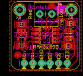

Contents
========

* [PROJ-ADAF-269-STAN-01>Adafruit MAX31855 breakout board](#proj-adaf-269-stan-01adafruit-max31855-breakout-board)
	* [Images](#images)
	* [Tags](#tags)
  
![][im]
# PROJ-ADAF-269-STAN-01>Adafruit MAX31855 breakout board

- ID: PROJ-ADAF-269-STAN-01
- Hex ID: PRA269
- Name: Adafruit MAX31855 breakout board
- Description: 

## Images
  
  

|eagleImage|kicadPcb3dFront|kicadPcb3dBack|kicadPcb3d|
| :---: | :---: | :---: | :---: |
|||||

## Tags

- hexID: PRA269
- oompType: PROJ
- oompSize: ADAF
- oompColor: 269
- oompDesc: STAN
- oompIndex: 01
- oompName: Adafruit MAX31855 breakout board
- sources: All source files from https://github.com/adafruit/Adafruit-MAX31855-breakout-board (source licence details in srcLicense.md)
- linkBuyPage: http://www.adafruit.com/products/269
- oompID: PROJ-ADAF-269-STAN-01
- oompParts: C1,UNMATCHED-UNMATCHED-UNMATCHED-UNMATCHED-UNMATCHED
- oompParts: C2,UNMATCHED-UNMATCHED-UNMATCHED-UNMATCHED-UNMATCHED
- oompParts: D1,UNMATCHED-UNMATCHED-UNMATCHED-UNMATCHED-UNMATCHED
- oompParts: D2,UNMATCHED-UNMATCHED-UNMATCHED-UNMATCHED-UNMATCHED
- oompParts: IC1,UNMATCHED-UNMATCHED-UNMATCHED-UNMATCHED-UNMATCHED
- oompParts: IC2,UNMATCHED-UNMATCHED-UNMATCHED-UNMATCHED-UNMATCHED
- oompParts: J1,UNMATCHED-UNMATCHED-UNMATCHED-UNMATCHED-UNMATCHED
- oompParts: JP1,UNMATCHED-UNMATCHED-UNMATCHED-UNMATCHED-UNMATCHED
- oompParts: R1,UNMATCHED-UNMATCHED-UNMATCHED-UNMATCHED-UNMATCHED
- oompParts: R2,UNMATCHED-UNMATCHED-UNMATCHED-UNMATCHED-UNMATCHED
- oompParts: U$4,UNMATCHED-UNMATCHED-UNMATCHED-UNMATCHED-UNMATCHED
- oompParts: U$5,UNMATCHED-UNMATCHED-UNMATCHED-UNMATCHED-UNMATCHED
- rawParts: C1,10uF,C-USC0805K,C0805K,CAPACITOR, American symbol,,
- rawParts: C2,10uF,C-USC0805K,C0805K,CAPACITOR, American symbol,,
- rawParts: D1,1n4148,DIODESOD-323F,SOD-323F,Diode,,
- rawParts: D2,1N4148,DIODESOD-323F,SOD-323F,Diode,,
- rawParts: IC1,MAX31855,MAX6675,SO08,,,
- rawParts: IC2,LP298XS,LP298XS,SOT23-5L,,,
- rawParts: J1,1X2-3.5MM,1X2-3.5MM,1X2-3.5MM,3.5mm Terminal block,,
- rawParts: JP1,Breakout,HEADER-1X676MIL,1X06_ROUND_76,PIN HEADER,,
- rawParts: R1,10K,R-US_R0805,R0805,RESISTOR, American symbol,,
- rawParts: R2,10K,R-US_R0805,R0805,RESISTOR, American symbol,,
- rawParts: U$1,FIDUCIAL,FIDUCIAL,FIDUCIAL_1MM,For use by pick and place machines to calibrate the vision/machine, 1mm,,
- rawParts: U$2,FIDUCIAL,FIDUCIAL,FIDUCIAL_1MM,For use by pick and place machines to calibrate the vision/machine, 1mm,,
- rawParts: U$4,MOUNTINGHOLE2.0,MOUNTINGHOLE2.0,MOUNTINGHOLE_2.0_PLATED,Mounting Hole,,
- rawParts: U$5,MOUNTINGHOLE2.0,MOUNTINGHOLE2.0,MOUNTINGHOLE_2.0_PLATED,Mounting Hole,,

[im]: kicadPcb3d_450.png
