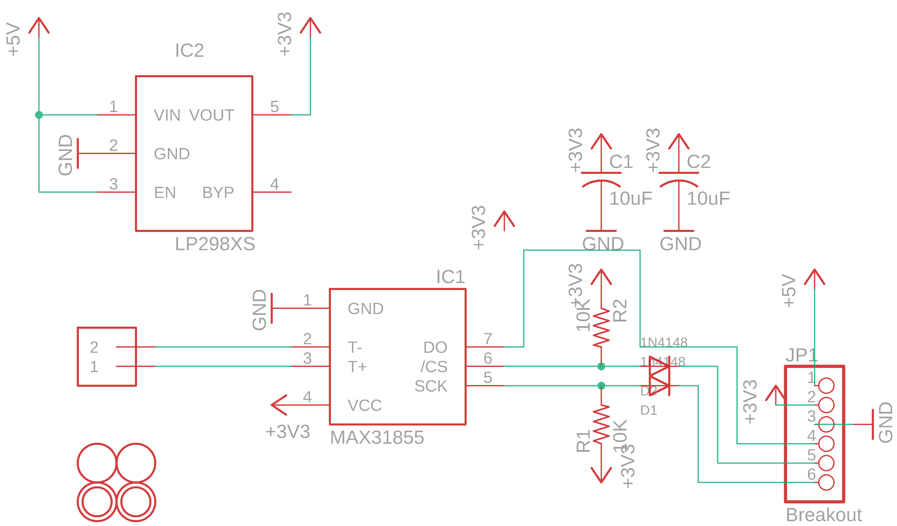

Contents
========

* [PRA269 > Adafruit](#pra269--adafruit)
	* [Schematic](#schematic)
	* [OOMP Parts](#oomp-parts)
	* [Images](#images)
	* [Tags](#tags)
  
![][im]
# PRA269 > Adafruit

- ID: PROJ-ADAF-269-STAN-01
- Hex ID: PRA269
- Name: Adafruit
- Description: Adafruit
- Long Link: [http://oom.lt/PROJ-ADAF-269-STAN-01](http://oom.lt/PROJ-ADAF-269-STAN-01)
- Short Link: [http://oom.lt/PRA269](http://oom.lt/PRA269)

## Schematic
  

## OOMP Parts
  

|OOMP Parts|
| :---: |
|C1,CAPC-0805-X-UF10-V10,C1,10uF,C-USC0805K,C0805K,CAPACITOR, American symbol,,|
|C2,CAPC-0805-X-UF10-V10,C2,10uF,C-USC0805K,C0805K,CAPACITOR, American symbol,,|
|D1,DIOD-S323-X-UNMATCHED-01,D1,1n4148,DIODESOD-323F,SOD-323F,Diode,,|
|D2,DIOD-S323-X-K4148-01,D2,1N4148,DIODESOD-323F,SOD-323F,Diode,,|
|IC1,UNMATCHED-UNMATCHED-X-UNMATCHED-01,IC1,MAX31855,MAX6675,SO08,,,|
|IC2,VREG-SO235-X-KLP298XS-V33D,IC2,LP298XS,LP298XS,SOT23-5L,,,|
|J1,UNMATCHED-UNMATCHED-X-UNMATCHED-01,J1,1X2-3.5MM,1X2-3.5MM,1X2-3.5MM,3.5mm Terminal block,,|
|JP1,HEAD-I01-X-PI06-01,JP1,Breakout,HEADER-1X676MIL,1X06_ROUND_76,PIN HEADER,,|
|R1,RESE-0805-X-O103-01,R1,10K,R-US_R0805,R0805,RESISTOR, American symbol,,|
|R2,RESE-0805-X-O103-01,R2,10K,R-US_R0805,R0805,RESISTOR, American symbol,,|
|U$4,UNMATCHED-UNMATCHED-X-UNMATCHED-01,U$1,FIDUCIAL,FIDUCIAL,FIDUCIAL_1MM,For use by pick and place machines to calibrate the vision/machine, 1mm,,|
|U$5,UNMATCHED-UNMATCHED-X-UNMATCHED-01,U$2,FIDUCIAL,FIDUCIAL,FIDUCIAL_1MM,For use by pick and place machines to calibrate the vision/machine, 1mm,,|

## Images
  
  

|kicadPcb3d|kicadPcb3dFront|kicadPcb3dBack|eagleImage|eagleSchemImage|
| :---: | :---: | :---: | :---: | :---: |
||||||

## Tags

- hexID: PRA269
- oompType: PROJ
- oompSize: ADAF
- oompColor: 269
- oompDesc: STAN
- oompIndex: 01
- oompName: Adafruit MAX31855 breakout board
- sources: All source files from https://github.com/adafruit/Adafruit-MAX31855-breakout-board (source licence details in srcLicense.md)
- linkBuyPage: http://www.adafruit.com/products/269
- oompID: PROJ-ADAF-269-STAN-01
- oompParts: C1,CAPC-0805-X-UF10-V10
- oompParts: C2,CAPC-0805-X-UF10-V10
- oompParts: D1,DIOD-S323-X-UNMATCHED-01
- oompParts: D2,DIOD-S323-X-K4148-01
- oompParts: IC1,UNMATCHED-UNMATCHED-X-UNMATCHED-01
- oompParts: IC2,VREG-SO235-X-KLP298XS-V33D
- oompParts: J1,UNMATCHED-UNMATCHED-X-UNMATCHED-01
- oompParts: JP1,HEAD-I01-X-PI06-01
- oompParts: R1,RESE-0805-X-O103-01
- oompParts: R2,RESE-0805-X-O103-01
- oompParts: U$4,UNMATCHED-UNMATCHED-X-UNMATCHED-01
- oompParts: U$5,UNMATCHED-UNMATCHED-X-UNMATCHED-01
- rawParts: C1,10uF,C-USC0805K,C0805K,CAPACITOR, American symbol,,
- rawParts: C2,10uF,C-USC0805K,C0805K,CAPACITOR, American symbol,,
- rawParts: D1,1n4148,DIODESOD-323F,SOD-323F,Diode,,
- rawParts: D2,1N4148,DIODESOD-323F,SOD-323F,Diode,,
- rawParts: IC1,MAX31855,MAX6675,SO08,,,
- rawParts: IC2,LP298XS,LP298XS,SOT23-5L,,,
- rawParts: J1,1X2-3.5MM,1X2-3.5MM,1X2-3.5MM,3.5mm Terminal block,,
- rawParts: JP1,Breakout,HEADER-1X676MIL,1X06_ROUND_76,PIN HEADER,,
- rawParts: R1,10K,R-US_R0805,R0805,RESISTOR, American symbol,,
- rawParts: R2,10K,R-US_R0805,R0805,RESISTOR, American symbol,,
- rawParts: U$1,FIDUCIAL,FIDUCIAL,FIDUCIAL_1MM,For use by pick and place machines to calibrate the vision/machine, 1mm,,
- rawParts: U$2,FIDUCIAL,FIDUCIAL,FIDUCIAL_1MM,For use by pick and place machines to calibrate the vision/machine, 1mm,,
- rawParts: U$4,MOUNTINGHOLE2.0,MOUNTINGHOLE2.0,MOUNTINGHOLE_2.0_PLATED,Mounting Hole,,
- rawParts: U$5,MOUNTINGHOLE2.0,MOUNTINGHOLE2.0,MOUNTINGHOLE_2.0_PLATED,Mounting Hole,,

[im]: kicadPcb3d_450.png
