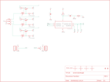

Contents
========

* [PRA2741 > Adafruit](#pra2741--adafruit)
	* [Schematic](#schematic)
	* [Interactive BOM](#interactive-bom)
	* [OOMP Parts](#oomp-parts)
	* [Images](#images)
	* [Tags](#tags)
  
![][im]
# PRA2741 > Adafruit

- ID: PROJ-ADAF-2741-STAN-01
- Hex ID: PRA2741
- Name: Adafruit
- Description: Adafruit
- Long Link: [http://oom.lt/PROJ-ADAF-2741-STAN-01](http://oom.lt/PROJ-ADAF-2741-STAN-01)
- Short Link: [http://oom.lt/PRA2741](http://oom.lt/PRA2741)

## Schematic
  

## Interactive BOM

- Interactive BOM page: [ibom.html](https://htmlpreview.github.io/?https://github.com/oomlout/oomlout_OOMP_projects/blob/main/PROJ-ADAF-2741-STAN-01/kicad/bom/ibom.html)

## OOMP Parts
  

|OOMP Parts|
| :---: |
|!MCLR,UNMATCHED-UNMATCHED-X-UNMATCHED-01,!MCLR,TEST-POINT3X4,TEST-POINT3X4,PAD.03X.04,Bare copper test points for troubleshooting or ICT,,|
|C1,CAPC-0805-X-UF22-01,C1,22uF,6.3V,CAP_CERAMIC_0805MP,_0805MP,Ceramic Capacitors,,|
|C2,CAPC-0805-X-UF22-01,C2,22uF,6.3V,CAP_CERAMIC_0805MP,_0805MP,Ceramic Capacitors,,|
|IC1,UNMATCHED-UNMATCHED-X-UNMATCHED-01,IC1,PIC12(L)F157X,PIC12(L)F157X,MSOP-8,,,|
|IN,UNMATCHED-UNMATCHED-X-UNMATCHED-01,IN,,M030.1PWR+SIG,1X03-0.1PWR+SIG,Header 3,,|
|LED1,UNMATCHED-UNMATCHED-X-UNMATCHED-01,LED1,RGBLED_CA,RGBLED_CA,RGBLED3W4PIN,RGB LED, common-anode5MM Staggered pins5mm Piranha package,,|
|OUT,UNMATCHED-UNMATCHED-X-UNMATCHED-01,OUT,,M030.1PWR+SIG,1X03-0.1PWR+SIG,Header 3,,|
|PGC,UNMATCHED-UNMATCHED-X-UNMATCHED-01,PGC,TEST-POINT3X4,TEST-POINT3X4,PAD.03X.04,Bare copper test points for troubleshooting or ICT,,|
|PGD,UNMATCHED-UNMATCHED-X-UNMATCHED-01,PGD,TEST-POINT3X4,TEST-POINT3X4,PAD.03X.04,Bare copper test points for troubleshooting or ICT,,|
|Q1,UNMATCHED-SO23-X-UNMATCHED-01,Q1,IRLML2060TRPBF,IRLML2060TRPBF,SOT23-3,,,|
|Q2,UNMATCHED-SO23-X-UNMATCHED-01,Q2,MMBT2222A,MMBT2222A,SOT23-3,,,|
|Q3,UNMATCHED-SO23-X-UNMATCHED-01,Q3,IRLML2060TRPBF,IRLML2060TRPBF,SOT23-3,,,|
|Q4,UNMATCHED-SO23-X-UNMATCHED-01,Q4,MMBT2222A,MMBT2222A,SOT23-3,,,|
|Q5,UNMATCHED-SO23-X-UNMATCHED-01,Q5,IRLML2060TRPBF,IRLML2060TRPBF,SOT23-3,,,|
|Q6,UNMATCHED-SO23-X-UNMATCHED-01,Q6,MMBT2222A,MMBT2222A,SOT23-3,,,|
|R1,RESE-1206-X-UNMATCHED-01,R1,1.74 0.25W,RESISTOR1206,1206,Resistor,,|
|R2,RESE-0603-X-O473-01,R2,47k,RESISTOR0603,0603-RES,Resistor,,|
|R3,RESE-1206-X-UNMATCHED-01,R3,1.74 0.25W,RESISTOR1206,1206,Resistor,,|
|R4,RESE-0603-X-O473-01,R4,47k,RESISTOR0603,0603-RES,Resistor,,|
|R5,RESE-1206-X-UNMATCHED-01,R5,1.74 0.25W,RESISTOR1206,1206,Resistor,,|
|R6,RESE-0603-X-O473-01,R6,47k,RESISTOR0603,0603-RES,Resistor,,|
|R7,RESE-0603-X-O101-01,R7,100,RESISTOR0603,0603-RES,Resistor,,|
|R8,RESE-0603-X-O31-01,R8,33,RESISTOR0603,0603-RES,Resistor,,|
|R9,RESE-0603-X-O101-01,R9,100,RESISTOR_0603MP,_0603MP,Resistors,,|
|U$1,UNMATCHED-UNMATCHED-X-UNMATCHED-01,U$1,ALIGN_CROSS,ALIGN_CROSS,ALIGN_CROSS,,,|
|U$2,UNMATCHED-UNMATCHED-X-UNMATCHED-01,U$2,ALIGN_CROSS,ALIGN_CROSS,ALIGN_CROSS,,,|
|U$3,UNMATCHED-UNMATCHED-X-UNMATCHED-01,U$3,ALIGN_CROSS,ALIGN_CROSS,ALIGN_CROSS,,,|
|U$4,UNMATCHED-UNMATCHED-X-UNMATCHED-01,U$4,ALIGN_CROSS,ALIGN_CROSS,ALIGN_CROSS,,,|

## Images
  
  

|kicadPcb3d|kicadPcb3dFront|kicadPcb3dBack|eagleImage|eagleSchemImage|
| :---: | :---: | :---: | :---: | :---: |
||||||

## Tags

- hexID: PRA2741
- oompType: PROJ
- oompSize: ADAF
- oompColor: 2741
- oompDesc: STAN
- oompIndex: 01
- oompName: Pixie 3W Smart LED PCB
- sources: All source files from https://github.com/adafruit/Pixie-3W-Smart-LED-PCB (source licence details in srcLicense.md)
- linkBuyPage: http://www.adafruit.com/products/2741
- oompID: PROJ-ADAF-2741-STAN-01
- oompParts: !MCLR,UNMATCHED-UNMATCHED-X-UNMATCHED-01
- oompParts: C1,CAPC-0805-X-UF22-01
- oompParts: C2,CAPC-0805-X-UF22-01
- oompParts: IC1,UNMATCHED-UNMATCHED-X-UNMATCHED-01
- oompParts: IN,UNMATCHED-UNMATCHED-X-UNMATCHED-01
- oompParts: LED1,UNMATCHED-UNMATCHED-X-UNMATCHED-01
- oompParts: OUT,UNMATCHED-UNMATCHED-X-UNMATCHED-01
- oompParts: PGC,UNMATCHED-UNMATCHED-X-UNMATCHED-01
- oompParts: PGD,UNMATCHED-UNMATCHED-X-UNMATCHED-01
- oompParts: Q1,UNMATCHED-SO23-X-UNMATCHED-01
- oompParts: Q2,UNMATCHED-SO23-X-UNMATCHED-01
- oompParts: Q3,UNMATCHED-SO23-X-UNMATCHED-01
- oompParts: Q4,UNMATCHED-SO23-X-UNMATCHED-01
- oompParts: Q5,UNMATCHED-SO23-X-UNMATCHED-01
- oompParts: Q6,UNMATCHED-SO23-X-UNMATCHED-01
- oompParts: R1,RESE-1206-X-UNMATCHED-01
- oompParts: R2,RESE-0603-X-O473-01
- oompParts: R3,RESE-1206-X-UNMATCHED-01
- oompParts: R4,RESE-0603-X-O473-01
- oompParts: R5,RESE-1206-X-UNMATCHED-01
- oompParts: R6,RESE-0603-X-O473-01
- oompParts: R7,RESE-0603-X-O101-01
- oompParts: R8,RESE-0603-X-O31-01
- oompParts: R9,RESE-0603-X-O101-01
- oompParts: U$1,UNMATCHED-UNMATCHED-X-UNMATCHED-01
- oompParts: U$2,UNMATCHED-UNMATCHED-X-UNMATCHED-01
- oompParts: U$3,UNMATCHED-UNMATCHED-X-UNMATCHED-01
- oompParts: U$4,UNMATCHED-UNMATCHED-X-UNMATCHED-01
- rawParts: !MCLR,TEST-POINT3X4,TEST-POINT3X4,PAD.03X.04,Bare copper test points for troubleshooting or ICT,,
- rawParts: C1,22uF,6.3V,CAP_CERAMIC_0805MP,_0805MP,Ceramic Capacitors,,
- rawParts: C2,22uF,6.3V,CAP_CERAMIC_0805MP,_0805MP,Ceramic Capacitors,,
- rawParts: IC1,PIC12(L)F157X,PIC12(L)F157X,MSOP-8,,,
- rawParts: IN,,M030.1PWR+SIG,1X03-0.1PWR+SIG,Header 3,,
- rawParts: LED1,RGBLED_CA,RGBLED_CA,RGBLED3W4PIN,RGB LED, common-anode5MM Staggered pins5mm Piranha package,,
- rawParts: OUT,,M030.1PWR+SIG,1X03-0.1PWR+SIG,Header 3,,
- rawParts: PGC,TEST-POINT3X4,TEST-POINT3X4,PAD.03X.04,Bare copper test points for troubleshooting or ICT,,
- rawParts: PGD,TEST-POINT3X4,TEST-POINT3X4,PAD.03X.04,Bare copper test points for troubleshooting or ICT,,
- rawParts: Q1,IRLML2060TRPBF,IRLML2060TRPBF,SOT23-3,,,
- rawParts: Q2,MMBT2222A,MMBT2222A,SOT23-3,,,
- rawParts: Q3,IRLML2060TRPBF,IRLML2060TRPBF,SOT23-3,,,
- rawParts: Q4,MMBT2222A,MMBT2222A,SOT23-3,,,
- rawParts: Q5,IRLML2060TRPBF,IRLML2060TRPBF,SOT23-3,,,
- rawParts: Q6,MMBT2222A,MMBT2222A,SOT23-3,,,
- rawParts: R1,1.74 0.25W,RESISTOR1206,1206,Resistor,,
- rawParts: R2,47k,RESISTOR0603,0603-RES,Resistor,,
- rawParts: R3,1.74 0.25W,RESISTOR1206,1206,Resistor,,
- rawParts: R4,47k,RESISTOR0603,0603-RES,Resistor,,
- rawParts: R5,1.74 0.25W,RESISTOR1206,1206,Resistor,,
- rawParts: R6,47k,RESISTOR0603,0603-RES,Resistor,,
- rawParts: R7,100,RESISTOR0603,0603-RES,Resistor,,
- rawParts: R8,33,RESISTOR0603,0603-RES,Resistor,,
- rawParts: R9,100,RESISTOR_0603MP,_0603MP,Resistors,,
- rawParts: U$1,ALIGN_CROSS,ALIGN_CROSS,ALIGN_CROSS,,,
- rawParts: U$2,ALIGN_CROSS,ALIGN_CROSS,ALIGN_CROSS,,,
- rawParts: U$3,ALIGN_CROSS,ALIGN_CROSS,ALIGN_CROSS,,,
- rawParts: U$4,ALIGN_CROSS,ALIGN_CROSS,ALIGN_CROSS,,,
- rawParts: U$5,PIXIE-LOGO,PIXIE-LOGO,PIXIE-LOGO,,,
- rawParts: U$6,FIDUCIAL,FIDUCIAL,FIDUCIAL_1MM,Fiducial Alignment Points,EXCLUDE,
- rawParts: U$7,FIDUCIAL,FIDUCIAL,FIDUCIAL_1MM,Fiducial Alignment Points,EXCLUDE,

[im]: kicadPcb3d_450.png
