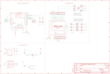

Contents
========

* [PRA2746 > Adafruit Bluefruit LE Shield PCB](#pra2746--adafruit-bluefruit-le-shield-pcb)
	* [Schematic](#schematic)
	* [PCB](#pcb)
	* [Interactive BOM](#interactive-bom)
	* [OOMP Parts](#oomp-parts)
	* [Images](#images)
	* [Tags](#tags)
  
![][im]
# PRA2746 > Adafruit Bluefruit LE Shield PCB

- ID: PROJ-ADAF-2746-STAN-01
- Hex ID: PRA2746
- Name: Adafruit
- Description: Adafruit
- Long Link: [http://oom.lt/PROJ-ADAF-2746-STAN-01](http://oom.lt/PROJ-ADAF-2746-STAN-01)
- Short Link: [http://oom.lt/PRA2746](http://oom.lt/PRA2746)

## Schematic
  

## PCB
  

## Interactive BOM

- Interactive BOM page: [ibom.html](https://htmlpreview.github.io/?https://github.com/oomlout/oomlout_OOMP_projects/blob/main/PROJ-ADAF-2746-STAN-01/kicad/bom/ibom.html)

## OOMP Parts
  

|OOMP ID|Name|Identifier|
| :---: | :---: | :---: |
|[CAPC-0805-X-UF10-V10](https://github.com/oomlout/oomlout_OOMP_parts/tree/main/CAPC-0805-X-UF10-V10/)|[SMD (0805) 10 uF Capacitor (Ceramic) 10v](https://github.com/oomlout/oomlout_OOMP_parts/tree/main/CAPC-0805-X-UF10-V10/)|[C1, C3](https://github.com/oomlout/oomlout_OOMP_parts/tree/main/CAPC-0805-X-UF10-V10/)|
|CAPC-0805-X-UNMATCHED-01||C2|
|[LEDS-0805-R-STAN-01](https://github.com/oomlout/oomlout_OOMP_parts/tree/main/LEDS-0805-R-STAN-01/)|[SMD (0805) Red LED](https://github.com/oomlout/oomlout_OOMP_parts/tree/main/LEDS-0805-R-STAN-01/)|[D1](https://github.com/oomlout/oomlout_OOMP_parts/tree/main/LEDS-0805-R-STAN-01/)|
|[LEDS-0805-L-STAN-01](https://github.com/oomlout/oomlout_OOMP_parts/tree/main/LEDS-0805-L-STAN-01/)|[SMD (0805) Blue LED](https://github.com/oomlout/oomlout_OOMP_parts/tree/main/LEDS-0805-L-STAN-01/)|[D2](https://github.com/oomlout/oomlout_OOMP_parts/tree/main/LEDS-0805-L-STAN-01/)|
|[DIOD-S323-X-K4148-01](https://github.com/oomlout/oomlout_OOMP_parts/tree/main/DIOD-S323-X-K4148-01/)|[SMD (SOD-323) Diode](https://github.com/oomlout/oomlout_OOMP_parts/tree/main/DIOD-S323-X-K4148-01/)|[D3](https://github.com/oomlout/oomlout_OOMP_parts/tree/main/DIOD-S323-X-K4148-01/)|
|UNMATCHED-SO23-X-UNMATCHED-01||IC1|
|[VREG-SO235-X-KMIC5225-V33D](https://github.com/oomlout/oomlout_OOMP_parts/tree/main/VREG-SO235-X-KMIC5225-V33D/)|[SMD (SOT-23-5) MIC5225 Voltage Regulator 3.3v](https://github.com/oomlout/oomlout_OOMP_parts/tree/main/VREG-SO235-X-KMIC5225-V33D/)|[IC4](https://github.com/oomlout/oomlout_OOMP_parts/tree/main/VREG-SO235-X-KMIC5225-V33D/)|
|HEAD-I01-X-PI01-01||JP1, JP6, JP7, JP9, JP10, JP11|
|[HEAD-I01-X-PI08-01](https://github.com/oomlout/oomlout_OOMP_parts/tree/main/HEAD-I01-X-PI08-01/)|[2.54 mm 8 Pin Header](https://github.com/oomlout/oomlout_OOMP_parts/tree/main/HEAD-I01-X-PI08-01/)|[JP2, JP3](https://github.com/oomlout/oomlout_OOMP_parts/tree/main/HEAD-I01-X-PI08-01/)|
|[HEAD-I01-X-PI06-01](https://github.com/oomlout/oomlout_OOMP_parts/tree/main/HEAD-I01-X-PI06-01/)|[2.54 mm 6 Pin Header](https://github.com/oomlout/oomlout_OOMP_parts/tree/main/HEAD-I01-X-PI06-01/)|[JP4](https://github.com/oomlout/oomlout_OOMP_parts/tree/main/HEAD-I01-X-PI06-01/)|
|[HEAD-I01-X-PI10-01](https://github.com/oomlout/oomlout_OOMP_parts/tree/main/HEAD-I01-X-PI10-01/)|[2.54 mm 10 Pin Header](https://github.com/oomlout/oomlout_OOMP_parts/tree/main/HEAD-I01-X-PI10-01/)|[JP5](https://github.com/oomlout/oomlout_OOMP_parts/tree/main/HEAD-I01-X-PI10-01/)|
|[HEAD-I01-X-PI03-01](https://github.com/oomlout/oomlout_OOMP_parts/tree/main/HEAD-I01-X-PI03-01/)|[2.54 mm 3 Pin Header](https://github.com/oomlout/oomlout_OOMP_parts/tree/main/HEAD-I01-X-PI03-01/)|[JP8](https://github.com/oomlout/oomlout_OOMP_parts/tree/main/HEAD-I01-X-PI03-01/)|
|UNMATCHED-UNMATCHED-X-UNMATCHED-01||M1, U1|
|[MOSN-SO23-X-KBSS138-01](https://github.com/oomlout/oomlout_OOMP_parts/tree/main/MOSN-SO23-X-KBSS138-01/)|[SMD (SOT-23) BSS138 N-Ch. MOSFET](https://github.com/oomlout/oomlout_OOMP_parts/tree/main/MOSN-SO23-X-KBSS138-01/)|[Q1](https://github.com/oomlout/oomlout_OOMP_parts/tree/main/MOSN-SO23-X-KBSS138-01/)|
|[RESE-0805-X-O202-01](https://github.com/oomlout/oomlout_OOMP_parts/tree/main/RESE-0805-X-O202-01/)|[SMD (0805) 2k Ohm Resistor](https://github.com/oomlout/oomlout_OOMP_parts/tree/main/RESE-0805-X-O202-01/)|[R1, R10](https://github.com/oomlout/oomlout_OOMP_parts/tree/main/RESE-0805-X-O202-01/)|
|RESE-0805-X-O1003-01||R3, R4, R5|
|[BUTA-4628-X-STAN-01](https://github.com/oomlout/oomlout_OOMP_parts/tree/main/BUTA-4628-X-STAN-01/)|[SMD (4628) Pushbutton (Tactile)](https://github.com/oomlout/oomlout_OOMP_parts/tree/main/BUTA-4628-X-STAN-01/)|[SW1](https://github.com/oomlout/oomlout_OOMP_parts/tree/main/BUTA-4628-X-STAN-01/)|
|[BUTA-6060-X-STAN-01](https://github.com/oomlout/oomlout_OOMP_parts/tree/main/BUTA-6060-X-STAN-01/)|[SMD (6060) Pushbutton (Tactile)](https://github.com/oomlout/oomlout_OOMP_parts/tree/main/BUTA-6060-X-STAN-01/)|[SW2](https://github.com/oomlout/oomlout_OOMP_parts/tree/main/BUTA-6060-X-STAN-01/)|

## Images
  
  

|bominteractivefront|bominteractiveback|kicadPcb3d|kicadPcb3dFront|kicadPcb3dBack|eagleImage|eagleSchemImage|pcbdraw|pcbdrawback|
| :---: | :---: | :---: | :---: | :---: | :---: | :---: | :---: | :---: |
||||||||||

## Tags

- hexID: PRA2746
- oompType: PROJ
- oompSize: ADAF
- oompColor: 2746
- oompDesc: STAN
- oompIndex: 01
- oompName: Adafruit Bluefruit LE Shield PCB
- sources: All source files from https://github.com/adafruit/Adafruit-Bluefruit-LE-Shield-PCB (source licence details in srcLicense.md)
- linkBuyPage: http://www.adafruit.com/products/2746
- oompID: PROJ-ADAF-2746-STAN-01
- oompParts: C1,CAPC-0805-X-UF10-V10
- oompParts: C2,CAPC-0805-X-UNMATCHED-01
- oompParts: C3,CAPC-0805-X-UF10-V10
- oompParts: D1,LEDS-0805-R-STAN-01
- oompParts: D2,LEDS-0805-L-STAN-01
- oompParts: D3,DIOD-S323-X-K4148-01
- oompParts: IC1,UNMATCHED-SO23-X-UNMATCHED-01
- oompParts: IC4,VREG-SO235-X-KMIC5225-V33D
- oompParts: JP1,HEAD-I01-X-PI01-01
- oompParts: JP2,HEAD-I01-X-PI08-01
- oompParts: JP3,HEAD-I01-X-PI08-01
- oompParts: JP4,HEAD-I01-X-PI06-01
- oompParts: JP5,HEAD-I01-X-PI10-01
- oompParts: JP6,HEAD-I01-X-PI01-01
- oompParts: JP7,HEAD-I01-X-PI01-01
- oompParts: JP8,HEAD-I01-X-PI03-01
- oompParts: JP9,HEAD-I01-X-PI01-01
- oompParts: JP10,HEAD-I01-X-PI01-01
- oompParts: JP11,HEAD-I01-X-PI01-01
- oompParts: M1,UNMATCHED-UNMATCHED-X-UNMATCHED-01
- oompParts: Q1,MOSN-SO23-X-KBSS138-01
- oompParts: R1,RESE-0805-X-O202-01
- oompParts: R3,RESE-0805-X-O1003-01
- oompParts: R4,RESE-0805-X-O1003-01
- oompParts: R5,RESE-0805-X-O1003-01
- oompParts: R10,RESE-0805-X-O202-01
- oompParts: SW1,BUTA-4628-X-STAN-01
- oompParts: SW2,BUTA-6060-X-STAN-01
- oompParts: U1,UNMATCHED-UNMATCHED-X-UNMATCHED-01
- rawParts: C1,10uF,CAP_CERAMIC0805-NOOUTLINE,0805-NO,Ceramic Capacitors,,
- rawParts: C2,1.0uF,CAP_CERAMIC0805-NOOUTLINE,0805-NO,Ceramic Capacitors,,
- rawParts: C3,10uF,CAP_CERAMIC0805-NOOUTLINE,0805-NO,Ceramic Capacitors,,
- rawParts: CS_JMP,,SOLDERJUMPERCLOSED,SOLDERJUMPER_CLOSEDWIRE,SMD Solder JUMPER,,
- rawParts: D1,RED,LED0805_NOOUTLINE,CHIPLED_0805_NOOUTLINE,LED,,
- rawParts: D2,BLUE,LED0805_NOOUTLINE,CHIPLED_0805_NOOUTLINE,LED,,
- rawParts: D3,1N4148,DIODESOD-323,SOD-323,Diode,,
- rawParts: FID1,FIDUCIAL,FIDUCIAL,FIDUCIAL_1MM,Fiducial Alignment Points,EXCLUDE,
- rawParts: FID2,FIDUCIAL,FIDUCIAL,FIDUCIAL_1MM,Fiducial Alignment Points,EXCLUDE,
- rawParts: FID3,FIDUCIAL,FIDUCIAL,FIDUCIAL_1MM,Fiducial Alignment Points,EXCLUDE,
- rawParts: IC1,74LVC2G34DBVR,74LVC2G34DBVR,SOT23-6,,,
- rawParts: IC4,MIC5225-3.3,LP298XS,SOT23-5L,,,
- rawParts: IRQ_JMP,,SOLDERJUMPERCLOSED,SOLDERJUMPER_CLOSEDWIRE,SMD Solder JUMPER,,
- rawParts: JP1,,HEADER-1X1ROUND,1X01_ROUND,PIN HEADER,,
- rawParts: JP2,,HEADER-1X870MIL,1X08_ROUND_70,PIN HEADER,,
- rawParts: JP3,,HEADER-1X870MIL,1X08_ROUND_70,PIN HEADER,,
- rawParts: JP4,,HEADER-1X670MIL,1X06_ROUND_70,PIN HEADER,,
- rawParts: JP5,,HEADER-1X1070MIL,1X10_ROUND70,PIN HEADER,,
- rawParts: JP6,,HEADER-1X1ROUND,1X01_ROUND,PIN HEADER,,
- rawParts: JP7,,HEADER-1X1ROUND,1X01_ROUND,PIN HEADER,,
- rawParts: JP8,SWDIO,HEADER-1X376MIL,1X03_ROUND_76,PIN HEADER,,
- rawParts: JP9,,HEADER-1X1ROUND,1X01_ROUND,PIN HEADER,,
- rawParts: JP10,,HEADER-1X1ROUND,1X01_ROUND,PIN HEADER,,
- rawParts: JP11,,HEADER-1X1ROUND,1X01_ROUND,PIN HEADER,,
- rawParts: M1,ARDUINO_R3_ICSP_NODIM,ARDUINO_R3_ICSP_NODIM,ARDUINOR3_ICSP_NODIM,,,
- rawParts: Q1,BSS138,MOSFET-NWIDE,SOT23-WIDE,N-Channel Mosfet,,
- rawParts: R1,2K,RESISTOR0805_NOOUTLINE,0805-NO,Resistors,,
- rawParts: R3,100K,RESISTOR0805_NOOUTLINE,0805-NO,Resistors,,
- rawParts: R4,100K,RESISTOR0805_NOOUTLINE,0805-NO,Resistors,,
- rawParts: R5,100K,RESISTOR0805_NOOUTLINE,0805-NO,Resistors,,
- rawParts: R10,2K,RESISTOR0805_NOOUTLINE,0805-NO,Resistors,,
- rawParts: RST_JMP,,SOLDERJUMPERCLOSED,SOLDERJUMPER_CLOSEDWIRE,SMD Solder JUMPER,,
- rawParts: SJ2,ICSP_MISO,SOLDERJUMPERCLOSED,SOLDERJUMPER_CLOSEDWIRE,SMD Solder JUMPER,,
- rawParts: SJ3,ISCP_SCLK,SOLDERJUMPERCLOSED,SOLDERJUMPER_CLOSEDWIRE,SMD Solder JUMPER,,
- rawParts: SJ4,ICSP_MOSI,SOLDERJUMPERCLOSED,SOLDERJUMPER_CLOSEDWIRE,SMD Solder JUMPER,,
- rawParts: SJ5,D12_MISO,SOLDERJUMPERREFLOW_NOPASTE,SOLDERJUMPER_REFLOW_NOPASTE,SMD Solder JUMPER,,
- rawParts: SJ6,D13_SCLK,SOLDERJUMPERREFLOW_NOPASTE,SOLDERJUMPER_REFLOW_NOPASTE,SMD Solder JUMPER,,
- rawParts: SJ7,D11_MOSI,SOLDERJUMPERREFLOW_NOPASTE,SOLDERJUMPER_REFLOW_NOPASTE,SMD Solder JUMPER,,
- rawParts: SW1,KMR2,SWITCH_TACT_SMT4.6X2.8,BTN_KMR2_4.6X2.8,SMT Tact Switches,,
- rawParts: SW2,Tactile,SWITCH_TACT_SMT,EVQ-Q2,SMT Tact Switches,,
- rawParts: U1,MBT40,NRF51822_MODULE_MDBT40,BLE_MODULE_RAYTAC_MDBT40,nRF51822 Bluetooth Low Energy Module,,

[im]: kicadPcb3d_450.png
