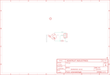

Contents
========

* [PRA2748 > Adafruit ALS PT19 Sensor Breakout PCB](#pra2748--adafruit-als-pt19-sensor-breakout-pcb)
	* [Schematic](#schematic)
	* [PCB](#pcb)
	* [Interactive BOM](#interactive-bom)
	* [OOMP Parts](#oomp-parts)
	* [Images](#images)
	* [Tags](#tags)
  
![][im]
# PRA2748 > Adafruit ALS PT19 Sensor Breakout PCB

- ID: PROJ-ADAF-2748-STAN-01
- Hex ID: PRA2748
- Name: Adafruit
- Description: Adafruit
- Long Link: [http://oom.lt/PROJ-ADAF-2748-STAN-01](http://oom.lt/PROJ-ADAF-2748-STAN-01)
- Short Link: [http://oom.lt/PRA2748](http://oom.lt/PRA2748)

## Schematic
  

## PCB
  

## Interactive BOM

- Interactive BOM page: [ibom.html](https://htmlpreview.github.io/?https://github.com/oomlout/oomlout_OOMP_projects/blob/main/PROJ-ADAF-2748-STAN-01/kicad/bom/ibom.html)

## OOMP Parts
  

|OOMP ID|Name|Identifier|
| :---: | :---: | :---: |
|[HEAD-I01-X-PI03-01](https://github.com/oomlout/oomlout_OOMP_parts/tree/main/HEAD-I01-X-PI03-01/)|[2.54 mm 3 Pin Header](https://github.com/oomlout/oomlout_OOMP_parts/tree/main/HEAD-I01-X-PI03-01/)|[JP2](https://github.com/oomlout/oomlout_OOMP_parts/tree/main/HEAD-I01-X-PI03-01/)|
|[RESE-0603-X-O103-01](https://github.com/oomlout/oomlout_OOMP_parts/tree/main/RESE-0603-X-O103-01/)|[SMD (0603) 10k Ohm Resistor](https://github.com/oomlout/oomlout_OOMP_parts/tree/main/RESE-0603-X-O103-01/)|[R1](https://github.com/oomlout/oomlout_OOMP_parts/tree/main/RESE-0603-X-O103-01/)|
|UNMATCHED-UNMATCHED-X-UNMATCHED-01||U1|

## Images
  
  

|bominteractivefront|bominteractiveback|kicadPcb3d|kicadPcb3dFront|kicadPcb3dBack|kicadSchem|eagleImage|eagleSchemImage|pcbdraw|pcbdrawback|
| :---: | :---: | :---: | :---: | :---: | :---: | :---: | :---: | :---: | :---: |
|||||||||||

## Tags

- hexID: PRA2748
- oompType: PROJ
- oompSize: ADAF
- oompColor: 2748
- oompDesc: STAN
- oompIndex: 01
- oompName: Adafruit ALS PT19 Sensor Breakout PCB
- sources: All source files from https://github.com/adafruit/Adafruit-ALS-PT19-Sensor-Breakout-PCB (source licence details in srcLicense.md)
- linkBuyPage: http://www.adafruit.com/products/2748
- oompID: PROJ-ADAF-2748-STAN-01
- oompParts: JP2,HEAD-I01-X-PI03-01
- oompParts: R1,RESE-0603-X-O103-01
- oompParts: U1,UNMATCHED-UNMATCHED-X-UNMATCHED-01
- rawParts: FID1,FIDUCIAL,FIDUCIAL,FIDUCIAL_1MM,Fiducial Alignment Points,EXCLUDE,
- rawParts: JP2,,HEADER-1X3ROUND,1X03_ROUND,PIN HEADER,,
- rawParts: R1,10K,RESISTOR_0603_NOOUT,0603-NO,Resistors,,
- rawParts: U$2,MOUNTINGHOLE2.0,MOUNTINGHOLE2.0,MOUNTINGHOLE_2.0_PLATED,Mounting Hole,EXCLUDE,
- rawParts: U1,ALS-PT19-315C,LIGHT_ALS-PT19-315C,ALS-PT19-315C,ALS-PT19-315C - Analog Light Sensor,,

[im]: kicadPcb3d_450.png
