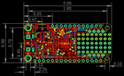
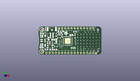
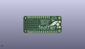
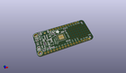

Contents
========

* [PROJ-ADAF-2771-STAN-01>Adafruit Feather 32u4 Basic Proto PCB](#proj-adaf-2771-stan-01adafruit-feather-32u4-basic-proto-pcb)
	* [Images](#images)
	* [Interactive BOM](#interactive-bom)
	* [OOMP Parts](#oomp-parts)
	* [Tags](#tags)
  
![][im]
# PROJ-ADAF-2771-STAN-01>Adafruit Feather 32u4 Basic Proto PCB

- ID: PROJ-ADAF-2771-STAN-01
- Hex ID: PRA2771
- Name: Adafruit Feather 32u4 Basic Proto PCB
- Description: 

## Images
  
  

|eagleImage|kicadPcb3dFront|kicadPcb3dBack|kicadPcb3d|
| :---: | :---: | :---: | :---: |
|||||

## Interactive BOM

- Interactive BOM page: [ibom.html](kicad/bom/ibom.html)

## OOMP Parts
  

|OOMP Parts|
| :---: |
|CAPC-0805-X-UNMATCHED-01, C3, 11.811, 12.065, 0,C3, 10uF, 0805-NO, microbuilder, (0.465, 0.475), R0|
|CAPC-0805-X-UNMATCHED-01, C6, 8.08800008, 12.95899999, 90,C6, 10uF, 0805-NO, microbuilder, (0.3184252, 0.51019685), R90|
|CAPC-0603-X-UNMATCHED-01, C7, 19.066999966, 15.290999897999999, 90,C7, 1uF, 0603-NO, microbuilder, (0.75066929, 0.60200787), R90|
|CAPC-0805-X-UNMATCHED-01, C8, 14.365999969999999, 11.624000119999998, 270,C8, 10uF, 0805-NO, microbuilder, (0.56559055, 0.4576378), R270|
|CAPC-0805-X-UNMATCHED-01, C9, 26.565200108, 15.905406339999997, 0,C9, 10uF, 0805-NO, microbuilder, (1.04587402, 0.6261971), R0|
|CAPC-0603-X-UNMATCHED-01, C14, 10.5918, 4.0905938, 0,C14, 1uF, 0603-NO, microbuilder, (0.417, 0.161047), R0|
|UNMATCHED-UNMATCHED-X-UNMATCHED-01, CHG, 2.413, 5.588, 270,CHG, ORANGE, CHIPLED_0805_NOOUTLINE, microbuilder, (0.095, 0.22), R270|
|UNMATCHED-UNMATCHED-X-UNMATCHED-01, D4, 17.906999999999996, 18.923, 180,D4, MBR120, SOD-123, microbuilder, (0.705, 0.745), R180|
|UNMATCHED-UNMATCHED-X-UNMATCHED-01, IC1, 23.5585, 11.049, 0,IC1, ATMEGA32U4-MU, TQFN44_7MM, microbuilder, (0.9275, 0.435), R0|
|<table><tr><td></td><td> JP1</td><td>[HEAD-I01-X-PI16-01 2.54 mm 16 Pin Header](https://github.com/oomlout/oomlout_OOMP_parts/tree/main/HEAD-I01-X-PI16-01/)</td><td>[H16](https://github.com/oomlout/oomlout_OOMP_parts/tree/main/HEAD-I01-X-PI16-01/)</td></tr></table>|
|<table><tr><td></td><td> JP3</td><td>[HEAD-I01-X-PI12-01 2.54 mm 12 Pin Header](https://github.com/oomlout/oomlout_OOMP_parts/tree/main/HEAD-I01-X-PI12-01/)</td><td>[H12](https://github.com/oomlout/oomlout_OOMP_parts/tree/main/HEAD-I01-X-PI12-01/)</td></tr></table>|
|LEDS-UNMATCHED-X-UNMATCHED-01, L, 2.6450000439999997, 17.359000079999998, 90,L, RED, CHIPLED_0805_NOOUTLINE, microbuilder, (0.10413386, 0.6834252), R90|
|RESE-0603-X-UNMATCHED-01, R2, 6.223, 4.191, 0,R2, 1K, 0603-NO, microbuilder, (0.245, 0.165), R0|
|<table><tr><td></td><td> R3</td><td>[RESE-0603-X-O104-01 SMD (0603) 100k Ohm Resistor](https://github.com/oomlout/oomlout_OOMP_parts/tree/main/RESE-0603-X-O104-01/)</td><td>[R6104](https://github.com/oomlout/oomlout_OOMP_parts/tree/main/RESE-0603-X-O104-01/)</td></tr></table>|
|RESE-0603-X-UNMATCHED-01, R4, 8.219000072, 10.268000038, 0,R4, 22, 0603-NO, microbuilder, (0.32358268, 0.40425197), R0|
|RESE-0603-X-UNMATCHED-01, R5, 8.149787611999999, 8.878687602, 0,R5, 22, 0603-NO, microbuilder, (0.32085778, 0.34955463), R0|
|<table><tr><td></td><td> R6</td><td>[RESE-0603-X-O104-01 SMD (0603) 100k Ohm Resistor](https://github.com/oomlout/oomlout_OOMP_parts/tree/main/RESE-0603-X-O104-01/)</td><td>[R6104](https://github.com/oomlout/oomlout_OOMP_parts/tree/main/RESE-0603-X-O104-01/)</td></tr></table>|
|RESE-0603-X-UNMATCHED-01, R7, 5.588, 20.955, 270,R7, 2.2K, 0603-NO, microbuilder, (0.22, 0.825), R270|
|RESE-0603-X-UNMATCHED-01, R8, 13.716, 4.191, 180,R8, 10K\, 0603-NO, microbuilder, (0.54, 0.165), R180|
|<table><tr><td></td><td> R9</td><td>[RESE-0603-X-O104-01 SMD (0603) 100k Ohm Resistor](https://github.com/oomlout/oomlout_OOMP_parts/tree/main/RESE-0603-X-O104-01/)</td><td>[R6104](https://github.com/oomlout/oomlout_OOMP_parts/tree/main/RESE-0603-X-O104-01/)</td></tr></table>|
|UNMATCHED-UNMATCHED-X-UNMATCHED-01, SW1, 9.398, 6.476999999999999, 180,SW1, SPST_TACT-KMR2, KMR2, adafruit, (0.37, 0.255), R180|
|UNMATCHED-UNMATCHED-X-UNMATCHED-01, U2, 16.5608, 14.808199999999998, 180,U2, SPX3819-3.3, SOT23-5, microbuilder, (0.652, 0.583), R180|
|UNMATCHED-UNMATCHED-X-UNMATCHED-01, U3, 13.97, 7.746999999999999, 180,U3, MCP73831T-2ACI/OT, SOT23-5, microbuilder, (0.55, 0.305), R180|
|UNMATCHED-UNMATCHED-X-UNMATCHED-01, X3, 4.444999999999999, 11.43, 270,X3, microUSB, 4UCONN_20329_V2, microbuilder, (0.175, 0.45), R270|
|UNMATCHED-UNMATCHED-X-UNMATCHED-01, Y1, 28.056106193999998, 5.386606194, 180,Y1, 8MHz, RESONATOR-SMD, SparkFun, (1.10457111, 0.21207111), R180|

## Tags

- hexID: PRA2771
- oompType: PROJ
- oompSize: ADAF
- oompColor: 2771
- oompDesc: STAN
- oompIndex: 01
- oompName: Adafruit Feather 32u4 Basic Proto PCB
- sources: All source files from https://github.com/adafruit/Adafruit-Feather-32u4-Basic-Proto-PCB (source licence details in srcLicense.md)
- linkBuyPage: http://www.adafruit.com/products/2771
- oompPart: CAPC-0805-X-UNMATCHED-01, C3, 11.811, 12.065, 0
- oompPart: CAPC-0805-X-UNMATCHED-01, C6, 8.08800008, 12.95899999, 90
- oompPart: CAPC-0603-X-UNMATCHED-01, C7, 19.066999966, 15.290999897999999, 90
- oompPart: CAPC-0805-X-UNMATCHED-01, C8, 14.365999969999999, 11.624000119999998, 270
- oompPart: CAPC-0805-X-UNMATCHED-01, C9, 26.565200108, 15.905406339999997, 0
- oompPart: CAPC-0603-X-UNMATCHED-01, C14, 10.5918, 4.0905938, 0
- oompPart: UNMATCHED-UNMATCHED-X-UNMATCHED-01, CHG, 2.413, 5.588, 270
- oompPart: UNMATCHED-UNMATCHED-X-UNMATCHED-01, D4, 17.906999999999996, 18.923, 180
- oompPart: UNMATCHED-UNMATCHED-X-UNMATCHED-01, IC1, 23.5585, 11.049, 0
- oompPart: HEAD-I01-X-PI16-01, JP1, 25.4, 1.27, 180
- oompPart: HEAD-I01-X-PI12-01, JP3, 30.479999999999997, 21.59, 0
- oompPart: LEDS-UNMATCHED-X-UNMATCHED-01, L, 2.6450000439999997, 17.359000079999998, 90
- oompPart: RESE-0603-X-UNMATCHED-01, R2, 6.223, 4.191, 0
- oompPart: RESE-0603-X-O104-01, R3, 29.463999999999995, 18.541999999999998, 0
- oompPart: RESE-0603-X-UNMATCHED-01, R4, 8.219000072, 10.268000038, 0
- oompPart: RESE-0603-X-UNMATCHED-01, R5, 8.149787611999999, 8.878687602, 0
- oompPart: RESE-0603-X-O104-01, R6, 29.463999999999995, 16.383, 270
- oompPart: RESE-0603-X-UNMATCHED-01, R7, 5.588, 20.955, 270
- oompPart: RESE-0603-X-UNMATCHED-01, R8, 13.716, 4.191, 180
- oompPart: RESE-0603-X-O104-01, R9, 17.399, 17.424400000000002, 180
- oompPart: UNMATCHED-UNMATCHED-X-UNMATCHED-01, SW1, 9.398, 6.476999999999999, 180
- oompPart: SKIP-UNMATCHED-X-UNMATCHED-01, U$31, 2.54, 20.32, 270
- oompPart: SKIP-UNMATCHED-X-UNMATCHED-01, U$32, 2.54, 2.54, 270
- oompPart: SKIP-UNMATCHED-X-UNMATCHED-01, U$34, 10.795, 20.066, 270
- oompPart: SKIP-UNMATCHED-X-UNMATCHED-01, U$35, 46.402200058, 1.0229999859999999, 270
- oompPart: UNMATCHED-UNMATCHED-X-UNMATCHED-01, U2, 16.5608, 14.808199999999998, 180
- oompPart: UNMATCHED-UNMATCHED-X-UNMATCHED-01, U3, 13.97, 7.746999999999999, 180
- oompPart: SKIP-UNMATCHED-X-UNMATCHED-01, X1, 10.668, 19.304, 0
- oompPart: UNMATCHED-UNMATCHED-X-UNMATCHED-01, X3, 4.444999999999999, 11.43, 270
- oompPart: UNMATCHED-UNMATCHED-X-UNMATCHED-01, Y1, 28.056106193999998, 5.386606194, 180
- rawPart: C3, 10uF, 0805-NO, microbuilder, (0.465, 0.475), R0
- rawPart: C6, 10uF, 0805-NO, microbuilder, (0.3184252, 0.51019685), R90
- rawPart: C7, 1uF, 0603-NO, microbuilder, (0.75066929, 0.60200787), R90
- rawPart: C8, 10uF, 0805-NO, microbuilder, (0.56559055, 0.4576378), R270
- rawPart: C9, 10uF, 0805-NO, microbuilder, (1.04587402, 0.6261971), R0
- rawPart: C14, 1uF, 0603-NO, microbuilder, (0.417, 0.161047), R0
- rawPart: CHG, ORANGE, CHIPLED_0805_NOOUTLINE, microbuilder, (0.095, 0.22), R270
- rawPart: D4, MBR120, SOD-123, microbuilder, (0.705, 0.745), R180
- rawPart: IC1, ATMEGA32U4-MU, TQFN44_7MM, microbuilder, (0.9275, 0.435), R0
- rawPart: JP1, 1X16_ROUND, microbuilder, (1, 0.05), R180
- rawPart: JP3, 1X12_ROUND, microbuilder, (1.2, 0.85), R0
- rawPart: L, RED, CHIPLED_0805_NOOUTLINE, microbuilder, (0.10413386, 0.6834252), R90
- rawPart: R2, 1K, 0603-NO, microbuilder, (0.245, 0.165), R0
- rawPart: R3, 100k, 0603-NO, microbuilder, (1.16, 0.73), R0
- rawPart: R4, 22, 0603-NO, microbuilder, (0.32358268, 0.40425197), R0
- rawPart: R5, 22, 0603-NO, microbuilder, (0.32085778, 0.34955463), R0
- rawPart: R6, 100K, _0603MP, microbuilder, (1.16, 0.645), R270
- rawPart: R7, 2.2K, 0603-NO, microbuilder, (0.22, 0.825), R270
- rawPart: R8, 10K\, 0603-NO, microbuilder, (0.54, 0.165), R180
- rawPart: R9, 100k, 0603-NO, microbuilder, (0.685, 0.686), R180
- rawPart: SW1, SPST_TACT-KMR2, KMR2, adafruit, (0.37, 0.255), R180
- rawPart: U$31, MOUNTINGHOLE2.5, MOUNTINGHOLE_2.5_PLATED, microbuilder, (0.1, 0.8), R270
- rawPart: U$32, MOUNTINGHOLE2.5, MOUNTINGHOLE_2.5_PLATED, microbuilder, (0.1, 0.1), R270
- rawPart: U$34, FIDUCIAL, FIDUCIAL_1MM, microbuilder, (0.425, 0.79), R270
- rawPart: U$35, FIDUCIAL, FIDUCIAL_1MM, microbuilder, (1.82685827, 0.04027559), R270
- rawPart: U2, SPX3819-3.3, SOT23-5, microbuilder, (0.652, 0.583), R180
- rawPart: U3, MCP73831T-2ACI/OT, SOT23-5, microbuilder, (0.55, 0.305), R180
- rawPart: X1, JSTPH, JSTPH2, microbuilder, (0.42, 0.76), R0
- rawPart: X3, microUSB, 4UCONN_20329_V2, microbuilder, (0.175, 0.45), R270
- rawPart: Y1, 8MHz, RESONATOR-SMD, SparkFun, (1.10457111, 0.21207111), R180
- oompID: PROJ-ADAF-2771-STAN-01

[im]: kicadPcb3d_450.png
