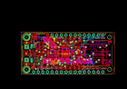
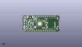
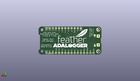
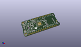

Contents
========

* [PROJ-ADAF-2795-STAN-01>Adafruit Feather 32u4 Adalogger PCB](#proj-adaf-2795-stan-01adafruit-feather-32u4-adalogger-pcb)
	* [Images](#images)
	* [Interactive BOM](#interactive-bom)
	* [Tags](#tags)
  
![][im]
# PROJ-ADAF-2795-STAN-01>Adafruit Feather 32u4 Adalogger PCB

- ID: PROJ-ADAF-2795-STAN-01
- Hex ID: PRA2795
- Name: Adafruit Feather 32u4 Adalogger PCB
- Description: 

## Images
  
  

|eagleImage|kicadPcb3dFront|kicadPcb3dBack|kicadPcb3d|
| :---: | :---: | :---: | :---: |
|||||

## Interactive BOM

- Interactive BOM page: [ibom.html](kicad/bom/ibom.html)

## Tags

- hexID: PRA2795
- oompType: PROJ
- oompSize: ADAF
- oompColor: 2795
- oompDesc: STAN
- oompIndex: 01
- oompName: Adafruit Feather 32u4 Adalogger PCB
- sources: All source files from https://github.com/adafruit/Adafruit-Feather-32u4-Adalogger-PCB (source licence details in srcLicense.md)
- linkBuyPage: http://www.adafruit.com/products/2795
- oompPart: CAPC-0805-X-UF10-V25, C3, 11.811, 12.065, 0
- oompPart: CAPC-0805-X-UF10-V25, C6, 8.08800008, 12.95899999, 90
- oompPart: CAPC-0603-X-UNMATCHED-01, C7, 19.066999966, 15.290999897999999, 90
- oompPart: CAPC-0805-X-UF10-V25, C8, 14.365999969999999, 11.624000119999998, 270
- oompPart: CAPC-0805-X-UF10-V25, C9, 29.822799891999995, 14.95559366, 180
- oompPart: CAPC-0603-X-UNMATCHED-01, C14, 10.5918, 4.0905938, 0
- oompPart: UNMATCHED-UNMATCHED-X-UNMATCHED-01, CHG, 2.413, 5.588, 270
- oompPart: UNMATCHED-UNMATCHED-X-UNMATCHED-01, D4, 17.779999999999998, 18.923, 180
- oompPart: UNMATCHED-UNMATCHED-X-UNMATCHED-01, IC1, 23.718184465999997, 11.101606193999999, 0
- oompPart: UNMATCHED-UNMATCHED-X-UNMATCHED-01, JP1, 25.4, 1.27, 180
- oompPart: UNMATCHED-UNMATCHED-X-UNMATCHED-01, JP3, 30.479999999999997, 21.59, 0
- oompPart: UNMATCHED-UNMATCHED-X-UNMATCHED-01, L, 2.6450000439999997, 17.359000079999998, 90
- oompPart: UNMATCHED-UNMATCHED-X-UNMATCHED-01, L1, 32.766, 9.398, 180
- oompPart: RESE-0603-X-O102-01, R1, 32.638999999999996, 5.968999999999999, 270
- oompPart: RESE-0603-X-O102-01, R2, 6.223, 4.191, 0
- oompPart: RESE-0603-X-UNMATCHED-01, R3, 31.876999999999995, 18.160999999999998, 0
- oompPart: RESE-0603-X-UNMATCHED-01, R4, 8.219000072, 10.268000038, 0
- oompPart: RESE-0603-X-UNMATCHED-01, R5, 8.149787611999999, 8.878687602, 0
- oompPart: RESE-UNMATCHED-X-O104-01, R6, 32.766, 16.256, 270
- oompPart: RESE-0603-X-O222-01, R7, 5.588, 20.955, 270
- oompPart: RESE-0603-X-UNMATCHED-01, R8, 13.716, 4.064, 180
- oompPart: RESE-0603-X-UNMATCHED-01, R9, 17.399, 17.424400000000002, 180
- oompPart: UNMATCHED-UNMATCHED-X-UNMATCHED-01, SW1, 9.398, 6.476999999999999, 180
- oompPart: SKIP-UNMATCHED-X-UNMATCHED-01, U$31, 2.54, 20.32, 270
- oompPart: SKIP-UNMATCHED-X-UNMATCHED-01, U$32, 2.54, 2.54, 270
- oompPart: SKIP-UNMATCHED-X-UNMATCHED-01, U$34, 10.795, 20.066, 270
- oompPart: SKIP-UNMATCHED-X-UNMATCHED-01, U$35, 48.307200058, 7.118999986, 270
- oompPart: UNMATCHED-UNMATCHED-X-UNMATCHED-01, U2, 16.5608, 14.808199999999998, 180
- oompPart: UNMATCHED-UNMATCHED-X-UNMATCHED-01, U3, 13.97, 7.746999999999999, 180
- oompPart: UNMATCHED-UNMATCHED-X-UNMATCHED-01, X1, 10.668, 19.304, 0
- oompPart: UNMATCHED-UNMATCHED-X-UNMATCHED-01, X2, 33.909, 4.444999999999999, 90
- oompPart: UNMATCHED-UNMATCHED-X-UNMATCHED-01, X3, 4.444999999999999, 11.43, 270
- oompPart: UNMATCHED-UNMATCHED-X-UNMATCHED-01, Y1, 28.881606193999996, 5.259606194, 180
- rawPart: 

[im]: kicadPcb3d_450.png
