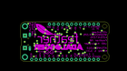
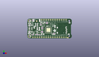
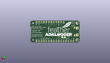
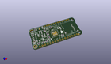

Contents
========

* [PROJ-ADAF-2796-STAN-01>Adafruit Feather M0 Adalogger PCB](#proj-adaf-2796-stan-01adafruit-feather-m0-adalogger-pcb)
	* [Images](#images)
	* [Interactive BOM](#interactive-bom)
	* [OOMP Parts](#oomp-parts)
	* [Tags](#tags)
  
![][im]
# PROJ-ADAF-2796-STAN-01>Adafruit Feather M0 Adalogger PCB

- ID: PROJ-ADAF-2796-STAN-01
- Hex ID: PRA2796
- Name: Adafruit Feather M0 Adalogger PCB
- Description: 

## Images
  
  

|eagleImage|kicadPcb3dFront|kicadPcb3dBack|kicadPcb3d|
| :---: | :---: | :---: | :---: |
|||||

## Interactive BOM

- Interactive BOM page: [ibom.html](kicad/bom/ibom.html)

## OOMP Parts
  

|OOMP Parts|
| :---: |
|CAPC-0603-X-UNMATCHED-01, C1, 17.779999999999998, 11.811, 90,C1, 1uF, 0603-NO, microbuilder, (0.7, 0.465), R90|
|CAPE-0603-X-UNMATCHED-01, C2, 17.653, 7.492999999999999, 90,C2, 22pF, 0603-NO, microbuilder, (0.695, 0.295), R90|
|CAPC-0805-X-UNMATCHED-01, C3, 11.43, 11.176, 270,C3, 10uF, 0805-NO, microbuilder, (0.45, 0.44), R270|
|CAPE-0603-X-UNMATCHED-01, C4, 16.383, 7.492999999999999, 90,C4, 22pF, 0603-NO, microbuilder, (0.645, 0.295), R90|
|CAPC-0805-X-UNMATCHED-01, C5, 31.623, 13.843, 270,C5, 10uF, 0805-NO, microbuilder, (1.245, 0.545), R270|
|CAPC-0805-X-UNMATCHED-01, C6, 8.08800008, 12.95899999, 90,C6, 10uF, 0805-NO, microbuilder, (0.3184252, 0.51019685), R90|
|CAPC-0603-X-UNMATCHED-01, C7, 16.399999966, 11.861999897999999, 90,C7, 1uF, 0603-NO, microbuilder, (0.64566929, 0.46700787), R90|
|CAPC-0805-X-UNMATCHED-01, C8, 13.85799997, 11.624000119999998, 270,C8, 10uF, 0805-NO, microbuilder, (0.54559055, 0.4576378), R270|
|CAPC-0603-X-UNMATCHED-01, C14, 10.7188, 4.3445938, 0,C14, 1uF, 0603-NO, microbuilder, (0.422, 0.171047), R0|
|UNMATCHED-UNMATCHED-X-UNMATCHED-01, CHG, 2.413, 5.588, 270,CHG, ORANGE, CHIPLED_0805_NOOUTLINE, microbuilder, (0.095, 0.22), R270|
|UNMATCHED-UNMATCHED-X-UNMATCHED-01, D1, 17.779999999999998, 18.668999999999997, 180,D1, MBR120, SOD-123, microbuilder, (0.7, 0.735), R180|
|<table><tr><td></td><td> JP1</td><td>[HEAD-I01-X-PI16-01 2.54 mm 16 Pin Header](https://github.com/oomlout/oomlout_OOMP_parts/tree/main/HEAD-I01-X-PI16-01/)</td><td>[H16](https://github.com/oomlout/oomlout_OOMP_parts/tree/main/HEAD-I01-X-PI16-01/)</td></tr></table>|
|<table><tr><td></td><td> JP3</td><td>[HEAD-I01-X-PI12-01 2.54 mm 12 Pin Header](https://github.com/oomlout/oomlout_OOMP_parts/tree/main/HEAD-I01-X-PI12-01/)</td><td>[H12](https://github.com/oomlout/oomlout_OOMP_parts/tree/main/HEAD-I01-X-PI12-01/)</td></tr></table>|
|LEDS-UNMATCHED-X-UNMATCHED-01, L, 2.6450000439999997, 17.359000079999998, 90,L, RED, CHIPLED_0805_NOOUTLINE, microbuilder, (0.10413386, 0.6834252), R90|
|UNMATCHED-UNMATCHED-X-UNMATCHED-01, L1, 30.479999999999997, 4.571999999999999, 270,L1, GREEN, CHIPLED_0805_NOOUTLINE, microbuilder, (1.2, 0.18), R270|
|<table><tr><td></td><td> R1</td><td>[RESE-0603-X-O104-01 SMD (0603) 100k Ohm Resistor](https://github.com/oomlout/oomlout_OOMP_parts/tree/main/RESE-0603-X-O104-01/)</td><td>[R6104](https://github.com/oomlout/oomlout_OOMP_parts/tree/main/RESE-0603-X-O104-01/)</td></tr></table>|
|RESE-0603-X-UNMATCHED-01, R2, 6.095999999999999, 4.3180000000000005, 0,R2, 1K, 0603-NO, microbuilder, (0.24, 0.17), R0|
|<table><tr><td></td><td> R3</td><td>[RESE-0603-X-O104-01 SMD (0603) 100k Ohm Resistor](https://github.com/oomlout/oomlout_OOMP_parts/tree/main/RESE-0603-X-O104-01/)</td><td>[R6104](https://github.com/oomlout/oomlout_OOMP_parts/tree/main/RESE-0603-X-O104-01/)</td></tr></table>|
|RESE-0603-X-UNMATCHED-01, R4, 30.861, 5.968999999999999, 180,R4, 1K, 0603-NO, microbuilder, (1.215, 0.235), R180|
|<table><tr><td></td><td> R6</td><td>[RESE-0603-X-O104-01 SMD (0603) 100k Ohm Resistor](https://github.com/oomlout/oomlout_OOMP_parts/tree/main/RESE-0603-X-O104-01/)</td><td>[R6104](https://github.com/oomlout/oomlout_OOMP_parts/tree/main/RESE-0603-X-O104-01/)</td></tr></table>|
|RESE-0603-X-UNMATCHED-01, R7, 5.715, 20.955, 270,R7, 2.2K, 0603-NO, microbuilder, (0.225, 0.825), R270|
|RESE-0603-X-UNMATCHED-01, R8, 13.843, 4.3180000000000005, 180,R8, 10K\, 0603-NO, microbuilder, (0.545, 0.17), R180|
|UNMATCHED-UNMATCHED-X-UNMATCHED-01, SW1, 9.398, 6.476999999999999, 180,SW1, SPST_TACT-KMR2, KMR2, adafruit, (0.37, 0.255), R180|
|UNMATCHED-UNMATCHED-X-UNMATCHED-01, U$4, 24.13, 9.652, 0,U$4, ATSAMD21G18_QFN, TQFN48_7MM, microbuilder, (0.95, 0.38), R0|
|UNMATCHED-UNMATCHED-X-UNMATCHED-01, U2, 18.160999999999998, 15.493999999999998, 180,U2, SPX3819-3.3, SOT23-5, microbuilder, (0.715, 0.61), R180|
|UNMATCHED-UNMATCHED-X-UNMATCHED-01, U3, 13.843, 7.746999999999999, 180,U3, MCP73831T-2ACI/OT, SOT23-5, microbuilder, (0.545, 0.305), R180|
|UNMATCHED-UNMATCHED-X-UNMATCHED-01, X2, 17.653, 4.826, 0,X2, 32.768, XTAL3215, adafruit2, (0.695, 0.19), R0|
|UNMATCHED-UNMATCHED-X-UNMATCHED-01, X3, 4.444999999999999, 11.43, 270,X3, microUSB, 4UCONN_20329_V2, microbuilder, (0.175, 0.45), R270|
|UNMATCHED-UNMATCHED-X-UNMATCHED-01, X4, 33.909, 4.444999999999999, 90,X4, microsd, MICROSD, microbuilder, (1.335, 0.175), R90|

## Tags

- hexID: PRA2796
- oompType: PROJ
- oompSize: ADAF
- oompColor: 2796
- oompDesc: STAN
- oompIndex: 01
- oompName: Adafruit Feather M0 Adalogger PCB
- sources: All source files from https://github.com/adafruit/Adafruit-Feather-M0-Adalogger-PCB (source licence details in srcLicense.md)
- linkBuyPage: http://www.adafruit.com/products/2796
- oompID: PROJ-ADAF-2796-STAN-01
- oompPart: CAPC-0603-X-UNMATCHED-01, C1, 17.779999999999998, 11.811, 90
- oompPart: CAPE-0603-X-UNMATCHED-01, C2, 17.653, 7.492999999999999, 90
- oompPart: CAPC-0805-X-UNMATCHED-01, C3, 11.43, 11.176, 270
- oompPart: CAPE-0603-X-UNMATCHED-01, C4, 16.383, 7.492999999999999, 90
- oompPart: CAPC-0805-X-UNMATCHED-01, C5, 31.623, 13.843, 270
- oompPart: CAPC-0805-X-UNMATCHED-01, C6, 8.08800008, 12.95899999, 90
- oompPart: CAPC-0603-X-UNMATCHED-01, C7, 16.399999966, 11.861999897999999, 90
- oompPart: CAPC-0805-X-UNMATCHED-01, C8, 13.85799997, 11.624000119999998, 270
- oompPart: CAPC-0603-X-UNMATCHED-01, C14, 10.7188, 4.3445938, 0
- oompPart: UNMATCHED-UNMATCHED-X-UNMATCHED-01, CHG, 2.413, 5.588, 270
- oompPart: UNMATCHED-UNMATCHED-X-UNMATCHED-01, D1, 17.779999999999998, 18.668999999999997, 180
- oompPart: HEAD-I01-X-PI16-01, JP1, 25.4, 1.27, 180
- oompPart: HEAD-I01-X-PI12-01, JP3, 30.479999999999997, 21.59, 0
- oompPart: LEDS-UNMATCHED-X-UNMATCHED-01, L, 2.6450000439999997, 17.359000079999998, 90
- oompPart: UNMATCHED-UNMATCHED-X-UNMATCHED-01, L1, 30.479999999999997, 4.571999999999999, 270
- oompPart: RESE-0603-X-O104-01, R1, 15.620999999999999, 16.128999999999998, 90
- oompPart: RESE-0603-X-UNMATCHED-01, R2, 6.095999999999999, 4.3180000000000005, 0
- oompPart: RESE-0603-X-O104-01, R3, 22.352, 18.541999999999998, 0
- oompPart: RESE-0603-X-UNMATCHED-01, R4, 30.861, 5.968999999999999, 180
- oompPart: RESE-0603-X-O104-01, R6, 22.479, 17.272000000000002, 180
- oompPart: RESE-0603-X-UNMATCHED-01, R7, 5.715, 20.955, 270
- oompPart: RESE-0603-X-UNMATCHED-01, R8, 13.843, 4.3180000000000005, 180
- oompPart: UNMATCHED-UNMATCHED-X-UNMATCHED-01, SW1, 9.398, 6.476999999999999, 180
- oompPart: SKIP-UNMATCHED-X-UNMATCHED-01, TP1, 15.366999999999999, 5.334, M0
- oompPart: SKIP-UNMATCHED-X-UNMATCHED-01, TP2, 17.906999999999996, 5.334, M0
- oompPart: UNMATCHED-UNMATCHED-X-UNMATCHED-01, U$4, 24.13, 9.652, 0
- oompPart: SKIP-UNMATCHED-X-UNMATCHED-01, U$31, 2.54, 20.32, 270
- oompPart: SKIP-UNMATCHED-X-UNMATCHED-01, U$32, 2.54, 2.54, 270
- oompPart: SKIP-UNMATCHED-X-UNMATCHED-01, U$34, 10.795, 20.066, 270
- oompPart: SKIP-UNMATCHED-X-UNMATCHED-01, U$35, 46.402200058, 0.768999986, 270
- oompPart: UNMATCHED-UNMATCHED-X-UNMATCHED-01, U2, 18.160999999999998, 15.493999999999998, 180
- oompPart: UNMATCHED-UNMATCHED-X-UNMATCHED-01, U3, 13.843, 7.746999999999999, 180
- oompPart: SKIP-UNMATCHED-X-UNMATCHED-01, X1, 10.795, 19.304, 0
- oompPart: UNMATCHED-UNMATCHED-X-UNMATCHED-01, X2, 17.653, 4.826, 0
- oompPart: UNMATCHED-UNMATCHED-X-UNMATCHED-01, X3, 4.444999999999999, 11.43, 270
- oompPart: UNMATCHED-UNMATCHED-X-UNMATCHED-01, X4, 33.909, 4.444999999999999, 90
- rawPart: C1, 1uF, 0603-NO, microbuilder, (0.7, 0.465), R90
- rawPart: C2, 22pF, 0603-NO, microbuilder, (0.695, 0.295), R90
- rawPart: C3, 10uF, 0805-NO, microbuilder, (0.45, 0.44), R270
- rawPart: C4, 22pF, 0603-NO, microbuilder, (0.645, 0.295), R90
- rawPart: C5, 10uF, 0805-NO, microbuilder, (1.245, 0.545), R270
- rawPart: C6, 10uF, 0805-NO, microbuilder, (0.3184252, 0.51019685), R90
- rawPart: C7, 1uF, 0603-NO, microbuilder, (0.64566929, 0.46700787), R90
- rawPart: C8, 10uF, 0805-NO, microbuilder, (0.54559055, 0.4576378), R270
- rawPart: C14, 1uF, 0603-NO, microbuilder, (0.422, 0.171047), R0
- rawPart: CHG, ORANGE, CHIPLED_0805_NOOUTLINE, microbuilder, (0.095, 0.22), R270
- rawPart: D1, MBR120, SOD-123, microbuilder, (0.7, 0.735), R180
- rawPart: JP1, 1X16_ROUND, microbuilder, (1, 0.05), R180
- rawPart: JP3, 1X12_ROUND, microbuilder, (1.2, 0.85), R0
- rawPart: L, RED, CHIPLED_0805_NOOUTLINE, microbuilder, (0.10413386, 0.6834252), R90
- rawPart: L1, GREEN, CHIPLED_0805_NOOUTLINE, microbuilder, (1.2, 0.18), R270
- rawPart: R1, 100k, 0603-NO, microbuilder, (0.615, 0.635), R90
- rawPart: R2, 1K, 0603-NO, microbuilder, (0.24, 0.17), R0
- rawPart: R3, 100k, 0603-NO, microbuilder, (0.88, 0.73), R0
- rawPart: R4, 1K, 0603-NO, microbuilder, (1.215, 0.235), R180
- rawPart: R6, 100K, 0603-NO, microbuilder, (0.885, 0.68), R180
- rawPart: R7, 2.2K, 0603-NO, microbuilder, (0.225, 0.825), R270
- rawPart: R8, 10K\, 0603-NO, microbuilder, (0.545, 0.17), R180
- rawPart: SW1, SPST_TACT-KMR2, KMR2, adafruit, (0.37, 0.255), R180
- rawPart: TP1, TESTPOINT_ROUND_1.5MM, microbuilder, (0.605, 0.21), MR0
- rawPart: TP2, TESTPOINT_ROUND_1.5MM, microbuilder, (0.705, 0.21), MR0
- rawPart: U$4, ATSAMD21G18_QFN, TQFN48_7MM, microbuilder, (0.95, 0.38), R0
- rawPart: U$31, MOUNTINGHOLE2.5, MOUNTINGHOLE_2.5_PLATED, microbuilder, (0.1, 0.8), R270
- rawPart: U$32, MOUNTINGHOLE2.5, MOUNTINGHOLE_2.5_PLATED, microbuilder, (0.1, 0.1), R270
- rawPart: U$34, FIDUCIAL, FIDUCIAL_1MM, microbuilder, (0.425, 0.79), R270
- rawPart: U$35, FIDUCIAL, FIDUCIAL_1MM, microbuilder, (1.82685827, 0.03027559), R270
- rawPart: U2, SPX3819-3.3, SOT23-5, microbuilder, (0.715, 0.61), R180
- rawPart: U3, MCP73831T-2ACI/OT, SOT23-5, microbuilder, (0.545, 0.305), R180
- rawPart: X1, JSTPH, JSTPH2, microbuilder, (0.425, 0.76), R0
- rawPart: X2, 32.768, XTAL3215, adafruit2, (0.695, 0.19), R0
- rawPart: X3, microUSB, 4UCONN_20329_V2, microbuilder, (0.175, 0.45), R270
- rawPart: X4, microsd, MICROSD, microbuilder, (1.335, 0.175), R90

[im]: kicadPcb3d_450.png
