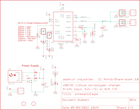

Contents
========

* [PRA280 > Adafruit USB DC LiPoly Charger](#pra280--adafruit-usb-dc-lipoly-charger)
	* [Schematic](#schematic)
	* [PCB](#pcb)
	* [Interactive BOM](#interactive-bom)
	* [OOMP Parts](#oomp-parts)
	* [Images](#images)
	* [Tags](#tags)
  
![][im]
# PRA280 > Adafruit USB DC LiPoly Charger

- ID: PROJ-ADAF-280-STAN-01
- Hex ID: PRA280
- Name: Adafruit
- Description: Adafruit
- Long Link: [http://oom.lt/PROJ-ADAF-280-STAN-01](http://oom.lt/PROJ-ADAF-280-STAN-01)
- Short Link: [http://oom.lt/PRA280](http://oom.lt/PRA280)

## Schematic
  

## PCB
  

## Interactive BOM

- Interactive BOM page: [ibom.html](https://htmlpreview.github.io/?https://github.com/oomlout/oomlout_OOMP_projects/blob/main/PROJ-ADAF-280-STAN-01/kicad/bom/ibom.html)

## OOMP Parts
  

|OOMP Parts|
| :---: |
|BATT_IN BATT_IN,UNMATCHED-UNMATCHED-X-UNMATCHED-01|
|BATT_OUT BATT_OUT,UNMATCHED-UNMATCHED-X-UNMATCHED-01|
|C3 C3,CAPC-0805-X-NF470-01|
|C4 C4,CAPX-UNMATCHED-X-UF10-01|
|C5 C5,CAPX-UNMATCHED-X-UF10-01|
|[CHG LEDS-0805-G-STAN-01 SMD (0805) Green LED](https://github.com/oomlout/oomlout_OOMP_parts/tree/main/LEDS-0805-G-STAN-01/)|
|D1 D1,DIOD-UNMATCHED-X-UNMATCHED-01|
|D2 D2,DIOD-UNMATCHED-X-UNMATCHED-01|
|[ERR LEDS-0805-G-STAN-01 SMD (0805) Green LED](https://github.com/oomlout/oomlout_OOMP_parts/tree/main/LEDS-0805-G-STAN-01/)|
|IC1 IC1,UNMATCHED-UNMATCHED-X-UNMATCHED-01|
|IN IN,UNMATCHED-UNMATCHED-X-UNMATCHED-01|
|OUT OUT,UNMATCHED-UNMATCHED-X-UNMATCHED-01|
|[PG LEDS-0805-G-STAN-01 SMD (0805) Green LED](https://github.com/oomlout/oomlout_OOMP_parts/tree/main/LEDS-0805-G-STAN-01/)|
|R1 R1,RESE-0805-X-UNMATCHED-01|
|R6 R6,RESE-0805-X-UNMATCHED-01|
|R7 R7,RESE-0805-X-UNMATCHED-01|
|R11 R11,RESE-0805-X-O471-01|
|RTH RTH,UNMATCHED-0805-X-UNMATCHED-01|
|STAT3 STAT3,UNMATCHED-UNMATCHED-X-UNMATCHED-01|
|STAT4 STAT4,UNMATCHED-UNMATCHED-X-UNMATCHED-01|
|U$1 U$1,UNMATCHED-UNMATCHED-X-UNMATCHED-01|
|USB USB,UNMATCHED-UNMATCHED-X-UNMATCHED-01|
|VIN VIN,UNMATCHED-UNMATCHED-X-UNMATCHED-01|

## Images
  
  

|kicadPcb3d|kicadPcb3dFront|kicadPcb3dBack|eagleImage|eagleSchemImage|
| :---: | :---: | :---: | :---: | :---: |
||||||

## Tags

- hexID: PRA280
- oompType: PROJ
- oompSize: ADAF
- oompColor: 280
- oompDesc: STAN
- oompIndex: 01
- oompName: Adafruit USB DC LiPoly Charger
- sources: All source files from https://github.com/adafruit/Adafruit-USB-DC-LiPoly-Charger (source licence details in srcLicense.md)
- linkBuyPage: http://www.adafruit.com/products/280
- oompID: PROJ-ADAF-280-STAN-01
- oompParts: BATT_IN,UNMATCHED-UNMATCHED-X-UNMATCHED-01
- oompParts: BATT_OUT,UNMATCHED-UNMATCHED-X-UNMATCHED-01
- oompParts: C3,CAPC-0805-X-NF470-01
- oompParts: C4,CAPX-UNMATCHED-X-UF10-01
- oompParts: C5,CAPX-UNMATCHED-X-UF10-01
- oompParts: CHG,LEDS-0805-G-STAN-01
- oompParts: D1,DIOD-UNMATCHED-X-UNMATCHED-01
- oompParts: D2,DIOD-UNMATCHED-X-UNMATCHED-01
- oompParts: ERR,LEDS-0805-G-STAN-01
- oompParts: IC1,UNMATCHED-UNMATCHED-X-UNMATCHED-01
- oompParts: IN,UNMATCHED-UNMATCHED-X-UNMATCHED-01
- oompParts: OUT,UNMATCHED-UNMATCHED-X-UNMATCHED-01
- oompParts: PG,LEDS-0805-G-STAN-01
- oompParts: R1,RESE-0805-X-UNMATCHED-01
- oompParts: R6,RESE-0805-X-UNMATCHED-01
- oompParts: R7,RESE-0805-X-UNMATCHED-01
- oompParts: R11,RESE-0805-X-O471-01
- oompParts: RTH,UNMATCHED-0805-X-UNMATCHED-01
- oompParts: STAT3,UNMATCHED-UNMATCHED-X-UNMATCHED-01
- oompParts: STAT4,UNMATCHED-UNMATCHED-X-UNMATCHED-01
- oompParts: U$1,UNMATCHED-UNMATCHED-X-UNMATCHED-01
- oompParts: USB,UNMATCHED-UNMATCHED-X-UNMATCHED-01
- oompParts: VIN,UNMATCHED-UNMATCHED-X-UNMATCHED-01
- rawParts: BATT_IN,,JST_2PIN,JSTPH2,JST 2-Pin Right-Angle Connector,,
- rawParts: BATT_OUT,,JST_2PIN,JSTPH2,JST 2-Pin Right-Angle Connector,,
- rawParts: C3,0.47uF,C-USC0805K,C0805K,CAPACITOR, American symbol,,
- rawParts: C4,10uF,CPOL-USA/3216-18R,A/3216-18R,POLARIZED CAPACITOR, American symbol,,
- rawParts: C5,10uF,CPOL-USA/3216-18R,A/3216-18R,POLARIZED CAPACITOR, American symbol,,
- rawParts: CHG,ORANGE,LEDCHIPLED_0805,CHIPLED_0805,LED,,
- rawParts: D1,B120,DIODESMA,SMADIODE,Diode,,
- rawParts: D2,B120,DIODESMA,SMADIODE,Diode,,
- rawParts: ERR,RED,LEDCHIPLED_0805,CHIPLED_0805,LED,,
- rawParts: IC1,,MCP7386XS,SO16,MCP7386x,,
- rawParts: IN,1X2-3.5MM,1X2-3.5MM,3.5MMTERM,3.5mm Terminal block,,
- rawParts: OUT,1X2-3.5MM,1X2-3.5MM,3.5MMTERM,3.5mm Terminal block,,
- rawParts: PG,GREEN,LEDCHIPLED_0805,CHIPLED_0805,LED,,
- rawParts: R1,adj,R-US_FLIPFLOP,0805-THM,RESISTOR, American symbol,,
- rawParts: R6,6.19K,R-US_R0805,R0805,RESISTOR, American symbol,,
- rawParts: R7,7.3k,R-US_R0805,R0805,RESISTOR, American symbol,,
- rawParts: R11,470,R-US_R0805,R0805,RESISTOR, American symbol,,
- rawParts: RTH,10K @ 25degC,R-US_FLIPFLOP,0805-THM,RESISTOR, American symbol,,
- rawParts: STAT3,,PINHD-1X1,1X01,Pin header 1x1 for 0.1 spacing,,
- rawParts: STAT4,,PINHD-1X1,1X01,Pin header 1x1 for 0.1 spacing,,
- rawParts: U$1,2.1MMJACKSMT,2.1MMJACKSMT,DCJACK_2MM_SMT,2.1mm x 5.5mm THM DC jack with internal switch. Digikey part #PJ-102A, 4UCON part #05537,,
- rawParts: U$3,FIDUCIAL,FIDUCIAL,FIDUCIAL_1MM,For use by pick and place machines to calibrate the vision/machine, 1mm,,
- rawParts: U$4,FIDUCIAL,FIDUCIAL,FIDUCIAL_1MM,For use by pick and place machines to calibrate the vision/machine, 1mm,,
- rawParts: USB,MINI-USB,USBMINIB,USB-MINIB,USB Connectors,,
- rawParts: VIN,1X2-3.5MM,1X2-3.5MM,3.5MMTERM,3.5mm Terminal block,,

[im]: kicadPcb3d_450.png
