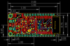
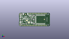
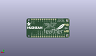
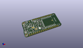

Contents
========

* [PROJ-ADAF-2821-STAN-01>Adafruit Feather ESP8266 HUZZAH PCB](#proj-adaf-2821-stan-01adafruit-feather-esp8266-huzzah-pcb)
	* [Images](#images)
	* [Interactive BOM](#interactive-bom)
	* [OOMP Parts](#oomp-parts)
	* [Tags](#tags)
  
![][im]
# PROJ-ADAF-2821-STAN-01>Adafruit Feather ESP8266 HUZZAH PCB

- ID: PROJ-ADAF-2821-STAN-01
- Hex ID: PRA2821
- Name: Adafruit Feather ESP8266 HUZZAH PCB
- Description: 

## Images
  
  

|eagleImage|kicadPcb3dFront|kicadPcb3dBack|kicadPcb3d|
| :---: | :---: | :---: | :---: |
|||||

## Interactive BOM

- Interactive BOM page: [ibom.html](kicad/bom/ibom.html)

## OOMP Parts
  

|OOMP Parts|
| :---: |
|CAPC-0805-X-UNMATCHED-01, C2, 21.462999999999997, 16.1925, 270,C2, 10uF, 0805-NO, microbuilder, (0.845, 0.6375), R270|
|CAPC-0805-X-UNMATCHED-01, C3, 11.049, 12.191999999999998, 180,C3, 10uF, 0805-NO, microbuilder, (0.435, 0.48), R180|
|CAPC-0805-X-UNMATCHED-01, C6, 8.08800008, 12.95899999, 90,C6, 10uF, 0805-NO, microbuilder, (0.3184252, 0.51019685), R90|
|CAPC-0603-X-UNMATCHED-01, C7, 12.302000033999999, 4.775000102, 270,C7, 1uF, 0603-NO, microbuilder, (0.48433071, 0.18799213), R270|
|CAPC-0805-X-UNMATCHED-01, C8, 14.365999969999999, 12.64000012, 270,C8, 10uF, 0805-NO, microbuilder, (0.56559055, 0.4976378), R270|
|UNMATCHED-UNMATCHED-X-UNMATCHED-01, CHG, 2.413, 5.588, 270,CHG, ORANGE, CHIPLED_0805_NOOUTLINE, microbuilder, (0.095, 0.22), R270|
|UNMATCHED-UNMATCHED-X-UNMATCHED-01, D3, 2.8575, 17.3355, 270,D3, RED, CHIPLED_0805_NOOUTLINE, microbuilder, (0.1125, 0.6825), R270|
|UNMATCHED-UNMATCHED-X-UNMATCHED-01, D4, 17.906999999999996, 18.796, 180,D4, MBR120, SOD-123, microbuilder, (0.705, 0.74), R180|
|UNMATCHED-UNMATCHED-X-UNMATCHED-01, IC1, 16.256, 6.476999999999999, 0,IC1, CP2104, QFN24_4MM_SMSC, microbuilder, (0.64, 0.255), R0|
|<table><tr><td></td><td> JP1</td><td>[HEAD-I01-X-PI16-01 2.54 mm 16 Pin Header](https://github.com/oomlout/oomlout_OOMP_parts/tree/main/HEAD-I01-X-PI16-01/)</td><td>[H16](https://github.com/oomlout/oomlout_OOMP_parts/tree/main/HEAD-I01-X-PI16-01/)</td></tr></table>|
|<table><tr><td></td><td> JP3</td><td>[HEAD-I01-X-PI12-01 2.54 mm 12 Pin Header](https://github.com/oomlout/oomlout_OOMP_parts/tree/main/HEAD-I01-X-PI12-01/)</td><td>[H12](https://github.com/oomlout/oomlout_OOMP_parts/tree/main/HEAD-I01-X-PI12-01/)</td></tr></table>|
|UNMATCHED-UNMATCHED-X-UNMATCHED-01, Q1, 24.002999999999997, 8.001, 180,Q1, mmbt2222, SOT23-3, SparkFun, (0.945, 0.315), R180|
|UNMATCHED-UNMATCHED-X-UNMATCHED-01, Q2, 24.002999999999997, 14.985999999999999, 0,Q2, mmbt2222, SOT23-3, SparkFun, (0.945, 0.59), R0|
|<table><tr><td></td><td> R1</td><td>[RESE-0603-X-O103-01 SMD (0603) 10k Ohm Resistor](https://github.com/oomlout/oomlout_OOMP_parts/tree/main/RESE-0603-X-O103-01/)</td><td>[R6103](https://github.com/oomlout/oomlout_OOMP_parts/tree/main/RESE-0603-X-O103-01/)</td></tr></table>|
|RESE-0603-X-UNMATCHED-01, R2, 6.223, 4.191, 0,R2, 1K, 0603-NO, microbuilder, (0.245, 0.165), R0|
|<table><tr><td></td><td> R3</td><td>[RESE-0603-X-O103-01 SMD (0603) 10k Ohm Resistor](https://github.com/oomlout/oomlout_OOMP_parts/tree/main/RESE-0603-X-O103-01/)</td><td>[R6103](https://github.com/oomlout/oomlout_OOMP_parts/tree/main/RESE-0603-X-O103-01/)</td></tr></table>|
|<table><tr><td></td><td> R4</td><td>[RESE-0603-X-O103-01 SMD (0603) 10k Ohm Resistor](https://github.com/oomlout/oomlout_OOMP_parts/tree/main/RESE-0603-X-O103-01/)</td><td>[R6103](https://github.com/oomlout/oomlout_OOMP_parts/tree/main/RESE-0603-X-O103-01/)</td></tr></table>|
|<table><tr><td></td><td> R5</td><td>[RESE-0603-X-O103-01 SMD (0603) 10k Ohm Resistor](https://github.com/oomlout/oomlout_OOMP_parts/tree/main/RESE-0603-X-O103-01/)</td><td>[R6103](https://github.com/oomlout/oomlout_OOMP_parts/tree/main/RESE-0603-X-O103-01/)</td></tr></table>|
|RESE-0603-X-UNMATCHED-01, R6, 24.383999999999997, 3.937, 0,R6, 4.7K, 0603-NO, microbuilder, (0.96, 0.155), R0|
|<table><tr><td></td><td> R7</td><td>[RESE-0603-X-O103-01 SMD (0603) 10k Ohm Resistor](https://github.com/oomlout/oomlout_OOMP_parts/tree/main/RESE-0603-X-O103-01/)</td><td>[R6103](https://github.com/oomlout/oomlout_OOMP_parts/tree/main/RESE-0603-X-O103-01/)</td></tr></table>|
|RESE-0603-X-UNMATCHED-01, R8, 20.827999999999996, 12.7, 270,R8, 10K\, 0603-NO, microbuilder, (0.82, 0.5), R270|
|<table><tr><td></td><td> R9</td><td>[RESE-0603-X-O103-01 SMD (0603) 10k Ohm Resistor](https://github.com/oomlout/oomlout_OOMP_parts/tree/main/RESE-0603-X-O103-01/)</td><td>[R6103](https://github.com/oomlout/oomlout_OOMP_parts/tree/main/RESE-0603-X-O103-01/)</td></tr></table>|
|RESE-0603-X-UNMATCHED-01, R10, 5.588, 21.081999999999997, 270,R10, 1K, 0603-NO, microbuilder, (0.22, 0.83), R270|
|RESE-0603-X-UNMATCHED-01, R11, 19.812, 8.382, 270,R11, 1K, _0603MP, microbuilder, (0.78, 0.33), R270|
|UNMATCHED-UNMATCHED-X-UNMATCHED-01, SW2, 9.398, 6.35, 270,SW2, KMR2, BTN_KMR2_4.6X2.8, microbuilder, (0.37, 0.25), R270|
|UNMATCHED-UNMATCHED-X-UNMATCHED-01, U2, 17.779999999999998, 14.985999999999999, 90,U2, SPX3819, SOT23-5, microbuilder, (0.7, 0.59), R90|
|UNMATCHED-UNMATCHED-X-UNMATCHED-01, U3, 17.779999999999998, 11.557, 270,U3, MCP73831T-2ACI/OT, SOT23-5, microbuilder, (0.7, 0.455), R270|
|UNMATCHED-UNMATCHED-X-UNMATCHED-01, X2, 36.321999999999996, 11.43, 270,X2, ESP-12, ESP-12E, microbuilder, (1.43, 0.45), R270|
|UNMATCHED-UNMATCHED-X-UNMATCHED-01, X4, 4.444999999999999, 11.43, 270,X4, 20329, 4UCONN_20329_V2, microbuilder, (0.175, 0.45), R270|

## Tags

- hexID: PRA2821
- oompType: PROJ
- oompSize: ADAF
- oompColor: 2821
- oompDesc: STAN
- oompIndex: 01
- oompName: Adafruit Feather ESP8266 HUZZAH PCB
- sources: All source files from https://github.com/adafruit/Adafruit-Feather-ESP8266-HUZZAH-PCB (source licence details in srcLicense.md)
- linkBuyPage: http://www.adafruit.com/products/2821
- oompID: PROJ-ADAF-2821-STAN-01
- oompPart: CAPC-0805-X-UNMATCHED-01, C2, 21.462999999999997, 16.1925, 270
- oompPart: CAPC-0805-X-UNMATCHED-01, C3, 11.049, 12.191999999999998, 180
- oompPart: CAPC-0805-X-UNMATCHED-01, C6, 8.08800008, 12.95899999, 90
- oompPart: CAPC-0603-X-UNMATCHED-01, C7, 12.302000033999999, 4.775000102, 270
- oompPart: CAPC-0805-X-UNMATCHED-01, C8, 14.365999969999999, 12.64000012, 270
- oompPart: UNMATCHED-UNMATCHED-X-UNMATCHED-01, CHG, 2.413, 5.588, 270
- oompPart: UNMATCHED-UNMATCHED-X-UNMATCHED-01, D3, 2.8575, 17.3355, 270
- oompPart: UNMATCHED-UNMATCHED-X-UNMATCHED-01, D4, 17.906999999999996, 18.796, 180
- oompPart: UNMATCHED-UNMATCHED-X-UNMATCHED-01, IC1, 16.256, 6.476999999999999, 0
- oompPart: HEAD-I01-X-PI16-01, JP1, 25.4, 1.27, 180
- oompPart: HEAD-I01-X-PI12-01, JP3, 30.479999999999997, 21.59, 0
- oompPart: UNMATCHED-UNMATCHED-X-UNMATCHED-01, Q1, 24.002999999999997, 8.001, 180
- oompPart: UNMATCHED-UNMATCHED-X-UNMATCHED-01, Q2, 24.002999999999997, 14.985999999999999, 0
- oompPart: RESE-0603-X-O103-01, R1, 24.256999999999998, 18.923, 180
- oompPart: RESE-0603-X-UNMATCHED-01, R2, 6.223, 4.191, 0
- oompPart: RESE-0603-X-O103-01, R3, 24.256999999999998, 17.525999999999996, 180
- oompPart: RESE-0603-X-O103-01, R4, 24.002999999999997, 11.937999999999999, 180
- oompPart: RESE-0603-X-O103-01, R5, 24.002999999999997, 10.540999999999999, 0
- oompPart: RESE-0603-X-UNMATCHED-01, R6, 24.383999999999997, 3.937, 0
- oompPart: RESE-0603-X-O103-01, R7, 17.779999999999998, 17.272000000000002, 0
- oompPart: RESE-0603-X-UNMATCHED-01, R8, 20.827999999999996, 12.7, 270
- oompPart: RESE-0603-X-O103-01, R9, 24.383999999999997, 5.334, 180
- oompPart: RESE-0603-X-UNMATCHED-01, R10, 5.588, 21.081999999999997, 270
- oompPart: RESE-0603-X-UNMATCHED-01, R11, 19.812, 8.382, 270
- oompPart: SKIP-UNMATCHED-X-UNMATCHED-01, SJ1, 12.827, 9.779, 180
- oompPart: UNMATCHED-UNMATCHED-X-UNMATCHED-01, SW2, 9.398, 6.35, 270
- oompPart: SKIP-UNMATCHED-X-UNMATCHED-01, U$31, 2.54, 20.32, 270
- oompPart: SKIP-UNMATCHED-X-UNMATCHED-01, U$32, 2.54, 2.54, 270
- oompPart: SKIP-UNMATCHED-X-UNMATCHED-01, U$34, 10.795, 20.066, 270
- oompPart: SKIP-UNMATCHED-X-UNMATCHED-01, U$35, 41.576200058, 11.690999986, 270
- oompPart: UNMATCHED-UNMATCHED-X-UNMATCHED-01, U2, 17.779999999999998, 14.985999999999999, 90
- oompPart: UNMATCHED-UNMATCHED-X-UNMATCHED-01, U3, 17.779999999999998, 11.557, 270
- oompPart: SKIP-UNMATCHED-X-UNMATCHED-01, X1, 10.795, 19.304, 0
- oompPart: UNMATCHED-UNMATCHED-X-UNMATCHED-01, X2, 36.321999999999996, 11.43, 270
- oompPart: UNMATCHED-UNMATCHED-X-UNMATCHED-01, X4, 4.444999999999999, 11.43, 270
- rawPart: C2, 10uF, 0805-NO, microbuilder, (0.845, 0.6375), R270
- rawPart: C3, 10uF, 0805-NO, microbuilder, (0.435, 0.48), R180
- rawPart: C6, 10uF, 0805-NO, microbuilder, (0.3184252, 0.51019685), R90
- rawPart: C7, 1uF, 0603-NO, microbuilder, (0.48433071, 0.18799213), R270
- rawPart: C8, 10uF, 0805-NO, microbuilder, (0.56559055, 0.4976378), R270
- rawPart: CHG, ORANGE, CHIPLED_0805_NOOUTLINE, microbuilder, (0.095, 0.22), R270
- rawPart: D3, RED, CHIPLED_0805_NOOUTLINE, microbuilder, (0.1125, 0.6825), R270
- rawPart: D4, MBR120, SOD-123, microbuilder, (0.705, 0.74), R180
- rawPart: IC1, CP2104, QFN24_4MM_SMSC, microbuilder, (0.64, 0.255), R0
- rawPart: JP1, 1X16_ROUND, microbuilder, (1, 0.05), R180
- rawPart: JP3, 1X12_ROUND, microbuilder, (1.2, 0.85), R0
- rawPart: Q1, mmbt2222, SOT23-3, SparkFun, (0.945, 0.315), R180
- rawPart: Q2, mmbt2222, SOT23-3, SparkFun, (0.945, 0.59), R0
- rawPart: R1, 10K, 0603-NO, microbuilder, (0.955, 0.745), R180
- rawPart: R2, 1K, 0603-NO, microbuilder, (0.245, 0.165), R0
- rawPart: R3, 10K, 0603-NO, microbuilder, (0.955, 0.69), R180
- rawPart: R4, 10K, 0603-NO, microbuilder, (0.945, 0.47), R180
- rawPart: R5, 10K, _0603MP, microbuilder, (0.945, 0.415), R0
- rawPart: R6, 4.7K, 0603-NO, microbuilder, (0.96, 0.155), R0
- rawPart: R7, 10K, 0603-NO, microbuilder, (0.7, 0.68), R0
- rawPart: R8, 10K\, 0603-NO, microbuilder, (0.82, 0.5), R270
- rawPart: R9, 10K, 0603-NO, microbuilder, (0.96, 0.21), R180
- rawPart: R10, 1K, 0603-NO, microbuilder, (0.22, 0.83), R270
- rawPart: R11, 1K, _0603MP, microbuilder, (0.78, 0.33), R270
- rawPart: SJ1, SOLDERJUMPER_CLOSEDWIRE, microbuilder, (0.505, 0.385), R180
- rawPart: SW2, KMR2, BTN_KMR2_4.6X2.8, microbuilder, (0.37, 0.25), R270
- rawPart: U$31, MOUNTINGHOLE2.5, MOUNTINGHOLE_2.5_PLATED, microbuilder, (0.1, 0.8), R270
- rawPart: U$32, MOUNTINGHOLE2.5, MOUNTINGHOLE_2.5_PLATED, microbuilder, (0.1, 0.1), R270
- rawPart: U$34, FIDUCIAL, FIDUCIAL_1MM, microbuilder, (0.425, 0.79), R270
- rawPart: U$35, FIDUCIAL, FIDUCIAL_1MM, microbuilder, (1.63685827, 0.46027559), R270
- rawPart: U2, SPX3819, SOT23-5, microbuilder, (0.7, 0.59), R90
- rawPart: U3, MCP73831T-2ACI/OT, SOT23-5, microbuilder, (0.7, 0.455), R270
- rawPart: X1, JSTPH, JSTPH2, microbuilder, (0.425, 0.76), R0
- rawPart: X2, ESP-12, ESP-12E, microbuilder, (1.43, 0.45), R270
- rawPart: X4, 20329, 4UCONN_20329_V2, microbuilder, (0.175, 0.45), R270

[im]: kicadPcb3d_450.png
