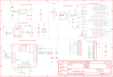

Contents
========

* [PRA2829 > Adafruit Feather 32u4 Bluefruit LE PCB](#pra2829--adafruit-feather-32u4-bluefruit-le-pcb)
	* [Schematic](#schematic)
	* [PCB](#pcb)
	* [Interactive BOM](#interactive-bom)
	* [OOMP Parts](#oomp-parts)
	* [Images](#images)
	* [Tags](#tags)
  
![][im]
# PRA2829 > Adafruit Feather 32u4 Bluefruit LE PCB

- ID: PROJ-ADAF-2829-STAN-01
- Hex ID: PRA2829
- Name: Adafruit
- Description: Adafruit
- Long Link: [http://oom.lt/PROJ-ADAF-2829-STAN-01](http://oom.lt/PROJ-ADAF-2829-STAN-01)
- Short Link: [http://oom.lt/PRA2829](http://oom.lt/PRA2829)

## Schematic
  

## PCB
  

## Interactive BOM

- Interactive BOM page: [ibom.html](https://htmlpreview.github.io/?https://github.com/oomlout/oomlout_OOMP_projects/blob/main/PROJ-ADAF-2829-STAN-01/kicad/bom/ibom.html)

## OOMP Parts
  

|OOMP Parts|
| :---: |
|[CAPC-0603-X-UF1-V25  SMD (0603) 1 uF Capacitor (Ceramic) 25v  C2, C7, C14](https://github.com/oomlout/oomlout_OOMP_parts/tree/main/CAPC-0603-X-UF1-V25/)|
|[CAPC-0805-X-UF10-V10  SMD (0805) 10 uF Capacitor (Ceramic) 10v  C3, C6, C8, C9](https://github.com/oomlout/oomlout_OOMP_parts/tree/main/CAPC-0805-X-UF10-V10/)|
|LEDS-0805-O-STAN-01 CHG|
|[LEDS-0805-R-STAN-01  SMD (0805) Red LED  D1, L](https://github.com/oomlout/oomlout_OOMP_parts/tree/main/LEDS-0805-R-STAN-01/)|
|[LEDS-0805-L-STAN-01  SMD (0805) Blue LED  D2](https://github.com/oomlout/oomlout_OOMP_parts/tree/main/LEDS-0805-L-STAN-01/)|
|[DIOD-S123-X-KMBR120-01  SMD (SOD-123) MBR120 Diode  D4](https://github.com/oomlout/oomlout_OOMP_parts/tree/main/DIOD-S123-X-KMBR120-01/)|
|UNMATCHED-UNMATCHED-X-UNMATCHED-01 IC1, U1, X1, X3, Y1|
|[HEAD-I01-X-PI16-01  2.54 mm 16 Pin Header  JP1](https://github.com/oomlout/oomlout_OOMP_parts/tree/main/HEAD-I01-X-PI16-01/)|
|[HEAD-I01-X-PI12-01  2.54 mm 12 Pin Header  JP3](https://github.com/oomlout/oomlout_OOMP_parts/tree/main/HEAD-I01-X-PI12-01/)|
|[RESE-0603-X-O222-01  SMD (0603) 2.2k Ohm Resistor  R1, R7, R10](https://github.com/oomlout/oomlout_OOMP_parts/tree/main/RESE-0603-X-O222-01/)|
|[RESE-0603-X-O102-01  SMD (0603) 1k Ohm Resistor  R2](https://github.com/oomlout/oomlout_OOMP_parts/tree/main/RESE-0603-X-O102-01/)|
|RESE-0603-X-O1003-01 R3, R6, R9|
|[RESE-0603-X-O220-01  SMD (0603) 22 Ohm Resistor  R4, R5](https://github.com/oomlout/oomlout_OOMP_parts/tree/main/RESE-0603-X-O220-01/)|
|RESE-0603-X-UNMATCHED-01 R8|
|BUTA-UNMATCHED-X-STAN-01 SW1|
|UNMATCHED-SO235-X-UNMATCHED-01 U2, U3|

## Images
  
  

|bominteractivefront|bominteractiveback|kicadPcb3d|kicadPcb3dFront|kicadPcb3dBack|eagleImage|eagleSchemImage|pcbdraw|pcbdrawback|
| :---: | :---: | :---: | :---: | :---: | :---: | :---: | :---: | :---: |
||||||||||

## Tags

- hexID: PRA2829
- oompType: PROJ
- oompSize: ADAF
- oompColor: 2829
- oompDesc: STAN
- oompIndex: 01
- oompName: Adafruit Feather 32u4 Bluefruit LE PCB
- sources: All source files from https://github.com/adafruit/Adafruit-Feather-32u4-Bluefruit-LE-PCB (source licence details in srcLicense.md)
- linkBuyPage: http://www.adafruit.com/products/2829
- oompID: PROJ-ADAF-2829-STAN-01
- oompParts: C2,CAPC-0603-X-UF1-V25
- oompParts: C3,CAPC-0805-X-UF10-V10
- oompParts: C6,CAPC-0805-X-UF10-V10
- oompParts: C7,CAPC-0603-X-UF1-V25
- oompParts: C8,CAPC-0805-X-UF10-V10
- oompParts: C9,CAPC-0805-X-UF10-V10
- oompParts: C14,CAPC-0603-X-UF1-V25
- oompParts: CHG,LEDS-0805-O-STAN-01
- oompParts: D1,LEDS-0805-R-STAN-01
- oompParts: D2,LEDS-0805-L-STAN-01
- oompParts: D4,DIOD-S123-X-KMBR120-01
- oompParts: IC1,UNMATCHED-UNMATCHED-X-UNMATCHED-01
- oompParts: JP1,HEAD-I01-X-PI16-01
- oompParts: JP3,HEAD-I01-X-PI12-01
- oompParts: L,LEDS-0805-R-STAN-01
- oompParts: R1,RESE-0603-X-O222-01
- oompParts: R2,RESE-0603-X-O102-01
- oompParts: R3,RESE-0603-X-O1003-01
- oompParts: R4,RESE-0603-X-O220-01
- oompParts: R5,RESE-0603-X-O220-01
- oompParts: R6,RESE-0603-X-O1003-01
- oompParts: R7,RESE-0603-X-O222-01
- oompParts: R8,RESE-0603-X-UNMATCHED-01
- oompParts: R9,RESE-0603-X-O1003-01
- oompParts: R10,RESE-0603-X-O222-01
- oompParts: SW1,BUTA-UNMATCHED-X-STAN-01
- oompParts: U1,UNMATCHED-UNMATCHED-X-UNMATCHED-01
- oompParts: U2,UNMATCHED-SO235-X-UNMATCHED-01
- oompParts: U3,UNMATCHED-SO235-X-UNMATCHED-01
- oompParts: X1,UNMATCHED-UNMATCHED-X-UNMATCHED-01
- oompParts: X3,UNMATCHED-UNMATCHED-X-UNMATCHED-01
- oompParts: Y1,UNMATCHED-UNMATCHED-X-UNMATCHED-01
- rawParts: C2,1uF,CAP_CERAMIC0603_NO,0603-NO,Ceramic Capacitors,,
- rawParts: C3,10µF,CAP_CERAMIC0805-NOOUTLINE,0805-NO,Ceramic Capacitors,,
- rawParts: C6,10µF,CAP_CERAMIC0805-NOOUTLINE,0805-NO,Ceramic Capacitors,,
- rawParts: C7,1uF,CAP_CERAMIC0603_NO,0603-NO,Ceramic Capacitors,,
- rawParts: C8,10µF,CAP_CERAMIC0805-NOOUTLINE,0805-NO,Ceramic Capacitors,,
- rawParts: C9,10uF,CAP_CERAMIC_0805MP,_0805MP,Ceramic Capacitors,,
- rawParts: C14,1uF,CAP_CERAMIC0603_NO,0603-NO,Ceramic Capacitors,,
- rawParts: CHG,ORANGE,LED0805_NOOUTLINE,CHIPLED_0805_NOOUTLINE,LED,,
- rawParts: D1,RED,LED0805_NOOUTLINE,CHIPLED_0805_NOOUTLINE,LED,,
- rawParts: D2,BLUE,LED0805_NOOUTLINE,CHIPLED_0805_NOOUTLINE,LED,,
- rawParts: D4,MBR120,DIODE-SCHOTTKYSOD-123,SOD-123,,,
- rawParts: IC1,ATMEGA32U4-MU,ATMEGA32U4-MU,TQFN44_7MM,http://www.ladyada.net/library/eagle,,
- rawParts: JP1,,HEADER-1X16ROUND,1X16_ROUND,PIN HEADER,,
- rawParts: JP3,,HEADER-1X12,1X12_ROUND,,,
- rawParts: L,RED,LED0805_NOOUTLINE,CHIPLED_0805_NOOUTLINE,LED,,
- rawParts: R1,2.2K,RESISTOR_0603_NOOUT,0603-NO,Resistors,,
- rawParts: R2,1K,RESISTOR_0603_NOOUT,0603-NO,Resistors,,
- rawParts: R3,100K,RESISTOR_0603_NOOUT,0603-NO,Resistors,,
- rawParts: R4,22,RESISTOR_0603_NOOUT,0603-NO,Resistors,,
- rawParts: R5,22,RESISTOR_0603_NOOUT,0603-NO,Resistors,,
- rawParts: R6,100K,RESISTOR_0603_NOOUT,0603-NO,Resistors,,
- rawParts: R7,2.2K,RESISTOR_0603_NOOUT,0603-NO,Resistors,,
- rawParts: R8,10K\,RESISTOR_0603_NOOUT,0603-NO,Resistors,,
- rawParts: R9,100K,RESISTOR_0603_NOOUT,0603-NO,Resistors,,
- rawParts: R10,2.2K,RESISTOR_0603_NOOUT,0603-NO,Resistors,,
- rawParts: SW1,SPST_TACT-KMR2,SPST_TACT-KMR2,KMR2,SMT 6mm switch, EVQQ2 series,,
- rawParts: TP1,SWCLK,TESTPOINT1.5X2.0MM_NOCREAM,PAD-1.5X2.0,Test Point,,
- rawParts: TP2,SWDIO,TESTPOINT1.5X2.0MM_NOCREAM,PAD-1.5X2.0,Test Point,,
- rawParts: TP3,SWDIO,TESTPOINT1.5X2.0MM_NOCREAM,PAD-1.5X2.0,Test Point,,
- rawParts: U$6,MOUNTINGHOLE2.5,MOUNTINGHOLE2.5,MOUNTINGHOLE_2.5_PLATED,Mounting Hole,EXCLUDE,
- rawParts: U$24,MOUNTINGHOLE2.5,MOUNTINGHOLE2.5,MOUNTINGHOLE_2.5_PLATED,Mounting Hole,EXCLUDE,
- rawParts: U$31,MOUNTINGHOLE2.5,MOUNTINGHOLE2.5,MOUNTINGHOLE_2.5_PLATED,Mounting Hole,EXCLUDE,
- rawParts: U$32,MOUNTINGHOLE2.5,MOUNTINGHOLE2.5,MOUNTINGHOLE_2.5_PLATED,Mounting Hole,EXCLUDE,
- rawParts: U$34,FIDUCIAL,FIDUCIAL,FIDUCIAL_1MM,Fiducial Alignment Points,EXCLUDE,
- rawParts: U$35,FIDUCIAL,FIDUCIAL,FIDUCIAL_1MM,Fiducial Alignment Points,EXCLUDE,
- rawParts: U1,MBT40,NRF51822_MODULE_MDBT40,BLE_MODULE_RAYTAC_MDBT40,nRF51822 Bluetooth Low Energy Module,,
- rawParts: U2,SPX3819-3.3,VREG_SOT23-5,SOT23-5,SOT23-5 Fixed Voltage Regulators,,
- rawParts: U3,MCP73831T-2ACI/OT,MCP73831/2,SOT23-5,MCP73831/2 LIPO Charger,,
- rawParts: X1,JSTPH,CON_JST_PH_2PIN,JSTPH2,JST 2-Pin Right-Angle Connector,,
- rawParts: X3,microUSB,USB_MICRO_20329_V2,4UCONN_20329_V2,USB Connectors,,
- rawParts: Y1,8MHz,RESONATORSMD,RESONATOR-SMD,Resonator,,

[im]: kicadPcb3d_450.png
