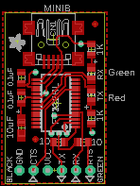

Contents
========

* [PROJ-ADAF-284-STAN-01>Adafruit_FTDI Friend PCB](#proj-adaf-284-stan-01adafruit_ftdi-friend-pcb)
	* [Images](#images)
	* [OOMP Parts](#oomp-parts)
	* [Tags](#tags)
  
![][im]
# PROJ-ADAF-284-STAN-01>Adafruit_FTDI Friend PCB

- ID: PROJ-ADAF-284-STAN-01
- Hex ID: PRA284
- Name: Adafruit_FTDI Friend PCB
- Description: 

## Images
  
  

|eagleImage|kicadPcb3dFront|kicadPcb3dBack|kicadPcb3d|
| :---: | :---: | :---: | :---: |
|||||

## OOMP Parts
  

|OOMP Parts|
| :---: |
|CAPC-UNMATCHED-X-UNMATCHED-01, C1, 2.921, 10.0076, 90,C1, 10uF, A/3216-18R, adafruit, (0.115, 0.394), R90|
|<table><tr><td></td><td> C2</td><td>[CAPC-0805-X-NF100-V50 SMD (0805) 100 nF Capacitor (Ceramic) 50v](https://github.com/oomlout/oomlout_OOMP_parts/tree/main/CAPC-0805-X-NF100-V50/)</td><td>[C85N100](https://github.com/oomlout/oomlout_OOMP_parts/tree/main/CAPC-0805-X-NF100-V50/)</td></tr></table>|
|<table><tr><td></td><td> C3</td><td>[CAPC-0805-X-NF100-V50 SMD (0805) 100 nF Capacitor (Ceramic) 50v](https://github.com/oomlout/oomlout_OOMP_parts/tree/main/CAPC-0805-X-NF100-V50/)</td><td>[C85N100](https://github.com/oomlout/oomlout_OOMP_parts/tree/main/CAPC-0805-X-NF100-V50/)</td></tr></table>|
|UNMATCHED-UNMATCHED-X-UNMATCHED-01, CN1, 8.6106, 25.780999999999995, 180,CN1, MINIB, USB-MINIB, adafruit, (0.339, 1.015), R180|
|UNMATCHED-UNMATCHED-X-UNMATCHED-01, FTDI, 8.8646, 2.413, 0,FTDI, 1X06-CLEANBIG, adafruit, (0.349, 0.095), R0|
|UNMATCHED-UNMATCHED-X-UNMATCHED-01, IC1, 9.118599999999999, 14.350999999999997, 90,IC1, FT232RL, SSOP28, ftdichip, (0.359, 0.565), R90|
|RESE-0805-X-UNMATCHED-01, R1, 13.9446, 7.365999999999999, 180,R1, 10, R0805, adafruit, (0.549, 0.29), R180|
|RESE-0805-X-UNMATCHED-01, R2, 15.468599999999999, 24.002999999999997, 270,R2, 1K, R0805, adafruit, (0.609, 0.945), R270|
|RESE-0805-X-UNMATCHED-01, R3, 15.468599999999999, 11.684, 90,R3, 1K, R0805, adafruit, (0.609, 0.46), R90|
|RESE-0805-X-UNMATCHED-01, R5, 9.6266, 7.365999999999999, 0,R5, 10, R0805, adafruit, (0.379, 0.29), R0|
|UNMATCHED-0805-X-UNMATCHED-01, RX, 15.468599999999999, 19.685, 180,RX, Green, CHIP-LED0805, adafruit, (0.609, 0.775), R180|
|UNMATCHED-0805-X-UNMATCHED-01, TX, 15.468599999999999, 15.748, 0,TX, Red, CHIP-LED0805, adafruit, (0.609, 0.62), R0|

## Tags

- hexID: PRA284
- oompType: PROJ
- oompSize: ADAF
- oompColor: 284
- oompDesc: STAN
- oompIndex: 01
- oompName: Adafruit_FTDI Friend PCB
- sources: All source files from https://github.com/adafruit/Adafruit_FTDI-Friend-PCB (source licence details in srcLicense.md)
- linkBuyPage: http://www.adafruit.com/products/284
- oompID: PROJ-ADAF-284-STAN-01
- oompPart: CAPC-UNMATCHED-X-UNMATCHED-01, C1, 2.921, 10.0076, 90
- oompPart: CAPC-0805-X-NF100-V50, C2, 2.8956, 15.366999999999999, 90
- oompPart: CAPC-0805-X-NF100-V50, C3, 2.9464, 18.923, 90
- oompPart: UNMATCHED-UNMATCHED-X-UNMATCHED-01, CN1, 8.6106, 25.780999999999995, 180
- oompPart: UNMATCHED-UNMATCHED-X-UNMATCHED-01, FTDI, 8.8646, 2.413, 0
- oompPart: UNMATCHED-UNMATCHED-X-UNMATCHED-01, IC1, 9.118599999999999, 14.350999999999997, 90
- oompPart: RESE-0805-X-UNMATCHED-01, R1, 13.9446, 7.365999999999999, 180
- oompPart: RESE-0805-X-UNMATCHED-01, R2, 15.468599999999999, 24.002999999999997, 270
- oompPart: RESE-0805-X-UNMATCHED-01, R3, 15.468599999999999, 11.684, 90
- oompPart: RESE-0805-X-UNMATCHED-01, R5, 9.6266, 7.365999999999999, 0
- oompPart: UNMATCHED-0805-X-UNMATCHED-01, RX, 15.468599999999999, 19.685, 180
- oompPart: SKIP-UNMATCHED-X-UNMATCHED-01, SJ1, 11.4046, 22.098, M0
- oompPart: SKIP-UNMATCHED-X-UNMATCHED-01, SJ2, 11.4046, 17.906999999999996, M0
- oompPart: SKIP-UNMATCHED-X-UNMATCHED-01, SJ3, 6.0706, 13.334999999999999, M180
- oompPart: SKIP-UNMATCHED-X-UNMATCHED-01, SJ4, 6.0706, 22.098, M0
- oompPart: SKIP-UNMATCHED-X-UNMATCHED-01, SJ5, 6.0706, 17.906999999999996, M0
- oompPart: SKIP-UNMATCHED-X-UNMATCHED-01, SJ6, 11.4046, 13.334999999999999, M180
- oompPart: UNMATCHED-0805-X-UNMATCHED-01, TX, 15.468599999999999, 15.748, 0
- oompPart: SKIP-UNMATCHED-X-UNMATCHED-01, U$1, 16.002, 28.448, 270
- oompPart: SKIP-UNMATCHED-X-UNMATCHED-01, U$2, 5.334, 7.874, 270
- rawPart: C1, 10uF, A/3216-18R, adafruit, (0.115, 0.394), R90
- rawPart: C2, 0.1uF, C0805K, adafruit, (0.114, 0.605), R90
- rawPart: C3, 0.1uF, C0805K, adafruit, (0.116, 0.745), R90
- rawPart: CN1, MINIB, USB-MINIB, adafruit, (0.339, 1.015), R180
- rawPart: FTDI, 1X06-CLEANBIG, adafruit, (0.349, 0.095), R0
- rawPart: IC1, FT232RL, SSOP28, ftdichip, (0.359, 0.565), R90
- rawPart: R1, 10, R0805, adafruit, (0.549, 0.29), R180
- rawPart: R2, 1K, R0805, adafruit, (0.609, 0.945), R270
- rawPart: R3, 1K, R0805, adafruit, (0.609, 0.46), R90
- rawPart: R5, 10, R0805, adafruit, (0.379, 0.29), R0
- rawPart: RX, Green, CHIP-LED0805, adafruit, (0.609, 0.775), R180
- rawPart: SJ1, SJ, jumper, (0.449, 0.87), MR0
- rawPart: SJ2, SJ, jumper, (0.449, 0.705), MR0
- rawPart: SJ3, SJ, jumper, (0.239, 0.525), MR180
- rawPart: SJ4, SJ, jumper, (0.239, 0.87), MR0
- rawPart: SJ5, SJ, jumper, (0.239, 0.705), MR0
- rawPart: SJ6, SJ, jumper, (0.449, 0.525), MR180
- rawPart: TX, Red, CHIP-LED0805, adafruit, (0.609, 0.62), R0
- rawPart: U$1, FIDUCIAL, FIDUCIAL_1MM, adafruit, (0.63, 1.12), R270
- rawPart: U$2, FIDUCIAL, FIDUCIAL_1MM, adafruit, (0.21, 0.31), R270

[im]: kicadPcb3d_450.png
