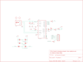

Contents
========

* [PRA284 > Adafruit](#pra284--adafruit)
	* [Schematic](#schematic)
	* [OOMP Parts](#oomp-parts)
	* [Images](#images)
	* [Tags](#tags)
  
![][im]
# PRA284 > Adafruit

- ID: PROJ-ADAF-284-STAN-01
- Hex ID: PRA284
- Name: Adafruit
- Description: Adafruit
- Long Link: [http://oom.lt/PROJ-ADAF-284-STAN-01](http://oom.lt/PROJ-ADAF-284-STAN-01)
- Long Link: [http://oom.lt/PRA284](http://oom.lt/PRA284)

## Schematic
  
![][schem]
## OOMP Parts
  

|OOMP Parts|
| :---: |
|C1,UNMATCHED-UNMATCHED-UNMATCHED-UNMATCHED-UNMATCHED,C1,10uF,CPOL-USA/3216-18R,A/3216-18R,POLARIZED CAPACITOR, American symbol,,|
|C2,UNMATCHED-UNMATCHED-UNMATCHED-UNMATCHED-UNMATCHED,C2,0.1uF,C-USC0805K,C0805K,CAPACITOR, American symbol,,|
|C3,UNMATCHED-UNMATCHED-UNMATCHED-UNMATCHED-UNMATCHED,C3,0.1uF,C-USC0805K,C0805K,CAPACITOR, American symbol,,|
|CN1,UNMATCHED-UNMATCHED-UNMATCHED-UNMATCHED-UNMATCHED,CN1,MINIB,USBMINIB,USB-MINIB,USB Connectors,,|
|FTDI,UNMATCHED-UNMATCHED-UNMATCHED-UNMATCHED-UNMATCHED,FTDI,,PINHD-1X6CB,1X06-CLEANBIG,PIN HEADER,,|
|IC1,UNMATCHED-UNMATCHED-UNMATCHED-UNMATCHED-UNMATCHED,IC1,FT232RL,FT232RL,SSOP28,Source: http://www.ftdichip.com/Documents/DataSheets/DS_FT232R_v104.pdf,,|
|R1,UNMATCHED-UNMATCHED-UNMATCHED-UNMATCHED-UNMATCHED,R1,10,R-US_R0805,R0805,RESISTOR, American symbol,,|
|R2,UNMATCHED-UNMATCHED-UNMATCHED-UNMATCHED-UNMATCHED,R2,1K,R-US_R0805,R0805,RESISTOR, American symbol,,|
|R3,UNMATCHED-UNMATCHED-UNMATCHED-UNMATCHED-UNMATCHED,R3,1K,R-US_R0805,R0805,RESISTOR, American symbol,,|
|R5,UNMATCHED-UNMATCHED-UNMATCHED-UNMATCHED-UNMATCHED,R5,10,R-US_R0805,R0805,RESISTOR, American symbol,,|
|RX,UNMATCHED-UNMATCHED-UNMATCHED-UNMATCHED-UNMATCHED,RX,Green,LEDCHIP-LED0805,CHIP-LED0805,LED,,|
|SJ1,UNMATCHED-UNMATCHED-UNMATCHED-UNMATCHED-UNMATCHED,SJ1,,SJ,SJ,SMD solder JUMPER,,|
|SJ2,UNMATCHED-UNMATCHED-UNMATCHED-UNMATCHED-UNMATCHED,SJ2,,SJ,SJ,SMD solder JUMPER,,|
|SJ3,UNMATCHED-UNMATCHED-UNMATCHED-UNMATCHED-UNMATCHED,SJ3,,SJ,SJ,SMD solder JUMPER,,|
|SJ4,UNMATCHED-UNMATCHED-UNMATCHED-UNMATCHED-UNMATCHED,SJ4,,SJ,SJ,SMD solder JUMPER,,|
|SJ5,UNMATCHED-UNMATCHED-UNMATCHED-UNMATCHED-UNMATCHED,SJ5,,SJ,SJ,SMD solder JUMPER,,|
|SJ6,UNMATCHED-UNMATCHED-UNMATCHED-UNMATCHED-UNMATCHED,SJ6,,SJ,SJ,SMD solder JUMPER,,|
|TX,UNMATCHED-UNMATCHED-UNMATCHED-UNMATCHED-UNMATCHED,TX,Red,LEDCHIP-LED0805,CHIP-LED0805,LED,,|

## Images
  
  

|kicadPcb3d|kicadPcb3dFront|kicadPcb3dBack|eagleImage|eagleSchemImage|
| :---: | :---: | :---: | :---: | :---: |
||||||

## Tags

- hexID: PRA284
- oompType: PROJ
- oompSize: ADAF
- oompColor: 284
- oompDesc: STAN
- oompIndex: 01
- oompName: Adafruit_FTDI Friend PCB
- sources: All source files from https://github.com/adafruit/Adafruit_FTDI-Friend-PCB (source licence details in srcLicense.md)
- linkBuyPage: http://www.adafruit.com/products/284
- oompID: PROJ-ADAF-284-STAN-01
- oompParts: C1,UNMATCHED-UNMATCHED-UNMATCHED-UNMATCHED-UNMATCHED
- oompParts: C2,UNMATCHED-UNMATCHED-UNMATCHED-UNMATCHED-UNMATCHED
- oompParts: C3,UNMATCHED-UNMATCHED-UNMATCHED-UNMATCHED-UNMATCHED
- oompParts: CN1,UNMATCHED-UNMATCHED-UNMATCHED-UNMATCHED-UNMATCHED
- oompParts: FTDI,UNMATCHED-UNMATCHED-UNMATCHED-UNMATCHED-UNMATCHED
- oompParts: IC1,UNMATCHED-UNMATCHED-UNMATCHED-UNMATCHED-UNMATCHED
- oompParts: R1,UNMATCHED-UNMATCHED-UNMATCHED-UNMATCHED-UNMATCHED
- oompParts: R2,UNMATCHED-UNMATCHED-UNMATCHED-UNMATCHED-UNMATCHED
- oompParts: R3,UNMATCHED-UNMATCHED-UNMATCHED-UNMATCHED-UNMATCHED
- oompParts: R5,UNMATCHED-UNMATCHED-UNMATCHED-UNMATCHED-UNMATCHED
- oompParts: RX,UNMATCHED-UNMATCHED-UNMATCHED-UNMATCHED-UNMATCHED
- oompParts: SJ1,UNMATCHED-UNMATCHED-UNMATCHED-UNMATCHED-UNMATCHED
- oompParts: SJ2,UNMATCHED-UNMATCHED-UNMATCHED-UNMATCHED-UNMATCHED
- oompParts: SJ3,UNMATCHED-UNMATCHED-UNMATCHED-UNMATCHED-UNMATCHED
- oompParts: SJ4,UNMATCHED-UNMATCHED-UNMATCHED-UNMATCHED-UNMATCHED
- oompParts: SJ5,UNMATCHED-UNMATCHED-UNMATCHED-UNMATCHED-UNMATCHED
- oompParts: SJ6,UNMATCHED-UNMATCHED-UNMATCHED-UNMATCHED-UNMATCHED
- oompParts: TX,UNMATCHED-UNMATCHED-UNMATCHED-UNMATCHED-UNMATCHED
- rawParts: C1,10uF,CPOL-USA/3216-18R,A/3216-18R,POLARIZED CAPACITOR, American symbol,,
- rawParts: C2,0.1uF,C-USC0805K,C0805K,CAPACITOR, American symbol,,
- rawParts: C3,0.1uF,C-USC0805K,C0805K,CAPACITOR, American symbol,,
- rawParts: CN1,MINIB,USBMINIB,USB-MINIB,USB Connectors,,
- rawParts: FTDI,,PINHD-1X6CB,1X06-CLEANBIG,PIN HEADER,,
- rawParts: IC1,FT232RL,FT232RL,SSOP28,Source: http://www.ftdichip.com/Documents/DataSheets/DS_FT232R_v104.pdf,,
- rawParts: R1,10,R-US_R0805,R0805,RESISTOR, American symbol,,
- rawParts: R2,1K,R-US_R0805,R0805,RESISTOR, American symbol,,
- rawParts: R3,1K,R-US_R0805,R0805,RESISTOR, American symbol,,
- rawParts: R5,10,R-US_R0805,R0805,RESISTOR, American symbol,,
- rawParts: RX,Green,LEDCHIP-LED0805,CHIP-LED0805,LED,,
- rawParts: SJ1,,SJ,SJ,SMD solder JUMPER,,
- rawParts: SJ2,,SJ,SJ,SMD solder JUMPER,,
- rawParts: SJ3,,SJ,SJ,SMD solder JUMPER,,
- rawParts: SJ4,,SJ,SJ,SMD solder JUMPER,,
- rawParts: SJ5,,SJ,SJ,SMD solder JUMPER,,
- rawParts: SJ6,,SJ,SJ,SMD solder JUMPER,,
- rawParts: TX,Red,LEDCHIP-LED0805,CHIP-LED0805,LED,,
- rawParts: U$1,FIDUCIAL,FIDUCIAL,FIDUCIAL_1MM,For use by pick and place machines to calibrate the vision/machine, 1mm,,
- rawParts: U$2,FIDUCIAL,FIDUCIAL,FIDUCIAL_1MM,For use by pick and place machines to calibrate the vision/machine, 1mm,,

[im]: kicadPcb3d_450.png
[schem]: eagleSchemImage.png
