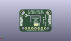

Contents
========

* [PROJ-ADAF-2857-STAN-01>Adafruit SHT31 Sensor Breakout PCB](#proj-adaf-2857-stan-01adafruit-sht31-sensor-breakout-pcb)
	* [Images](#images)
	* [Interactive BOM](#interactive-bom)
	* [Tags](#tags)
  
![][im]
# PROJ-ADAF-2857-STAN-01>Adafruit SHT31 Sensor Breakout PCB

- ID: PROJ-ADAF-2857-STAN-01
- Hex ID: PRA2857
- Name: Adafruit SHT31 Sensor Breakout PCB
- Description: 

## Images
  
  

|eagleImage|kicadPcb3dFront|kicadPcb3dBack|kicadPcb3d|
| :---: | :---: | :---: | :---: |
|||||

## Interactive BOM

- Interactive BOM page: [ibom.html](kicad/bom/ibom.html)

## Tags

- hexID: PRA2857
- oompType: PROJ
- oompSize: ADAF
- oompColor: 2857
- oompDesc: STAN
- oompIndex: 01
- oompName: Adafruit SHT31 Sensor Breakout PCB
- sources: All source files from https://github.com/adafruit/Adafruit-SHT31-Sensor-Breakout-PCB (source licence details in srcLicense.md)
- linkBuyPage: http://www.adafruit.com/products/2857
- oompPart: CAPC-0805-X-UF10-V25, C5, 7.112, 10.0965, 90
- oompPart: CAPC-0603-X-NF100-V50, C6, 18.160999999999998, 5.3975, 180
- oompPart: UNMATCHED-UNMATCHED-X-UNMATCHED-01, CONN3, 22.796499999999998, 8.889999999999999, 90
- oompPart: UNMATCHED-UNMATCHED-X-UNMATCHED-01, CONN4, 2.6034999999999995, 8.889999999999999, 270
- oompPart: UNMATCHED-UNMATCHED-X-UNMATCHED-01, D1, 3.556, 12.572999999999999, 90
- oompPart: SKIP-UNMATCHED-X-UNMATCHED-01, FID3, 1.0795000000000001, 4.3180000000000005, 0
- oompPart: SKIP-UNMATCHED-X-UNMATCHED-01, FID4, 19.558, 16.509999999999998, 0
- oompPart: UNMATCHED-UNMATCHED-X-UNMATCHED-01, JP1, 12.7, 2.54, 0
- oompPart: RESE-0603-X-O103-01, R1, 6.4135, 12.572999999999999, 0
- oompPart: RESE-UNMATCHED-X-O103-01, R5, 12.827, 6.286499999999999, 0
- oompPart: UNMATCHED-UNMATCHED-X-UNMATCHED-01, SJ1, 12.191999999999998, 5.588, M0
- oompPart: SKIP-UNMATCHED-X-UNMATCHED-01, U$19, 2.54, 15.239999999999998, 0
- oompPart: SKIP-UNMATCHED-X-UNMATCHED-01, U$20, 22.86, 15.239999999999998, 0
- oompPart: UNMATCHED-UNMATCHED-X-UNMATCHED-01, U2, 12.763499999999999, 10.350499999999998, 0
- rawPart: 

[im]: kicadPcb3d_450.png
