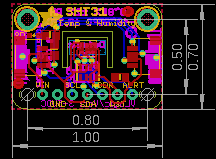

Contents
========

* [PRA2857 > Adafruit SHT31 Sensor Breakout PCB](#pra2857--adafruit-sht31-sensor-breakout-pcb)
	* [Schematic](#schematic)
	* [PCB](#pcb)
	* [Interactive BOM](#interactive-bom)
	* [OOMP Parts](#oomp-parts)
	* [Images](#images)
	* [Tags](#tags)
  
![][im]
# PRA2857 > Adafruit SHT31 Sensor Breakout PCB

- ID: PROJ-ADAF-2857-STAN-01
- Hex ID: PRA2857
- Name: Adafruit
- Description: Adafruit
- Long Link: [http://oom.lt/PROJ-ADAF-2857-STAN-01](http://oom.lt/PROJ-ADAF-2857-STAN-01)
- Short Link: [http://oom.lt/PRA2857](http://oom.lt/PRA2857)

## Schematic
  

## PCB
  

## Interactive BOM

- Interactive BOM page: [ibom.html](https://htmlpreview.github.io/?https://github.com/oomlout/oomlout_OOMP_projects/blob/main/PROJ-ADAF-2857-STAN-01/kicad/bom/ibom.html)

## OOMP Parts
  

|OOMP Parts|
| :---: |
|[C5 CAPC-0805-X-UF10-V10 SMD (0805) 10 uF Capacitor (Ceramic) 10v](https://github.com/oomlout/oomlout_OOMP_parts/tree/main/CAPC-0805-X-UF10-V10/)|
|C6 C6,CAPC-0603-X-UF1D-01|
|[CONN3 HEAD-I01-X-PI04-01 2.54 mm 4 Pin Header](https://github.com/oomlout/oomlout_OOMP_parts/tree/main/HEAD-I01-X-PI04-01/)|
|[CONN4 HEAD-I01-X-PI04-01 2.54 mm 4 Pin Header](https://github.com/oomlout/oomlout_OOMP_parts/tree/main/HEAD-I01-X-PI04-01/)|
|[D1 LEDS-0603-G-STAN-01 SMD (0603) Green LED](https://github.com/oomlout/oomlout_OOMP_parts/tree/main/LEDS-0603-G-STAN-01/)|
|[JP1 HEAD-I01-X-PI07-01 2.54 mm 7 Pin Header](https://github.com/oomlout/oomlout_OOMP_parts/tree/main/HEAD-I01-X-PI07-01/)|
|[R1 RESE-0603-X-O103-01 SMD (0603) 10k Ohm Resistor](https://github.com/oomlout/oomlout_OOMP_parts/tree/main/RESE-0603-X-O103-01/)|
|R5 R5,RESA-06038-X-O103X4-01|
|U2 U2,UNMATCHED-UNMATCHED-X-UNMATCHED-01|

## Images
  
  

|kicadPcb3d|kicadPcb3dFront|kicadPcb3dBack|eagleImage|eagleSchemImage|
| :---: | :---: | :---: | :---: | :---: |
||||||

## Tags

- hexID: PRA2857
- oompType: PROJ
- oompSize: ADAF
- oompColor: 2857
- oompDesc: STAN
- oompIndex: 01
- oompName: Adafruit SHT31 Sensor Breakout PCB
- sources: All source files from https://github.com/adafruit/Adafruit-SHT31-Sensor-Breakout-PCB (source licence details in srcLicense.md)
- linkBuyPage: http://www.adafruit.com/products/2857
- oompID: PROJ-ADAF-2857-STAN-01
- oompParts: C5,CAPC-0805-X-UF10-V10
- oompParts: C6,CAPC-0603-X-UF1D-01
- oompParts: CONN3,HEAD-I01-X-PI04-01
- oompParts: CONN4,HEAD-I01-X-PI04-01
- oompParts: D1,LEDS-0603-G-STAN-01
- oompParts: JP1,HEAD-I01-X-PI07-01
- oompParts: R1,RESE-0603-X-O103-01
- oompParts: R5,RESA-06038-X-O103X4-01
- oompParts: U2,UNMATCHED-UNMATCHED-X-UNMATCHED-01
- rawParts: C5,10uF,CAP_CERAMIC0805-NOOUTLINE,0805-NO,Ceramic Capacitors,,
- rawParts: C6,0.1uF,CAP_CERAMIC0603_NO,0603-NO,Ceramic Capacitors,,
- rawParts: CONN3,STEMMA_I2C_QT,STEMMA_I2C_QT,JST_SH4,,,
- rawParts: CONN4,STEMMA_I2C_QT,STEMMA_I2C_QT,JST_SH4,,,
- rawParts: D1,GREEN,LED0603_NOOUTLINE,CHIPLED_0603_NOOUTLINE,LED,,
- rawParts: FID3,FIDUCIAL_1MM,FIDUCIAL_1MM,FIDUCIAL_1MM,Fiducial Alignment Points,EXCLUDE,
- rawParts: FID4,FIDUCIAL_1MM,FIDUCIAL_1MM,FIDUCIAL_1MM,Fiducial Alignment Points,EXCLUDE,
- rawParts: JP1,,HEADER-1X770MIL,1X07_ROUND_70,PIN HEADER,,
- rawParts: R1,10K,RESISTOR_0603_NOOUT,0603-NO,Resistors,,
- rawParts: R5,10K,RESISTOR_4PACK,RESPACK_4X0603,Resistor Packs (4 resistors),,
- rawParts: SJ1,,SOLDERJUMPER,SOLDERJUMPER_ARROW_NOPASTE,SMD Solder JUMPER,EXCLUDE,
- rawParts: U$19,MOUNTINGHOLE2.5,MOUNTINGHOLE2.5,MOUNTINGHOLE_2.5_PLATED,Mounting Hole,EXCLUDE,
- rawParts: U$20,MOUNTINGHOLE2.5,MOUNTINGHOLE2.5,MOUNTINGHOLE_2.5_PLATED,Mounting Hole,EXCLUDE,
- rawParts: U2,,SHT3X,SHT3X,SHT3x - Digital Temperature and Humidity Sensor,,

[im]: kicadPcb3d_450.png
