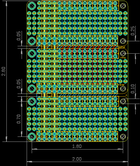
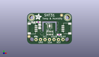
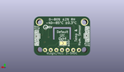
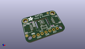

Contents
========

* [PROJ-ADAF-2884-STAN-01>Adafruit FeatherWing Proto Doubler Tripler and Quad](#proj-adaf-2884-stan-01adafruit-featherwing-proto-doubler-tripler-and-quad)
	* [Images](#images)
	* [Interactive BOM](#interactive-bom)
	* [OOMP Parts](#oomp-parts)
	* [Tags](#tags)
  
![][im]
# PROJ-ADAF-2884-STAN-01>Adafruit FeatherWing Proto Doubler Tripler and Quad

- ID: PROJ-ADAF-2884-STAN-01
- Hex ID: PRA2884
- Name: Adafruit FeatherWing Proto Doubler Tripler and Quad
- Description: 

## Images
  
  

|eagleImage|kicadPcb3dFront|kicadPcb3dBack|kicadPcb3d|
| :---: | :---: | :---: | :---: |
|||||

## Interactive BOM

- Interactive BOM page: [ibom.html](kicad/bom/ibom.html)

## OOMP Parts
  

|OOMP Parts|
| :---: |
|UNMATCHED-UNMATCHED-X-UNMATCHED-01, JP1, 30.479999999999997, 19.049999999999997, 0,JP1, 1X12_ROUND_76MIL, microbuilder, (1.2, 0.75), R0|
|UNMATCHED-UNMATCHED-X-UNMATCHED-01, JP2, 25.4, 27.94, 180,JP2, 1X16_ROUND_76MIL, microbuilder, (1, 1.1), R180|
|UNMATCHED-UNMATCHED-X-UNMATCHED-01, JP3, 25.4, 3.8099999999999996, 180,JP3, 1X16_ROUND_76MIL, microbuilder, (1, 0.15), R180|
|UNMATCHED-UNMATCHED-X-UNMATCHED-01, JP4, 30.479999999999997, 43.18, 0,JP4, 1X12_ROUND_76MIL, microbuilder, (1.2, 1.7), R0|
|UNMATCHED-UNMATCHED-X-UNMATCHED-01, JP5, 30.479999999999997, 67.30999999999999, 0,JP5, 1X12_ROUND_76MIL, microbuilder, (1.2, 2.65), R0|
|UNMATCHED-UNMATCHED-X-UNMATCHED-01, JP6, 25.4, 52.06999999999999, 180,JP6, 1X16_ROUND_76MIL, microbuilder, (1, 2.05), R180|
|UNMATCHED-UNMATCHED-X-UNMATCHED-01, MS1, 0.0, 0.0, 0,MS1, FEATHERWING_NODIM, FEATHERWING_DIM, microbuilder, (0, 0), R0|
|UNMATCHED-UNMATCHED-X-UNMATCHED-01, MS2, 0.0, 24.13, 0,MS2, FEATHERWING_NODIM, FEATHERWING_DIM, microbuilder, (0, 0.95), R0|
|UNMATCHED-UNMATCHED-X-UNMATCHED-01, MS3, 0.0, 48.26, 0,MS3, FEATHERWING_NODIM, FEATHERWING_DIM, microbuilder, (0, 1.9), R0|

## Tags

- hexID: PRA2884
- oompType: PROJ
- oompSize: ADAF
- oompColor: 2884
- oompDesc: STAN
- oompIndex: 01
- oompName: Adafruit FeatherWing Proto Doubler Tripler and Quad
- sources: All source files from https://github.com/adafruit/Adafruit-FeatherWing-Proto-Doubler-Tripler-and-Quad (source licence details in srcLicense.md)
- linkBuyPage: http://www.adafruit.com/products/2884
- oompPart: UNMATCHED-UNMATCHED-X-UNMATCHED-01, JP1, 30.479999999999997, 19.049999999999997, 0
- oompPart: UNMATCHED-UNMATCHED-X-UNMATCHED-01, JP2, 25.4, 27.94, 180
- oompPart: UNMATCHED-UNMATCHED-X-UNMATCHED-01, JP3, 25.4, 3.8099999999999996, 180
- oompPart: UNMATCHED-UNMATCHED-X-UNMATCHED-01, JP4, 30.479999999999997, 43.18, 0
- oompPart: UNMATCHED-UNMATCHED-X-UNMATCHED-01, JP5, 30.479999999999997, 67.30999999999999, 0
- oompPart: UNMATCHED-UNMATCHED-X-UNMATCHED-01, JP6, 25.4, 52.06999999999999, 180
- oompPart: UNMATCHED-UNMATCHED-X-UNMATCHED-01, MS1, 0.0, 0.0, 0
- oompPart: UNMATCHED-UNMATCHED-X-UNMATCHED-01, MS2, 0.0, 24.13, 0
- oompPart: UNMATCHED-UNMATCHED-X-UNMATCHED-01, MS3, 0.0, 48.26, 0
- rawPart: JP1, 1X12_ROUND_76MIL, microbuilder, (1.2, 0.75), R0
- rawPart: JP2, 1X16_ROUND_76MIL, microbuilder, (1, 1.1), R180
- rawPart: JP3, 1X16_ROUND_76MIL, microbuilder, (1, 0.15), R180
- rawPart: JP4, 1X12_ROUND_76MIL, microbuilder, (1.2, 1.7), R0
- rawPart: JP5, 1X12_ROUND_76MIL, microbuilder, (1.2, 2.65), R0
- rawPart: JP6, 1X16_ROUND_76MIL, microbuilder, (1, 2.05), R180
- rawPart: MS1, FEATHERWING_NODIM, FEATHERWING_DIM, microbuilder, (0, 0), R0
- rawPart: MS2, FEATHERWING_NODIM, FEATHERWING_DIM, microbuilder, (0, 0.95), R0
- rawPart: MS3, FEATHERWING_NODIM, FEATHERWING_DIM, microbuilder, (0, 1.9), R0

[im]: kicadPcb3d_450.png
