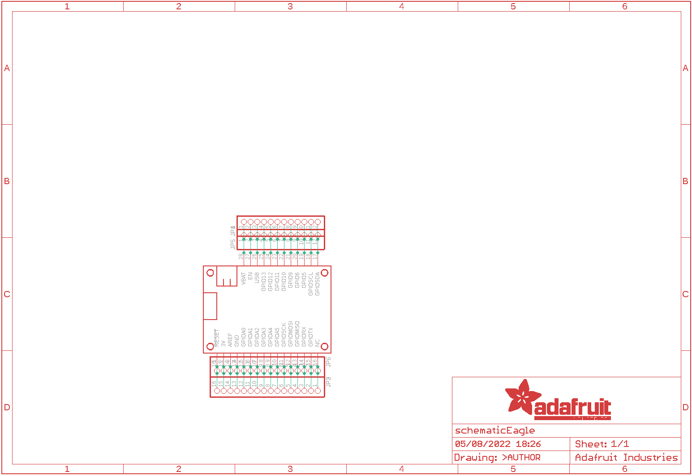
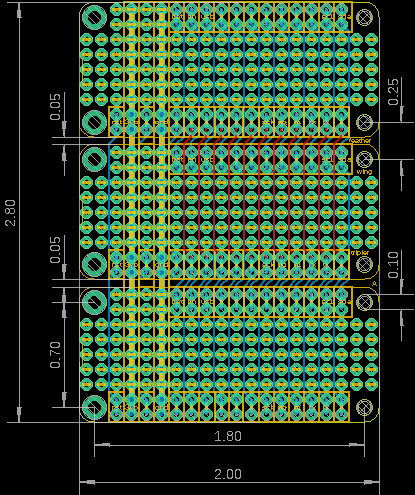
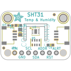
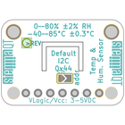
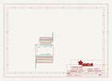
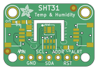
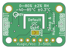

Contents
========

* [PRA2884 > Adafruit FeatherWing Proto Doubler Tripler and Quad](#pra2884--adafruit-featherwing-proto-doubler-tripler-and-quad)
	* [Schematic](#schematic)
	* [PCB](#pcb)
	* [Interactive BOM](#interactive-bom)
	* [OOMP Parts](#oomp-parts)
	* [Images](#images)
	* [Tags](#tags)
  
![][im]
# PRA2884 > Adafruit FeatherWing Proto Doubler Tripler and Quad

- ID: PROJ-ADAF-2884-STAN-01
- Hex ID: PRA2884
- Name: Adafruit
- Description: Adafruit
- Long Link: [http://oom.lt/PROJ-ADAF-2884-STAN-01](http://oom.lt/PROJ-ADAF-2884-STAN-01)
- Short Link: [http://oom.lt/PRA2884](http://oom.lt/PRA2884)

## Schematic
  

## PCB
  

## Interactive BOM

- Interactive BOM page: [ibom.html](https://htmlpreview.github.io/?https://github.com/oomlout/oomlout_OOMP_projects/blob/main/PROJ-ADAF-2884-STAN-01/kicad/bom/ibom.html)

## OOMP Parts
  

|OOMP ID|Name|Identifier|
| :---: | :---: | :---: |
|[HEAD-I01-X-PI12-01](https://github.com/oomlout/oomlout_OOMP_parts/tree/main/HEAD-I01-X-PI12-01/)|[2.54 mm 12 Pin Header](https://github.com/oomlout/oomlout_OOMP_parts/tree/main/HEAD-I01-X-PI12-01/)|[JP1, JP4, JP5](https://github.com/oomlout/oomlout_OOMP_parts/tree/main/HEAD-I01-X-PI12-01/)|
|[HEAD-I01-X-PI16-01](https://github.com/oomlout/oomlout_OOMP_parts/tree/main/HEAD-I01-X-PI16-01/)|[2.54 mm 16 Pin Header](https://github.com/oomlout/oomlout_OOMP_parts/tree/main/HEAD-I01-X-PI16-01/)|[JP2, JP3, JP6](https://github.com/oomlout/oomlout_OOMP_parts/tree/main/HEAD-I01-X-PI16-01/)|
|UNMATCHED-UNMATCHED-X-UNMATCHED-01||MS1, MS2, MS3|

## Images
  
  

|bominteractivefront|bominteractiveback|kicadPcb3d|kicadPcb3dFront|kicadPcb3dBack|kicadSchem|eagleImage|eagleSchemImage|pcbdraw|pcbdrawback|
| :---: | :---: | :---: | :---: | :---: | :---: | :---: | :---: | :---: | :---: |
|||||||||||

## Tags

- hexID: PRA2884
- oompType: PROJ
- oompSize: ADAF
- oompColor: 2884
- oompDesc: STAN
- oompIndex: 01
- oompName: Adafruit FeatherWing Proto Doubler Tripler and Quad
- sources: All source files from https://github.com/adafruit/Adafruit-FeatherWing-Proto-Doubler-Tripler-and-Quad (source licence details in srcLicense.md)
- linkBuyPage: http://www.adafruit.com/products/2884
- oompID: PROJ-ADAF-2884-STAN-01
- oompParts: JP1,HEAD-I01-X-PI12-01
- oompParts: JP2,HEAD-I01-X-PI16-01
- oompParts: JP3,HEAD-I01-X-PI16-01
- oompParts: JP4,HEAD-I01-X-PI12-01
- oompParts: JP5,HEAD-I01-X-PI12-01
- oompParts: JP6,HEAD-I01-X-PI16-01
- oompParts: MS1,UNMATCHED-UNMATCHED-X-UNMATCHED-01
- oompParts: MS2,UNMATCHED-UNMATCHED-X-UNMATCHED-01
- oompParts: MS3,UNMATCHED-UNMATCHED-X-UNMATCHED-01
- rawParts: JP1,,HEADER-1X1276MIL,1X12_ROUND_76MIL,,,
- rawParts: JP2,,HEADER-1X16_76MIL,1X16_ROUND_76MIL,PIN HEADER,,
- rawParts: JP3,,HEADER-1X16_76MIL,1X16_ROUND_76MIL,PIN HEADER,,
- rawParts: JP4,,HEADER-1X1276MIL,1X12_ROUND_76MIL,,,
- rawParts: JP5,,HEADER-1X1276MIL,1X12_ROUND_76MIL,,,
- rawParts: JP6,,HEADER-1X16_76MIL,1X16_ROUND_76MIL,PIN HEADER,,
- rawParts: MS1,FEATHERWING_NODIM,FEATHERWING_NODIM,FEATHERWING_DIM,,,
- rawParts: MS2,FEATHERWING_NODIM,FEATHERWING_NODIM,FEATHERWING_DIM,,,
- rawParts: MS3,FEATHERWING_NODIM,FEATHERWING_NODIM,FEATHERWING_DIM,,,

[im]: kicadPcb3d_450.png
