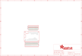

Contents
========

* [PRA2884 > Adafruit](#pra2884--adafruit)
	* [Schematic](#schematic)
	* [Interactive BOM](#interactive-bom)
	* [OOMP Parts](#oomp-parts)
	* [Images](#images)
	* [Tags](#tags)
  
![][im]
# PRA2884 > Adafruit

- ID: PROJ-ADAF-2884-STAN-01
- Hex ID: PRA2884
- Name: Adafruit
- Description: Adafruit
- Long Link: [http://oom.lt/PROJ-ADAF-2884-STAN-01](http://oom.lt/PROJ-ADAF-2884-STAN-01)
- Long Link: [http://oom.lt/PRA2884](http://oom.lt/PRA2884)

## Schematic
  
![][schem]
## Interactive BOM

- Interactive BOM page: [ibom.html](https://htmlpreview.github.io/?https://github.com/oomlout/oomlout_OOMP_projects/blob/main/PROJ-ADAF-2884-STAN-01/kicad/bom/ibom.html)

## OOMP Parts
  

|OOMP Parts|
| :---: |
|JP1,UNMATCHED-UNMATCHED-UNMATCHED-UNMATCHED-UNMATCHED,JP1,,HEADER-1X1276MIL,1X12_ROUND_76MIL,,,|
|JP2,UNMATCHED-UNMATCHED-UNMATCHED-UNMATCHED-UNMATCHED,JP2,,HEADER-1X16_76MIL,1X16_ROUND_76MIL,PIN HEADER,,|
|JP3,UNMATCHED-UNMATCHED-UNMATCHED-UNMATCHED-UNMATCHED,JP3,,HEADER-1X16_76MIL,1X16_ROUND_76MIL,PIN HEADER,,|
|JP4,UNMATCHED-UNMATCHED-UNMATCHED-UNMATCHED-UNMATCHED,JP4,,HEADER-1X1276MIL,1X12_ROUND_76MIL,,,|
|JP5,UNMATCHED-UNMATCHED-UNMATCHED-UNMATCHED-UNMATCHED,JP5,,HEADER-1X1276MIL,1X12_ROUND_76MIL,,,|
|JP6,UNMATCHED-UNMATCHED-UNMATCHED-UNMATCHED-UNMATCHED,JP6,,HEADER-1X16_76MIL,1X16_ROUND_76MIL,PIN HEADER,,|
|MS1,UNMATCHED-UNMATCHED-UNMATCHED-UNMATCHED-UNMATCHED,MS1,FEATHERWING_NODIM,FEATHERWING_NODIM,FEATHERWING_DIM,,,|
|MS2,UNMATCHED-UNMATCHED-UNMATCHED-UNMATCHED-UNMATCHED,MS2,FEATHERWING_NODIM,FEATHERWING_NODIM,FEATHERWING_DIM,,,|
|MS3,UNMATCHED-UNMATCHED-UNMATCHED-UNMATCHED-UNMATCHED,MS3,FEATHERWING_NODIM,FEATHERWING_NODIM,FEATHERWING_DIM,,,|

## Images
  
  

|kicadPcb3d|kicadPcb3dFront|kicadPcb3dBack|eagleImage|eagleSchemImage|
| :---: | :---: | :---: | :---: | :---: |
||||||

## Tags

- hexID: PRA2884
- oompType: PROJ
- oompSize: ADAF
- oompColor: 2884
- oompDesc: STAN
- oompIndex: 01
- oompName: Adafruit FeatherWing Proto Doubler Tripler and Quad
- sources: All source files from https://github.com/adafruit/Adafruit-FeatherWing-Proto-Doubler-Tripler-and-Quad (source licence details in srcLicense.md)
- linkBuyPage: http://www.adafruit.com/products/2884
- oompID: PROJ-ADAF-2884-STAN-01
- oompParts: JP1,UNMATCHED-UNMATCHED-UNMATCHED-UNMATCHED-UNMATCHED
- oompParts: JP2,UNMATCHED-UNMATCHED-UNMATCHED-UNMATCHED-UNMATCHED
- oompParts: JP3,UNMATCHED-UNMATCHED-UNMATCHED-UNMATCHED-UNMATCHED
- oompParts: JP4,UNMATCHED-UNMATCHED-UNMATCHED-UNMATCHED-UNMATCHED
- oompParts: JP5,UNMATCHED-UNMATCHED-UNMATCHED-UNMATCHED-UNMATCHED
- oompParts: JP6,UNMATCHED-UNMATCHED-UNMATCHED-UNMATCHED-UNMATCHED
- oompParts: MS1,UNMATCHED-UNMATCHED-UNMATCHED-UNMATCHED-UNMATCHED
- oompParts: MS2,UNMATCHED-UNMATCHED-UNMATCHED-UNMATCHED-UNMATCHED
- oompParts: MS3,UNMATCHED-UNMATCHED-UNMATCHED-UNMATCHED-UNMATCHED
- rawParts: JP1,,HEADER-1X1276MIL,1X12_ROUND_76MIL,,,
- rawParts: JP2,,HEADER-1X16_76MIL,1X16_ROUND_76MIL,PIN HEADER,,
- rawParts: JP3,,HEADER-1X16_76MIL,1X16_ROUND_76MIL,PIN HEADER,,
- rawParts: JP4,,HEADER-1X1276MIL,1X12_ROUND_76MIL,,,
- rawParts: JP5,,HEADER-1X1276MIL,1X12_ROUND_76MIL,,,
- rawParts: JP6,,HEADER-1X16_76MIL,1X16_ROUND_76MIL,PIN HEADER,,
- rawParts: MS1,FEATHERWING_NODIM,FEATHERWING_NODIM,FEATHERWING_DIM,,,
- rawParts: MS2,FEATHERWING_NODIM,FEATHERWING_NODIM,FEATHERWING_DIM,,,
- rawParts: MS3,FEATHERWING_NODIM,FEATHERWING_NODIM,FEATHERWING_DIM,,,

[im]: kicadPcb3d_450.png
[schem]: eagleSchemImage.png
