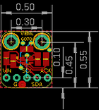
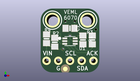
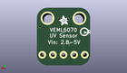

Contents
========

* [PROJ-ADAF-2899-STAN-01>Adafruit VEML6070 PCB](#proj-adaf-2899-stan-01adafruit-veml6070-pcb)
	* [Images](#images)
	* [Interactive BOM](#interactive-bom)
	* [OOMP Parts](#oomp-parts)
	* [Tags](#tags)
  
![][im]
# PROJ-ADAF-2899-STAN-01>Adafruit VEML6070 PCB

- ID: PROJ-ADAF-2899-STAN-01
- Hex ID: PRA2899
- Name: Adafruit VEML6070 PCB
- Description: 

## Images
  
  

|eagleImage|kicadPcb3dFront|kicadPcb3dBack|kicadPcb3d|
| :---: | :---: | :---: | :---: |
|||||

## Interactive BOM

- Interactive BOM page: [ibom.html](kicad/bom/ibom.html)

## OOMP Parts
  

|OOMP Parts|
| :---: |
|CAPE-0805-X-UNMATCHED-01, C1, 6.35, 9.652, 180,C1, 10uF, 0805-NO, microbuilder, (0.25, 0.38), R180|
|UNMATCHED-UNMATCHED-X-UNMATCHED-01, JP1, 6.35, 2.54, 0,JP1, 1X05_ROUND_70, microbuilder, (0.25, 0.1), R0|
|<table><tr><td></td><td> R1</td><td>[RESE-0805-X-O103-01 SMD (0805) 10k Ohm Resistor](https://github.com/oomlout/oomlout_OOMP_parts/tree/main/RESE-0805-X-O103-01/)</td><td>[R85103](https://github.com/oomlout/oomlout_OOMP_parts/tree/main/RESE-0805-X-O103-01/)</td></tr></table>|
|<table><tr><td></td><td> R2</td><td>[RESE-0805-X-O103-01 SMD (0805) 10k Ohm Resistor](https://github.com/oomlout/oomlout_OOMP_parts/tree/main/RESE-0805-X-O103-01/)</td><td>[R85103](https://github.com/oomlout/oomlout_OOMP_parts/tree/main/RESE-0805-X-O103-01/)</td></tr></table>|
|RESE-0805-X-O274-01, R3, 11.176, 7.112, 270,R3, 270K, 0805-NO, microbuilder, (0.44, 0.28), R270|
|<table><tr><td></td><td> R4</td><td>[RESE-0805-X-O103-01 SMD (0805) 10k Ohm Resistor](https://github.com/oomlout/oomlout_OOMP_parts/tree/main/RESE-0805-X-O103-01/)</td><td>[R85103](https://github.com/oomlout/oomlout_OOMP_parts/tree/main/RESE-0805-X-O103-01/)</td></tr></table>|
|UNMATCHED-UNMATCHED-X-UNMATCHED-01, U1, 6.35, 6.858, 0,U1, VEML6070, VEML6070, microbuilder, (0.25, 0.27), R0|

## Tags

- hexID: PRA2899
- oompType: PROJ
- oompSize: ADAF
- oompColor: 2899
- oompDesc: STAN
- oompIndex: 01
- oompName: Adafruit VEML6070 PCB
- sources: All source files from https://github.com/adafruit/Adafruit-VEML6070-PCB (source licence details in srcLicense.md)
- linkBuyPage: http://www.adafruit.com/products/2899
- oompPart: CAPE-0805-X-UNMATCHED-01, C1, 6.35, 9.652, 180
- oompPart: SKIP-UNMATCHED-X-UNMATCHED-01, FID1, 5.334, 0.7619999999999999, 0
- oompPart: UNMATCHED-UNMATCHED-X-UNMATCHED-01, JP1, 6.35, 2.54, 0
- oompPart: RESE-0805-X-O103-01, R1, 9.143999999999998, 7.112, 90
- oompPart: RESE-0805-X-O103-01, R2, 3.0479999999999996, 6.604, 270
- oompPart: RESE-0805-X-O274-01, R3, 11.176, 7.112, 270
- oompPart: RESE-0805-X-O103-01, R4, 1.27, 7.365999999999999, 270
- oompPart: SKIP-UNMATCHED-X-UNMATCHED-01, U$10, 2.54, 11.43, 0
- oompPart: SKIP-UNMATCHED-X-UNMATCHED-01, U$11, 10.16, 11.43, 0
- oompPart: UNMATCHED-UNMATCHED-X-UNMATCHED-01, U1, 6.35, 6.858, 0
- rawPart: C1, 10uF, 0805-NO, microbuilder, (0.25, 0.38), R180
- rawPart: FID1, FIDUCIAL, FIDUCIAL_1MM, microbuilder, (0.21, 0.03), R0
- rawPart: JP1, 1X05_ROUND_70, microbuilder, (0.25, 0.1), R0
- rawPart: R1, 10K, 0805-NO, microbuilder, (0.36, 0.28), R90
- rawPart: R2, 10K, 0805-NO, microbuilder, (0.12, 0.26), R270
- rawPart: R3, 270K, 0805-NO, microbuilder, (0.44, 0.28), R270
- rawPart: R4, 10K, 0805-NO, microbuilder, (0.05, 0.29), R270
- rawPart: U$10, MOUNTINGHOLE2.5, MOUNTINGHOLE_2.5_PLATED, microbuilder, (0.1, 0.45), R0
- rawPart: U$11, MOUNTINGHOLE2.5, MOUNTINGHOLE_2.5_PLATED, microbuilder, (0.4, 0.45), R0
- rawPart: U1, VEML6070, VEML6070, microbuilder, (0.25, 0.27), R0

[im]: kicadPcb3d_450.png
