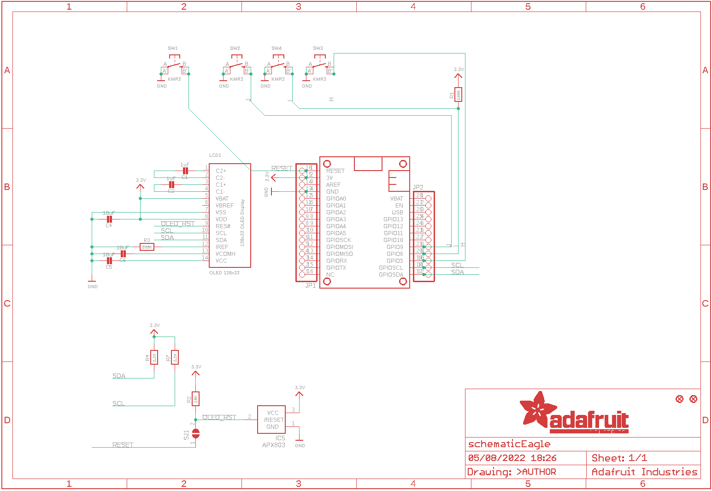
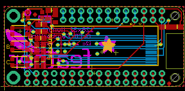
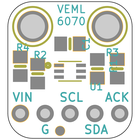
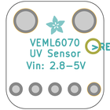
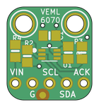
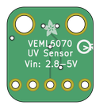

Contents
========

* [PRA2900 > Adafruit OLED FeatherWing PCB](#pra2900--adafruit-oled-featherwing-pcb)
	* [Schematic](#schematic)
	* [PCB](#pcb)
	* [Interactive BOM](#interactive-bom)
	* [OOMP Parts](#oomp-parts)
	* [Images](#images)
	* [Tags](#tags)
  
![][im]
# PRA2900 > Adafruit OLED FeatherWing PCB

- ID: PROJ-ADAF-2900-STAN-01
- Hex ID: PRA2900
- Name: Adafruit
- Description: Adafruit
- Long Link: [http://oom.lt/PROJ-ADAF-2900-STAN-01](http://oom.lt/PROJ-ADAF-2900-STAN-01)
- Short Link: [http://oom.lt/PRA2900](http://oom.lt/PRA2900)

## Schematic
  

## PCB
  

## Interactive BOM

- Interactive BOM page: [ibom.html](https://htmlpreview.github.io/?https://github.com/oomlout/oomlout_OOMP_projects/blob/main/PROJ-ADAF-2900-STAN-01/kicad/bom/ibom.html)

## OOMP Parts
  

|OOMP ID|Name|Identifier|
| :---: | :---: | :---: |
|[CAPC-0805-X-UF1-V25](https://github.com/oomlout/oomlout_OOMP_parts/tree/main/CAPC-0805-X-UF1-V25/)|[SMD (0805) 1 uF Capacitor (Ceramic) 25v](https://github.com/oomlout/oomlout_OOMP_parts/tree/main/CAPC-0805-X-UF1-V25/)|[C1, C2](https://github.com/oomlout/oomlout_OOMP_parts/tree/main/CAPC-0805-X-UF1-V25/)|
|[CAPC-0805-X-UF10-V10](https://github.com/oomlout/oomlout_OOMP_parts/tree/main/CAPC-0805-X-UF10-V10/)|[SMD (0805) 10 uF Capacitor (Ceramic) 10v](https://github.com/oomlout/oomlout_OOMP_parts/tree/main/CAPC-0805-X-UF10-V10/)|[C4, C5, C6](https://github.com/oomlout/oomlout_OOMP_parts/tree/main/CAPC-0805-X-UF10-V10/)|
|UNMATCHED-SO23-X-UNMATCHED-01||IC5|
|[HEAD-I01-X-PI16-01](https://github.com/oomlout/oomlout_OOMP_parts/tree/main/HEAD-I01-X-PI16-01/)|[2.54 mm 16 Pin Header](https://github.com/oomlout/oomlout_OOMP_parts/tree/main/HEAD-I01-X-PI16-01/)|[JP1](https://github.com/oomlout/oomlout_OOMP_parts/tree/main/HEAD-I01-X-PI16-01/)|
|[HEAD-I01-X-PI12-01](https://github.com/oomlout/oomlout_OOMP_parts/tree/main/HEAD-I01-X-PI12-01/)|[2.54 mm 12 Pin Header](https://github.com/oomlout/oomlout_OOMP_parts/tree/main/HEAD-I01-X-PI12-01/)|[JP2](https://github.com/oomlout/oomlout_OOMP_parts/tree/main/HEAD-I01-X-PI12-01/)|
|UNMATCHED-UNMATCHED-X-UNMATCHED-01||LCD1, MS1|
|RESE-0805-X-O1003-01||R1|
|[RESE-0805-X-O103-01](https://github.com/oomlout/oomlout_OOMP_parts/tree/main/RESE-0805-X-O103-01/)|[SMD (0805) 10k Ohm Resistor](https://github.com/oomlout/oomlout_OOMP_parts/tree/main/RESE-0805-X-O103-01/)|[R2](https://github.com/oomlout/oomlout_OOMP_parts/tree/main/RESE-0805-X-O103-01/)|
|RESE-0805-X-O3903-01||R3|
|[RESE-0805-X-O222-01](https://github.com/oomlout/oomlout_OOMP_parts/tree/main/RESE-0805-X-O222-01/)|[SMD (0805) 2.2k Ohm Resistor](https://github.com/oomlout/oomlout_OOMP_parts/tree/main/RESE-0805-X-O222-01/)|[R4, R7](https://github.com/oomlout/oomlout_OOMP_parts/tree/main/RESE-0805-X-O222-01/)|
|[BUTA-4628-X-STAN-01](https://github.com/oomlout/oomlout_OOMP_parts/tree/main/BUTA-4628-X-STAN-01/)|[SMD (4628) Pushbutton (Tactile)](https://github.com/oomlout/oomlout_OOMP_parts/tree/main/BUTA-4628-X-STAN-01/)|[SW1, SW2, SW3, SW4](https://github.com/oomlout/oomlout_OOMP_parts/tree/main/BUTA-4628-X-STAN-01/)|

## Images
  
  

|bominteractivefront|bominteractiveback|kicadPcb3d|kicadPcb3dFront|kicadPcb3dBack|eagleImage|eagleSchemImage|pcbdraw|pcbdrawback|
| :---: | :---: | :---: | :---: | :---: | :---: | :---: | :---: | :---: |
||||||||||

## Tags

- hexID: PRA2900
- oompType: PROJ
- oompSize: ADAF
- oompColor: 2900
- oompDesc: STAN
- oompIndex: 01
- oompName: Adafruit OLED FeatherWing PCB
- sources: All source files from https://github.com/adafruit/Adafruit-OLED-FeatherWing-PCB (source licence details in srcLicense.md)
- linkBuyPage: http://www.adafruit.com/products/2900
- oompID: PROJ-ADAF-2900-STAN-01
- oompParts: C1,CAPC-0805-X-UF1-V25
- oompParts: C2,CAPC-0805-X-UF1-V25
- oompParts: C4,CAPC-0805-X-UF10-V10
- oompParts: C5,CAPC-0805-X-UF10-V10
- oompParts: C6,CAPC-0805-X-UF10-V10
- oompParts: IC5,UNMATCHED-SO23-X-UNMATCHED-01
- oompParts: JP1,HEAD-I01-X-PI16-01
- oompParts: JP2,HEAD-I01-X-PI12-01
- oompParts: LCD1,UNMATCHED-UNMATCHED-X-UNMATCHED-01
- oompParts: MS1,UNMATCHED-UNMATCHED-X-UNMATCHED-01
- oompParts: R1,RESE-0805-X-O1003-01
- oompParts: R2,RESE-0805-X-O103-01
- oompParts: R3,RESE-0805-X-O3903-01
- oompParts: R4,RESE-0805-X-O222-01
- oompParts: R7,RESE-0805-X-O222-01
- oompParts: SW1,BUTA-4628-X-STAN-01
- oompParts: SW2,BUTA-4628-X-STAN-01
- oompParts: SW3,BUTA-4628-X-STAN-01
- oompParts: SW4,BUTA-4628-X-STAN-01
- rawParts: C1,1uF,CAP_CERAMIC0805-NOOUTLINE,0805-NO,Ceramic Capacitors,,
- rawParts: C2,1uF,CAP_CERAMIC0805-NOOUTLINE,0805-NO,Ceramic Capacitors,,
- rawParts: C4,10uF,CAP_CERAMIC0805-NOOUTLINE,0805-NO,Ceramic Capacitors,,
- rawParts: C5,10uF,CAP_CERAMIC0805-NOOUTLINE,0805-NO,Ceramic Capacitors,,
- rawParts: C6,10uF,CAP_CERAMIC0805-NOOUTLINE,0805-NO,Ceramic Capacitors,,
- rawParts: FID1,FIDUCIAL,FIDUCIAL,FIDUCIAL_1MM,Fiducial Alignment Points,EXCLUDE,
- rawParts: FID2,FIDUCIAL,FIDUCIAL,FIDUCIAL_1MM,Fiducial Alignment Points,EXCLUDE,
- rawParts: IC5,APX803,AXP083-SAG,SOT23,,,
- rawParts: JP1,,HEADER-1X16ROUND,1X16_ROUND,PIN HEADER,,
- rawParts: JP2,,HEADER-1X12,1X12_ROUND,,,
- rawParts: LCD1,OLED 128x32,DISP_OLED_UG-2832HSWEG02,UG-2832HSWEG02_WRAPUNDER,128x32 I2C 0.91 Monochrome OLED Display,,
- rawParts: MS1,FEATHERWING,FEATHERWING,FEATHERWING,,,
- rawParts: R1,100K,RESISTOR0805_NOOUTLINE,0805-NO,Resistors,,
- rawParts: R2,10K,RESISTOR_0805MP,_0805MP,Resistors,,
- rawParts: R3,390K,RESISTOR0805_NOOUTLINE,0805-NO,Resistors,,
- rawParts: R4,2.2K,RESISTOR0805_NOOUTLINE,0805-NO,Resistors,,
- rawParts: R7,2.2K,RESISTOR0805_NOOUTLINE,0805-NO,Resistors,,
- rawParts: SJ1,,SOLDERJUMPER,SOLDERJUMPER_ARROW_NOPASTE,SMD Solder JUMPER,EXCLUDE,
- rawParts: SW1,KMR2,SWITCH_TACT_SMT4.6X2.8,BTN_KMR2_4.6X2.8,SMT Tact Switches,,
- rawParts: SW2,KMR2,SWITCH_TACT_SMT4.6X2.8,BTN_KMR2_4.6X2.8,SMT Tact Switches,,
- rawParts: SW3,KMR2,SWITCH_TACT_SMT4.6X2.8,BTN_KMR2_4.6X2.8,SMT Tact Switches,,
- rawParts: SW4,KMR2,SWITCH_TACT_SMT4.6X2.8,BTN_KMR2_4.6X2.8,SMT Tact Switches,,

[im]: kicadPcb3d_450.png
