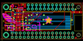
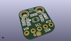

Contents
========

* [PROJ-ADAF-2900-STAN-01>Adafruit OLED FeatherWing PCB](#proj-adaf-2900-stan-01adafruit-oled-featherwing-pcb)
	* [Images](#images)
	* [Interactive BOM](#interactive-bom)
	* [OOMP Parts](#oomp-parts)
	* [Tags](#tags)
  
![][im]
# PROJ-ADAF-2900-STAN-01>Adafruit OLED FeatherWing PCB

- ID: PROJ-ADAF-2900-STAN-01
- Hex ID: PRA2900
- Name: Adafruit OLED FeatherWing PCB
- Description: 

## Images
  
  

|eagleImage|kicadPcb3dFront|kicadPcb3dBack|kicadPcb3d|
| :---: | :---: | :---: | :---: |
|||||

## Interactive BOM

- Interactive BOM page: [ibom.html](kicad/bom/ibom.html)

## OOMP Parts
  

|OOMP Parts|
| :---: |
|CAPC-0805-X-UNMATCHED-01, C1, 11.049, 7.112, 270,C1, 1uF, 0805-NO, microbuilder, (0.435, 0.28), R270|
|CAPC-0805-X-UNMATCHED-01, C2, 9.143999999999998, 7.112, 270,C2, 1uF, 0805-NO, microbuilder, (0.36, 0.28), R270|
|CAPC-0805-X-UNMATCHED-01, C4, 9.143999999999998, 11.176, 90,C4, 10uF, 0805-NO, microbuilder, (0.36, 0.44), R90|
|CAPC-0805-X-UNMATCHED-01, C5, 10.413999999999998, 17.653, 0,C5, 10uF, 0805-NO, microbuilder, (0.41, 0.695), R0|
|CAPC-0805-X-UNMATCHED-01, C6, 10.413999999999998, 15.748, 0,C6, 10uF, 0805-NO, microbuilder, (0.41, 0.62), R0|
|UNMATCHED-UNMATCHED-X-UNMATCHED-01, IC5, 13.334999999999999, 19.431, 90,IC5, APX803, SOT23, adafruit, (0.525, 0.765), R90|
|<table><tr><td></td><td> JP1</td><td>[HEAD-I01-X-PI16-01 2.54 mm 16 Pin Header](https://github.com/oomlout/oomlout_OOMP_parts/tree/main/HEAD-I01-X-PI16-01/)</td><td>[H16](https://github.com/oomlout/oomlout_OOMP_parts/tree/main/HEAD-I01-X-PI16-01/)</td></tr></table>|
|<table><tr><td></td><td> JP2</td><td>[HEAD-I01-X-PI12-01 2.54 mm 12 Pin Header](https://github.com/oomlout/oomlout_OOMP_parts/tree/main/HEAD-I01-X-PI12-01/)</td><td>[H12](https://github.com/oomlout/oomlout_OOMP_parts/tree/main/HEAD-I01-X-PI12-01/)</td></tr></table>|
|ERROR, LCD1 OLED 128x32, 0, 0, 0,LCD1, OLED, 128x32, UG-2832HSWEG02_WRAPUNDER, microbuilder, (1.71, 0.46), R0|
|UNMATCHED-UNMATCHED-X-UNMATCHED-01, MS1, 0.0, 0.0, 0,MS1, FEATHERWING, FEATHERWING, microbuilder, (0, 0), R0|
|RESE-0805-X-O104-01, R1, 10.287, 13.843, 180,R1, 100K, 0805-NO, microbuilder, (0.405, 0.545), R180|
|<table><tr><td></td><td> R2</td><td>[RESE-0805-X-O103-01 SMD (0805) 10k Ohm Resistor](https://github.com/oomlout/oomlout_OOMP_parts/tree/main/RESE-0805-X-O103-01/)</td><td>[R85103](https://github.com/oomlout/oomlout_OOMP_parts/tree/main/RESE-0805-X-O103-01/)</td></tr></table>|
|RESE-0805-X-O394-01, R3, 11.049, 11.176, 90,R3, 390K, 0805-NO, microbuilder, (0.435, 0.44), R90|
|RESE-0805-X-UNMATCHED-01, R4, 48.894999999999996, 17.018, 180,R4, 2.2K, 0805-NO, microbuilder, (1.925, 0.67), R180|
|RESE-0805-X-UNMATCHED-01, R7, 45.466, 17.018, 0,R7, 2.2K, 0805-NO, microbuilder, (1.79, 0.67), R0|
|UNMATCHED-UNMATCHED-X-UNMATCHED-01, SW1, 8.636000000000001, 20.574, 180,SW1, KMR2, BTN_KMR2_4.6X2.8, microbuilder, (0.34, 0.81), R180|
|UNMATCHED-UNMATCHED-X-UNMATCHED-01, SW2, 4.3180000000000005, 15.875, 180,SW2, KMR2, BTN_KMR2_4.6X2.8, microbuilder, (0.17, 0.625), R180|
|UNMATCHED-UNMATCHED-X-UNMATCHED-01, SW3, 4.3180000000000005, 6.985, 0,SW3, KMR2, BTN_KMR2_4.6X2.8, microbuilder, (0.17, 0.275), R0|
|UNMATCHED-UNMATCHED-X-UNMATCHED-01, SW4, 4.3180000000000005, 11.43, 0,SW4, KMR2, BTN_KMR2_4.6X2.8, microbuilder, (0.17, 0.45), R0|

## Tags

- hexID: PRA2900
- oompType: PROJ
- oompSize: ADAF
- oompColor: 2900
- oompDesc: STAN
- oompIndex: 01
- oompName: Adafruit OLED FeatherWing PCB
- sources: All source files from https://github.com/adafruit/Adafruit-OLED-FeatherWing-PCB (source licence details in srcLicense.md)
- linkBuyPage: http://www.adafruit.com/products/2900
- oompID: PROJ-ADAF-2900-STAN-01
- oompPart: CAPC-0805-X-UNMATCHED-01, C1, 11.049, 7.112, 270
- oompPart: CAPC-0805-X-UNMATCHED-01, C2, 9.143999999999998, 7.112, 270
- oompPart: CAPC-0805-X-UNMATCHED-01, C4, 9.143999999999998, 11.176, 90
- oompPart: CAPC-0805-X-UNMATCHED-01, C5, 10.413999999999998, 17.653, 0
- oompPart: CAPC-0805-X-UNMATCHED-01, C6, 10.413999999999998, 15.748, 0
- oompPart: SKIP-UNMATCHED-X-UNMATCHED-01, FID1, 8.636000000000001, 20.574, 0
- oompPart: SKIP-UNMATCHED-X-UNMATCHED-01, FID2, 46.608999999999995, 0.889, 0
- oompPart: UNMATCHED-UNMATCHED-X-UNMATCHED-01, IC5, 13.334999999999999, 19.431, 90
- oompPart: HEAD-I01-X-PI16-01, JP1, 25.4, 3.8099999999999996, 180
- oompPart: HEAD-I01-X-PI12-01, JP2, 30.479999999999997, 19.049999999999997, 0
- oompPart: ERROR, LCD1 OLED 128x32, 0, 0, 0
- oompPart: UNMATCHED-UNMATCHED-X-UNMATCHED-01, MS1, 0.0, 0.0, 0
- oompPart: RESE-0805-X-O104-01, R1, 10.287, 13.843, 180
- oompPart: RESE-0805-X-O103-01, R2, 13.334999999999999, 21.843999999999998, 180
- oompPart: RESE-0805-X-O394-01, R3, 11.049, 11.176, 90
- oompPart: RESE-0805-X-UNMATCHED-01, R4, 48.894999999999996, 17.018, 180
- oompPart: RESE-0805-X-UNMATCHED-01, R7, 45.466, 17.018, 0
- oompPart: SKIP-UNMATCHED-X-UNMATCHED-01, SJ1, 11.43, 19.177, M180
- oompPart: UNMATCHED-UNMATCHED-X-UNMATCHED-01, SW1, 8.636000000000001, 20.574, 180
- oompPart: UNMATCHED-UNMATCHED-X-UNMATCHED-01, SW2, 4.3180000000000005, 15.875, 180
- oompPart: UNMATCHED-UNMATCHED-X-UNMATCHED-01, SW3, 4.3180000000000005, 6.985, 0
- oompPart: UNMATCHED-UNMATCHED-X-UNMATCHED-01, SW4, 4.3180000000000005, 11.43, 0
- rawPart: C1, 1uF, 0805-NO, microbuilder, (0.435, 0.28), R270
- rawPart: C2, 1uF, 0805-NO, microbuilder, (0.36, 0.28), R270
- rawPart: C4, 10uF, 0805-NO, microbuilder, (0.36, 0.44), R90
- rawPart: C5, 10uF, 0805-NO, microbuilder, (0.41, 0.695), R0
- rawPart: C6, 10uF, 0805-NO, microbuilder, (0.41, 0.62), R0
- rawPart: FID1, FIDUCIAL, FIDUCIAL_1MM, microbuilder, (0.34, 0.81), R0
- rawPart: FID2, FIDUCIAL, FIDUCIAL_1MM, microbuilder, (1.835, 0.035), R0
- rawPart: IC5, APX803, SOT23, adafruit, (0.525, 0.765), R90
- rawPart: JP1, 1X16_ROUND, microbuilder, (1, 0.15), R180
- rawPart: JP2, 1X12_ROUND, microbuilder, (1.2, 0.75), R0
- rawPart: LCD1, OLED, 128x32, UG-2832HSWEG02_WRAPUNDER, microbuilder, (1.71, 0.46), R0
- rawPart: MS1, FEATHERWING, FEATHERWING, microbuilder, (0, 0), R0
- rawPart: R1, 100K, 0805-NO, microbuilder, (0.405, 0.545), R180
- rawPart: R2, 10K, _0805MP, microbuilder, (0.525, 0.86), R180
- rawPart: R3, 390K, 0805-NO, microbuilder, (0.435, 0.44), R90
- rawPart: R4, 2.2K, 0805-NO, microbuilder, (1.925, 0.67), R180
- rawPart: R7, 2.2K, 0805-NO, microbuilder, (1.79, 0.67), R0
- rawPart: SJ1, SOLDERJUMPER_ARROW_NOPASTE, microbuilder, (0.45, 0.755), MR180
- rawPart: SW1, KMR2, BTN_KMR2_4.6X2.8, microbuilder, (0.34, 0.81), R180
- rawPart: SW2, KMR2, BTN_KMR2_4.6X2.8, microbuilder, (0.17, 0.625), R180
- rawPart: SW3, KMR2, BTN_KMR2_4.6X2.8, microbuilder, (0.17, 0.275), R0
- rawPart: SW4, KMR2, BTN_KMR2_4.6X2.8, microbuilder, (0.17, 0.45), R0

[im]: kicadPcb3d_450.png
