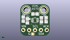

Contents
========

* [PROJ-ADAF-2900-STAN-01>Adafruit OLED FeatherWing PCB](#proj-adaf-2900-stan-01adafruit-oled-featherwing-pcb)
	* [Images](#images)
	* [Interactive BOM](#interactive-bom)
	* [Tags](#tags)
  
![][im]
# PROJ-ADAF-2900-STAN-01>Adafruit OLED FeatherWing PCB

- ID: PROJ-ADAF-2900-STAN-01
- Hex ID: PRA2900
- Name: Adafruit OLED FeatherWing PCB
- Description: 

## Images
  
  

|eagleImage|kicadPcb3dFront|kicadPcb3dBack|kicadPcb3d|
| :---: | :---: | :---: | :---: |
|||||

## Interactive BOM

- Interactive BOM page: [ibom.html](kicad/bom/ibom.html)

## Tags

- hexID: PRA2900
- oompType: PROJ
- oompSize: ADAF
- oompColor: 2900
- oompDesc: STAN
- oompIndex: 01
- oompName: Adafruit OLED FeatherWing PCB
- sources: All source files from https://github.com/adafruit/Adafruit-OLED-FeatherWing-PCB (source licence details in srcLicense.md)
- linkBuyPage: http://www.adafruit.com/products/2900
- oompPart: CAPC-0805-X-UNMATCHED-01, C1, 11.049, 7.112, 270
- oompPart: CAPC-0805-X-UNMATCHED-01, C2, 9.143999999999998, 7.112, 270
- oompPart: CAPC-0805-X-UF10-V25, C4, 9.143999999999998, 11.176, 90
- oompPart: CAPC-0805-X-UF10-V25, C5, 10.413999999999998, 17.653, 0
- oompPart: CAPC-0805-X-UF10-V25, C6, 10.413999999999998, 15.748, 0
- oompPart: SKIP-UNMATCHED-X-UNMATCHED-01, FID1, 8.636000000000001, 20.574, 0
- oompPart: SKIP-UNMATCHED-X-UNMATCHED-01, FID2, 46.608999999999995, 0.889, 0
- oompPart: UNMATCHED-UNMATCHED-X-UNMATCHED-01, IC5, 13.334999999999999, 19.431, 90
- oompPart: UNMATCHED-UNMATCHED-X-UNMATCHED-01, JP1, 25.4, 3.8099999999999996, 180
- oompPart: UNMATCHED-UNMATCHED-X-UNMATCHED-01, JP2, 30.479999999999997, 19.049999999999997, 0
- oompPart: ERROR, LCD1 OLED 128x32, 0, 0, 0
- oompPart: UNMATCHED-UNMATCHED-X-UNMATCHED-01, MS1, 0.0, 0.0, 0
- oompPart: RESE-0805-X-O104-01, R1, 10.287, 13.843, 180
- oompPart: RESE-UNMATCHED-X-O103-01, R2, 13.334999999999999, 21.843999999999998, 180
- oompPart: RESE-0805-X-UNMATCHED-01, R3, 11.049, 11.176, 90
- oompPart: RESE-0805-X-O222-01, R4, 48.894999999999996, 17.018, 180
- oompPart: RESE-0805-X-O222-01, R7, 45.466, 17.018, 0
- oompPart: UNMATCHED-UNMATCHED-X-UNMATCHED-01, SJ1, 11.43, 19.177, M180
- oompPart: UNMATCHED-UNMATCHED-X-UNMATCHED-01, SW1, 8.636000000000001, 20.574, 180
- oompPart: UNMATCHED-UNMATCHED-X-UNMATCHED-01, SW2, 4.3180000000000005, 15.875, 180
- oompPart: UNMATCHED-UNMATCHED-X-UNMATCHED-01, SW3, 4.3180000000000005, 6.985, 0
- oompPart: UNMATCHED-UNMATCHED-X-UNMATCHED-01, SW4, 4.3180000000000005, 11.43, 0
- rawPart: 

[im]: kicadPcb3d_450.png
