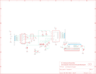

Contents
========

* [PRA292 > Adafruit I2C SPI LCD Backpack PCB](#pra292--adafruit-i2c-spi-lcd-backpack-pcb)
	* [Schematic](#schematic)
	* [PCB](#pcb)
	* [OOMP Parts](#oomp-parts)
	* [Images](#images)
	* [Tags](#tags)
  
![][im]
# PRA292 > Adafruit I2C SPI LCD Backpack PCB

- ID: PROJ-ADAF-292-STAN-01
- Hex ID: PRA292
- Name: Adafruit
- Description: Adafruit
- Long Link: [http://oom.lt/PROJ-ADAF-292-STAN-01](http://oom.lt/PROJ-ADAF-292-STAN-01)
- Short Link: [http://oom.lt/PRA292](http://oom.lt/PRA292)

## Schematic
  

## PCB
  

## OOMP Parts
  

|OOMP Parts|
| :---: |
|UNMATCHED-UNMATCHED-X-UNMATCHED-01 A0, A1, A2, CONTRAST, IC1, IC2, J1, SPI|
|CAPX-UNMATCHED-X-UF10-01 C1|
|[CAPC-0805-X-NF100-V50  SMD (0805) 100 nF Capacitor (Ceramic) 50v  C2](https://github.com/oomlout/oomlout_OOMP_parts/tree/main/CAPC-0805-X-NF100-V50/)|
|[HEAD-I01-X-PI16-01  2.54 mm 16 Pin Header  JP1](https://github.com/oomlout/oomlout_OOMP_parts/tree/main/HEAD-I01-X-PI16-01/)|
|UNMATCHED-SO23-X-UNMATCHED-01 Q1|
|[RESE-0805-X-O103-01  SMD (0805) 10k Ohm Resistor  R1, R2, R3, R6, R7](https://github.com/oomlout/oomlout_OOMP_parts/tree/main/RESE-0805-X-O103-01/)|
|[RESE-0805-X-O472-01  SMD (0805) 4.7k Ohm Resistor  R4, R5](https://github.com/oomlout/oomlout_OOMP_parts/tree/main/RESE-0805-X-O472-01/)|

## Images
  
  

|kicadPcb3d|kicadPcb3dFront|kicadPcb3dBack|eagleImage|eagleSchemImage|
| :---: | :---: | :---: | :---: | :---: |
||||||

## Tags

- hexID: PRA292
- oompType: PROJ
- oompSize: ADAF
- oompColor: 292
- oompDesc: STAN
- oompIndex: 01
- oompName: Adafruit I2C SPI LCD Backpack PCB
- sources: All source files from https://github.com/adafruit/Adafruit-I2C-SPI-LCD-Backpack-PCB (source licence details in srcLicense.md)
- linkBuyPage: http://www.adafruit.com/products/292
- oompID: PROJ-ADAF-292-STAN-01
- oompParts: A0,UNMATCHED-UNMATCHED-X-UNMATCHED-01
- oompParts: A1,UNMATCHED-UNMATCHED-X-UNMATCHED-01
- oompParts: A2,UNMATCHED-UNMATCHED-X-UNMATCHED-01
- oompParts: C1,CAPX-UNMATCHED-X-UF10-01
- oompParts: C2,CAPC-0805-X-NF100-V50
- oompParts: CONTRAST,UNMATCHED-UNMATCHED-X-UNMATCHED-01
- oompParts: IC1,UNMATCHED-UNMATCHED-X-UNMATCHED-01
- oompParts: IC2,UNMATCHED-UNMATCHED-X-UNMATCHED-01
- oompParts: J1,UNMATCHED-UNMATCHED-X-UNMATCHED-01
- oompParts: JP1,HEAD-I01-X-PI16-01
- oompParts: Q1,UNMATCHED-SO23-X-UNMATCHED-01
- oompParts: R1,RESE-0805-X-O103-01
- oompParts: R2,RESE-0805-X-O103-01
- oompParts: R3,RESE-0805-X-O103-01
- oompParts: R4,RESE-0805-X-O472-01
- oompParts: R5,RESE-0805-X-O472-01
- oompParts: R6,RESE-0805-X-O103-01
- oompParts: R7,RESE-0805-X-O103-01
- oompParts: SPI,UNMATCHED-UNMATCHED-X-UNMATCHED-01
- rawParts: A0,,SJ,SJ,SMD solder JUMPER,,
- rawParts: A1,,SJ,SJ,SMD solder JUMPER,,
- rawParts: A2,,SJ,SJ,SMD solder JUMPER,,
- rawParts: C1,10uF,CPOL-USA/3216-18R,A/3216-18R,POLARIZED CAPACITOR, American symbol,,
- rawParts: C2,0.1uF,C-USC0805K,C0805K,CAPACITOR, American symbol,,
- rawParts: CONTRAST,10K,TRIMPOTTC33X,TC33X,SMT trimmer potentiometer part number TC33X,,
- rawParts: IC1,MCP2300X/SO,MCP2300X/SO,SO18W,MCP23008,,
- rawParts: IC2,74LS595D,74LS595D,SO16,8-bit SHIFT REGISTER, output latch,,
- rawParts: J1,1X5,1X5,3.5MM-5P,,,
- rawParts: JP1,,PINHD-1X16,1X16,PIN HEADER,,
- rawParts: Q1,,MMBT2222ALT1-NPN-SOT23-BEC,SOT23-BEC,NPN Transistror,,
- rawParts: R1,10k,R-US_R0805,R0805,RESISTOR, American symbol,,
- rawParts: R2,10k,R-US_R0805,R0805,RESISTOR, American symbol,,
- rawParts: R3,10k,R-US_R0805,R0805,RESISTOR, American symbol,,
- rawParts: R4,4.7k,R-US_R0805,R0805,RESISTOR, American symbol,,
- rawParts: R5,4.7k,R-US_R0805,R0805,RESISTOR, American symbol,,
- rawParts: R6,10k,R-US_R0805,R0805,RESISTOR, American symbol,,
- rawParts: R7,10k,R-US_R0805,R0805,RESISTOR, American symbol,,
- rawParts: SPI,,SJ,SJ,SMD solder JUMPER,,
- rawParts: U$1,FIDUCIAL,FIDUCIAL,FIDUCIAL_1MM,For use by pick and place machines to calibrate the vision/machine, 1mm,,
- rawParts: U$2,FIDUCIAL,FIDUCIAL,FIDUCIAL_1MM,For use by pick and place machines to calibrate the vision/machine, 1mm,,

[im]: kicadPcb3d_450.png
