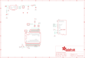

Contents
========

* [PRA2922 > Adafruit Adalogger FeatherWing PCB](#pra2922--adafruit-adalogger-featherwing-pcb)
	* [Schematic](#schematic)
	* [PCB](#pcb)
	* [Interactive BOM](#interactive-bom)
	* [OOMP Parts](#oomp-parts)
	* [Images](#images)
	* [Tags](#tags)
  
![][im]
# PRA2922 > Adafruit Adalogger FeatherWing PCB

- ID: PROJ-ADAF-2922-STAN-01
- Hex ID: PRA2922
- Name: Adafruit
- Description: Adafruit
- Long Link: [http://oom.lt/PROJ-ADAF-2922-STAN-01](http://oom.lt/PROJ-ADAF-2922-STAN-01)
- Short Link: [http://oom.lt/PRA2922](http://oom.lt/PRA2922)

## Schematic
  

## PCB
  

## Interactive BOM

- Interactive BOM page: [ibom.html](https://htmlpreview.github.io/?https://github.com/oomlout/oomlout_OOMP_projects/blob/main/PROJ-ADAF-2922-STAN-01/kicad/bom/ibom.html)

## OOMP Parts
  

|OOMP ID|Name|Identifier|
| :---: | :---: | :---: |
|UNMATCHED-UNMATCHED-X-UNMATCHED-01||B1, IC1, MS1, X4, Y1|
|[CAPC-0805-X-UF10-V10](https://github.com/oomlout/oomlout_OOMP_parts/tree/main/CAPC-0805-X-UF10-V10/)|[SMD (0805) 10 uF Capacitor (Ceramic) 10v](https://github.com/oomlout/oomlout_OOMP_parts/tree/main/CAPC-0805-X-UF10-V10/)|[C1, C2](https://github.com/oomlout/oomlout_OOMP_parts/tree/main/CAPC-0805-X-UF10-V10/)|
|HEAD-I01-X-PI01-01||INT1, JP3, SDCS|
|HEAD-I01-X-PI11-01||JP1|
|[HEAD-I01-X-PI16-01](https://github.com/oomlout/oomlout_OOMP_parts/tree/main/HEAD-I01-X-PI16-01/)|[2.54 mm 16 Pin Header](https://github.com/oomlout/oomlout_OOMP_parts/tree/main/HEAD-I01-X-PI16-01/)|[JP2](https://github.com/oomlout/oomlout_OOMP_parts/tree/main/HEAD-I01-X-PI16-01/)|
|[RESE-0603-X-O103-01](https://github.com/oomlout/oomlout_OOMP_parts/tree/main/RESE-0603-X-O103-01/)|[SMD (0603) 10k Ohm Resistor](https://github.com/oomlout/oomlout_OOMP_parts/tree/main/RESE-0603-X-O103-01/)|[R1, R2](https://github.com/oomlout/oomlout_OOMP_parts/tree/main/RESE-0603-X-O103-01/)|
|RESE-0603-X-O1003-01||R3|
|[RESE-0603-X-O102-01](https://github.com/oomlout/oomlout_OOMP_parts/tree/main/RESE-0603-X-O102-01/)|[SMD (0603) 1k Ohm Resistor](https://github.com/oomlout/oomlout_OOMP_parts/tree/main/RESE-0603-X-O102-01/)|[R4](https://github.com/oomlout/oomlout_OOMP_parts/tree/main/RESE-0603-X-O102-01/)|
|[BUTA-4628-X-STAN-01](https://github.com/oomlout/oomlout_OOMP_parts/tree/main/BUTA-4628-X-STAN-01/)|[SMD (4628) Pushbutton (Tactile)](https://github.com/oomlout/oomlout_OOMP_parts/tree/main/BUTA-4628-X-STAN-01/)|[SW1](https://github.com/oomlout/oomlout_OOMP_parts/tree/main/BUTA-4628-X-STAN-01/)|

## Images
  
  

|bominteractivefront|bominteractiveback|kicadPcb3d|kicadPcb3dFront|kicadPcb3dBack|eagleImage|eagleSchemImage|pcbdraw|pcbdrawback|
| :---: | :---: | :---: | :---: | :---: | :---: | :---: | :---: | :---: |
||||||||||

## Tags

- hexID: PRA2922
- oompType: PROJ
- oompSize: ADAF
- oompColor: 2922
- oompDesc: STAN
- oompIndex: 01
- oompName: Adafruit Adalogger FeatherWing PCB
- sources: All source files from https://github.com/adafruit/Adafruit-Adalogger-FeatherWing-PCB (source licence details in srcLicense.md)
- linkBuyPage: http://www.adafruit.com/products/2922
- oompID: PROJ-ADAF-2922-STAN-01
- oompParts: B1,UNMATCHED-UNMATCHED-X-UNMATCHED-01
- oompParts: C1,CAPC-0805-X-UF10-V10
- oompParts: C2,CAPC-0805-X-UF10-V10
- oompParts: IC1,UNMATCHED-UNMATCHED-X-UNMATCHED-01
- oompParts: INT1,HEAD-I01-X-PI01-01
- oompParts: JP1,HEAD-I01-X-PI11-01
- oompParts: JP2,HEAD-I01-X-PI16-01
- oompParts: JP3,HEAD-I01-X-PI01-01
- oompParts: MS1,UNMATCHED-UNMATCHED-X-UNMATCHED-01
- oompParts: R1,RESE-0603-X-O103-01
- oompParts: R2,RESE-0603-X-O103-01
- oompParts: R3,RESE-0603-X-O1003-01
- oompParts: R4,RESE-0603-X-O102-01
- oompParts: SDCS,HEAD-I01-X-PI01-01
- oompParts: SW1,BUTA-4628-X-STAN-01
- oompParts: X4,UNMATCHED-UNMATCHED-X-UNMATCHED-01
- oompParts: Y1,UNMATCHED-UNMATCHED-X-UNMATCHED-01
- rawParts: B1,cr1220,BATTERYCR1220_2,CR1220-2,CR1220 SMT - Digikey: 3001K-ND,,
- rawParts: C1,10uF,CAP_CERAMIC0805-NOOUTLINE,0805-NO,Ceramic Capacitors,,
- rawParts: C2,10uF,CAP_CERAMIC0805-NOOUTLINE,0805-NO,Ceramic Capacitors,,
- rawParts: FID1,FIDUCIAL_1MM,FIDUCIAL_1MM,FIDUCIAL_1MM,Fiducial Alignment Points,EXCLUDE,
- rawParts: FID2,FIDUCIAL_1MM,FIDUCIAL_1MM,FIDUCIAL_1MM,Fiducial Alignment Points,EXCLUDE,
- rawParts: IC1,PCF8523T,RTC_PCF8523T,SOIC8_150MIL,,,
- rawParts: INT1,,HEADER-1X1ROUND,1X01_ROUND,PIN HEADER,,
- rawParts: JP1,,HEADER-1X11,1X11_ROUND,,,
- rawParts: JP2,,HEADER-1X16ROUND,1X16_ROUND,PIN HEADER,,
- rawParts: JP3,,HEADER-1X1ROUND,1X01_ROUND,PIN HEADER,,
- rawParts: MS1,FEATHERWING_NODIM,FEATHERWING_NODIM,FEATHERWING_NODIM,,,
- rawParts: R1,10K,RESISTOR_0603_NOOUT,0603-NO,Resistors,,
- rawParts: R2,10K,RESISTOR_0603_NOOUT,0603-NO,Resistors,,
- rawParts: R3,100K,RESISTOR_0603_NOOUT,0603-NO,Resistors,,
- rawParts: R4,1K,RESISTOR_0603_NOOUT,0603-NO,Resistors,,
- rawParts: SDCS,,HEADER-1X1ROUND,1X01_ROUND,PIN HEADER,,
- rawParts: SJ1,,SOLDERJUMPER_CLOSED,SOLDERJUMPER_CLOSEDWIRE,Solder Jumper - Closed,,
- rawParts: SW1,KMR2,SWITCH_TACT_SMT4.6X2.8,BTN_KMR2_4.6X2.8,SMT Tact Switches,,
- rawParts: X4,microsd,MICROSD,MICROSD,MicroSD/Transflash Card Holder with SPI pinout,,
- rawParts: Y1,32khz,CRYSTAL8.0X3.8,CRYSTAL_8X3.8,Crystals,,

[im]: kicadPcb3d_450.png
