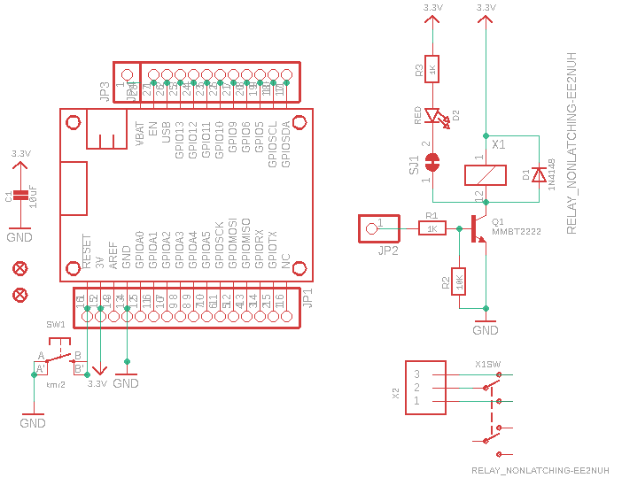
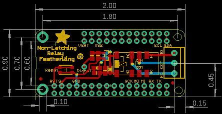
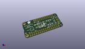
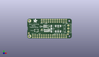
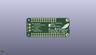
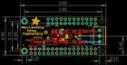
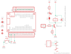

Contents
========

* [PRA2923 > Adafruit Relay FeatherWing PCBs](#pra2923--adafruit-relay-featherwing-pcbs)
	* [Schematic](#schematic)
	* [PCB](#pcb)
	* [Interactive BOM](#interactive-bom)
	* [OOMP Parts](#oomp-parts)
	* [Images](#images)
	* [Tags](#tags)
  
![][im]
# PRA2923 > Adafruit Relay FeatherWing PCBs

- ID: PROJ-ADAF-2923-STAN-01
- Hex ID: PRA2923
- Name: Adafruit
- Description: Adafruit
- Long Link: [http://oom.lt/PROJ-ADAF-2923-STAN-01](http://oom.lt/PROJ-ADAF-2923-STAN-01)
- Short Link: [http://oom.lt/PRA2923](http://oom.lt/PRA2923)

## Schematic
  

## PCB
  

## Interactive BOM

- Interactive BOM page: [ibom.html](https://htmlpreview.github.io/?https://github.com/oomlout/oomlout_OOMP_projects/blob/main/PROJ-ADAF-2923-STAN-01/kicad/bom/ibom.html)

## OOMP Parts
  

|OOMP Parts|
| :---: |
|[CAPC-0805-X-UF10-V10  SMD (0805) 10 uF Capacitor (Ceramic) 10v  C1](https://github.com/oomlout/oomlout_OOMP_parts/tree/main/CAPC-0805-X-UF10-V10/)|
|[DIOD-S323-X-K4148-01  SMD (SOD-323) Diode  D1](https://github.com/oomlout/oomlout_OOMP_parts/tree/main/DIOD-S323-X-K4148-01/)|
|[LEDS-0805-R-STAN-01  SMD (0805) Red LED  D2](https://github.com/oomlout/oomlout_OOMP_parts/tree/main/LEDS-0805-R-STAN-01/)|
|[HEAD-I01-X-PI16-01  2.54 mm 16 Pin Header  JP1](https://github.com/oomlout/oomlout_OOMP_parts/tree/main/HEAD-I01-X-PI16-01/)|
|HEAD-I01-X-PI01-01 JP2, JP3|
|HEAD-I01-X-PI11-01 JP4|
|UNMATCHED-UNMATCHED-X-UNMATCHED-01 MS1, X1|
|UNMATCHED-SO23-X-UNMATCHED-01 Q1|
|[RESE-0805-X-O102-01  SMD (0805) 1k Ohm Resistor  R1, R3](https://github.com/oomlout/oomlout_OOMP_parts/tree/main/RESE-0805-X-O102-01/)|
|[RESE-0805-X-O103-01  SMD (0805) 10k Ohm Resistor  R2](https://github.com/oomlout/oomlout_OOMP_parts/tree/main/RESE-0805-X-O103-01/)|
|[BUTA-4628-X-STAN-01  SMD (4628) Pushbutton (Tactile)  SW1](https://github.com/oomlout/oomlout_OOMP_parts/tree/main/BUTA-4628-X-STAN-01/)|
|[TERS-35D-L-PI03-01  3.5 mm 3 Pin Blue Screw Terminal  X2](https://github.com/oomlout/oomlout_OOMP_parts/tree/main/TERS-35D-L-PI03-01/)|

## Images
  
  

|kicadPcb3d|kicadPcb3dFront|kicadPcb3dBack|eagleImage|eagleSchemImage|
| :---: | :---: | :---: | :---: | :---: |
||||||

## Tags

- hexID: PRA2923
- oompType: PROJ
- oompSize: ADAF
- oompColor: 2923
- oompDesc: STAN
- oompIndex: 01
- oompName: Adafruit Relay FeatherWing PCBs
- sources: All source files from https://github.com/adafruit/Adafruit-Relay-FeatherWing-PCBs (source licence details in srcLicense.md)
- linkBuyPage: http://www.adafruit.com/products/2923
- oompID: PROJ-ADAF-2923-STAN-01
- oompParts: C1,CAPC-0805-X-UF10-V10
- oompParts: D1,DIOD-S323-X-K4148-01
- oompParts: D2,LEDS-0805-R-STAN-01
- oompParts: JP1,HEAD-I01-X-PI16-01
- oompParts: JP2,HEAD-I01-X-PI01-01
- oompParts: JP3,HEAD-I01-X-PI01-01
- oompParts: JP4,HEAD-I01-X-PI11-01
- oompParts: MS1,UNMATCHED-UNMATCHED-X-UNMATCHED-01
- oompParts: Q1,UNMATCHED-SO23-X-UNMATCHED-01
- oompParts: R1,RESE-0805-X-O102-01
- oompParts: R2,RESE-0805-X-O103-01
- oompParts: R3,RESE-0805-X-O102-01
- oompParts: SW1,BUTA-4628-X-STAN-01
- oompParts: X1,UNMATCHED-UNMATCHED-X-UNMATCHED-01
- oompParts: X2,TERS-35D-L-PI03-01
- rawParts: C1,10uF,CAP_CERAMIC0805-NOOUTLINE,0805-NO,Ceramic Capacitors,,
- rawParts: D1,1N4148,DIODESOD-323,SOD-323,Diode,,
- rawParts: D2,RED,LED0805_NOOUTLINE,CHIPLED_0805_NOOUTLINE,LED,,
- rawParts: FID2,FIDUCIAL,FIDUCIAL,FIDUCIAL_1MM,Fiducial Alignment Points,EXCLUDE,
- rawParts: FID3,FIDUCIAL,FIDUCIAL,FIDUCIAL_1MM,Fiducial Alignment Points,EXCLUDE,
- rawParts: JP1,,HEADER-1X16ROUND,1X16_ROUND,PIN HEADER,,
- rawParts: JP2,,HEADER-1X1ROUND,1X01_ROUND,PIN HEADER,,
- rawParts: JP3,,HEADER-1X1ROUND,1X01_ROUND,PIN HEADER,,
- rawParts: JP4,,HEADER-1X11,1X11_ROUND,,,
- rawParts: MS1,MICROSHIELD,MICROSHIELD,MICROSHIELD,,,
- rawParts: Q1,MMBT2222,TRANSISTOR_NPN,SOT23-R,NPN Transistor,,
- rawParts: R1,1K,RESISTOR0805_NOOUTLINE,0805-NO,Resistors,,
- rawParts: R2,10K,RESISTOR0805_NOOUTLINE,0805-NO,Resistors,,
- rawParts: R3,1K,RESISTOR0805_NOOUTLINE,0805-NO,Resistors,,
- rawParts: SJ1,,SOLDERJUMPER_CLOSED,SOLDERJUMPER_CLOSEDWIRE,Solder Jumper - Closed,,
- rawParts: SW1,kmr2,SWITCH_TACT_SMT4.6X2.8,BTN_KMR2_4.6X2.8,SMT Tact Switches,,
- rawParts: X1,RELAY_NONLATCHING-EE2NUH,RELAY_NONLATCHING-EE2NUH,RELAY_EE2_NOLATCH,,,
- rawParts: X2,,TERMBLOCK_1X3,TERMBLOCK_1X3-3.5MM,3.5mm Terminal block,,

[im]: kicadPcb3d_450.png
