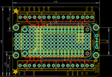
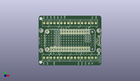
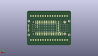
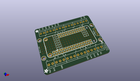

Contents
========

* [PROJ-ADAF-2926-STAN-01>Adafruit Terminal Block FeatherWing PCB](#proj-adaf-2926-stan-01adafruit-terminal-block-featherwing-pcb)
	* [Images](#images)
	* [Interactive BOM](#interactive-bom)
	* [OOMP Parts](#oomp-parts)
	* [Tags](#tags)
  
![][im]
# PROJ-ADAF-2926-STAN-01>Adafruit Terminal Block FeatherWing PCB

- ID: PROJ-ADAF-2926-STAN-01
- Hex ID: PRA2926
- Name: Adafruit Terminal Block FeatherWing PCB
- Description: 

## Images
  
  

|eagleImage|kicadPcb3dFront|kicadPcb3dBack|kicadPcb3d|
| :---: | :---: | :---: | :---: |
|||||

## Interactive BOM

- Interactive BOM page: [ibom.html](kicad/bom/ibom.html)

## OOMP Parts
  

|OOMP Parts|
| :---: |
|<table><tr><td></td><td> JP1</td><td>[HEAD-I01-X-PI12-01 2.54 mm 12 Pin Header](https://github.com/oomlout/oomlout_OOMP_parts/tree/main/HEAD-I01-X-PI12-01/)</td><td>[H12](https://github.com/oomlout/oomlout_OOMP_parts/tree/main/HEAD-I01-X-PI12-01/)</td></tr></table>|
|<table><tr><td></td><td> JP3</td><td>[HEAD-I01-X-PI16-01 2.54 mm 16 Pin Header](https://github.com/oomlout/oomlout_OOMP_parts/tree/main/HEAD-I01-X-PI16-01/)</td><td>[H16](https://github.com/oomlout/oomlout_OOMP_parts/tree/main/HEAD-I01-X-PI16-01/)</td></tr></table>|
|UNMATCHED-UNMATCHED-X-UNMATCHED-01, MS1, -25.4, -11.43, 0,MS1, FEATHERWING_NODIM, FEATHERWING_DIM, microbuilder, (-1, -0.45), R0|
|UNMATCHED-UNMATCHED-X-UNMATCHED-01, S2, 29.717999999999996, 0.0, 90,S2, OS102011MA1Q, OS102011MA1Q, adafruit, (1.17, 0), R90|
|UNMATCHED-UNMATCHED-X-UNMATCHED-01, X1, -24.665999944, -17.695999913999998, 0,X1, TERMBLOCK_1X2-3.5MM, microbuilder, (-0.97110236, -0.69669291), R0|
|UNMATCHED-UNMATCHED-X-UNMATCHED-01, X2, 24.3340001, -17.695999913999998, 0,X2, TERMBLOCK_1X2-3.5MM, microbuilder, (0.9580315, -0.69669291), R0|
|UNMATCHED-UNMATCHED-X-UNMATCHED-01, X3, -24.439999888, 17.83999988, 180,X3, TERMBLOCK_1X2-3.5MM, microbuilder, (-0.96220472, 0.7023622), R180|
|UNMATCHED-UNMATCHED-X-UNMATCHED-01, X4, 24.559999901999998, 17.83999988, 180,X4, TERMBLOCK_1X2-3.5MM, microbuilder, (0.96692913, 0.7023622), R180|
|UNMATCHED-UNMATCHED-X-UNMATCHED-01, X5, -15.915999917999999, -17.695999913999998, 0,X5, TERMBLOCK_1X3-3.5MM, microbuilder, (-0.62661417, -0.69669291), R0|
|UNMATCHED-UNMATCHED-X-UNMATCHED-01, X6, -5.41600009, -17.695999913999998, 0,X6, TERMBLOCK_1X3-3.5MM, microbuilder, (-0.21322835, -0.69669291), R0|
|UNMATCHED-UNMATCHED-X-UNMATCHED-01, X7, 5.083999992, -17.695999913999998, 0,X7, TERMBLOCK_1X3-3.5MM, microbuilder, (0.20015748, -0.69669291), R0|
|UNMATCHED-UNMATCHED-X-UNMATCHED-01, X8, 15.584000073999999, -17.695999913999998, 0,X8, TERMBLOCK_1X3-3.5MM, microbuilder, (0.61354331, -0.69669291), R0|
|UNMATCHED-UNMATCHED-X-UNMATCHED-01, X9, -15.690000115999998, 17.83999988, 180,X9, TERMBLOCK_1X3-3.5MM, microbuilder, (-0.61771654, 0.7023622), R180|
|UNMATCHED-UNMATCHED-X-UNMATCHED-01, X10, -5.190000034, 17.83999988, 180,X10, TERMBLOCK_1X3-3.5MM, microbuilder, (-0.20433071, 0.7023622), R180|
|UNMATCHED-UNMATCHED-X-UNMATCHED-01, X11, 5.310000048, 17.83999988, 180,X11, TERMBLOCK_1X3-3.5MM, microbuilder, (0.20905512, 0.7023622), R180|
|UNMATCHED-UNMATCHED-X-UNMATCHED-01, X12, 15.809999876000001, 17.83999988, 180,X12, TERMBLOCK_1X3-3.5MM, microbuilder, (0.62244094, 0.7023622), R180|

## Tags

- hexID: PRA2926
- oompType: PROJ
- oompSize: ADAF
- oompColor: 2926
- oompDesc: STAN
- oompIndex: 01
- oompName: Adafruit Terminal Block FeatherWing PCB
- sources: All source files from https://github.com/adafruit/Adafruit-Terminal-Block-FeatherWing-PCB (source licence details in srcLicense.md)
- linkBuyPage: http://www.adafruit.com/products/2926
- oompPart: HEAD-I01-X-PI12-01, JP1, 5.08, 7.619999999999999, 0
- oompPart: HEAD-I01-X-PI16-01, JP3, 0.0, -7.619999999999999, 180
- oompPart: UNMATCHED-UNMATCHED-X-UNMATCHED-01, MS1, -25.4, -11.43, 0
- oompPart: UNMATCHED-UNMATCHED-X-UNMATCHED-01, S2, 29.717999999999996, 0.0, 90
- oompPart: SKIP-UNMATCHED-X-UNMATCHED-01, U$2, -29.209999999999997, 10.16, 0
- oompPart: SKIP-UNMATCHED-X-UNMATCHED-01, U$3, -29.209999999999997, -10.16, 0
- oompPart: SKIP-UNMATCHED-X-UNMATCHED-01, U$4, 29.209999999999997, -10.16, 0
- oompPart: SKIP-UNMATCHED-X-UNMATCHED-01, U$5, 29.209999999999997, 10.16, 0
- oompPart: UNMATCHED-UNMATCHED-X-UNMATCHED-01, X1, -24.665999944, -17.695999913999998, 0
- oompPart: UNMATCHED-UNMATCHED-X-UNMATCHED-01, X2, 24.3340001, -17.695999913999998, 0
- oompPart: UNMATCHED-UNMATCHED-X-UNMATCHED-01, X3, -24.439999888, 17.83999988, 180
- oompPart: UNMATCHED-UNMATCHED-X-UNMATCHED-01, X4, 24.559999901999998, 17.83999988, 180
- oompPart: UNMATCHED-UNMATCHED-X-UNMATCHED-01, X5, -15.915999917999999, -17.695999913999998, 0
- oompPart: UNMATCHED-UNMATCHED-X-UNMATCHED-01, X6, -5.41600009, -17.695999913999998, 0
- oompPart: UNMATCHED-UNMATCHED-X-UNMATCHED-01, X7, 5.083999992, -17.695999913999998, 0
- oompPart: UNMATCHED-UNMATCHED-X-UNMATCHED-01, X8, 15.584000073999999, -17.695999913999998, 0
- oompPart: UNMATCHED-UNMATCHED-X-UNMATCHED-01, X9, -15.690000115999998, 17.83999988, 180
- oompPart: UNMATCHED-UNMATCHED-X-UNMATCHED-01, X10, -5.190000034, 17.83999988, 180
- oompPart: UNMATCHED-UNMATCHED-X-UNMATCHED-01, X11, 5.310000048, 17.83999988, 180
- oompPart: UNMATCHED-UNMATCHED-X-UNMATCHED-01, X12, 15.809999876000001, 17.83999988, 180
- rawPart: JP1, 1X12_ROUND_76MIL, microbuilder, (0.2, 0.3), R0
- rawPart: JP3, 1X16_ROUND_76MIL, microbuilder, (0, -0.3), R180
- rawPart: MS1, FEATHERWING_NODIM, FEATHERWING_DIM, microbuilder, (-1, -0.45), R0
- rawPart: S2, OS102011MA1Q, OS102011MA1Q, adafruit, (1.17, 0), R90
- rawPart: U$2, MOUNTINGHOLE3.0THIN, MOUNTINGHOLE_3.0_PLATEDTHIN, microbuilder, (-1.15, 0.4), R0
- rawPart: U$3, MOUNTINGHOLE3.0THIN, MOUNTINGHOLE_3.0_PLATEDTHIN, microbuilder, (-1.15, -0.4), R0
- rawPart: U$4, MOUNTINGHOLE3.0THIN, MOUNTINGHOLE_3.0_PLATEDTHIN, microbuilder, (1.15, -0.4), R0
- rawPart: U$5, MOUNTINGHOLE3.0THIN, MOUNTINGHOLE_3.0_PLATEDTHIN, microbuilder, (1.15, 0.4), R0
- rawPart: X1, TERMBLOCK_1X2-3.5MM, microbuilder, (-0.97110236, -0.69669291), R0
- rawPart: X2, TERMBLOCK_1X2-3.5MM, microbuilder, (0.9580315, -0.69669291), R0
- rawPart: X3, TERMBLOCK_1X2-3.5MM, microbuilder, (-0.96220472, 0.7023622), R180
- rawPart: X4, TERMBLOCK_1X2-3.5MM, microbuilder, (0.96692913, 0.7023622), R180
- rawPart: X5, TERMBLOCK_1X3-3.5MM, microbuilder, (-0.62661417, -0.69669291), R0
- rawPart: X6, TERMBLOCK_1X3-3.5MM, microbuilder, (-0.21322835, -0.69669291), R0
- rawPart: X7, TERMBLOCK_1X3-3.5MM, microbuilder, (0.20015748, -0.69669291), R0
- rawPart: X8, TERMBLOCK_1X3-3.5MM, microbuilder, (0.61354331, -0.69669291), R0
- rawPart: X9, TERMBLOCK_1X3-3.5MM, microbuilder, (-0.61771654, 0.7023622), R180
- rawPart: X10, TERMBLOCK_1X3-3.5MM, microbuilder, (-0.20433071, 0.7023622), R180
- rawPart: X11, TERMBLOCK_1X3-3.5MM, microbuilder, (0.20905512, 0.7023622), R180
- rawPart: X12, TERMBLOCK_1X3-3.5MM, microbuilder, (0.62244094, 0.7023622), R180
- oompID: PROJ-ADAF-2926-STAN-01

[im]: kicadPcb3d_450.png
