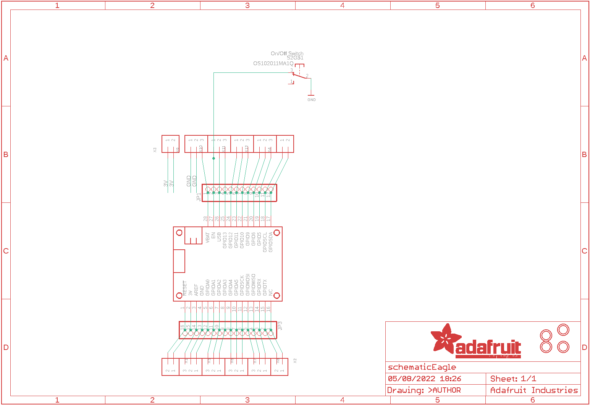
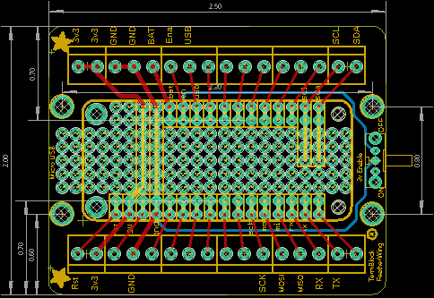
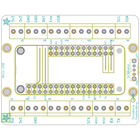
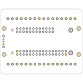
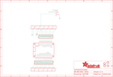
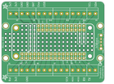
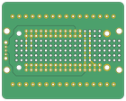

Contents
========

* [PRA2926 > Adafruit Terminal Block FeatherWing PCB](#pra2926--adafruit-terminal-block-featherwing-pcb)
	* [Schematic](#schematic)
	* [PCB](#pcb)
	* [Interactive BOM](#interactive-bom)
	* [OOMP Parts](#oomp-parts)
	* [Images](#images)
	* [Tags](#tags)
  
![][im]
# PRA2926 > Adafruit Terminal Block FeatherWing PCB

- ID: PROJ-ADAF-2926-STAN-01
- Hex ID: PRA2926
- Name: Adafruit
- Description: Adafruit
- Long Link: [http://oom.lt/PROJ-ADAF-2926-STAN-01](http://oom.lt/PROJ-ADAF-2926-STAN-01)
- Short Link: [http://oom.lt/PRA2926](http://oom.lt/PRA2926)

## Schematic
  

## PCB
  

## Interactive BOM

- Interactive BOM page: [ibom.html](https://htmlpreview.github.io/?https://github.com/oomlout/oomlout_OOMP_projects/blob/main/PROJ-ADAF-2926-STAN-01/kicad/bom/ibom.html)

## OOMP Parts
  

|OOMP Parts|
| :---: |
|[HEAD-I01-X-PI12-01  2.54 mm 12 Pin Header  JP1](https://github.com/oomlout/oomlout_OOMP_parts/tree/main/HEAD-I01-X-PI12-01/)|
|[HEAD-I01-X-PI16-01  2.54 mm 16 Pin Header  JP3](https://github.com/oomlout/oomlout_OOMP_parts/tree/main/HEAD-I01-X-PI16-01/)|
|UNMATCHED-UNMATCHED-X-UNMATCHED-01 MS1, S2|
|[TERS-35D-L-PI02-01  3.5 mm 2 Pin Blue Screw Terminal  X1, X2, X3, X4](https://github.com/oomlout/oomlout_OOMP_parts/tree/main/TERS-35D-L-PI02-01/)|
|[TERS-35D-L-PI03-01  3.5 mm 3 Pin Blue Screw Terminal  X5, X6, X7, X8, X9, X10, X11, X12](https://github.com/oomlout/oomlout_OOMP_parts/tree/main/TERS-35D-L-PI03-01/)|

## Images
  
  

|bominteractivefront|bominteractiveback|kicadPcb3d|kicadPcb3dFront|kicadPcb3dBack|eagleImage|eagleSchemImage|pcbdraw|pcbdrawback|
| :---: | :---: | :---: | :---: | :---: | :---: | :---: | :---: | :---: |
||||||||||

## Tags

- hexID: PRA2926
- oompType: PROJ
- oompSize: ADAF
- oompColor: 2926
- oompDesc: STAN
- oompIndex: 01
- oompName: Adafruit Terminal Block FeatherWing PCB
- sources: All source files from https://github.com/adafruit/Adafruit-Terminal-Block-FeatherWing-PCB (source licence details in srcLicense.md)
- linkBuyPage: http://www.adafruit.com/products/2926
- oompID: PROJ-ADAF-2926-STAN-01
- oompParts: JP1,HEAD-I01-X-PI12-01
- oompParts: JP3,HEAD-I01-X-PI16-01
- oompParts: MS1,UNMATCHED-UNMATCHED-X-UNMATCHED-01
- oompParts: S2,UNMATCHED-UNMATCHED-X-UNMATCHED-01
- oompParts: X1,TERS-35D-L-PI02-01
- oompParts: X2,TERS-35D-L-PI02-01
- oompParts: X3,TERS-35D-L-PI02-01
- oompParts: X4,TERS-35D-L-PI02-01
- oompParts: X5,TERS-35D-L-PI03-01
- oompParts: X6,TERS-35D-L-PI03-01
- oompParts: X7,TERS-35D-L-PI03-01
- oompParts: X8,TERS-35D-L-PI03-01
- oompParts: X9,TERS-35D-L-PI03-01
- oompParts: X10,TERS-35D-L-PI03-01
- oompParts: X11,TERS-35D-L-PI03-01
- oompParts: X12,TERS-35D-L-PI03-01
- rawParts: JP1,,HEADER-1X1276MIL,1X12_ROUND_76MIL,,,
- rawParts: JP3,,HEADER-1X16_76MIL,1X16_ROUND_76MIL,PIN HEADER,,
- rawParts: MS1,FEATHERWING_NODIM,FEATHERWING_NODIM,FEATHERWING_DIM,,,
- rawParts: S2,OS102011MA1Q,OS102011MA1Q,OS102011MA1Q,OS10201MA1Q through-hole right angle switch,,
- rawParts: U$2,MOUNTINGHOLE3.0THIN,MOUNTINGHOLE3.0THIN,MOUNTINGHOLE_3.0_PLATEDTHIN,Mounting Hole,EXCLUDE,
- rawParts: U$3,MOUNTINGHOLE3.0THIN,MOUNTINGHOLE3.0THIN,MOUNTINGHOLE_3.0_PLATEDTHIN,Mounting Hole,EXCLUDE,
- rawParts: U$4,MOUNTINGHOLE3.0THIN,MOUNTINGHOLE3.0THIN,MOUNTINGHOLE_3.0_PLATEDTHIN,Mounting Hole,EXCLUDE,
- rawParts: U$5,MOUNTINGHOLE3.0THIN,MOUNTINGHOLE3.0THIN,MOUNTINGHOLE_3.0_PLATEDTHIN,Mounting Hole,EXCLUDE,
- rawParts: X1,,TERMBLOCK_1X2,TERMBLOCK_1X2-3.5MM,3.5mm Terminal block,,
- rawParts: X2,,TERMBLOCK_1X2,TERMBLOCK_1X2-3.5MM,3.5mm Terminal block,,
- rawParts: X3,,TERMBLOCK_1X2,TERMBLOCK_1X2-3.5MM,3.5mm Terminal block,,
- rawParts: X4,,TERMBLOCK_1X2,TERMBLOCK_1X2-3.5MM,3.5mm Terminal block,,
- rawParts: X5,,TERMBLOCK_1X3,TERMBLOCK_1X3-3.5MM,3.5mm Terminal block,,
- rawParts: X6,,TERMBLOCK_1X3,TERMBLOCK_1X3-3.5MM,3.5mm Terminal block,,
- rawParts: X7,,TERMBLOCK_1X3,TERMBLOCK_1X3-3.5MM,3.5mm Terminal block,,
- rawParts: X8,,TERMBLOCK_1X3,TERMBLOCK_1X3-3.5MM,3.5mm Terminal block,,
- rawParts: X9,,TERMBLOCK_1X3,TERMBLOCK_1X3-3.5MM,3.5mm Terminal block,,
- rawParts: X10,,TERMBLOCK_1X3,TERMBLOCK_1X3-3.5MM,3.5mm Terminal block,,
- rawParts: X11,,TERMBLOCK_1X3,TERMBLOCK_1X3-3.5MM,3.5mm Terminal block,,
- rawParts: X12,,TERMBLOCK_1X3,TERMBLOCK_1X3-3.5MM,3.5mm Terminal block,,

[im]: kicadPcb3d_450.png
