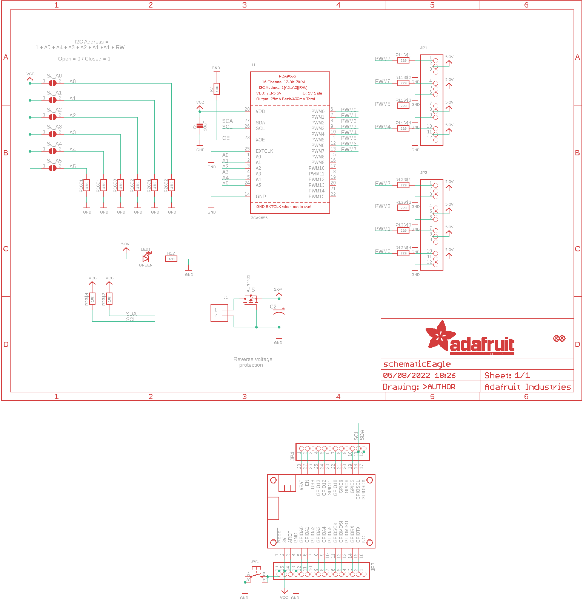
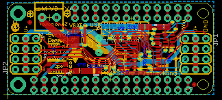
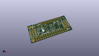
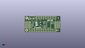
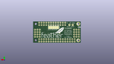
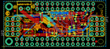
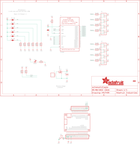

Contents
========

* [PRA2928 > Adafruit PWM Servo FeatherWing PCB](#pra2928--adafruit-pwm-servo-featherwing-pcb)
	* [Schematic](#schematic)
	* [PCB](#pcb)
	* [Interactive BOM](#interactive-bom)
	* [OOMP Parts](#oomp-parts)
	* [Images](#images)
	* [Tags](#tags)
  
![][im]
# PRA2928 > Adafruit PWM Servo FeatherWing PCB

- ID: PROJ-ADAF-2928-STAN-01
- Hex ID: PRA2928
- Name: Adafruit
- Description: Adafruit
- Long Link: [http://oom.lt/PROJ-ADAF-2928-STAN-01](http://oom.lt/PROJ-ADAF-2928-STAN-01)
- Short Link: [http://oom.lt/PRA2928](http://oom.lt/PRA2928)

## Schematic
  

## PCB
  

## Interactive BOM

- Interactive BOM page: [ibom.html](https://htmlpreview.github.io/?https://github.com/oomlout/oomlout_OOMP_projects/blob/main/PROJ-ADAF-2928-STAN-01/kicad/bom/ibom.html)

## OOMP Parts
  

|OOMP Parts|
| :---: |
|[C1 CAPC-0805-X-UF10-V10 SMD (0805) 10 uF Capacitor (Ceramic) 10v](https://github.com/oomlout/oomlout_OOMP_parts/tree/main/CAPC-0805-X-UF10-V10/)|
|C2 C2,CAPX-UNMATCHED-X-NF100-01|
|J1 J1,UNMATCHED-UNMATCHED-X-UNMATCHED-01|
|JP1 JP1,HEAD-I01-X-UNMATCHED-01|
|JP2 JP2,HEAD-I01-X-UNMATCHED-01|
|[JP3 HEAD-I01-X-PI16-01 2.54 mm 16 Pin Header](https://github.com/oomlout/oomlout_OOMP_parts/tree/main/HEAD-I01-X-PI16-01/)|
|[JP4 HEAD-I01-X-PI12-01 2.54 mm 12 Pin Header](https://github.com/oomlout/oomlout_OOMP_parts/tree/main/HEAD-I01-X-PI12-01/)|
|[LED1 LEDS-0805-G-STAN-01 SMD (0805) Green LED](https://github.com/oomlout/oomlout_OOMP_parts/tree/main/LEDS-0805-G-STAN-01/)|
|MS1 MS1,UNMATCHED-UNMATCHED-X-UNMATCHED-01|
|Q1 Q1,MOSP-UNMATCHED-X-UNMATCHED-01|
|R1 R1,RESA-06038-X-O103X4-01|
|R2 R2,RESA-06038-X-O103X4-01|
|[R7 RESE-0805-X-O103-01 SMD (0805) 10k Ohm Resistor](https://github.com/oomlout/oomlout_OOMP_parts/tree/main/RESE-0805-X-O103-01/)|
|R10 R10,RESE-0805-X-O471-01|
|R11 R11,RESA-06038-X-O221X4-01|
|R13 R13,RESA-06038-X-O221X4-01|
|SW1 SW1,UNMATCHED-UNMATCHED-X-UNMATCHED-01|
|U1 U1,UNMATCHED-UNMATCHED-X-UNMATCHED-01|

## Images
  
  

|kicadPcb3d|kicadPcb3dFront|kicadPcb3dBack|eagleImage|eagleSchemImage|
| :---: | :---: | :---: | :---: | :---: |
||||||

## Tags

- hexID: PRA2928
- oompType: PROJ
- oompSize: ADAF
- oompColor: 2928
- oompDesc: STAN
- oompIndex: 01
- oompName: Adafruit PWM Servo FeatherWing PCB
- sources: All source files from https://github.com/adafruit/Adafruit-PWM-Servo-FeatherWing-PCB (source licence details in srcLicense.md)
- linkBuyPage: http://www.adafruit.com/products/2928
- oompID: PROJ-ADAF-2928-STAN-01
- oompParts: C1,CAPC-0805-X-UF10-V10
- oompParts: C2,CAPX-UNMATCHED-X-NF100-01
- oompParts: J1,UNMATCHED-UNMATCHED-X-UNMATCHED-01
- oompParts: JP1,HEAD-I01-X-UNMATCHED-01
- oompParts: JP2,HEAD-I01-X-UNMATCHED-01
- oompParts: JP3,HEAD-I01-X-PI16-01
- oompParts: JP4,HEAD-I01-X-PI12-01
- oompParts: LED1,LEDS-0805-G-STAN-01
- oompParts: MS1,UNMATCHED-UNMATCHED-X-UNMATCHED-01
- oompParts: Q1,MOSP-UNMATCHED-X-UNMATCHED-01
- oompParts: R1,RESA-06038-X-O103X4-01
- oompParts: R2,RESA-06038-X-O103X4-01
- oompParts: R7,RESE-0805-X-O103-01
- oompParts: R10,RESE-0805-X-O471-01
- oompParts: R11,RESA-06038-X-O221X4-01
- oompParts: R13,RESA-06038-X-O221X4-01
- oompParts: SW1,UNMATCHED-UNMATCHED-X-UNMATCHED-01
- oompParts: U1,UNMATCHED-UNMATCHED-X-UNMATCHED-01
- rawParts: C1,10uF,CAP_CERAMIC0805-NOOUTLINE,0805-NO,Ceramic Capacitors,,
- rawParts: C2,,CPOL-USE3.5-8,E3,5-8,POLARIZED CAPACITOR, American symbol,,
- rawParts: FID1,FIDUCIAL,FIDUCIAL,FIDUCIAL_1MM,Fiducial Alignment Points,EXCLUDE,
- rawParts: FID2,FIDUCIAL,FIDUCIAL,FIDUCIAL_1MM,Fiducial Alignment Points,EXCLUDE,
- rawParts: J1,,TERMBLOCK_1X2,TERMBLOCK_1X2-3.5MM,3.5mm Terminal block,,
- rawParts: JP1,,HEADER-3X04,3X04,,,
- rawParts: JP2,,HEADER-3X04,3X04,,,
- rawParts: JP3,,HEADER-1X16ROUND,1X16_ROUND,PIN HEADER,,
- rawParts: JP4,,HEADER-1X12,1X12_ROUND,,,
- rawParts: LED1,GREEN,LED0805_NOOUTLINE,CHIPLED_0805_NOOUTLINE,LED,,
- rawParts: MS1,FEATHERWING,FEATHERWING,FEATHERWING,,,
- rawParts: Q1,AON7401,MOSFET-P-POWERDI3333,POWERDI3333,P-Channel Mosfet,,
- rawParts: R1,10K,RESISTOR_4PACK,RESPACK_4X0603,Resistor Packs (4 resistors),,
- rawParts: R2,10K,RESISTOR_4PACK,RESPACK_4X0603,Resistor Packs (4 resistors),,
- rawParts: R7,10K,RESISTOR0805_NOOUTLINE,0805-NO,Resistors,,
- rawParts: R10,470,RESISTOR0805_NOOUTLINE,0805-NO,Resistors,,
- rawParts: R11,220,RESISTOR_4PACK,RESPACK_4X0603,Resistor Packs (4 resistors),,
- rawParts: R13,220,RESISTOR_4PACK,RESPACK_4X0603,Resistor Packs (4 resistors),,
- rawParts: SJ_A0,,SOLDERJUMPERREFLOW_NOPASTE,SOLDERJUMPER_REFLOW_NOPASTE,SMD Solder JUMPER,,
- rawParts: SJ_A1,,SOLDERJUMPERREFLOW_NOPASTE,SOLDERJUMPER_REFLOW_NOPASTE,SMD Solder JUMPER,,
- rawParts: SJ_A2,,SOLDERJUMPERREFLOW_NOPASTE,SOLDERJUMPER_REFLOW_NOPASTE,SMD Solder JUMPER,,
- rawParts: SJ_A3,,SOLDERJUMPERREFLOW_NOPASTE,SOLDERJUMPER_REFLOW_NOPASTE,SMD Solder JUMPER,,
- rawParts: SJ_A4,,SOLDERJUMPERREFLOW_NOPASTE,SOLDERJUMPER_REFLOW_NOPASTE,SMD Solder JUMPER,,
- rawParts: SJ_A5,,SOLDERJUMPERREFLOW_NOPASTE,SOLDERJUMPER_REFLOW_NOPASTE,SMD Solder JUMPER,,
- rawParts: SW1,,SWITCH_TACT_SMT4.6X2.8,BTN_KMR2_4.6X2.8,SMT Tact Switches,,
- rawParts: U1,PCA9685,PCA9685,TSSOP28,PCA9685 - 16 Channel 12-Bit I2C PWM Controller,,

[im]: kicadPcb3d_450.png
