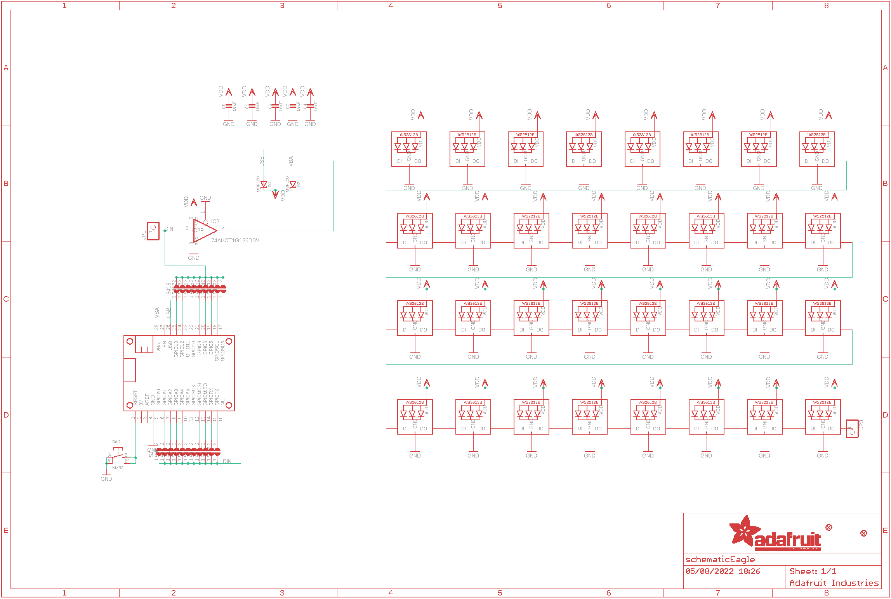
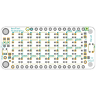
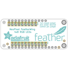
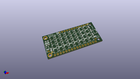
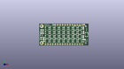
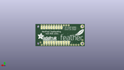
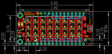
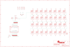

Contents
========

* [PRA2945 > Adafruit NeoPixel FeatherWing PCB](#pra2945--adafruit-neopixel-featherwing-pcb)
	* [Schematic](#schematic)
	* [PCB](#pcb)
	* [Interactive BOM](#interactive-bom)
	* [OOMP Parts](#oomp-parts)
	* [Images](#images)
	* [Tags](#tags)
  
![][im]
# PRA2945 > Adafruit NeoPixel FeatherWing PCB

- ID: PROJ-ADAF-2945-STAN-01
- Hex ID: PRA2945
- Name: Adafruit
- Description: Adafruit
- Long Link: [http://oom.lt/PROJ-ADAF-2945-STAN-01](http://oom.lt/PROJ-ADAF-2945-STAN-01)
- Short Link: [http://oom.lt/PRA2945](http://oom.lt/PRA2945)

## Schematic
  

## PCB
  

## Interactive BOM

- Interactive BOM page: [ibom.html](https://htmlpreview.github.io/?https://github.com/oomlout/oomlout_OOMP_projects/blob/main/PROJ-ADAF-2945-STAN-01/kicad/bom/ibom.html)

## OOMP Parts
  

|OOMP Parts|
| :---: |
|[CAPC-0805-X-UF10-V10  SMD (0805) 10 uF Capacitor (Ceramic) 10v  C1, C2, C3, C4, C5](https://github.com/oomlout/oomlout_OOMP_parts/tree/main/CAPC-0805-X-UF10-V10/)|
|[DIOD-S123-X-KMBR120-01  SMD (SOD-123) MBR120 Diode  D1, D2](https://github.com/oomlout/oomlout_OOMP_parts/tree/main/DIOD-S123-X-KMBR120-01/)|
|UNMATCHED-SO235-X-UNMATCHED-01 IC2|
|HEAD-I01-X-PI01-01 JP1, JP3|
|[LEDS-3535-RGB-K2812-01  SMD (3535) Smart Controller (WS2812B) RGB LED  LED1, LED2, LED3, LED4, LED5, LED6, LED7, LED8, LED9, LED10, LED11, LED12, LED13, LED14, LED15, LED16, LED17, LED18, LED19, LED20, LED21, LED22, LED23, LED24, LED25, LED26, LED27, LED28, LED29, LED30, LED31, LED32](https://github.com/oomlout/oomlout_OOMP_parts/tree/main/LEDS-3535-RGB-K2812-01/)|
|UNMATCHED-UNMATCHED-X-UNMATCHED-01 MS1|
|[BUTA-4628-X-STAN-01  SMD (4628) Pushbutton (Tactile)  SW1](https://github.com/oomlout/oomlout_OOMP_parts/tree/main/BUTA-4628-X-STAN-01/)|

## Images
  
  

|bominteractivefront|bominteractiveback|kicadPcb3d|kicadPcb3dFront|kicadPcb3dBack|eagleImage|eagleSchemImage|pcbdraw|pcbdrawback|
| :---: | :---: | :---: | :---: | :---: | :---: | :---: | :---: | :---: |
||||||||||

## Tags

- hexID: PRA2945
- oompType: PROJ
- oompSize: ADAF
- oompColor: 2945
- oompDesc: STAN
- oompIndex: 01
- oompName: Adafruit NeoPixel FeatherWing PCB
- sources: All source files from https://github.com/adafruit/Adafruit-NeoPixel-FeatherWing-PCB (source licence details in srcLicense.md)
- linkBuyPage: http://www.adafruit.com/products/2945
- oompID: PROJ-ADAF-2945-STAN-01
- oompParts: C1,CAPC-0805-X-UF10-V10
- oompParts: C2,CAPC-0805-X-UF10-V10
- oompParts: C3,CAPC-0805-X-UF10-V10
- oompParts: C4,CAPC-0805-X-UF10-V10
- oompParts: C5,CAPC-0805-X-UF10-V10
- oompParts: D1,DIOD-S123-X-KMBR120-01
- oompParts: D2,DIOD-S123-X-KMBR120-01
- oompParts: IC2,UNMATCHED-SO235-X-UNMATCHED-01
- oompParts: JP1,HEAD-I01-X-PI01-01
- oompParts: JP3,HEAD-I01-X-PI01-01
- oompParts: LED1,LEDS-3535-RGB-K2812-01
- oompParts: LED2,LEDS-3535-RGB-K2812-01
- oompParts: LED3,LEDS-3535-RGB-K2812-01
- oompParts: LED4,LEDS-3535-RGB-K2812-01
- oompParts: LED5,LEDS-3535-RGB-K2812-01
- oompParts: LED6,LEDS-3535-RGB-K2812-01
- oompParts: LED7,LEDS-3535-RGB-K2812-01
- oompParts: LED8,LEDS-3535-RGB-K2812-01
- oompParts: LED9,LEDS-3535-RGB-K2812-01
- oompParts: LED10,LEDS-3535-RGB-K2812-01
- oompParts: LED11,LEDS-3535-RGB-K2812-01
- oompParts: LED12,LEDS-3535-RGB-K2812-01
- oompParts: LED13,LEDS-3535-RGB-K2812-01
- oompParts: LED14,LEDS-3535-RGB-K2812-01
- oompParts: LED15,LEDS-3535-RGB-K2812-01
- oompParts: LED16,LEDS-3535-RGB-K2812-01
- oompParts: LED17,LEDS-3535-RGB-K2812-01
- oompParts: LED18,LEDS-3535-RGB-K2812-01
- oompParts: LED19,LEDS-3535-RGB-K2812-01
- oompParts: LED20,LEDS-3535-RGB-K2812-01
- oompParts: LED21,LEDS-3535-RGB-K2812-01
- oompParts: LED22,LEDS-3535-RGB-K2812-01
- oompParts: LED23,LEDS-3535-RGB-K2812-01
- oompParts: LED24,LEDS-3535-RGB-K2812-01
- oompParts: LED25,LEDS-3535-RGB-K2812-01
- oompParts: LED26,LEDS-3535-RGB-K2812-01
- oompParts: LED27,LEDS-3535-RGB-K2812-01
- oompParts: LED28,LEDS-3535-RGB-K2812-01
- oompParts: LED29,LEDS-3535-RGB-K2812-01
- oompParts: LED30,LEDS-3535-RGB-K2812-01
- oompParts: LED31,LEDS-3535-RGB-K2812-01
- oompParts: LED32,LEDS-3535-RGB-K2812-01
- oompParts: MS1,UNMATCHED-UNMATCHED-X-UNMATCHED-01
- oompParts: SW1,BUTA-4628-X-STAN-01
- rawParts: C1,10uF,CAP_CERAMIC0805-NOOUTLINE,0805-NO,Ceramic Capacitors,,
- rawParts: C2,10uF,CAP_CERAMIC0805-NOOUTLINE,0805-NO,Ceramic Capacitors,,
- rawParts: C3,10uF,CAP_CERAMIC0805-NOOUTLINE,0805-NO,Ceramic Capacitors,,
- rawParts: C4,10uF,CAP_CERAMIC0805-NOOUTLINE,0805-NO,Ceramic Capacitors,,
- rawParts: C5,10uF,CAP_CERAMIC0805-NOOUTLINE,0805-NO,Ceramic Capacitors,,
- rawParts: D1,MBR120,DIODE-SCHOTTKYSOD-123,SOD-123,,,
- rawParts: D2,MBR120,DIODE-SCHOTTKYSOD-123,SOD-123,,,
- rawParts: FID1,FIDUCIAL,FIDUCIAL,FIDUCIAL_1MM,Fiducial Alignment Points,EXCLUDE,
- rawParts: FID3,FIDUCIAL,FIDUCIAL,FIDUCIAL_1MM,Fiducial Alignment Points,EXCLUDE,
- rawParts: IC2,74AHCT1G125DBV,74AHCT1G125DBV,SOT23-5,Single Bus Buffer Gate with 3-State Output,,
- rawParts: JP1,,HEADER-1X1ROUND,1X01_ROUND,PIN HEADER,,
- rawParts: JP3,,HEADER-1X1ROUND,1X01_ROUND,PIN HEADER,,
- rawParts: LED1,WS2812B3535,WS2812B3535,LED3535,,,
- rawParts: LED2,WS2812B3535,WS2812B3535,LED3535,,,
- rawParts: LED3,WS2812B3535,WS2812B3535,LED3535,,,
- rawParts: LED4,WS2812B3535,WS2812B3535,LED3535,,,
- rawParts: LED5,WS2812B3535,WS2812B3535,LED3535,,,
- rawParts: LED6,WS2812B3535,WS2812B3535,LED3535,,,
- rawParts: LED7,WS2812B3535,WS2812B3535,LED3535,,,
- rawParts: LED8,WS2812B3535,WS2812B3535,LED3535,,,
- rawParts: LED9,WS2812B3535,WS2812B3535,LED3535,,,
- rawParts: LED10,WS2812B3535,WS2812B3535,LED3535,,,
- rawParts: LED11,WS2812B3535,WS2812B3535,LED3535,,,
- rawParts: LED12,WS2812B3535,WS2812B3535,LED3535,,,
- rawParts: LED13,WS2812B3535,WS2812B3535,LED3535,,,
- rawParts: LED14,WS2812B3535,WS2812B3535,LED3535,,,
- rawParts: LED15,WS2812B3535,WS2812B3535,LED3535,,,
- rawParts: LED16,WS2812B3535,WS2812B3535,LED3535,,,
- rawParts: LED17,WS2812B3535,WS2812B3535,LED3535,,,
- rawParts: LED18,WS2812B3535,WS2812B3535,LED3535,,,
- rawParts: LED19,WS2812B3535,WS2812B3535,LED3535,,,
- rawParts: LED20,WS2812B3535,WS2812B3535,LED3535,,,
- rawParts: LED21,WS2812B3535,WS2812B3535,LED3535,,,
- rawParts: LED22,WS2812B3535,WS2812B3535,LED3535,,,
- rawParts: LED23,WS2812B3535,WS2812B3535,LED3535,,,
- rawParts: LED24,WS2812B3535,WS2812B3535,LED3535,,,
- rawParts: LED25,WS2812B3535,WS2812B3535,LED3535,,,
- rawParts: LED26,WS2812B3535,WS2812B3535,LED3535,,,
- rawParts: LED27,WS2812B3535,WS2812B3535,LED3535,,,
- rawParts: LED28,WS2812B3535,WS2812B3535,LED3535,,,
- rawParts: LED29,WS2812B3535,WS2812B3535,LED3535,,,
- rawParts: LED30,WS2812B3535,WS2812B3535,LED3535,,,
- rawParts: LED31,WS2812B3535,WS2812B3535,LED3535,,,
- rawParts: LED32,WS2812B3535,WS2812B3535,LED3535,,,
- rawParts: MS1,FEATHERWING,FEATHERWING,FEATHERWING,,,
- rawParts: SJ1,,SOLDERJUMPER,SOLDERJUMPER_ARROW_NOPASTE,SMD Solder JUMPER,EXCLUDE,
- rawParts: SJ2,,SOLDERJUMPER,SOLDERJUMPER_ARROW_NOPASTE,SMD Solder JUMPER,EXCLUDE,
- rawParts: SJ3,,SOLDERJUMPER,SOLDERJUMPER_ARROW_NOPASTE,SMD Solder JUMPER,EXCLUDE,
- rawParts: SJ4,,SOLDERJUMPER,SOLDERJUMPER_ARROW_NOPASTE,SMD Solder JUMPER,EXCLUDE,
- rawParts: SJ5,,SOLDERJUMPER,SOLDERJUMPER_ARROW_NOPASTE,SMD Solder JUMPER,EXCLUDE,
- rawParts: SJ6,,SOLDERJUMPER,SOLDERJUMPER_ARROW_NOPASTE,SMD Solder JUMPER,EXCLUDE,
- rawParts: SJ7,,SOLDERJUMPER,SOLDERJUMPER_ARROW_NOPASTE,SMD Solder JUMPER,EXCLUDE,
- rawParts: SJ8,,SOLDERJUMPER,SOLDERJUMPER_ARROW_NOPASTE,SMD Solder JUMPER,EXCLUDE,
- rawParts: SJ9,,SOLDERJUMPER,SOLDERJUMPER_ARROW_NOPASTE,SMD Solder JUMPER,EXCLUDE,
- rawParts: SJ10,,SOLDERJUMPER,SOLDERJUMPER_ARROW_NOPASTE,SMD Solder JUMPER,EXCLUDE,
- rawParts: SJ11,,SOLDERJUMPER,SOLDERJUMPER_ARROW_NOPASTE,SMD Solder JUMPER,EXCLUDE,
- rawParts: SJ12,,SOLDERJUMPER,SOLDERJUMPER_ARROW_NOPASTE,SMD Solder JUMPER,EXCLUDE,
- rawParts: SJ13,,SOLDERJUMPER,SOLDERJUMPER_ARROW_NOPASTE,SMD Solder JUMPER,EXCLUDE,
- rawParts: SJ14,,SOLDERJUMPER,SOLDERJUMPER_ARROW_NOPASTE,SMD Solder JUMPER,EXCLUDE,
- rawParts: SJ15,,SOLDERJUMPER,SOLDERJUMPER_ARROW_NOPASTE,SMD Solder JUMPER,EXCLUDE,
- rawParts: SJ16,,SOLDERJUMPER,SOLDERJUMPER_ARROW_NOPASTE,SMD Solder JUMPER,EXCLUDE,
- rawParts: SJ17,,SOLDERJUMPER,SOLDERJUMPER_ARROW_NOPASTE,SMD Solder JUMPER,EXCLUDE,
- rawParts: SJ18,,SOLDERJUMPER,SOLDERJUMPER_ARROW_NOPASTE,SMD Solder JUMPER,EXCLUDE,
- rawParts: SJ19,,SOLDERJUMPER,SOLDERJUMPER_ARROW_NOPASTE,SMD Solder JUMPER,EXCLUDE,
- rawParts: SJ20,,SOLDERJUMPERCLOSED,SOLDERJUMPER_CLOSEDWIRE,SMD Solder JUMPER,,
- rawParts: SW1,KMR2,SWITCH_TACT_SMT4.6X2.8,BTN_KMR2_4.6X2.8,SMT Tact Switches,,

[im]: kicadPcb3d_450.png
