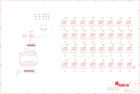

Contents
========

* [PRA2945 > Adafruit](#pra2945--adafruit)
	* [Schematic](#schematic)
	* [Interactive BOM](#interactive-bom)
	* [OOMP Parts](#oomp-parts)
	* [Images](#images)
	* [Tags](#tags)
  
![][im]
# PRA2945 > Adafruit

- ID: PROJ-ADAF-2945-STAN-01
- Hex ID: PRA2945
- Name: Adafruit
- Description: Adafruit
- Long Link: [http://oom.lt/PROJ-ADAF-2945-STAN-01](http://oom.lt/PROJ-ADAF-2945-STAN-01)
- Long Link: [http://oom.lt/PRA2945](http://oom.lt/PRA2945)

## Schematic
  
![][schem]
## Interactive BOM

- Interactive BOM page: [ibom.html](https://htmlpreview.github.io/?https://github.com/oomlout/oomlout_OOMP_projects/blob/main/PROJ-ADAF-2945-STAN-01/kicad/bom/ibom.html)

## OOMP Parts
  

|OOMP Parts|
| :---: |
|C1,UNMATCHED-UNMATCHED-UNMATCHED-UNMATCHED-UNMATCHED,C1,10uF,CAP_CERAMIC0805-NOOUTLINE,0805-NO,Ceramic Capacitors,,|
|C2,UNMATCHED-UNMATCHED-UNMATCHED-UNMATCHED-UNMATCHED,C2,10uF,CAP_CERAMIC0805-NOOUTLINE,0805-NO,Ceramic Capacitors,,|
|C3,UNMATCHED-UNMATCHED-UNMATCHED-UNMATCHED-UNMATCHED,C3,10uF,CAP_CERAMIC0805-NOOUTLINE,0805-NO,Ceramic Capacitors,,|
|C4,UNMATCHED-UNMATCHED-UNMATCHED-UNMATCHED-UNMATCHED,C4,10uF,CAP_CERAMIC0805-NOOUTLINE,0805-NO,Ceramic Capacitors,,|
|C5,UNMATCHED-UNMATCHED-UNMATCHED-UNMATCHED-UNMATCHED,C5,10uF,CAP_CERAMIC0805-NOOUTLINE,0805-NO,Ceramic Capacitors,,|
|D1,UNMATCHED-UNMATCHED-UNMATCHED-UNMATCHED-UNMATCHED,D1,MBR120,DIODE-SCHOTTKYSOD-123,SOD-123,,,|
|D2,UNMATCHED-UNMATCHED-UNMATCHED-UNMATCHED-UNMATCHED,D2,MBR120,DIODE-SCHOTTKYSOD-123,SOD-123,,,|
|IC2,UNMATCHED-UNMATCHED-UNMATCHED-UNMATCHED-UNMATCHED,FID1,FIDUCIAL,FIDUCIAL,FIDUCIAL_1MM,Fiducial Alignment Points,EXCLUDE,|
|JP1,UNMATCHED-UNMATCHED-UNMATCHED-UNMATCHED-UNMATCHED,FID3,FIDUCIAL,FIDUCIAL,FIDUCIAL_1MM,Fiducial Alignment Points,EXCLUDE,|
|JP3,UNMATCHED-UNMATCHED-UNMATCHED-UNMATCHED-UNMATCHED,IC2,74AHCT1G125DBV,74AHCT1G125DBV,SOT23-5,Single Bus Buffer Gate with 3-State Output,,|
|LED1,UNMATCHED-UNMATCHED-UNMATCHED-UNMATCHED-UNMATCHED,JP1,,HEADER-1X1ROUND,1X01_ROUND,PIN HEADER,,|
|LED2,UNMATCHED-UNMATCHED-UNMATCHED-UNMATCHED-UNMATCHED,JP3,,HEADER-1X1ROUND,1X01_ROUND,PIN HEADER,,|
|LED3,UNMATCHED-UNMATCHED-UNMATCHED-UNMATCHED-UNMATCHED,LED1,WS2812B3535,WS2812B3535,LED3535,,,|
|LED4,UNMATCHED-UNMATCHED-UNMATCHED-UNMATCHED-UNMATCHED,LED2,WS2812B3535,WS2812B3535,LED3535,,,|
|LED5,UNMATCHED-UNMATCHED-UNMATCHED-UNMATCHED-UNMATCHED,LED3,WS2812B3535,WS2812B3535,LED3535,,,|
|LED6,UNMATCHED-UNMATCHED-UNMATCHED-UNMATCHED-UNMATCHED,LED4,WS2812B3535,WS2812B3535,LED3535,,,|
|LED7,UNMATCHED-UNMATCHED-UNMATCHED-UNMATCHED-UNMATCHED,LED5,WS2812B3535,WS2812B3535,LED3535,,,|
|LED8,UNMATCHED-UNMATCHED-UNMATCHED-UNMATCHED-UNMATCHED,LED6,WS2812B3535,WS2812B3535,LED3535,,,|
|LED9,UNMATCHED-UNMATCHED-UNMATCHED-UNMATCHED-UNMATCHED,LED7,WS2812B3535,WS2812B3535,LED3535,,,|
|LED10,UNMATCHED-UNMATCHED-UNMATCHED-UNMATCHED-UNMATCHED,LED8,WS2812B3535,WS2812B3535,LED3535,,,|
|LED11,UNMATCHED-UNMATCHED-UNMATCHED-UNMATCHED-UNMATCHED,LED9,WS2812B3535,WS2812B3535,LED3535,,,|
|LED12,UNMATCHED-UNMATCHED-UNMATCHED-UNMATCHED-UNMATCHED,LED10,WS2812B3535,WS2812B3535,LED3535,,,|
|LED13,UNMATCHED-UNMATCHED-UNMATCHED-UNMATCHED-UNMATCHED,LED11,WS2812B3535,WS2812B3535,LED3535,,,|
|LED14,UNMATCHED-UNMATCHED-UNMATCHED-UNMATCHED-UNMATCHED,LED12,WS2812B3535,WS2812B3535,LED3535,,,|
|LED15,UNMATCHED-UNMATCHED-UNMATCHED-UNMATCHED-UNMATCHED,LED13,WS2812B3535,WS2812B3535,LED3535,,,|
|LED16,UNMATCHED-UNMATCHED-UNMATCHED-UNMATCHED-UNMATCHED,LED14,WS2812B3535,WS2812B3535,LED3535,,,|
|LED17,UNMATCHED-UNMATCHED-UNMATCHED-UNMATCHED-UNMATCHED,LED15,WS2812B3535,WS2812B3535,LED3535,,,|
|LED18,UNMATCHED-UNMATCHED-UNMATCHED-UNMATCHED-UNMATCHED,LED16,WS2812B3535,WS2812B3535,LED3535,,,|
|LED19,UNMATCHED-UNMATCHED-UNMATCHED-UNMATCHED-UNMATCHED,LED17,WS2812B3535,WS2812B3535,LED3535,,,|
|LED20,UNMATCHED-UNMATCHED-UNMATCHED-UNMATCHED-UNMATCHED,LED18,WS2812B3535,WS2812B3535,LED3535,,,|
|LED21,UNMATCHED-UNMATCHED-UNMATCHED-UNMATCHED-UNMATCHED,LED19,WS2812B3535,WS2812B3535,LED3535,,,|
|LED22,UNMATCHED-UNMATCHED-UNMATCHED-UNMATCHED-UNMATCHED,LED20,WS2812B3535,WS2812B3535,LED3535,,,|
|LED23,UNMATCHED-UNMATCHED-UNMATCHED-UNMATCHED-UNMATCHED,LED21,WS2812B3535,WS2812B3535,LED3535,,,|
|LED24,UNMATCHED-UNMATCHED-UNMATCHED-UNMATCHED-UNMATCHED,LED22,WS2812B3535,WS2812B3535,LED3535,,,|
|LED25,UNMATCHED-UNMATCHED-UNMATCHED-UNMATCHED-UNMATCHED,LED23,WS2812B3535,WS2812B3535,LED3535,,,|
|LED26,UNMATCHED-UNMATCHED-UNMATCHED-UNMATCHED-UNMATCHED,LED24,WS2812B3535,WS2812B3535,LED3535,,,|
|LED27,UNMATCHED-UNMATCHED-UNMATCHED-UNMATCHED-UNMATCHED,LED25,WS2812B3535,WS2812B3535,LED3535,,,|
|LED28,UNMATCHED-UNMATCHED-UNMATCHED-UNMATCHED-UNMATCHED,LED26,WS2812B3535,WS2812B3535,LED3535,,,|
|LED29,UNMATCHED-UNMATCHED-UNMATCHED-UNMATCHED-UNMATCHED,LED27,WS2812B3535,WS2812B3535,LED3535,,,|
|LED30,UNMATCHED-UNMATCHED-UNMATCHED-UNMATCHED-UNMATCHED,LED28,WS2812B3535,WS2812B3535,LED3535,,,|
|LED31,UNMATCHED-UNMATCHED-UNMATCHED-UNMATCHED-UNMATCHED,LED29,WS2812B3535,WS2812B3535,LED3535,,,|
|LED32,UNMATCHED-UNMATCHED-UNMATCHED-UNMATCHED-UNMATCHED,LED30,WS2812B3535,WS2812B3535,LED3535,,,|
|MS1,UNMATCHED-UNMATCHED-UNMATCHED-UNMATCHED-UNMATCHED,LED31,WS2812B3535,WS2812B3535,LED3535,,,|
|SJ20,UNMATCHED-UNMATCHED-UNMATCHED-UNMATCHED-UNMATCHED,LED32,WS2812B3535,WS2812B3535,LED3535,,,|
|SW1,UNMATCHED-UNMATCHED-UNMATCHED-UNMATCHED-UNMATCHED,MS1,FEATHERWING,FEATHERWING,FEATHERWING,,,|

## Images
  
  

|kicadPcb3d|kicadPcb3dFront|kicadPcb3dBack|eagleImage|eagleSchemImage|
| :---: | :---: | :---: | :---: | :---: |
||||||

## Tags

- hexID: PRA2945
- oompType: PROJ
- oompSize: ADAF
- oompColor: 2945
- oompDesc: STAN
- oompIndex: 01
- oompName: Adafruit NeoPixel FeatherWing PCB
- sources: All source files from https://github.com/adafruit/Adafruit-NeoPixel-FeatherWing-PCB (source licence details in srcLicense.md)
- linkBuyPage: http://www.adafruit.com/products/2945
- oompID: PROJ-ADAF-2945-STAN-01
- oompParts: C1,UNMATCHED-UNMATCHED-UNMATCHED-UNMATCHED-UNMATCHED
- oompParts: C2,UNMATCHED-UNMATCHED-UNMATCHED-UNMATCHED-UNMATCHED
- oompParts: C3,UNMATCHED-UNMATCHED-UNMATCHED-UNMATCHED-UNMATCHED
- oompParts: C4,UNMATCHED-UNMATCHED-UNMATCHED-UNMATCHED-UNMATCHED
- oompParts: C5,UNMATCHED-UNMATCHED-UNMATCHED-UNMATCHED-UNMATCHED
- oompParts: D1,UNMATCHED-UNMATCHED-UNMATCHED-UNMATCHED-UNMATCHED
- oompParts: D2,UNMATCHED-UNMATCHED-UNMATCHED-UNMATCHED-UNMATCHED
- oompParts: IC2,UNMATCHED-UNMATCHED-UNMATCHED-UNMATCHED-UNMATCHED
- oompParts: JP1,UNMATCHED-UNMATCHED-UNMATCHED-UNMATCHED-UNMATCHED
- oompParts: JP3,UNMATCHED-UNMATCHED-UNMATCHED-UNMATCHED-UNMATCHED
- oompParts: LED1,UNMATCHED-UNMATCHED-UNMATCHED-UNMATCHED-UNMATCHED
- oompParts: LED2,UNMATCHED-UNMATCHED-UNMATCHED-UNMATCHED-UNMATCHED
- oompParts: LED3,UNMATCHED-UNMATCHED-UNMATCHED-UNMATCHED-UNMATCHED
- oompParts: LED4,UNMATCHED-UNMATCHED-UNMATCHED-UNMATCHED-UNMATCHED
- oompParts: LED5,UNMATCHED-UNMATCHED-UNMATCHED-UNMATCHED-UNMATCHED
- oompParts: LED6,UNMATCHED-UNMATCHED-UNMATCHED-UNMATCHED-UNMATCHED
- oompParts: LED7,UNMATCHED-UNMATCHED-UNMATCHED-UNMATCHED-UNMATCHED
- oompParts: LED8,UNMATCHED-UNMATCHED-UNMATCHED-UNMATCHED-UNMATCHED
- oompParts: LED9,UNMATCHED-UNMATCHED-UNMATCHED-UNMATCHED-UNMATCHED
- oompParts: LED10,UNMATCHED-UNMATCHED-UNMATCHED-UNMATCHED-UNMATCHED
- oompParts: LED11,UNMATCHED-UNMATCHED-UNMATCHED-UNMATCHED-UNMATCHED
- oompParts: LED12,UNMATCHED-UNMATCHED-UNMATCHED-UNMATCHED-UNMATCHED
- oompParts: LED13,UNMATCHED-UNMATCHED-UNMATCHED-UNMATCHED-UNMATCHED
- oompParts: LED14,UNMATCHED-UNMATCHED-UNMATCHED-UNMATCHED-UNMATCHED
- oompParts: LED15,UNMATCHED-UNMATCHED-UNMATCHED-UNMATCHED-UNMATCHED
- oompParts: LED16,UNMATCHED-UNMATCHED-UNMATCHED-UNMATCHED-UNMATCHED
- oompParts: LED17,UNMATCHED-UNMATCHED-UNMATCHED-UNMATCHED-UNMATCHED
- oompParts: LED18,UNMATCHED-UNMATCHED-UNMATCHED-UNMATCHED-UNMATCHED
- oompParts: LED19,UNMATCHED-UNMATCHED-UNMATCHED-UNMATCHED-UNMATCHED
- oompParts: LED20,UNMATCHED-UNMATCHED-UNMATCHED-UNMATCHED-UNMATCHED
- oompParts: LED21,UNMATCHED-UNMATCHED-UNMATCHED-UNMATCHED-UNMATCHED
- oompParts: LED22,UNMATCHED-UNMATCHED-UNMATCHED-UNMATCHED-UNMATCHED
- oompParts: LED23,UNMATCHED-UNMATCHED-UNMATCHED-UNMATCHED-UNMATCHED
- oompParts: LED24,UNMATCHED-UNMATCHED-UNMATCHED-UNMATCHED-UNMATCHED
- oompParts: LED25,UNMATCHED-UNMATCHED-UNMATCHED-UNMATCHED-UNMATCHED
- oompParts: LED26,UNMATCHED-UNMATCHED-UNMATCHED-UNMATCHED-UNMATCHED
- oompParts: LED27,UNMATCHED-UNMATCHED-UNMATCHED-UNMATCHED-UNMATCHED
- oompParts: LED28,UNMATCHED-UNMATCHED-UNMATCHED-UNMATCHED-UNMATCHED
- oompParts: LED29,UNMATCHED-UNMATCHED-UNMATCHED-UNMATCHED-UNMATCHED
- oompParts: LED30,UNMATCHED-UNMATCHED-UNMATCHED-UNMATCHED-UNMATCHED
- oompParts: LED31,UNMATCHED-UNMATCHED-UNMATCHED-UNMATCHED-UNMATCHED
- oompParts: LED32,UNMATCHED-UNMATCHED-UNMATCHED-UNMATCHED-UNMATCHED
- oompParts: MS1,UNMATCHED-UNMATCHED-UNMATCHED-UNMATCHED-UNMATCHED
- oompParts: SJ20,UNMATCHED-UNMATCHED-UNMATCHED-UNMATCHED-UNMATCHED
- oompParts: SW1,UNMATCHED-UNMATCHED-UNMATCHED-UNMATCHED-UNMATCHED
- rawParts: C1,10uF,CAP_CERAMIC0805-NOOUTLINE,0805-NO,Ceramic Capacitors,,
- rawParts: C2,10uF,CAP_CERAMIC0805-NOOUTLINE,0805-NO,Ceramic Capacitors,,
- rawParts: C3,10uF,CAP_CERAMIC0805-NOOUTLINE,0805-NO,Ceramic Capacitors,,
- rawParts: C4,10uF,CAP_CERAMIC0805-NOOUTLINE,0805-NO,Ceramic Capacitors,,
- rawParts: C5,10uF,CAP_CERAMIC0805-NOOUTLINE,0805-NO,Ceramic Capacitors,,
- rawParts: D1,MBR120,DIODE-SCHOTTKYSOD-123,SOD-123,,,
- rawParts: D2,MBR120,DIODE-SCHOTTKYSOD-123,SOD-123,,,
- rawParts: FID1,FIDUCIAL,FIDUCIAL,FIDUCIAL_1MM,Fiducial Alignment Points,EXCLUDE,
- rawParts: FID3,FIDUCIAL,FIDUCIAL,FIDUCIAL_1MM,Fiducial Alignment Points,EXCLUDE,
- rawParts: IC2,74AHCT1G125DBV,74AHCT1G125DBV,SOT23-5,Single Bus Buffer Gate with 3-State Output,,
- rawParts: JP1,,HEADER-1X1ROUND,1X01_ROUND,PIN HEADER,,
- rawParts: JP3,,HEADER-1X1ROUND,1X01_ROUND,PIN HEADER,,
- rawParts: LED1,WS2812B3535,WS2812B3535,LED3535,,,
- rawParts: LED2,WS2812B3535,WS2812B3535,LED3535,,,
- rawParts: LED3,WS2812B3535,WS2812B3535,LED3535,,,
- rawParts: LED4,WS2812B3535,WS2812B3535,LED3535,,,
- rawParts: LED5,WS2812B3535,WS2812B3535,LED3535,,,
- rawParts: LED6,WS2812B3535,WS2812B3535,LED3535,,,
- rawParts: LED7,WS2812B3535,WS2812B3535,LED3535,,,
- rawParts: LED8,WS2812B3535,WS2812B3535,LED3535,,,
- rawParts: LED9,WS2812B3535,WS2812B3535,LED3535,,,
- rawParts: LED10,WS2812B3535,WS2812B3535,LED3535,,,
- rawParts: LED11,WS2812B3535,WS2812B3535,LED3535,,,
- rawParts: LED12,WS2812B3535,WS2812B3535,LED3535,,,
- rawParts: LED13,WS2812B3535,WS2812B3535,LED3535,,,
- rawParts: LED14,WS2812B3535,WS2812B3535,LED3535,,,
- rawParts: LED15,WS2812B3535,WS2812B3535,LED3535,,,
- rawParts: LED16,WS2812B3535,WS2812B3535,LED3535,,,
- rawParts: LED17,WS2812B3535,WS2812B3535,LED3535,,,
- rawParts: LED18,WS2812B3535,WS2812B3535,LED3535,,,
- rawParts: LED19,WS2812B3535,WS2812B3535,LED3535,,,
- rawParts: LED20,WS2812B3535,WS2812B3535,LED3535,,,
- rawParts: LED21,WS2812B3535,WS2812B3535,LED3535,,,
- rawParts: LED22,WS2812B3535,WS2812B3535,LED3535,,,
- rawParts: LED23,WS2812B3535,WS2812B3535,LED3535,,,
- rawParts: LED24,WS2812B3535,WS2812B3535,LED3535,,,
- rawParts: LED25,WS2812B3535,WS2812B3535,LED3535,,,
- rawParts: LED26,WS2812B3535,WS2812B3535,LED3535,,,
- rawParts: LED27,WS2812B3535,WS2812B3535,LED3535,,,
- rawParts: LED28,WS2812B3535,WS2812B3535,LED3535,,,
- rawParts: LED29,WS2812B3535,WS2812B3535,LED3535,,,
- rawParts: LED30,WS2812B3535,WS2812B3535,LED3535,,,
- rawParts: LED31,WS2812B3535,WS2812B3535,LED3535,,,
- rawParts: LED32,WS2812B3535,WS2812B3535,LED3535,,,
- rawParts: MS1,FEATHERWING,FEATHERWING,FEATHERWING,,,
- rawParts: SJ1,,SOLDERJUMPER,SOLDERJUMPER_ARROW_NOPASTE,SMD Solder JUMPER,EXCLUDE,
- rawParts: SJ2,,SOLDERJUMPER,SOLDERJUMPER_ARROW_NOPASTE,SMD Solder JUMPER,EXCLUDE,
- rawParts: SJ3,,SOLDERJUMPER,SOLDERJUMPER_ARROW_NOPASTE,SMD Solder JUMPER,EXCLUDE,
- rawParts: SJ4,,SOLDERJUMPER,SOLDERJUMPER_ARROW_NOPASTE,SMD Solder JUMPER,EXCLUDE,
- rawParts: SJ5,,SOLDERJUMPER,SOLDERJUMPER_ARROW_NOPASTE,SMD Solder JUMPER,EXCLUDE,
- rawParts: SJ6,,SOLDERJUMPER,SOLDERJUMPER_ARROW_NOPASTE,SMD Solder JUMPER,EXCLUDE,
- rawParts: SJ7,,SOLDERJUMPER,SOLDERJUMPER_ARROW_NOPASTE,SMD Solder JUMPER,EXCLUDE,
- rawParts: SJ8,,SOLDERJUMPER,SOLDERJUMPER_ARROW_NOPASTE,SMD Solder JUMPER,EXCLUDE,
- rawParts: SJ9,,SOLDERJUMPER,SOLDERJUMPER_ARROW_NOPASTE,SMD Solder JUMPER,EXCLUDE,
- rawParts: SJ10,,SOLDERJUMPER,SOLDERJUMPER_ARROW_NOPASTE,SMD Solder JUMPER,EXCLUDE,
- rawParts: SJ11,,SOLDERJUMPER,SOLDERJUMPER_ARROW_NOPASTE,SMD Solder JUMPER,EXCLUDE,
- rawParts: SJ12,,SOLDERJUMPER,SOLDERJUMPER_ARROW_NOPASTE,SMD Solder JUMPER,EXCLUDE,
- rawParts: SJ13,,SOLDERJUMPER,SOLDERJUMPER_ARROW_NOPASTE,SMD Solder JUMPER,EXCLUDE,
- rawParts: SJ14,,SOLDERJUMPER,SOLDERJUMPER_ARROW_NOPASTE,SMD Solder JUMPER,EXCLUDE,
- rawParts: SJ15,,SOLDERJUMPER,SOLDERJUMPER_ARROW_NOPASTE,SMD Solder JUMPER,EXCLUDE,
- rawParts: SJ16,,SOLDERJUMPER,SOLDERJUMPER_ARROW_NOPASTE,SMD Solder JUMPER,EXCLUDE,
- rawParts: SJ17,,SOLDERJUMPER,SOLDERJUMPER_ARROW_NOPASTE,SMD Solder JUMPER,EXCLUDE,
- rawParts: SJ18,,SOLDERJUMPER,SOLDERJUMPER_ARROW_NOPASTE,SMD Solder JUMPER,EXCLUDE,
- rawParts: SJ19,,SOLDERJUMPER,SOLDERJUMPER_ARROW_NOPASTE,SMD Solder JUMPER,EXCLUDE,
- rawParts: SJ20,,SOLDERJUMPERCLOSED,SOLDERJUMPER_CLOSEDWIRE,SMD Solder JUMPER,,
- rawParts: SW1,KMR2,SWITCH_TACT_SMT4.6X2.8,BTN_KMR2_4.6X2.8,SMT Tact Switches,,

[im]: kicadPcb3d_450.png
[schem]: eagleSchemImage.png
