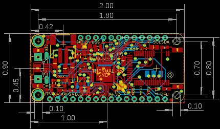
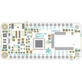
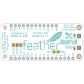
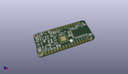
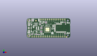
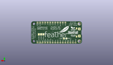
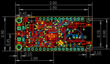
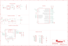
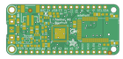
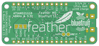

Contents
========

* [PRA2995 > Adafruit Feather M0 Bluefruit LE PCB](#pra2995--adafruit-feather-m0-bluefruit-le-pcb)
	* [Schematic](#schematic)
	* [PCB](#pcb)
	* [Interactive BOM](#interactive-bom)
	* [OOMP Parts](#oomp-parts)
	* [Images](#images)
	* [Tags](#tags)
  
![][im]
# PRA2995 > Adafruit Feather M0 Bluefruit LE PCB

- ID: PROJ-ADAF-2995-STAN-01
- Hex ID: PRA2995
- Name: Adafruit
- Description: Adafruit
- Long Link: [http://oom.lt/PROJ-ADAF-2995-STAN-01](http://oom.lt/PROJ-ADAF-2995-STAN-01)
- Short Link: [http://oom.lt/PRA2995](http://oom.lt/PRA2995)

## Schematic
  

## PCB
  

## Interactive BOM

- Interactive BOM page: [ibom.html](https://htmlpreview.github.io/?https://github.com/oomlout/oomlout_OOMP_projects/blob/main/PROJ-ADAF-2995-STAN-01/kicad/bom/ibom.html)

## OOMP Parts
  

|OOMP ID|Name|Identifier|
| :---: | :---: | :---: |
|[CAPC-0603-X-UF1-V25](https://github.com/oomlout/oomlout_OOMP_parts/tree/main/CAPC-0603-X-UF1-V25/)|[SMD (0603) 1 uF Capacitor (Ceramic) 25v](https://github.com/oomlout/oomlout_OOMP_parts/tree/main/CAPC-0603-X-UF1-V25/)|[C1, C7, C14](https://github.com/oomlout/oomlout_OOMP_parts/tree/main/CAPC-0603-X-UF1-V25/)|
|[CAPC-0603-X-PF22-V50](https://github.com/oomlout/oomlout_OOMP_parts/tree/main/CAPC-0603-X-PF22-V50/)|[SMD (0603) 22 pF Capacitor (Ceramic) 50v](https://github.com/oomlout/oomlout_OOMP_parts/tree/main/CAPC-0603-X-PF22-V50/)|[C2, C4](https://github.com/oomlout/oomlout_OOMP_parts/tree/main/CAPC-0603-X-PF22-V50/)|
|[CAPC-0805-X-UF10-V10](https://github.com/oomlout/oomlout_OOMP_parts/tree/main/CAPC-0805-X-UF10-V10/)|[SMD (0805) 10 uF Capacitor (Ceramic) 10v](https://github.com/oomlout/oomlout_OOMP_parts/tree/main/CAPC-0805-X-UF10-V10/)|[C3, C5, C6, C8, C9](https://github.com/oomlout/oomlout_OOMP_parts/tree/main/CAPC-0805-X-UF10-V10/)|
|LEDS-0805-O-STAN-01||CHG|
|[DIOD-S123-X-KMBR120-01](https://github.com/oomlout/oomlout_OOMP_parts/tree/main/DIOD-S123-X-KMBR120-01/)|[SMD (SOD-123) MBR120 Diode](https://github.com/oomlout/oomlout_OOMP_parts/tree/main/DIOD-S123-X-KMBR120-01/)|[D1](https://github.com/oomlout/oomlout_OOMP_parts/tree/main/DIOD-S123-X-KMBR120-01/)|
|[LEDS-0805-R-STAN-01](https://github.com/oomlout/oomlout_OOMP_parts/tree/main/LEDS-0805-R-STAN-01/)|[SMD (0805) Red LED](https://github.com/oomlout/oomlout_OOMP_parts/tree/main/LEDS-0805-R-STAN-01/)|[D2, L](https://github.com/oomlout/oomlout_OOMP_parts/tree/main/LEDS-0805-R-STAN-01/)|
|[LEDS-0805-L-STAN-01](https://github.com/oomlout/oomlout_OOMP_parts/tree/main/LEDS-0805-L-STAN-01/)|[SMD (0805) Blue LED](https://github.com/oomlout/oomlout_OOMP_parts/tree/main/LEDS-0805-L-STAN-01/)|[D3](https://github.com/oomlout/oomlout_OOMP_parts/tree/main/LEDS-0805-L-STAN-01/)|
|[HEAD-I01-X-PI16-01](https://github.com/oomlout/oomlout_OOMP_parts/tree/main/HEAD-I01-X-PI16-01/)|[2.54 mm 16 Pin Header](https://github.com/oomlout/oomlout_OOMP_parts/tree/main/HEAD-I01-X-PI16-01/)|[JP1](https://github.com/oomlout/oomlout_OOMP_parts/tree/main/HEAD-I01-X-PI16-01/)|
|[HEAD-I01-X-PI12-01](https://github.com/oomlout/oomlout_OOMP_parts/tree/main/HEAD-I01-X-PI12-01/)|[2.54 mm 12 Pin Header](https://github.com/oomlout/oomlout_OOMP_parts/tree/main/HEAD-I01-X-PI12-01/)|[JP3](https://github.com/oomlout/oomlout_OOMP_parts/tree/main/HEAD-I01-X-PI12-01/)|
|RESE-0603-X-O1003-01||R1, R3, R6|
|[RESE-0603-X-O102-01](https://github.com/oomlout/oomlout_OOMP_parts/tree/main/RESE-0603-X-O102-01/)|[SMD (0603) 1k Ohm Resistor](https://github.com/oomlout/oomlout_OOMP_parts/tree/main/RESE-0603-X-O102-01/)|[R2](https://github.com/oomlout/oomlout_OOMP_parts/tree/main/RESE-0603-X-O102-01/)|
|[RESE-0603-X-O222-01](https://github.com/oomlout/oomlout_OOMP_parts/tree/main/RESE-0603-X-O222-01/)|[SMD (0603) 2.2k Ohm Resistor](https://github.com/oomlout/oomlout_OOMP_parts/tree/main/RESE-0603-X-O222-01/)|[R4, R7, R10](https://github.com/oomlout/oomlout_OOMP_parts/tree/main/RESE-0603-X-O222-01/)|
|RESE-0603-X-UNMATCHED-01||R8|
|BUTA-UNMATCHED-X-STAN-01||SW1|
|UNMATCHED-UNMATCHED-X-UNMATCHED-01||U$4, U1, X1, X2, X3|
|UNMATCHED-SO235-X-UNMATCHED-01||U2, U3|

## Images
  
  

|bominteractivefront|bominteractiveback|kicadPcb3d|kicadPcb3dFront|kicadPcb3dBack|eagleImage|eagleSchemImage|pcbdraw|pcbdrawback|
| :---: | :---: | :---: | :---: | :---: | :---: | :---: | :---: | :---: |
||||||||||

## Tags

- hexID: PRA2995
- oompType: PROJ
- oompSize: ADAF
- oompColor: 2995
- oompDesc: STAN
- oompIndex: 01
- oompName: Adafruit Feather M0 Bluefruit LE PCB
- sources: All source files from https://github.com/adafruit/Adafruit-Feather-M0-Bluefruit-LE-PCB (source licence details in srcLicense.md)
- linkBuyPage: http://www.adafruit.com/products/2995
- oompID: PROJ-ADAF-2995-STAN-01
- oompParts: C1,CAPC-0603-X-UF1-V25
- oompParts: C2,CAPC-0603-X-PF22-V50
- oompParts: C3,CAPC-0805-X-UF10-V10
- oompParts: C4,CAPC-0603-X-PF22-V50
- oompParts: C5,CAPC-0805-X-UF10-V10
- oompParts: C6,CAPC-0805-X-UF10-V10
- oompParts: C7,CAPC-0603-X-UF1-V25
- oompParts: C8,CAPC-0805-X-UF10-V10
- oompParts: C9,CAPC-0805-X-UF10-V10
- oompParts: C14,CAPC-0603-X-UF1-V25
- oompParts: CHG,LEDS-0805-O-STAN-01
- oompParts: D1,DIOD-S123-X-KMBR120-01
- oompParts: D2,LEDS-0805-R-STAN-01
- oompParts: D3,LEDS-0805-L-STAN-01
- oompParts: JP1,HEAD-I01-X-PI16-01
- oompParts: JP3,HEAD-I01-X-PI12-01
- oompParts: L,LEDS-0805-R-STAN-01
- oompParts: R1,RESE-0603-X-O1003-01
- oompParts: R2,RESE-0603-X-O102-01
- oompParts: R3,RESE-0603-X-O1003-01
- oompParts: R4,RESE-0603-X-O222-01
- oompParts: R6,RESE-0603-X-O1003-01
- oompParts: R7,RESE-0603-X-O222-01
- oompParts: R8,RESE-0603-X-UNMATCHED-01
- oompParts: R10,RESE-0603-X-O222-01
- oompParts: SW1,BUTA-UNMATCHED-X-STAN-01
- oompParts: U$4,UNMATCHED-UNMATCHED-X-UNMATCHED-01
- oompParts: U1,UNMATCHED-UNMATCHED-X-UNMATCHED-01
- oompParts: U2,UNMATCHED-SO235-X-UNMATCHED-01
- oompParts: U3,UNMATCHED-SO235-X-UNMATCHED-01
- oompParts: X1,UNMATCHED-UNMATCHED-X-UNMATCHED-01
- oompParts: X2,UNMATCHED-UNMATCHED-X-UNMATCHED-01
- oompParts: X3,UNMATCHED-UNMATCHED-X-UNMATCHED-01
- rawParts: C1,1uF,CAP_CERAMIC0603_NO,0603-NO,Ceramic Capacitors,,
- rawParts: C2,22pF,CAP_CERAMIC0603_NO,0603-NO,Ceramic Capacitors,,
- rawParts: C3,10µF,CAP_CERAMIC0805-NOOUTLINE,0805-NO,Ceramic Capacitors,,
- rawParts: C4,22pF,CAP_CERAMIC0603_NO,0603-NO,Ceramic Capacitors,,
- rawParts: C5,10uF,CAP_CERAMIC0805-NOOUTLINE,0805-NO,Ceramic Capacitors,,
- rawParts: C6,10µF,CAP_CERAMIC0805-NOOUTLINE,0805-NO,Ceramic Capacitors,,
- rawParts: C7,1uF,CAP_CERAMIC0603_NO,0603-NO,Ceramic Capacitors,,
- rawParts: C8,10µF,CAP_CERAMIC0805-NOOUTLINE,0805-NO,Ceramic Capacitors,,
- rawParts: C9,10uF,CAP_CERAMIC0805-NOOUTLINE,0805-NO,Ceramic Capacitors,,
- rawParts: C14,1uF,CAP_CERAMIC0603_NO,0603-NO,Ceramic Capacitors,,
- rawParts: CHG,ORANGE,LED0805_NOOUTLINE,CHIPLED_0805_NOOUTLINE,LED,,
- rawParts: D1,MBR120,DIODE-SCHOTTKYSOD-123,SOD-123,,,
- rawParts: D2,RED,LED0805_NOOUTLINE,CHIPLED_0805_NOOUTLINE,LED,,
- rawParts: D3,BLUE,LED0805_NOOUTLINE,CHIPLED_0805_NOOUTLINE,LED,,
- rawParts: JP1,,HEADER-1X16ROUND,1X16_ROUND,PIN HEADER,,
- rawParts: JP3,,HEADER-1X12,1X12_ROUND,,,
- rawParts: L,RED,LED0805_NOOUTLINE,CHIPLED_0805_NOOUTLINE,LED,,
- rawParts: R1,100k,RESISTOR_0603_NOOUT,0603-NO,Resistors,,
- rawParts: R2,1K,RESISTOR_0603_NOOUT,0603-NO,Resistors,,
- rawParts: R3,100k,RESISTOR_0603_NOOUT,0603-NO,Resistors,,
- rawParts: R4,2.2K,RESISTOR_0603_NOOUT,0603-NO,Resistors,,
- rawParts: R6,100K,RESISTOR_0603_NOOUT,0603-NO,Resistors,,
- rawParts: R7,2.2K,RESISTOR_0603_NOOUT,0603-NO,Resistors,,
- rawParts: R8,10K\,RESISTOR_0603_NOOUT,0603-NO,Resistors,,
- rawParts: R10,2.2K,RESISTOR_0603_NOOUT,0603-NO,Resistors,,
- rawParts: SW1,SPST_TACT-KMR2,SPST_TACT-KMR2,KMR2,SMT 6mm switch, EVQQ2 series,,
- rawParts: TP1,,TESTPOINTROUND1.5MM,TESTPOINT_ROUND_1.5MM,Test Point,,
- rawParts: TP2,,TESTPOINTROUND1.5MM,TESTPOINT_ROUND_1.5MM,Test Point,,
- rawParts: TP3,SWCLK,TESTPOINT1.5X2.0MM_NOCREAM,PAD-1.5X2.0,Test Point,,
- rawParts: TP4,SWDIO,TESTPOINT1.5X2.0MM_NOCREAM,PAD-1.5X2.0,Test Point,,
- rawParts: TP5,SWDIO,TESTPOINT1.5X2.0MM_NOCREAM,PAD-1.5X2.0,Test Point,,
- rawParts: U$4,ATSAMD21G18_QFN,ATSAMD21J_QFN,TQFN48_7MM,,,
- rawParts: U$31,MOUNTINGHOLE2.5,MOUNTINGHOLE2.5,MOUNTINGHOLE_2.5_PLATED,Mounting Hole,EXCLUDE,
- rawParts: U$32,MOUNTINGHOLE2.5,MOUNTINGHOLE2.5,MOUNTINGHOLE_2.5_PLATED,Mounting Hole,EXCLUDE,
- rawParts: U$34,FIDUCIAL,FIDUCIAL,FIDUCIAL_1MM,Fiducial Alignment Points,EXCLUDE,
- rawParts: U$35,FIDUCIAL,FIDUCIAL,FIDUCIAL_1MM,Fiducial Alignment Points,EXCLUDE,
- rawParts: U1,MBT40,NRF51822_MODULE_MDBT40,BLE_MODULE_RAYTAC_MDBT40,nRF51822 Bluetooth Low Energy Module,,
- rawParts: U2,AP2112-3.3,VREG_SOT23-5,SOT23-5,SOT23-5 Fixed Voltage Regulators,,
- rawParts: U3,MCP73831T-2ACI/OT,MCP73831/2,SOT23-5,MCP73831/2 LIPO Charger,,
- rawParts: X1,JSTPH,CON_JST_PH_2PIN,JSTPH2,JST 2-Pin Right-Angle Connector,,
- rawParts: X2,32.768,XTAL-3.2X1.5,XTAL3215,Low cost SMT crystals, no capacitors included,,
- rawParts: X3,microUSB,USB_MICRO_20329_V2,4UCONN_20329_V2,USB Connectors,,

[im]: kicadPcb3d_450.png
