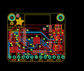
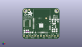
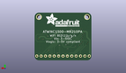
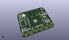

Contents
========

* [PROJ-ADAF-2999-STAN-01>Adafruit ATWINC1500 WiFi Breakout PCB](#proj-adaf-2999-stan-01adafruit-atwinc1500-wifi-breakout-pcb)
	* [Images](#images)
	* [Interactive BOM](#interactive-bom)
	* [OOMP Parts](#oomp-parts)
	* [Tags](#tags)
  
![][im]
# PROJ-ADAF-2999-STAN-01>Adafruit ATWINC1500 WiFi Breakout PCB

- ID: PROJ-ADAF-2999-STAN-01
- Hex ID: PRA2999
- Name: Adafruit ATWINC1500 WiFi Breakout PCB
- Description: 

## Images
  
  

|eagleImage|kicadPcb3dFront|kicadPcb3dBack|kicadPcb3d|
| :---: | :---: | :---: | :---: |
|||||

## Interactive BOM

- Interactive BOM page: [ibom.html](kicad/bom/ibom.html)

## OOMP Parts
  

|OOMP Parts|
| :---: |
|<table><tr><td></td><td> C1</td><td>[CAPC-0805-X-UF10-V25 SMD (0805) 10 uF Capacitor (Ceramic) 25v](https://github.com/oomlout/oomlout_OOMP_parts/tree/main/CAPC-0805-X-UF10-V25/)</td><td>[C85U010](https://github.com/oomlout/oomlout_OOMP_parts/tree/main/CAPC-0805-X-UF10-V25/)</td></tr></table>|
|CAPC-UNMATCHED-X-UF10-V25, C2, 7.874, 5.842, 180,C2, 10uF, 0805_10MGAP, microbuilder, (0.31, 0.23), R180|
|<table><tr><td></td><td> C3</td><td>[CAPC-0805-X-UF10-V25 SMD (0805) 10 uF Capacitor (Ceramic) 25v](https://github.com/oomlout/oomlout_OOMP_parts/tree/main/CAPC-0805-X-UF10-V25/)</td><td>[C85U010](https://github.com/oomlout/oomlout_OOMP_parts/tree/main/CAPC-0805-X-UF10-V25/)</td></tr></table>|
|<table><tr><td></td><td> C4</td><td>[CAPC-0805-X-NF100-V50 SMD (0805) 100 nF Capacitor (Ceramic) 50v](https://github.com/oomlout/oomlout_OOMP_parts/tree/main/CAPC-0805-X-NF100-V50/)</td><td>[C85N100](https://github.com/oomlout/oomlout_OOMP_parts/tree/main/CAPC-0805-X-NF100-V50/)</td></tr></table>|
|UNMATCHED-UNMATCHED-X-UNMATCHED-01, D1, 29.209999999999997, 16.637, 180,D1, green, CHIPLED_0805_NOOUTLINE, microbuilder, (1.15, 0.655), R180|
|UNMATCHED-UNMATCHED-X-UNMATCHED-01, D2, 31.623, 16.637, 180,D2, Yellow, CHIPLED_0805_NOOUTLINE, microbuilder, (1.245, 0.655), R180|
|UNMATCHED-UNMATCHED-X-UNMATCHED-01, D3, 26.796999999999997, 16.637, 180,D3, Red, CHIPLED_0805_NOOUTLINE, microbuilder, (1.055, 0.655), R180|
|UNMATCHED-UNMATCHED-X-UNMATCHED-01, JP2, 16.509999999999998, 2.54, 0,JP2, 1X13_ROUND_70, microbuilder, (0.65, 0.1), R0|
|RESE-0805-X-O104-01, R1, 1.778, 6.731, 90,R1, 100K, 0805-NO, microbuilder, (0.07, 0.265), R90|
|RESE-0805-X-O104-01, R2, 30.479999999999997, 7.874, 270,R2, 100K, 0805-NO, microbuilder, (1.2, 0.31), R270|
|RESE-UNMATCHED-X-O104-01, R3, 3.556, 6.731, 90,R3, 100K, _0805MP, microbuilder, (0.14, 0.265), R90|
|RESE-UNMATCHED-X-O104-01, R7, 5.206999999999999, 6.858, 90,R7, 100K, _0805MP, microbuilder, (0.205, 0.27), R90|
|RESE-UNMATCHED-X-O102-01, R8, 29.209999999999997, 19.939, 0,R8, 1K, RESPACK_4X0603, microbuilder, (1.15, 0.785), R0|
|UNMATCHED-UNMATCHED-X-UNMATCHED-01, U1, 4.064, 14.097000000000001, 270,U1, 74LVC245, TSSOP20, microbuilder, (0.16, 0.555), R270|
|UNMATCHED-UNMATCHED-X-UNMATCHED-01, U2, 28.194000000000003, 11.176, 90,U2, AP2112-3.3, SOT23-5, microbuilder, (1.11, 0.44), R90|

## Tags

- hexID: PRA2999
- oompType: PROJ
- oompSize: ADAF
- oompColor: 2999
- oompDesc: STAN
- oompIndex: 01
- oompName: Adafruit ATWINC1500 WiFi Breakout PCB
- sources: All source files from https://github.com/adafruit/Adafruit-ATWINC1500-WiFi-Breakout-PCB (source licence details in srcLicense.md)
- linkBuyPage: http://www.adafruit.com/products/2999
- oompPart: CAPC-0805-X-UF10-V25, C1, 28.194000000000003, 13.843, 180
- oompPart: CAPC-UNMATCHED-X-UF10-V25, C2, 7.874, 5.842, 180
- oompPart: CAPC-0805-X-UF10-V25, C3, 27.686, 6.731, 0
- oompPart: CAPC-0805-X-NF100-V50, C4, 27.686, 8.509, 0
- oompPart: UNMATCHED-UNMATCHED-X-UNMATCHED-01, D1, 29.209999999999997, 16.637, 180
- oompPart: UNMATCHED-UNMATCHED-X-UNMATCHED-01, D2, 31.623, 16.637, 180
- oompPart: UNMATCHED-UNMATCHED-X-UNMATCHED-01, D3, 26.796999999999997, 16.637, 180
- oompPart: SKIP-UNMATCHED-X-UNMATCHED-01, FID1, 5.968999999999999, 26.416, 0
- oompPart: SKIP-UNMATCHED-X-UNMATCHED-01, FID2, 21.122999918, 18.691999954, 0
- oompPart: UNMATCHED-UNMATCHED-X-UNMATCHED-01, JP2, 16.509999999999998, 2.54, 0
- oompPart: RESE-0805-X-O104-01, R1, 1.778, 6.731, 90
- oompPart: RESE-0805-X-O104-01, R2, 30.479999999999997, 7.874, 270
- oompPart: RESE-UNMATCHED-X-O104-01, R3, 3.556, 6.731, 90
- oompPart: RESE-UNMATCHED-X-O104-01, R7, 5.206999999999999, 6.858, 90
- oompPart: RESE-UNMATCHED-X-O102-01, R8, 29.209999999999997, 19.939, 0
- oompPart: SKIP-UNMATCHED-X-UNMATCHED-01, U$1, 17.399, 13.462, 0
- oompPart: SKIP-UNMATCHED-X-UNMATCHED-01, U$2, 2.54, 25.4, 0
- oompPart: SKIP-UNMATCHED-X-UNMATCHED-01, U$3, 30.479999999999997, 25.4, 0
- oompPart: UNMATCHED-UNMATCHED-X-UNMATCHED-01, U1, 4.064, 14.097000000000001, 270
- oompPart: UNMATCHED-UNMATCHED-X-UNMATCHED-01, U2, 28.194000000000003, 11.176, 90
- rawPart: C1, 10uF, 0805-NO, microbuilder, (1.11, 0.545), R180
- rawPart: C2, 10uF, 0805_10MGAP, microbuilder, (0.31, 0.23), R180
- rawPart: C3, 10uF, 0805-NO, microbuilder, (1.09, 0.265), R0
- rawPart: C4, 0.1uF, 0805-NO, microbuilder, (1.09, 0.335), R0
- rawPart: D1, green, CHIPLED_0805_NOOUTLINE, microbuilder, (1.15, 0.655), R180
- rawPart: D2, Yellow, CHIPLED_0805_NOOUTLINE, microbuilder, (1.245, 0.655), R180
- rawPart: D3, Red, CHIPLED_0805_NOOUTLINE, microbuilder, (1.055, 0.655), R180
- rawPart: FID1, FIDUCIAL, FIDUCIAL_1MM, microbuilder, (0.235, 1.04), R0
- rawPart: FID2, FIDUCIAL, FIDUCIAL_1MM, microbuilder, (0.83161417, 0.73590551), R0
- rawPart: JP2, 1X13_ROUND_70, microbuilder, (0.65, 0.1), R0
- rawPart: R1, 100K, 0805-NO, microbuilder, (0.07, 0.265), R90
- rawPart: R2, 100K, 0805-NO, microbuilder, (1.2, 0.31), R270
- rawPart: R3, 100K, _0805MP, microbuilder, (0.14, 0.265), R90
- rawPart: R7, 100K, _0805MP, microbuilder, (0.205, 0.27), R90
- rawPart: R8, 1K, RESPACK_4X0603, microbuilder, (1.15, 0.785), R0
- rawPart: U$1, ATWINC1500_MR210PB, ATWINC1500_MR210PA, microbuilder, (0.685, 0.53), R0
- rawPart: U$2, MOUNTINGHOLE2.5, MOUNTINGHOLE_2.5_PLATED, microbuilder, (0.1, 1), R0
- rawPart: U$3, MOUNTINGHOLE2.5, MOUNTINGHOLE_2.5_PLATED, microbuilder, (1.2, 1), R0
- rawPart: U1, 74LVC245, TSSOP20, microbuilder, (0.16, 0.555), R270
- rawPart: U2, AP2112-3.3, SOT23-5, microbuilder, (1.11, 0.44), R90

[im]: kicadPcb3d_450.png
