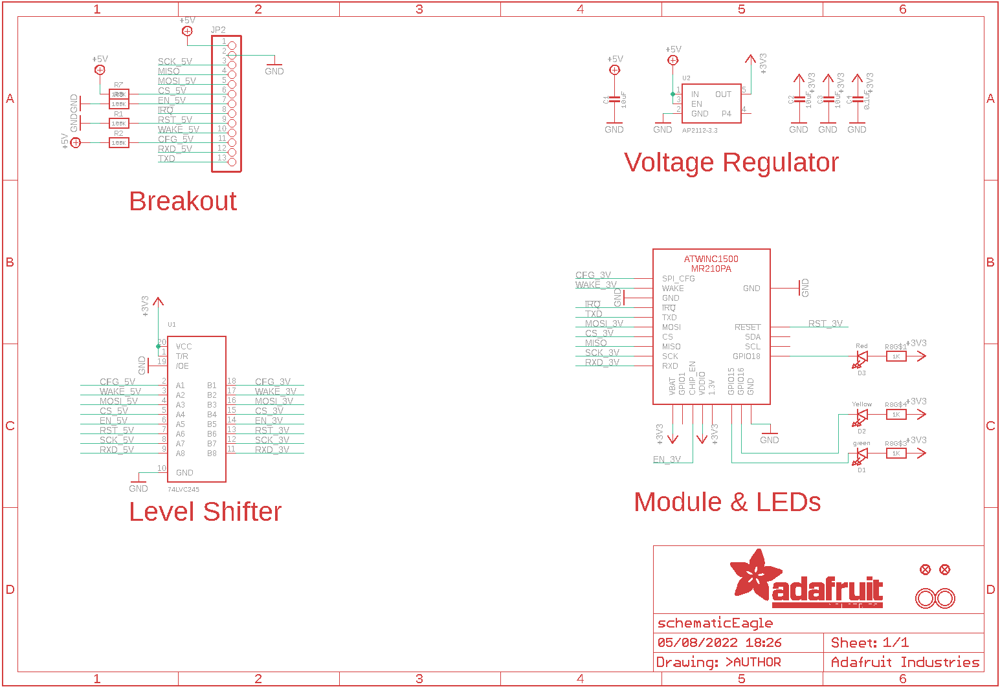

Contents
========

* [PRA2999 > Adafruit](#pra2999--adafruit)
	* [Schematic](#schematic)
	* [Interactive BOM](#interactive-bom)
	* [OOMP Parts](#oomp-parts)
	* [Images](#images)
	* [Tags](#tags)
  
![][im]
# PRA2999 > Adafruit

- ID: PROJ-ADAF-2999-STAN-01
- Hex ID: PRA2999
- Name: Adafruit
- Description: Adafruit
- Long Link: [http://oom.lt/PROJ-ADAF-2999-STAN-01](http://oom.lt/PROJ-ADAF-2999-STAN-01)
- Short Link: [http://oom.lt/PRA2999](http://oom.lt/PRA2999)

## Schematic
  

## Interactive BOM

- Interactive BOM page: [ibom.html](https://htmlpreview.github.io/?https://github.com/oomlout/oomlout_OOMP_projects/blob/main/PROJ-ADAF-2999-STAN-01/kicad/bom/ibom.html)

## OOMP Parts
  

|OOMP Parts|
| :---: |
|C1,CAPC-0805-X-UF10-V10,C1,10uF,CAP_CERAMIC0805-NOOUTLINE,0805-NO,Ceramic Capacitors,,|
|C2,CAPC-UNMATCHED-X-UF10-01,C2,10uF,CAP_CERAMIC0805_10MGAP,0805_10MGAP,Ceramic Capacitors,,|
|C3,CAPC-0805-X-UF10-V10,C3,10uF,CAP_CERAMIC0805-NOOUTLINE,0805-NO,Ceramic Capacitors,,|
|C4,CAPC-0805-X-NF100-V50,C4,0.1uF,CAP_CERAMIC0805-NOOUTLINE,0805-NO,Ceramic Capacitors,,|
|D1,LEDS-0805-G-STAN-01,D1,green,LED0805_NOOUTLINE,CHIPLED_0805_NOOUTLINE,LED,,|
|D2,LEDS-0805-G-STAN-01,D2,Yellow,LED0805_NOOUTLINE,CHIPLED_0805_NOOUTLINE,LED,,|
|D3,LEDS-0805-G-STAN-01,D3,Red,LED0805_NOOUTLINE,CHIPLED_0805_NOOUTLINE,LED,,|
|JP2,HEAD-I01-X-PI13-01,FID1,FIDUCIAL,FIDUCIAL,FIDUCIAL_1MM,Fiducial Alignment Points,EXCLUDE,|
|R1,RESE-0805-X-O1003-01,FID2,FIDUCIAL,FIDUCIAL,FIDUCIAL_1MM,Fiducial Alignment Points,EXCLUDE,|
|R2,RESE-0805-X-O1003-01,JP2,,HEADER-1X13,1X13_ROUND_70,,,|
|R3,RESE-0805-X-O1003-01,R1,100K,RESISTOR0805_NOOUTLINE,0805-NO,Resistors,,|
|R7,RESE-0805-X-O1003-01,R2,100K,RESISTOR0805_NOOUTLINE,0805-NO,Resistors,,|
|R8,RESE-UNMATCHED-X-O102-01,R3,100K,RESISTOR_0805MP,_0805MP,Resistors,,|
|U$1,UNMATCHED-UNMATCHED-X-UNMATCHED-01,R7,100K,RESISTOR_0805MP,_0805MP,Resistors,,|
|U1,UNMATCHED-UNMATCHED-X-UNMATCHED-01,R8,1K,RESISTOR_4PACK,RESPACK_4X0603,Resistor Packs (4 resistors),,|
|U2,UNMATCHED-SO235-X-UNMATCHED-01,U$1,ATWINC1500_MR210PB,ATWINC1500_MR210PA,ATWINC1500_MR210PA,ATWINC1500_MR210PA wifi module,,|

## Images
  
  

|kicadPcb3d|kicadPcb3dFront|kicadPcb3dBack|eagleImage|eagleSchemImage|
| :---: | :---: | :---: | :---: | :---: |
||||||

## Tags

- hexID: PRA2999
- oompType: PROJ
- oompSize: ADAF
- oompColor: 2999
- oompDesc: STAN
- oompIndex: 01
- oompName: Adafruit ATWINC1500 WiFi Breakout PCB
- sources: All source files from https://github.com/adafruit/Adafruit-ATWINC1500-WiFi-Breakout-PCB (source licence details in srcLicense.md)
- linkBuyPage: http://www.adafruit.com/products/2999
- oompID: PROJ-ADAF-2999-STAN-01
- oompParts: C1,CAPC-0805-X-UF10-V10
- oompParts: C2,CAPC-UNMATCHED-X-UF10-01
- oompParts: C3,CAPC-0805-X-UF10-V10
- oompParts: C4,CAPC-0805-X-NF100-V50
- oompParts: D1,LEDS-0805-G-STAN-01
- oompParts: D2,LEDS-0805-G-STAN-01
- oompParts: D3,LEDS-0805-G-STAN-01
- oompParts: JP2,HEAD-I01-X-PI13-01
- oompParts: R1,RESE-0805-X-O1003-01
- oompParts: R2,RESE-0805-X-O1003-01
- oompParts: R3,RESE-0805-X-O1003-01
- oompParts: R7,RESE-0805-X-O1003-01
- oompParts: R8,RESE-UNMATCHED-X-O102-01
- oompParts: U$1,UNMATCHED-UNMATCHED-X-UNMATCHED-01
- oompParts: U1,UNMATCHED-UNMATCHED-X-UNMATCHED-01
- oompParts: U2,UNMATCHED-SO235-X-UNMATCHED-01
- rawParts: C1,10uF,CAP_CERAMIC0805-NOOUTLINE,0805-NO,Ceramic Capacitors,,
- rawParts: C2,10uF,CAP_CERAMIC0805_10MGAP,0805_10MGAP,Ceramic Capacitors,,
- rawParts: C3,10uF,CAP_CERAMIC0805-NOOUTLINE,0805-NO,Ceramic Capacitors,,
- rawParts: C4,0.1uF,CAP_CERAMIC0805-NOOUTLINE,0805-NO,Ceramic Capacitors,,
- rawParts: D1,green,LED0805_NOOUTLINE,CHIPLED_0805_NOOUTLINE,LED,,
- rawParts: D2,Yellow,LED0805_NOOUTLINE,CHIPLED_0805_NOOUTLINE,LED,,
- rawParts: D3,Red,LED0805_NOOUTLINE,CHIPLED_0805_NOOUTLINE,LED,,
- rawParts: FID1,FIDUCIAL,FIDUCIAL,FIDUCIAL_1MM,Fiducial Alignment Points,EXCLUDE,
- rawParts: FID2,FIDUCIAL,FIDUCIAL,FIDUCIAL_1MM,Fiducial Alignment Points,EXCLUDE,
- rawParts: JP2,,HEADER-1X13,1X13_ROUND_70,,,
- rawParts: R1,100K,RESISTOR0805_NOOUTLINE,0805-NO,Resistors,,
- rawParts: R2,100K,RESISTOR0805_NOOUTLINE,0805-NO,Resistors,,
- rawParts: R3,100K,RESISTOR_0805MP,_0805MP,Resistors,,
- rawParts: R7,100K,RESISTOR_0805MP,_0805MP,Resistors,,
- rawParts: R8,1K,RESISTOR_4PACK,RESPACK_4X0603,Resistor Packs (4 resistors),,
- rawParts: U$1,ATWINC1500_MR210PB,ATWINC1500_MR210PA,ATWINC1500_MR210PA,ATWINC1500_MR210PA wifi module,,
- rawParts: U$2,MOUNTINGHOLE2.5,MOUNTINGHOLE2.5,MOUNTINGHOLE_2.5_PLATED,Mounting Hole,EXCLUDE,
- rawParts: U$3,MOUNTINGHOLE2.5,MOUNTINGHOLE2.5,MOUNTINGHOLE_2.5_PLATED,Mounting Hole,EXCLUDE,
- rawParts: U1,74LVC245,74LCX245,TSSOP20,74LCX245MTC - 5.0V Tolerant Bi-Directional Buffer,,
- rawParts: U2,AP2112-3.3,VREG_SOT23-5,SOT23-5,SOT23-5 Fixed Voltage Regulators,,

[im]: kicadPcb3d_450.png
