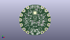
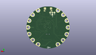
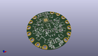

Contents
========

* [PROJ-ADAF-3000-STAN-01>Adafruit Circuit Playground PCB](#proj-adaf-3000-stan-01adafruit-circuit-playground-pcb)
	* [Images](#images)
	* [Interactive BOM](#interactive-bom)
	* [OOMP Parts](#oomp-parts)
	* [Tags](#tags)
  
![][im]
# PROJ-ADAF-3000-STAN-01>Adafruit Circuit Playground PCB

- ID: PROJ-ADAF-3000-STAN-01
- Hex ID: PRA3000
- Name: Adafruit Circuit Playground PCB
- Description: 

## Images
  
  

|eagleImage|kicadPcb3dFront|kicadPcb3dBack|kicadPcb3d|
| :---: | :---: | :---: | :---: |
|||||

## Interactive BOM

- Interactive BOM page: [ibom.html](kicad/bom/ibom.html)

## OOMP Parts
  

|OOMP Parts|
| :---: |
|UNMATCHED-UNMATCHED-X-UNMATCHED-01, 3.3VTAP, -22.6695, 0.0, 90,3.3VTAP, SEWTAP-ALLIGATOR, SEWALLI, microbuilder, (-0.8925, 0), R90|
|UNMATCHED-UNMATCHED-X-UNMATCHED-01, 3V3TAP2, 11.302999999999999, 19.685, 330,3V3TAP2, SEWTAP-ALLIGATOR, SEWALLI, microbuilder, (0.445, 0.775), R330|
|<table><tr><td></td><td> C1</td><td>[CAPC-0603-X-NF100-V50 SMD (0603) 100 nF Capacitor (Ceramic) 50v](https://github.com/oomlout/oomlout_OOMP_parts/tree/main/CAPC-0603-X-NF100-V50/)</td><td>[C6N100](https://github.com/oomlout/oomlout_OOMP_parts/tree/main/CAPC-0603-X-NF100-V50/)</td></tr></table>|
|CAPC-0603-X-UNMATCHED-01, C2, -10.16, 11.43, 0,C2, 1uF, 0603-NO, microbuilder, (-0.4, 0.45), R0|
|CAPC-0603-X-UNMATCHED-01, C3, -0.7619999999999999, -3.937, 0,C3, 1uF, 0603-NO, microbuilder, (-0.03, -0.155), R0|
|CAPC-0805-X-UNMATCHED-01, C4, 7.238999999999999, -20.955, 90,C4, 10uF, 0805-NO, microbuilder, (0.285, -0.825), R90|
|CAPC-0603-X-UNMATCHED-01, C5, -7.112, -20.32, 270,C5, 1uF, 0603-NO, microbuilder, (-0.28, -0.8), R270|
|CAPC-0603-X-UNMATCHED-01, C6, 13.97, -2.794, 0,C6, 1uF, 0603-NO, microbuilder, (0.55, -0.11), R0|
|CAPC-0603-X-UNMATCHED-01, C7, 5.715, 8.636000000000001, 0,C7, 1uF, 0603-NO, microbuilder, (0.225, 0.34), R0|
|CAPC-0805-X-UNMATCHED-01, C8, 3.429, -15.620999999999999, 180,C8, 10uF, 0805-NO, microbuilder, (0.135, -0.615), R180|
|CAPC-0603-X-UNMATCHED-01, C9, 10.540999999999999, -8.128, 270,C9, 1uF, 0603-NO, microbuilder, (0.415, -0.32), R270|
|ERROR, CN1 MicroB USB, 0, 0, 0,CN1, MicroB, USB, 4UCONN_20329_V2, microbuilder, (0, 0.82), R180|
|ERROR, D1 SCHOTTKY (1A), 0, 0, 0,D1, SCHOTTKY, (1A), SOD-123, microbuilder, (0.215, -0.83), R90|
|ERROR, D2 SCHOTTKY (1A), 0, 0, 0,D2, SCHOTTKY, (1A), SOD-123, microbuilder, (-0.215, -0.835), R270|
|UNMATCHED-UNMATCHED-X-UNMATCHED-01, D4, -4.699, -5.968999999999999, 90,D4, 1N4148, SOD-323, microbuilder, (-0.185, -0.235), R90|
|UNMATCHED-UNMATCHED-X-UNMATCHED-01, D6, 21.336, -7.746999999999999, 250,D6, SEWTAP-ALLIGATOR, SEWALLI, microbuilder, (0.84, -0.305), R250|
|UNMATCHED-UNMATCHED-X-UNMATCHED-01, GND3TAP, -11.3665, 19.621499999999997, 30,GND3TAP, SEWTAP-ALLIGATOR, SEWALLI, microbuilder, (-0.4475, 0.7725), R30|
|UNMATCHED-UNMATCHED-X-UNMATCHED-01, GNDTAP, 22.6695, 0.0, 270,GNDTAP, SEWTAP-ALLIGATOR, SEWALLI, microbuilder, (0.8925, 0), R270|
|UNMATCHED-UNMATCHED-X-UNMATCHED-01, GNDTAP2, -11.302999999999999, -19.685, 150,GNDTAP2, SEWTAP-ALLIGATOR, SEWALLI, microbuilder, (-0.445, -0.775), R150|
|UNMATCHED-UNMATCHED-X-UNMATCHED-01, IC1, 0.0, 11.684, 180,IC1, ATMEGA32U4-MU, TQFN44_7MM, microbuilder, (0, 0.46), R180|
|UNMATCHED-UNMATCHED-X-UNMATCHED-01, IC2, 9.524999999999999, -4.953, 270,IC2, LMV358MM, MSOP08, linear, (0.375, -0.195), R270|
|UNMATCHED-UNMATCHED-X-UNMATCHED-01, IC4, 0.0, 0.0, 270,IC4, LIS3DH, LGA16_3X3MM, microbuilder, (0, 0), R270|
|UNMATCHED-UNMATCHED-X-UNMATCHED-01, IO9, 21.336, 7.746999999999999, 290,IO9, SEWTAP-ALLIGATOR, SEWALLI, microbuilder, (0.84, 0.305), R290|
|UNMATCHED-UNMATCHED-X-UNMATCHED-01, IO10, 17.399, 14.604999999999999, 310,IO10, SEWTAP-ALLIGATOR, SEWALLI, microbuilder, (0.685, 0.575), R310|
|UNMATCHED-UNMATCHED-X-UNMATCHED-01, IO12, 17.399, -14.604999999999999, 230,IO12, SEWTAP-ALLIGATOR, SEWALLI, microbuilder, (0.685, -0.575), R230|
|LEDS-UNMATCHED-X-UNMATCHED-01, L, 6.223, 22.098, 0,L, RED, CHIPLED_0805_NOOUTLINE, microbuilder, (0.245, 0.87), R0|
|UNMATCHED-UNMATCHED-X-UNMATCHED-01, LED1, 15.112999999999998, -8.128, 60,LED1, WS2812B3535, LED3535, microbuilder, (0.595, -0.32), R60|
|UNMATCHED-UNMATCHED-X-UNMATCHED-01, LED2, 8.636000000000001, -14.858999999999998, 30,LED2, WS2812B3535, LED3535, microbuilder, (0.34, -0.585), R30|
|UNMATCHED-UNMATCHED-X-UNMATCHED-01, LED3, 17.145, -0.254, 90,LED3, WS2812B3535, LED3535, microbuilder, (0.675, -0.01), R90|
|UNMATCHED-UNMATCHED-X-UNMATCHED-01, LED4, 14.985999999999999, 8.254999999999999, 120,LED4, WS2812B3535, LED3535, microbuilder, (0.59, 0.325), R120|
|UNMATCHED-UNMATCHED-X-UNMATCHED-01, LED5, 8.509, 14.858999999999998, 150,LED5, WS2812B3535, LED3535, microbuilder, (0.335, 0.585), R150|
|UNMATCHED-UNMATCHED-X-UNMATCHED-01, LED6, -8.762999999999998, 14.985999999999999, 210,LED6, WS2812B3535, LED3535, microbuilder, (-0.345, 0.59), R210|
|UNMATCHED-UNMATCHED-X-UNMATCHED-01, LED7, -14.858999999999998, 8.509, 240,LED7, WS2812B3535, LED3535, microbuilder, (-0.585, 0.335), R240|
|UNMATCHED-UNMATCHED-X-UNMATCHED-01, LED8, -17.145, 0.0, 270,LED8, WS2812B3535, LED3535, microbuilder, (-0.675, 0), R270|
|UNMATCHED-UNMATCHED-X-UNMATCHED-01, LED9, -14.858999999999998, -8.889999999999999, 300,LED9, WS2812B3535, LED3535, microbuilder, (-0.585, -0.35), R300|
|UNMATCHED-UNMATCHED-X-UNMATCHED-01, LED10, -8.128, -15.112999999999998, 330,LED10, WS2812B3535, LED3535, microbuilder, (-0.32, -0.595), R330|
|UNMATCHED-UNMATCHED-X-UNMATCHED-01, PWR, -6.35, 21.843999999999998, 0,PWR, GREEN, CHIPLED_0805_NOOUTLINE, microbuilder, (-0.25, 0.86), R0|
|UNMATCHED-UNMATCHED-X-UNMATCHED-01, Q1, -13.843, -4.3180000000000005, 180,Q1, MMBT2222, SOT23-WIDE, microbuilder, (-0.545, -0.17), R180|
|RESE-0603-X-UNMATCHED-01, R1, 3.429, 17.018, 270,R1, 22, 0603-NO, microbuilder, (0.135, 0.67), R270|
|RESE-0603-X-UNMATCHED-01, R2, 1.27, 17.399, 0,R2, 22, 0603-NO, microbuilder, (0.05, 0.685), R0|
|RESE-0603-X-UNMATCHED-01, R3, -7.112, 19.304, 180,R3, 1K, 0603-NO, microbuilder, (-0.28, 0.76), R180|
|<table><tr><td></td><td> R4</td><td>[RESE-0603-X-O103-01 SMD (0603) 10k Ohm Resistor](https://github.com/oomlout/oomlout_OOMP_parts/tree/main/RESE-0603-X-O103-01/)</td><td>[R6103](https://github.com/oomlout/oomlout_OOMP_parts/tree/main/RESE-0603-X-O103-01/)</td></tr></table>|
|RESE-0603-X-UNMATCHED-01, R5, 7.112, 19.558, 0,R5, 1K, 0603-NO, microbuilder, (0.28, 0.77), R0|
|<table><tr><td></td><td> R6</td><td>[RESE-0603-X-O103-01 SMD (0603) 10k Ohm Resistor](https://github.com/oomlout/oomlout_OOMP_parts/tree/main/RESE-0603-X-O103-01/)</td><td>[R6103](https://github.com/oomlout/oomlout_OOMP_parts/tree/main/RESE-0603-X-O103-01/)</td></tr></table>|
|<table><tr><td></td><td> R7</td><td>[RESE-0603-X-O103-01 SMD (0603) 10k Ohm Resistor](https://github.com/oomlout/oomlout_OOMP_parts/tree/main/RESE-0603-X-O103-01/)</td><td>[R6103](https://github.com/oomlout/oomlout_OOMP_parts/tree/main/RESE-0603-X-O103-01/)</td></tr></table>|
|RESE-0603-X-UNMATCHED-01, R8, 5.206999999999999, -4.826, 0,R8, 1K, 0603-NO, microbuilder, (0.205, -0.19), R0|
|<table><tr><td></td><td> R9</td><td>[RESE-0603-X-O104-01 SMD (0603) 100k Ohm Resistor](https://github.com/oomlout/oomlout_OOMP_parts/tree/main/RESE-0603-X-O104-01/)</td><td>[R6104](https://github.com/oomlout/oomlout_OOMP_parts/tree/main/RESE-0603-X-O104-01/)</td></tr></table>|
|<table><tr><td></td><td> R10</td><td>[RESE-0603-X-O103-01 SMD (0603) 10k Ohm Resistor](https://github.com/oomlout/oomlout_OOMP_parts/tree/main/RESE-0603-X-O103-01/)</td><td>[R6103](https://github.com/oomlout/oomlout_OOMP_parts/tree/main/RESE-0603-X-O103-01/)</td></tr></table>|
|<table><tr><td></td><td> R11</td><td>[RESE-0603-X-O203-01 SMD (0603) 20k Ohm Resistor](https://github.com/oomlout/oomlout_OOMP_parts/tree/main/RESE-0603-X-O203-01/)</td><td>[R6203](https://github.com/oomlout/oomlout_OOMP_parts/tree/main/RESE-0603-X-O203-01/)</td></tr></table>|
|<table><tr><td></td><td> R13</td><td>[RESE-0603-X-O103-01 SMD (0603) 10k Ohm Resistor](https://github.com/oomlout/oomlout_OOMP_parts/tree/main/RESE-0603-X-O103-01/)</td><td>[R6103](https://github.com/oomlout/oomlout_OOMP_parts/tree/main/RESE-0603-X-O103-01/)</td></tr></table>|
|<table><tr><td></td><td> R14</td><td>[RESE-0603-X-O103-01 SMD (0603) 10k Ohm Resistor](https://github.com/oomlout/oomlout_OOMP_parts/tree/main/RESE-0603-X-O103-01/)</td><td>[R6103](https://github.com/oomlout/oomlout_OOMP_parts/tree/main/RESE-0603-X-O103-01/)</td></tr></table>|
|RESE-UNMATCHED-X-UNMATCHED-01, R15, -5.968999999999999, 6.095999999999999, 0,R15, 1M, RESPACK_4X0603_NO, microbuilder, (-0.235, 0.24), R0|
|RESE-0603-X-UNMATCHED-01, R21, -4.3180000000000005, -1.397, 0,R21, 100, 0603-NO, microbuilder, (-0.17, -0.055), R0|
|RESE-UNMATCHED-X-UNMATCHED-01, R22, 5.968999999999999, 6.095999999999999, 180,R22, 1M, RESPACK_4X0603_NO, microbuilder, (0.235, 0.24), R180|
|UNMATCHED-UNMATCHED-X-UNMATCHED-01, RESET, 0.0, 4.191, 180,RESET, KMR2, BTN_KMR2_4.6X2.8, microbuilder, (0, 0.165), R180|
|UNMATCHED-UNMATCHED-X-UNMATCHED-01, RX, -21.2725, -8.001, 110,RX, SEWTAP-ALLIGATOR, SEWALLI, microbuilder, (-0.8375, -0.315), R110|
|UNMATCHED-UNMATCHED-X-UNMATCHED-01, SCL, -17.399, 14.5415, 50,SCL, SEWTAP-ALLIGATOR, SEWALLI, microbuilder, (-0.685, 0.5725), R50|
|UNMATCHED-UNMATCHED-X-UNMATCHED-01, SDA, -21.336, 7.746999999999999, 70,SDA, SEWTAP-ALLIGATOR, SEWALLI, microbuilder, (-0.84, 0.305), R70|
|UNMATCHED-UNMATCHED-X-UNMATCHED-01, SP1, -8.636000000000001, -6.858, 0,SP1, 8MM, BUZZER_SMT_5MM, microbuilder, (-0.34, -0.27), R0|
|UNMATCHED-UNMATCHED-X-UNMATCHED-01, SW1, -10.16, 0.635, 180,SW1, EVQQ, EVQ-Q2_SMALLER, microbuilder, (-0.4, 0.025), R180|
|UNMATCHED-UNMATCHED-X-UNMATCHED-01, SW2, 10.16, 0.635, 180,SW2, EVQQ, EVQ-Q2_SMALLER, microbuilder, (0.4, 0.025), R180|
|UNMATCHED-UNMATCHED-X-UNMATCHED-01, SWITCH, 0.0, -8.254999999999999, 0,SWITCH, EG1390, EG1390, adafruit, (0, -0.325), R0|
|UNMATCHED-0402-X-UNMATCHED-01, THM1, 10.287, 8.254999999999999, 0,THM1, 10K, _0402, microbuilder, (0.405, 0.325), R0|
|UNMATCHED-UNMATCHED-X-UNMATCHED-01, TX, -17.145, -14.858999999999998, 130,TX, SEWTAP-ALLIGATOR, SEWALLI, microbuilder, (-0.675, -0.585), R130|
|UNMATCHED-UNMATCHED-X-UNMATCHED-01, U1, 8.128, -8.254999999999999, 90,U1, SPW2430, SPW2430HR5H-B, microbuilder, (0.32, -0.325), R90|
|UNMATCHED-UNMATCHED-X-UNMATCHED-01, U2, -10.16, 8.254999999999999, 0,U2, ALS-PT19-315C, ALS-PT19-315C, microbuilder, (-0.4, 0.325), R0|
|UNMATCHED-UNMATCHED-X-UNMATCHED-01, U3, -3.6829999999999994, -14.731999999999998, 0,U3, AP2112K-3.3, SOT23-5, microbuilder, (-0.145, -0.58), R0|
|UNMATCHED-UNMATCHED-X-UNMATCHED-01, VCC2, 11.302999999999999, -19.685, 210,VCC2, SEWTAP-ALLIGATOR, SEWALLI, microbuilder, (0.445, -0.775), R210|
|UNMATCHED-UNMATCHED-X-UNMATCHED-01, Y1, -6.476999999999999, 12.191999999999998, 45,Y1, 8MHz, RESONATOR-SMD, SparkFun, (-0.255, 0.48), R45|

## Tags

- hexID: PRA3000
- oompType: PROJ
- oompSize: ADAF
- oompColor: 3000
- oompDesc: STAN
- oompIndex: 01
- oompName: Adafruit Circuit Playground PCB
- sources: All source files from https://github.com/adafruit/Adafruit-Circuit-Playground-PCB (source licence details in srcLicense.md)
- linkBuyPage: http://www.adafruit.com/products/3000
- oompPart: UNMATCHED-UNMATCHED-X-UNMATCHED-01, 3.3VTAP, -22.6695, 0.0, 90
- oompPart: UNMATCHED-UNMATCHED-X-UNMATCHED-01, 3V3TAP2, 11.302999999999999, 19.685, 330
- oompPart: SKIP-UNMATCHED-X-UNMATCHED-01, BATT, 0.0, -21.59, 180
- oompPart: CAPC-0603-X-NF100-V50, C1, 5.460999999999999, -7.874, 90
- oompPart: CAPC-0603-X-UNMATCHED-01, C2, -10.16, 11.43, 0
- oompPart: CAPC-0603-X-UNMATCHED-01, C3, -0.7619999999999999, -3.937, 0
- oompPart: CAPC-0805-X-UNMATCHED-01, C4, 7.238999999999999, -20.955, 90
- oompPart: CAPC-0603-X-UNMATCHED-01, C5, -7.112, -20.32, 270
- oompPart: CAPC-0603-X-UNMATCHED-01, C6, 13.97, -2.794, 0
- oompPart: CAPC-0603-X-UNMATCHED-01, C7, 5.715, 8.636000000000001, 0
- oompPart: CAPC-0805-X-UNMATCHED-01, C8, 3.429, -15.620999999999999, 180
- oompPart: CAPC-0603-X-UNMATCHED-01, C9, 10.540999999999999, -8.128, 270
- oompPart: ERROR, CN1 MicroB USB, 0, 0, 0
- oompPart: ERROR, D1 SCHOTTKY (1A), 0, 0, 0
- oompPart: ERROR, D2 SCHOTTKY (1A), 0, 0, 0
- oompPart: UNMATCHED-UNMATCHED-X-UNMATCHED-01, D4, -4.699, -5.968999999999999, 90
- oompPart: UNMATCHED-UNMATCHED-X-UNMATCHED-01, D6, 21.336, -7.746999999999999, 250
- oompPart: UNMATCHED-UNMATCHED-X-UNMATCHED-01, GND3TAP, -11.3665, 19.621499999999997, 30
- oompPart: UNMATCHED-UNMATCHED-X-UNMATCHED-01, GNDTAP, 22.6695, 0.0, 270
- oompPart: UNMATCHED-UNMATCHED-X-UNMATCHED-01, GNDTAP2, -11.302999999999999, -19.685, 150
- oompPart: UNMATCHED-UNMATCHED-X-UNMATCHED-01, IC1, 0.0, 11.684, 180
- oompPart: UNMATCHED-UNMATCHED-X-UNMATCHED-01, IC2, 9.524999999999999, -4.953, 270
- oompPart: UNMATCHED-UNMATCHED-X-UNMATCHED-01, IC4, 0.0, 0.0, 270
- oompPart: UNMATCHED-UNMATCHED-X-UNMATCHED-01, IO9, 21.336, 7.746999999999999, 290
- oompPart: UNMATCHED-UNMATCHED-X-UNMATCHED-01, IO10, 17.399, 14.604999999999999, 310
- oompPart: UNMATCHED-UNMATCHED-X-UNMATCHED-01, IO12, 17.399, -14.604999999999999, 230
- oompPart: LEDS-UNMATCHED-X-UNMATCHED-01, L, 6.223, 22.098, 0
- oompPart: UNMATCHED-UNMATCHED-X-UNMATCHED-01, LED1, 15.112999999999998, -8.128, 60
- oompPart: UNMATCHED-UNMATCHED-X-UNMATCHED-01, LED2, 8.636000000000001, -14.858999999999998, 30
- oompPart: UNMATCHED-UNMATCHED-X-UNMATCHED-01, LED3, 17.145, -0.254, 90
- oompPart: UNMATCHED-UNMATCHED-X-UNMATCHED-01, LED4, 14.985999999999999, 8.254999999999999, 120
- oompPart: UNMATCHED-UNMATCHED-X-UNMATCHED-01, LED5, 8.509, 14.858999999999998, 150
- oompPart: UNMATCHED-UNMATCHED-X-UNMATCHED-01, LED6, -8.762999999999998, 14.985999999999999, 210
- oompPart: UNMATCHED-UNMATCHED-X-UNMATCHED-01, LED7, -14.858999999999998, 8.509, 240
- oompPart: UNMATCHED-UNMATCHED-X-UNMATCHED-01, LED8, -17.145, 0.0, 270
- oompPart: UNMATCHED-UNMATCHED-X-UNMATCHED-01, LED9, -14.858999999999998, -8.889999999999999, 300
- oompPart: UNMATCHED-UNMATCHED-X-UNMATCHED-01, LED10, -8.128, -15.112999999999998, 330
- oompPart: UNMATCHED-UNMATCHED-X-UNMATCHED-01, PWR, -6.35, 21.843999999999998, 0
- oompPart: UNMATCHED-UNMATCHED-X-UNMATCHED-01, Q1, -13.843, -4.3180000000000005, 180
- oompPart: RESE-0603-X-UNMATCHED-01, R1, 3.429, 17.018, 270
- oompPart: RESE-0603-X-UNMATCHED-01, R2, 1.27, 17.399, 0
- oompPart: RESE-0603-X-UNMATCHED-01, R3, -7.112, 19.304, 180
- oompPart: RESE-0603-X-O103-01, R4, -10.287, 6.858, 0
- oompPart: RESE-0603-X-UNMATCHED-01, R5, 7.112, 19.558, 0
- oompPart: RESE-0603-X-O103-01, R6, -4.3180000000000005, -3.302, 0
- oompPart: RESE-0603-X-O103-01, R7, 10.413999999999998, 6.604, 0
- oompPart: RESE-0603-X-UNMATCHED-01, R8, 5.206999999999999, -4.826, 0
- oompPart: RESE-0603-X-O104-01, R9, 5.206999999999999, -3.302, 180
- oompPart: RESE-0603-X-O103-01, R10, 11.811, -8.128, 270
- oompPart: RESE-0603-X-O203-01, R11, 13.208, -4.953, 270
- oompPart: RESE-0603-X-O103-01, R13, 14.604999999999999, 4.571999999999999, 180
- oompPart: RESE-0603-X-O103-01, R14, -15.493999999999998, 4.064, 270
- oompPart: RESE-UNMATCHED-X-UNMATCHED-01, R15, -5.968999999999999, 6.095999999999999, 0
- oompPart: RESE-0603-X-UNMATCHED-01, R21, -4.3180000000000005, -1.397, 0
- oompPart: RESE-UNMATCHED-X-UNMATCHED-01, R22, 5.968999999999999, 6.095999999999999, 180
- oompPart: UNMATCHED-UNMATCHED-X-UNMATCHED-01, RESET, 0.0, 4.191, 180
- oompPart: UNMATCHED-UNMATCHED-X-UNMATCHED-01, RX, -21.2725, -8.001, 110
- oompPart: UNMATCHED-UNMATCHED-X-UNMATCHED-01, SCL, -17.399, 14.5415, 50
- oompPart: UNMATCHED-UNMATCHED-X-UNMATCHED-01, SDA, -21.336, 7.746999999999999, 70
- oompPart: UNMATCHED-UNMATCHED-X-UNMATCHED-01, SP1, -8.636000000000001, -6.858, 0
- oompPart: UNMATCHED-UNMATCHED-X-UNMATCHED-01, SW1, -10.16, 0.635, 180
- oompPart: UNMATCHED-UNMATCHED-X-UNMATCHED-01, SW2, 10.16, 0.635, 180
- oompPart: UNMATCHED-UNMATCHED-X-UNMATCHED-01, SWITCH, 0.0, -8.254999999999999, 0
- oompPart: UNMATCHED-0402-X-UNMATCHED-01, THM1, 10.287, 8.254999999999999, 0
- oompPart: SKIP-UNMATCHED-X-UNMATCHED-01, TP1, -7.619999999999999, 17.779999999999998, M270
- oompPart: SKIP-UNMATCHED-X-UNMATCHED-01, TP2, -2.54, 17.779999999999998, M270
- oompPart: SKIP-UNMATCHED-X-UNMATCHED-01, TP3, -5.08, 15.239999999999998, M270
- oompPart: SKIP-UNMATCHED-X-UNMATCHED-01, TP4, -5.08, 17.779999999999998, M270
- oompPart: UNMATCHED-UNMATCHED-X-UNMATCHED-01, TX, -17.145, -14.858999999999998, 130
- oompPart: SKIP-UNMATCHED-X-UNMATCHED-01, U$2, 15.366999999999999, 18.287999999999997, 0
- oompPart: SKIP-UNMATCHED-X-UNMATCHED-01, U$3, -15.493999999999998, -18.668999999999997, 0
- oompPart: SKIP-UNMATCHED-X-UNMATCHED-01, U$6, 15.493999999999998, -18.668999999999997, 0
- oompPart: UNMATCHED-UNMATCHED-X-UNMATCHED-01, U1, 8.128, -8.254999999999999, 90
- oompPart: UNMATCHED-UNMATCHED-X-UNMATCHED-01, U2, -10.16, 8.254999999999999, 0
- oompPart: UNMATCHED-UNMATCHED-X-UNMATCHED-01, U3, -3.6829999999999994, -14.731999999999998, 0
- oompPart: UNMATCHED-UNMATCHED-X-UNMATCHED-01, VCC2, 11.302999999999999, -19.685, 210
- oompPart: UNMATCHED-UNMATCHED-X-UNMATCHED-01, Y1, -6.476999999999999, 12.191999999999998, 45
- rawPart: 3.3VTAP, SEWTAP-ALLIGATOR, SEWALLI, microbuilder, (-0.8925, 0), R90
- rawPart: 3V3TAP2, SEWTAP-ALLIGATOR, SEWALLI, microbuilder, (0.445, 0.775), R330
- rawPart: BATT, 3-6VDC, JSTPH2, microbuilder, (0, -0.85), R180
- rawPart: C1, 0.1uF, 0603-NO, microbuilder, (0.215, -0.31), R90
- rawPart: C2, 1uF, 0603-NO, microbuilder, (-0.4, 0.45), R0
- rawPart: C3, 1uF, 0603-NO, microbuilder, (-0.03, -0.155), R0
- rawPart: C4, 10uF, 0805-NO, microbuilder, (0.285, -0.825), R90
- rawPart: C5, 1uF, 0603-NO, microbuilder, (-0.28, -0.8), R270
- rawPart: C6, 1uF, 0603-NO, microbuilder, (0.55, -0.11), R0
- rawPart: C7, 1uF, 0603-NO, microbuilder, (0.225, 0.34), R0
- rawPart: C8, 10uF, 0805-NO, microbuilder, (0.135, -0.615), R180
- rawPart: C9, 1uF, 0603-NO, microbuilder, (0.415, -0.32), R270
- rawPart: CN1, MicroB, USB, 4UCONN_20329_V2, microbuilder, (0, 0.82), R180
- rawPart: D1, SCHOTTKY, (1A), SOD-123, microbuilder, (0.215, -0.83), R90
- rawPart: D2, SCHOTTKY, (1A), SOD-123, microbuilder, (-0.215, -0.835), R270
- rawPart: D4, 1N4148, SOD-323, microbuilder, (-0.185, -0.235), R90
- rawPart: D6, SEWTAP-ALLIGATOR, SEWALLI, microbuilder, (0.84, -0.305), R250
- rawPart: GND3TAP, SEWTAP-ALLIGATOR, SEWALLI, microbuilder, (-0.4475, 0.7725), R30
- rawPart: GNDTAP, SEWTAP-ALLIGATOR, SEWALLI, microbuilder, (0.8925, 0), R270
- rawPart: GNDTAP2, SEWTAP-ALLIGATOR, SEWALLI, microbuilder, (-0.445, -0.775), R150
- rawPart: IC1, ATMEGA32U4-MU, TQFN44_7MM, microbuilder, (0, 0.46), R180
- rawPart: IC2, LMV358MM, MSOP08, linear, (0.375, -0.195), R270
- rawPart: IC4, LIS3DH, LGA16_3X3MM, microbuilder, (0, 0), R270
- rawPart: IO9, SEWTAP-ALLIGATOR, SEWALLI, microbuilder, (0.84, 0.305), R290
- rawPart: IO10, SEWTAP-ALLIGATOR, SEWALLI, microbuilder, (0.685, 0.575), R310
- rawPart: IO12, SEWTAP-ALLIGATOR, SEWALLI, microbuilder, (0.685, -0.575), R230
- rawPart: L, RED, CHIPLED_0805_NOOUTLINE, microbuilder, (0.245, 0.87), R0
- rawPart: LED1, WS2812B3535, LED3535, microbuilder, (0.595, -0.32), R60
- rawPart: LED2, WS2812B3535, LED3535, microbuilder, (0.34, -0.585), R30
- rawPart: LED3, WS2812B3535, LED3535, microbuilder, (0.675, -0.01), R90
- rawPart: LED4, WS2812B3535, LED3535, microbuilder, (0.59, 0.325), R120
- rawPart: LED5, WS2812B3535, LED3535, microbuilder, (0.335, 0.585), R150
- rawPart: LED6, WS2812B3535, LED3535, microbuilder, (-0.345, 0.59), R210
- rawPart: LED7, WS2812B3535, LED3535, microbuilder, (-0.585, 0.335), R240
- rawPart: LED8, WS2812B3535, LED3535, microbuilder, (-0.675, 0), R270
- rawPart: LED9, WS2812B3535, LED3535, microbuilder, (-0.585, -0.35), R300
- rawPart: LED10, WS2812B3535, LED3535, microbuilder, (-0.32, -0.595), R330
- rawPart: PWR, GREEN, CHIPLED_0805_NOOUTLINE, microbuilder, (-0.25, 0.86), R0
- rawPart: Q1, MMBT2222, SOT23-WIDE, microbuilder, (-0.545, -0.17), R180
- rawPart: R1, 22, 0603-NO, microbuilder, (0.135, 0.67), R270
- rawPart: R2, 22, 0603-NO, microbuilder, (0.05, 0.685), R0
- rawPart: R3, 1K, 0603-NO, microbuilder, (-0.28, 0.76), R180
- rawPart: R4, 10K, 0603-NO, microbuilder, (-0.405, 0.27), R0
- rawPart: R5, 1K, 0603-NO, microbuilder, (0.28, 0.77), R0
- rawPart: R6, 10K, 0603-NO, microbuilder, (-0.17, -0.13), R0
- rawPart: R7, 10K, 0603-NO, microbuilder, (0.41, 0.26), R0
- rawPart: R8, 1K, 0603-NO, microbuilder, (0.205, -0.19), R0
- rawPart: R9, 100K, 0603-NO, microbuilder, (0.205, -0.13), R180
- rawPart: R10, 10K, 0603-NO, microbuilder, (0.465, -0.32), R270
- rawPart: R11, 20K, 0603-NO, microbuilder, (0.52, -0.195), R270
- rawPart: R13, 10K, 0603-NO, microbuilder, (0.575, 0.18), R180
- rawPart: R14, 10K, 0603-NO, microbuilder, (-0.61, 0.16), R270
- rawPart: R15, 1M, RESPACK_4X0603_NO, microbuilder, (-0.235, 0.24), R0
- rawPart: R21, 100, 0603-NO, microbuilder, (-0.17, -0.055), R0
- rawPart: R22, 1M, RESPACK_4X0603_NO, microbuilder, (0.235, 0.24), R180
- rawPart: RESET, KMR2, BTN_KMR2_4.6X2.8, microbuilder, (0, 0.165), R180
- rawPart: RX, SEWTAP-ALLIGATOR, SEWALLI, microbuilder, (-0.8375, -0.315), R110
- rawPart: SCL, SEWTAP-ALLIGATOR, SEWALLI, microbuilder, (-0.685, 0.5725), R50
- rawPart: SDA, SEWTAP-ALLIGATOR, SEWALLI, microbuilder, (-0.84, 0.305), R70
- rawPart: SP1, 8MM, BUZZER_SMT_5MM, microbuilder, (-0.34, -0.27), R0
- rawPart: SW1, EVQQ, EVQ-Q2_SMALLER, microbuilder, (-0.4, 0.025), R180
- rawPart: SW2, EVQQ, EVQ-Q2_SMALLER, microbuilder, (0.4, 0.025), R180
- rawPart: SWITCH, EG1390, EG1390, adafruit, (0, -0.325), R0
- rawPart: THM1, 10K, _0402, microbuilder, (0.405, 0.325), R0
- rawPart: TP1, MISO, TESTPOINT_ROUND_1.5MM, microbuilder, (-0.3, 0.7), MR270
- rawPart: TP2, SCK, TESTPOINT_ROUND_1.5MM, microbuilder, (-0.1, 0.7), MR270
- rawPart: TP3, RST, TESTPOINT_ROUND_1.5MM, microbuilder, (-0.2, 0.6), MR270
- rawPart: TP4, MOSI, TESTPOINT_ROUND_1.5MM, microbuilder, (-0.2, 0.7), MR270
- rawPart: TX, SEWTAP-ALLIGATOR, SEWALLI, microbuilder, (-0.675, -0.585), R130
- rawPart: U$2, FIDUCIAL, FIDUCIAL_1MM, microbuilder, (0.605, 0.72), R0
- rawPart: U$3, FIDUCIAL, FIDUCIAL_1MM, microbuilder, (-0.61, -0.735), R0
- rawPart: U$6, FIDUCIAL, FIDUCIAL_1MM, microbuilder, (0.61, -0.735), R0
- rawPart: U1, SPW2430, SPW2430HR5H-B, microbuilder, (0.32, -0.325), R90
- rawPart: U2, ALS-PT19-315C, ALS-PT19-315C, microbuilder, (-0.4, 0.325), R0
- rawPart: U3, AP2112K-3.3, SOT23-5, microbuilder, (-0.145, -0.58), R0
- rawPart: VCC2, SEWTAP-ALLIGATOR, SEWALLI, microbuilder, (0.445, -0.775), R210
- rawPart: Y1, 8MHz, RESONATOR-SMD, SparkFun, (-0.255, 0.48), R45
- oompID: PROJ-ADAF-3000-STAN-01

[im]: kicadPcb3d_450.png
