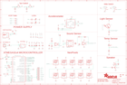

Contents
========

* [PRA3000 > Adafruit](#pra3000--adafruit)
	* [Schematic](#schematic)
	* [Interactive BOM](#interactive-bom)
	* [OOMP Parts](#oomp-parts)
	* [Images](#images)
	* [Tags](#tags)
  
![][im]
# PRA3000 > Adafruit

- ID: PROJ-ADAF-3000-STAN-01
- Hex ID: PRA3000
- Name: Adafruit
- Description: Adafruit
- Long Link: [http://oom.lt/PROJ-ADAF-3000-STAN-01](http://oom.lt/PROJ-ADAF-3000-STAN-01)
- Long Link: [http://oom.lt/PRA3000](http://oom.lt/PRA3000)

## Schematic
  
![][schem]
## Interactive BOM

- Interactive BOM page: [ibom.html](https://htmlpreview.github.io/?https://github.com/oomlout/oomlout_OOMP_projects/blob/main/PROJ-ADAF-3000-STAN-01/kicad/bom/ibom.html)

## OOMP Parts
  

|OOMP Parts|
| :---: |
|3.3VTAP,UNMATCHED-UNMATCHED-UNMATCHED-UNMATCHED-UNMATCHED,3.3VTAP,SEWTAP-ALLIGATOR,SEWTAP-ALLIGATOR,SEWALLI,,,|
|3V3TAP2,UNMATCHED-UNMATCHED-UNMATCHED-UNMATCHED-UNMATCHED,3V3TAP2,SEWTAP-ALLIGATOR,SEWTAP-ALLIGATOR,SEWALLI,,,|
|BATT,UNMATCHED-UNMATCHED-UNMATCHED-UNMATCHED-UNMATCHED,BATT,3-6VDC,CON_JST_PH_2PIN,JSTPH2,JST 2-Pin Right-Angle Connector,,|
|C1,UNMATCHED-UNMATCHED-UNMATCHED-UNMATCHED-UNMATCHED,C1,0.1uF,CAP_CERAMIC0603_NO,0603-NO,Ceramic Capacitors,,|
|C2,UNMATCHED-UNMATCHED-UNMATCHED-UNMATCHED-UNMATCHED,C2,1uF,CAP_CERAMIC0603_NO,0603-NO,Ceramic Capacitors,,|
|C3,UNMATCHED-UNMATCHED-UNMATCHED-UNMATCHED-UNMATCHED,C3,1uF,CAP_CERAMIC0603_NO,0603-NO,Ceramic Capacitors,,|
|C4,UNMATCHED-UNMATCHED-UNMATCHED-UNMATCHED-UNMATCHED,C4,10uF,CAP_CERAMIC0805-NOOUTLINE,0805-NO,Ceramic Capacitors,,|
|C5,UNMATCHED-UNMATCHED-UNMATCHED-UNMATCHED-UNMATCHED,C5,1uF,CAP_CERAMIC0603_NO,0603-NO,Ceramic Capacitors,,|
|C6,UNMATCHED-UNMATCHED-UNMATCHED-UNMATCHED-UNMATCHED,C6,1uF,CAP_CERAMIC0603_NO,0603-NO,Ceramic Capacitors,,|
|C7,UNMATCHED-UNMATCHED-UNMATCHED-UNMATCHED-UNMATCHED,C7,1uF,CAP_CERAMIC0603_NO,0603-NO,Ceramic Capacitors,,|
|C8,UNMATCHED-UNMATCHED-UNMATCHED-UNMATCHED-UNMATCHED,C8,10uF,CAP_CERAMIC0805-NOOUTLINE,0805-NO,Ceramic Capacitors,,|
|C9,UNMATCHED-UNMATCHED-UNMATCHED-UNMATCHED-UNMATCHED,C9,1uF,CAP_CERAMIC0603_NO,0603-NO,Ceramic Capacitors,,|
|CN1,UNMATCHED-UNMATCHED-UNMATCHED-UNMATCHED-UNMATCHED,CN1,MicroB USB,USB_MICRO_20329_V2,4UCONN_20329_V2,USB Connectors,,|
|D1,UNMATCHED-UNMATCHED-UNMATCHED-UNMATCHED-UNMATCHED,D1,SCHOTTKY (1A),DIODESOD-123,SOD-123,Diode,,|
|D2,UNMATCHED-UNMATCHED-UNMATCHED-UNMATCHED-UNMATCHED,D2,SCHOTTKY (1A),DIODESOD-123,SOD-123,Diode,,|
|D4,UNMATCHED-UNMATCHED-UNMATCHED-UNMATCHED-UNMATCHED,D4,1N4148,DIODESOD-323,SOD-323,Diode,,|
|D6,UNMATCHED-UNMATCHED-UNMATCHED-UNMATCHED-UNMATCHED,D6,SEWTAP-ALLIGATOR,SEWTAP-ALLIGATOR,SEWALLI,,,|
|GND3TAP,UNMATCHED-UNMATCHED-UNMATCHED-UNMATCHED-UNMATCHED,GND3TAP,SEWTAP-ALLIGATOR,SEWTAP-ALLIGATOR,SEWALLI,,,|
|GNDTAP,UNMATCHED-UNMATCHED-UNMATCHED-UNMATCHED-UNMATCHED,GNDTAP,SEWTAP-ALLIGATOR,SEWTAP-ALLIGATOR,SEWALLI,,,|
|GNDTAP2,UNMATCHED-UNMATCHED-UNMATCHED-UNMATCHED-UNMATCHED,GNDTAP2,SEWTAP-ALLIGATOR,SEWTAP-ALLIGATOR,SEWALLI,,,|
|IC1,UNMATCHED-UNMATCHED-UNMATCHED-UNMATCHED-UNMATCHED,IC1,ATMEGA32U4-MU,ATMEGA32U4-MU,TQFN44_7MM,http://www.ladyada.net/library/eagle,,|
|IC2,UNMATCHED-UNMATCHED-UNMATCHED-UNMATCHED-UNMATCHED,IC2,LMV358MM,LMV358MM,MSOP08,Dual General Purpose, Low Voltage, Rail-to-Rail Output Operational Amplifiers,,|
|IC4,UNMATCHED-UNMATCHED-UNMATCHED-UNMATCHED-UNMATCHED,IC4,LIS3DH,ACCEL_LIS3DHTR,LGA16_3X3MM,LIS3DHTR 3-Axis Accelerometer with I2C/SPI Interface,,|
|IO9,UNMATCHED-UNMATCHED-UNMATCHED-UNMATCHED-UNMATCHED,IO9,SEWTAP-ALLIGATOR,SEWTAP-ALLIGATOR,SEWALLI,,,|
|IO10,UNMATCHED-UNMATCHED-UNMATCHED-UNMATCHED-UNMATCHED,IO10,SEWTAP-ALLIGATOR,SEWTAP-ALLIGATOR,SEWALLI,,,|
|IO12,UNMATCHED-UNMATCHED-UNMATCHED-UNMATCHED-UNMATCHED,IO12,SEWTAP-ALLIGATOR,SEWTAP-ALLIGATOR,SEWALLI,,,|
|L,UNMATCHED-UNMATCHED-UNMATCHED-UNMATCHED-UNMATCHED,L,RED,LED0805_NOOUTLINE,CHIPLED_0805_NOOUTLINE,LED,,|
|LED1,UNMATCHED-UNMATCHED-UNMATCHED-UNMATCHED-UNMATCHED,LED1,WS2812B3535,WS2812B3535,LED3535,,,|
|LED2,UNMATCHED-UNMATCHED-UNMATCHED-UNMATCHED-UNMATCHED,LED2,WS2812B3535,WS2812B3535,LED3535,,,|
|LED3,UNMATCHED-UNMATCHED-UNMATCHED-UNMATCHED-UNMATCHED,LED3,WS2812B3535,WS2812B3535,LED3535,,,|
|LED4,UNMATCHED-UNMATCHED-UNMATCHED-UNMATCHED-UNMATCHED,LED4,WS2812B3535,WS2812B3535,LED3535,,,|
|LED5,UNMATCHED-UNMATCHED-UNMATCHED-UNMATCHED-UNMATCHED,LED5,WS2812B3535,WS2812B3535,LED3535,,,|
|LED6,UNMATCHED-UNMATCHED-UNMATCHED-UNMATCHED-UNMATCHED,LED6,WS2812B3535,WS2812B3535,LED3535,,,|
|LED7,UNMATCHED-UNMATCHED-UNMATCHED-UNMATCHED-UNMATCHED,LED7,WS2812B3535,WS2812B3535,LED3535,,,|
|LED8,UNMATCHED-UNMATCHED-UNMATCHED-UNMATCHED-UNMATCHED,LED8,WS2812B3535,WS2812B3535,LED3535,,,|
|LED9,UNMATCHED-UNMATCHED-UNMATCHED-UNMATCHED-UNMATCHED,LED9,WS2812B3535,WS2812B3535,LED3535,,,|
|LED10,UNMATCHED-UNMATCHED-UNMATCHED-UNMATCHED-UNMATCHED,LED10,WS2812B3535,WS2812B3535,LED3535,,,|
|PWR,UNMATCHED-UNMATCHED-UNMATCHED-UNMATCHED-UNMATCHED,PWR,GREEN,LED0805_NOOUTLINE,CHIPLED_0805_NOOUTLINE,LED,,|
|Q1,UNMATCHED-UNMATCHED-UNMATCHED-UNMATCHED-UNMATCHED,Q1,MMBT2222,TRANSISTOR_NPNWIDE,SOT23-WIDE,NPN Transistor,,|
|R1,UNMATCHED-UNMATCHED-UNMATCHED-UNMATCHED-UNMATCHED,R1,22,RESISTOR_0603_NOOUT,0603-NO,Resistors,,|
|R2,UNMATCHED-UNMATCHED-UNMATCHED-UNMATCHED-UNMATCHED,R2,22,RESISTOR_0603_NOOUT,0603-NO,Resistors,,|
|R3,UNMATCHED-UNMATCHED-UNMATCHED-UNMATCHED-UNMATCHED,R3,1K,RESISTOR_0603_NOOUT,0603-NO,Resistors,,|
|R4,UNMATCHED-UNMATCHED-UNMATCHED-UNMATCHED-UNMATCHED,R4,10K,RESISTOR_0603_NOOUT,0603-NO,Resistors,,|
|R5,UNMATCHED-UNMATCHED-UNMATCHED-UNMATCHED-UNMATCHED,R5,1K,RESISTOR_0603_NOOUT,0603-NO,Resistors,,|
|R6,UNMATCHED-UNMATCHED-UNMATCHED-UNMATCHED-UNMATCHED,R6,10K,RESISTOR_0603_NOOUT,0603-NO,Resistors,,|
|R7,UNMATCHED-UNMATCHED-UNMATCHED-UNMATCHED-UNMATCHED,R7,10K,RESISTOR_0603_NOOUT,0603-NO,Resistors,,|
|R8,UNMATCHED-UNMATCHED-UNMATCHED-UNMATCHED-UNMATCHED,R8,1K,RESISTOR_0603_NOOUT,0603-NO,Resistors,,|
|R9,UNMATCHED-UNMATCHED-UNMATCHED-UNMATCHED-UNMATCHED,R9,100K,RESISTOR_0603_NOOUT,0603-NO,Resistors,,|
|R10,UNMATCHED-UNMATCHED-UNMATCHED-UNMATCHED-UNMATCHED,R10,10K,RESISTOR_0603_NOOUT,0603-NO,Resistors,,|
|R11,UNMATCHED-UNMATCHED-UNMATCHED-UNMATCHED-UNMATCHED,R11,20K,RESISTOR_0603_NOOUT,0603-NO,Resistors,,|
|R13,UNMATCHED-UNMATCHED-UNMATCHED-UNMATCHED-UNMATCHED,R13,10K,RESISTOR_0603_NOOUT,0603-NO,Resistors,,|
|R14,UNMATCHED-UNMATCHED-UNMATCHED-UNMATCHED-UNMATCHED,R14,10K,RESISTOR_0603_NOOUT,0603-NO,Resistors,,|
|R15,UNMATCHED-UNMATCHED-UNMATCHED-UNMATCHED-UNMATCHED,R15,1M,RESISTOR_4PACK_NO,RESPACK_4X0603_NO,Resistor Packs (4 resistors),,|
|R21,UNMATCHED-UNMATCHED-UNMATCHED-UNMATCHED-UNMATCHED,R21,100,RESISTOR_0603_NOOUT,0603-NO,Resistors,,|
|R22,UNMATCHED-UNMATCHED-UNMATCHED-UNMATCHED-UNMATCHED,R22,1M,RESISTOR_4PACK_NO,RESPACK_4X0603_NO,Resistor Packs (4 resistors),,|
|RESET,UNMATCHED-UNMATCHED-UNMATCHED-UNMATCHED-UNMATCHED,RESET,KMR2,SWITCH_TACT_SMT4.6X2.8,BTN_KMR2_4.6X2.8,SMT Tact Switches,,|
|RX,UNMATCHED-UNMATCHED-UNMATCHED-UNMATCHED-UNMATCHED,RX,SEWTAP-ALLIGATOR,SEWTAP-ALLIGATOR,SEWALLI,,,|
|SCL,UNMATCHED-UNMATCHED-UNMATCHED-UNMATCHED-UNMATCHED,SCL,SEWTAP-ALLIGATOR,SEWTAP-ALLIGATOR,SEWALLI,,,|
|SDA,UNMATCHED-UNMATCHED-UNMATCHED-UNMATCHED-UNMATCHED,SDA,SEWTAP-ALLIGATOR,SEWTAP-ALLIGATOR,SEWALLI,,,|
|SP1,UNMATCHED-UNMATCHED-UNMATCHED-UNMATCHED-UNMATCHED,SP1,8MM,SPEAKER_BUZZER5MM,BUZZER_SMT_5MM,SPEAKER Source: BuerklinAdded PS12 (for part # PS1240 piezo) http://www.ladyada.net/library/pcb/eaglelibrary.html,,|
|SW1,UNMATCHED-UNMATCHED-UNMATCHED-UNMATCHED-UNMATCHED,SW1,EVQQ,SWITCH_TACT_SMT_EVQQ2_SMALL,EVQ-Q2_SMALLER,SMT Tact Switches,,|
|SW2,UNMATCHED-UNMATCHED-UNMATCHED-UNMATCHED-UNMATCHED,SW2,EVQQ,SWITCH_TACT_SMT_EVQQ2_SMALL,EVQ-Q2_SMALLER,SMT Tact Switches,,|
|SWITCH,UNMATCHED-UNMATCHED-UNMATCHED-UNMATCHED-UNMATCHED,SWITCH,EG1390,DPDT-EG1390,EG1390,,,|
|THM1,UNMATCHED-UNMATCHED-UNMATCHED-UNMATCHED-UNMATCHED,THM1,10K,RESISTOR_0402,_0402,Resistors,,|
|TP1,UNMATCHED-UNMATCHED-UNMATCHED-UNMATCHED-UNMATCHED,TP1,MISO,TESTPOINTROUND1.5MM,TESTPOINT_ROUND_1.5MM,Test Point,,|
|TP2,UNMATCHED-UNMATCHED-UNMATCHED-UNMATCHED-UNMATCHED,TP2,SCK,TESTPOINTROUND1.5MM,TESTPOINT_ROUND_1.5MM,Test Point,,|
|TP3,UNMATCHED-UNMATCHED-UNMATCHED-UNMATCHED-UNMATCHED,TP3,RST,TESTPOINTROUND1.5MM,TESTPOINT_ROUND_1.5MM,Test Point,,|
|TP4,UNMATCHED-UNMATCHED-UNMATCHED-UNMATCHED-UNMATCHED,TP4,MOSI,TESTPOINTROUND1.5MM,TESTPOINT_ROUND_1.5MM,Test Point,,|
|TX,UNMATCHED-UNMATCHED-UNMATCHED-UNMATCHED-UNMATCHED,TX,SEWTAP-ALLIGATOR,SEWTAP-ALLIGATOR,SEWALLI,,,|
|U1,UNMATCHED-UNMATCHED-UNMATCHED-UNMATCHED-UNMATCHED,U$2,FIDUCIAL,FIDUCIAL,FIDUCIAL_1MM,Fiducial Alignment Points,EXCLUDE,|
|U2,UNMATCHED-UNMATCHED-UNMATCHED-UNMATCHED-UNMATCHED,U$3,FIDUCIAL,FIDUCIAL,FIDUCIAL_1MM,Fiducial Alignment Points,EXCLUDE,|
|U3,UNMATCHED-UNMATCHED-UNMATCHED-UNMATCHED-UNMATCHED,U$6,FIDUCIAL,FIDUCIAL,FIDUCIAL_1MM,Fiducial Alignment Points,EXCLUDE,|
|VCC2,UNMATCHED-UNMATCHED-UNMATCHED-UNMATCHED-UNMATCHED,U1,SPW2430,SPW2430HR5H-B,SPW2430HR5H-B,SPW2430HR5H-B - Silicon Microphone,,|
|Y1,UNMATCHED-UNMATCHED-UNMATCHED-UNMATCHED-UNMATCHED,U2,ALS-PT19-315C,LIGHT_ALS-PT19-315C,ALS-PT19-315C,ALS-PT19-315C - Analog Light Sensor,,|

## Images
  
  

|kicadPcb3d|kicadPcb3dFront|kicadPcb3dBack|eagleImage|eagleSchemImage|
| :---: | :---: | :---: | :---: | :---: |
||||||

## Tags

- hexID: PRA3000
- oompType: PROJ
- oompSize: ADAF
- oompColor: 3000
- oompDesc: STAN
- oompIndex: 01
- oompName: Adafruit Circuit Playground PCB
- sources: All source files from https://github.com/adafruit/Adafruit-Circuit-Playground-PCB (source licence details in srcLicense.md)
- linkBuyPage: http://www.adafruit.com/products/3000
- oompID: PROJ-ADAF-3000-STAN-01
- oompParts: 3.3VTAP,UNMATCHED-UNMATCHED-UNMATCHED-UNMATCHED-UNMATCHED
- oompParts: 3V3TAP2,UNMATCHED-UNMATCHED-UNMATCHED-UNMATCHED-UNMATCHED
- oompParts: BATT,UNMATCHED-UNMATCHED-UNMATCHED-UNMATCHED-UNMATCHED
- oompParts: C1,UNMATCHED-UNMATCHED-UNMATCHED-UNMATCHED-UNMATCHED
- oompParts: C2,UNMATCHED-UNMATCHED-UNMATCHED-UNMATCHED-UNMATCHED
- oompParts: C3,UNMATCHED-UNMATCHED-UNMATCHED-UNMATCHED-UNMATCHED
- oompParts: C4,UNMATCHED-UNMATCHED-UNMATCHED-UNMATCHED-UNMATCHED
- oompParts: C5,UNMATCHED-UNMATCHED-UNMATCHED-UNMATCHED-UNMATCHED
- oompParts: C6,UNMATCHED-UNMATCHED-UNMATCHED-UNMATCHED-UNMATCHED
- oompParts: C7,UNMATCHED-UNMATCHED-UNMATCHED-UNMATCHED-UNMATCHED
- oompParts: C8,UNMATCHED-UNMATCHED-UNMATCHED-UNMATCHED-UNMATCHED
- oompParts: C9,UNMATCHED-UNMATCHED-UNMATCHED-UNMATCHED-UNMATCHED
- oompParts: CN1,UNMATCHED-UNMATCHED-UNMATCHED-UNMATCHED-UNMATCHED
- oompParts: D1,UNMATCHED-UNMATCHED-UNMATCHED-UNMATCHED-UNMATCHED
- oompParts: D2,UNMATCHED-UNMATCHED-UNMATCHED-UNMATCHED-UNMATCHED
- oompParts: D4,UNMATCHED-UNMATCHED-UNMATCHED-UNMATCHED-UNMATCHED
- oompParts: D6,UNMATCHED-UNMATCHED-UNMATCHED-UNMATCHED-UNMATCHED
- oompParts: GND3TAP,UNMATCHED-UNMATCHED-UNMATCHED-UNMATCHED-UNMATCHED
- oompParts: GNDTAP,UNMATCHED-UNMATCHED-UNMATCHED-UNMATCHED-UNMATCHED
- oompParts: GNDTAP2,UNMATCHED-UNMATCHED-UNMATCHED-UNMATCHED-UNMATCHED
- oompParts: IC1,UNMATCHED-UNMATCHED-UNMATCHED-UNMATCHED-UNMATCHED
- oompParts: IC2,UNMATCHED-UNMATCHED-UNMATCHED-UNMATCHED-UNMATCHED
- oompParts: IC4,UNMATCHED-UNMATCHED-UNMATCHED-UNMATCHED-UNMATCHED
- oompParts: IO9,UNMATCHED-UNMATCHED-UNMATCHED-UNMATCHED-UNMATCHED
- oompParts: IO10,UNMATCHED-UNMATCHED-UNMATCHED-UNMATCHED-UNMATCHED
- oompParts: IO12,UNMATCHED-UNMATCHED-UNMATCHED-UNMATCHED-UNMATCHED
- oompParts: L,UNMATCHED-UNMATCHED-UNMATCHED-UNMATCHED-UNMATCHED
- oompParts: LED1,UNMATCHED-UNMATCHED-UNMATCHED-UNMATCHED-UNMATCHED
- oompParts: LED2,UNMATCHED-UNMATCHED-UNMATCHED-UNMATCHED-UNMATCHED
- oompParts: LED3,UNMATCHED-UNMATCHED-UNMATCHED-UNMATCHED-UNMATCHED
- oompParts: LED4,UNMATCHED-UNMATCHED-UNMATCHED-UNMATCHED-UNMATCHED
- oompParts: LED5,UNMATCHED-UNMATCHED-UNMATCHED-UNMATCHED-UNMATCHED
- oompParts: LED6,UNMATCHED-UNMATCHED-UNMATCHED-UNMATCHED-UNMATCHED
- oompParts: LED7,UNMATCHED-UNMATCHED-UNMATCHED-UNMATCHED-UNMATCHED
- oompParts: LED8,UNMATCHED-UNMATCHED-UNMATCHED-UNMATCHED-UNMATCHED
- oompParts: LED9,UNMATCHED-UNMATCHED-UNMATCHED-UNMATCHED-UNMATCHED
- oompParts: LED10,UNMATCHED-UNMATCHED-UNMATCHED-UNMATCHED-UNMATCHED
- oompParts: PWR,UNMATCHED-UNMATCHED-UNMATCHED-UNMATCHED-UNMATCHED
- oompParts: Q1,UNMATCHED-UNMATCHED-UNMATCHED-UNMATCHED-UNMATCHED
- oompParts: R1,UNMATCHED-UNMATCHED-UNMATCHED-UNMATCHED-UNMATCHED
- oompParts: R2,UNMATCHED-UNMATCHED-UNMATCHED-UNMATCHED-UNMATCHED
- oompParts: R3,UNMATCHED-UNMATCHED-UNMATCHED-UNMATCHED-UNMATCHED
- oompParts: R4,UNMATCHED-UNMATCHED-UNMATCHED-UNMATCHED-UNMATCHED
- oompParts: R5,UNMATCHED-UNMATCHED-UNMATCHED-UNMATCHED-UNMATCHED
- oompParts: R6,UNMATCHED-UNMATCHED-UNMATCHED-UNMATCHED-UNMATCHED
- oompParts: R7,UNMATCHED-UNMATCHED-UNMATCHED-UNMATCHED-UNMATCHED
- oompParts: R8,UNMATCHED-UNMATCHED-UNMATCHED-UNMATCHED-UNMATCHED
- oompParts: R9,UNMATCHED-UNMATCHED-UNMATCHED-UNMATCHED-UNMATCHED
- oompParts: R10,UNMATCHED-UNMATCHED-UNMATCHED-UNMATCHED-UNMATCHED
- oompParts: R11,UNMATCHED-UNMATCHED-UNMATCHED-UNMATCHED-UNMATCHED
- oompParts: R13,UNMATCHED-UNMATCHED-UNMATCHED-UNMATCHED-UNMATCHED
- oompParts: R14,UNMATCHED-UNMATCHED-UNMATCHED-UNMATCHED-UNMATCHED
- oompParts: R15,UNMATCHED-UNMATCHED-UNMATCHED-UNMATCHED-UNMATCHED
- oompParts: R21,UNMATCHED-UNMATCHED-UNMATCHED-UNMATCHED-UNMATCHED
- oompParts: R22,UNMATCHED-UNMATCHED-UNMATCHED-UNMATCHED-UNMATCHED
- oompParts: RESET,UNMATCHED-UNMATCHED-UNMATCHED-UNMATCHED-UNMATCHED
- oompParts: RX,UNMATCHED-UNMATCHED-UNMATCHED-UNMATCHED-UNMATCHED
- oompParts: SCL,UNMATCHED-UNMATCHED-UNMATCHED-UNMATCHED-UNMATCHED
- oompParts: SDA,UNMATCHED-UNMATCHED-UNMATCHED-UNMATCHED-UNMATCHED
- oompParts: SP1,UNMATCHED-UNMATCHED-UNMATCHED-UNMATCHED-UNMATCHED
- oompParts: SW1,UNMATCHED-UNMATCHED-UNMATCHED-UNMATCHED-UNMATCHED
- oompParts: SW2,UNMATCHED-UNMATCHED-UNMATCHED-UNMATCHED-UNMATCHED
- oompParts: SWITCH,UNMATCHED-UNMATCHED-UNMATCHED-UNMATCHED-UNMATCHED
- oompParts: THM1,UNMATCHED-UNMATCHED-UNMATCHED-UNMATCHED-UNMATCHED
- oompParts: TP1,UNMATCHED-UNMATCHED-UNMATCHED-UNMATCHED-UNMATCHED
- oompParts: TP2,UNMATCHED-UNMATCHED-UNMATCHED-UNMATCHED-UNMATCHED
- oompParts: TP3,UNMATCHED-UNMATCHED-UNMATCHED-UNMATCHED-UNMATCHED
- oompParts: TP4,UNMATCHED-UNMATCHED-UNMATCHED-UNMATCHED-UNMATCHED
- oompParts: TX,UNMATCHED-UNMATCHED-UNMATCHED-UNMATCHED-UNMATCHED
- oompParts: U1,UNMATCHED-UNMATCHED-UNMATCHED-UNMATCHED-UNMATCHED
- oompParts: U2,UNMATCHED-UNMATCHED-UNMATCHED-UNMATCHED-UNMATCHED
- oompParts: U3,UNMATCHED-UNMATCHED-UNMATCHED-UNMATCHED-UNMATCHED
- oompParts: VCC2,UNMATCHED-UNMATCHED-UNMATCHED-UNMATCHED-UNMATCHED
- oompParts: Y1,UNMATCHED-UNMATCHED-UNMATCHED-UNMATCHED-UNMATCHED
- rawParts: 3.3VTAP,SEWTAP-ALLIGATOR,SEWTAP-ALLIGATOR,SEWALLI,,,
- rawParts: 3V3TAP2,SEWTAP-ALLIGATOR,SEWTAP-ALLIGATOR,SEWALLI,,,
- rawParts: BATT,3-6VDC,CON_JST_PH_2PIN,JSTPH2,JST 2-Pin Right-Angle Connector,,
- rawParts: C1,0.1uF,CAP_CERAMIC0603_NO,0603-NO,Ceramic Capacitors,,
- rawParts: C2,1uF,CAP_CERAMIC0603_NO,0603-NO,Ceramic Capacitors,,
- rawParts: C3,1uF,CAP_CERAMIC0603_NO,0603-NO,Ceramic Capacitors,,
- rawParts: C4,10uF,CAP_CERAMIC0805-NOOUTLINE,0805-NO,Ceramic Capacitors,,
- rawParts: C5,1uF,CAP_CERAMIC0603_NO,0603-NO,Ceramic Capacitors,,
- rawParts: C6,1uF,CAP_CERAMIC0603_NO,0603-NO,Ceramic Capacitors,,
- rawParts: C7,1uF,CAP_CERAMIC0603_NO,0603-NO,Ceramic Capacitors,,
- rawParts: C8,10uF,CAP_CERAMIC0805-NOOUTLINE,0805-NO,Ceramic Capacitors,,
- rawParts: C9,1uF,CAP_CERAMIC0603_NO,0603-NO,Ceramic Capacitors,,
- rawParts: CN1,MicroB USB,USB_MICRO_20329_V2,4UCONN_20329_V2,USB Connectors,,
- rawParts: D1,SCHOTTKY (1A),DIODESOD-123,SOD-123,Diode,,
- rawParts: D2,SCHOTTKY (1A),DIODESOD-123,SOD-123,Diode,,
- rawParts: D4,1N4148,DIODESOD-323,SOD-323,Diode,,
- rawParts: D6,SEWTAP-ALLIGATOR,SEWTAP-ALLIGATOR,SEWALLI,,,
- rawParts: GND3TAP,SEWTAP-ALLIGATOR,SEWTAP-ALLIGATOR,SEWALLI,,,
- rawParts: GNDTAP,SEWTAP-ALLIGATOR,SEWTAP-ALLIGATOR,SEWALLI,,,
- rawParts: GNDTAP2,SEWTAP-ALLIGATOR,SEWTAP-ALLIGATOR,SEWALLI,,,
- rawParts: IC1,ATMEGA32U4-MU,ATMEGA32U4-MU,TQFN44_7MM,http://www.ladyada.net/library/eagle,,
- rawParts: IC2,LMV358MM,LMV358MM,MSOP08,Dual General Purpose, Low Voltage, Rail-to-Rail Output Operational Amplifiers,,
- rawParts: IC4,LIS3DH,ACCEL_LIS3DHTR,LGA16_3X3MM,LIS3DHTR 3-Axis Accelerometer with I2C/SPI Interface,,
- rawParts: IO9,SEWTAP-ALLIGATOR,SEWTAP-ALLIGATOR,SEWALLI,,,
- rawParts: IO10,SEWTAP-ALLIGATOR,SEWTAP-ALLIGATOR,SEWALLI,,,
- rawParts: IO12,SEWTAP-ALLIGATOR,SEWTAP-ALLIGATOR,SEWALLI,,,
- rawParts: L,RED,LED0805_NOOUTLINE,CHIPLED_0805_NOOUTLINE,LED,,
- rawParts: LED1,WS2812B3535,WS2812B3535,LED3535,,,
- rawParts: LED2,WS2812B3535,WS2812B3535,LED3535,,,
- rawParts: LED3,WS2812B3535,WS2812B3535,LED3535,,,
- rawParts: LED4,WS2812B3535,WS2812B3535,LED3535,,,
- rawParts: LED5,WS2812B3535,WS2812B3535,LED3535,,,
- rawParts: LED6,WS2812B3535,WS2812B3535,LED3535,,,
- rawParts: LED7,WS2812B3535,WS2812B3535,LED3535,,,
- rawParts: LED8,WS2812B3535,WS2812B3535,LED3535,,,
- rawParts: LED9,WS2812B3535,WS2812B3535,LED3535,,,
- rawParts: LED10,WS2812B3535,WS2812B3535,LED3535,,,
- rawParts: PWR,GREEN,LED0805_NOOUTLINE,CHIPLED_0805_NOOUTLINE,LED,,
- rawParts: Q1,MMBT2222,TRANSISTOR_NPNWIDE,SOT23-WIDE,NPN Transistor,,
- rawParts: R1,22,RESISTOR_0603_NOOUT,0603-NO,Resistors,,
- rawParts: R2,22,RESISTOR_0603_NOOUT,0603-NO,Resistors,,
- rawParts: R3,1K,RESISTOR_0603_NOOUT,0603-NO,Resistors,,
- rawParts: R4,10K,RESISTOR_0603_NOOUT,0603-NO,Resistors,,
- rawParts: R5,1K,RESISTOR_0603_NOOUT,0603-NO,Resistors,,
- rawParts: R6,10K,RESISTOR_0603_NOOUT,0603-NO,Resistors,,
- rawParts: R7,10K,RESISTOR_0603_NOOUT,0603-NO,Resistors,,
- rawParts: R8,1K,RESISTOR_0603_NOOUT,0603-NO,Resistors,,
- rawParts: R9,100K,RESISTOR_0603_NOOUT,0603-NO,Resistors,,
- rawParts: R10,10K,RESISTOR_0603_NOOUT,0603-NO,Resistors,,
- rawParts: R11,20K,RESISTOR_0603_NOOUT,0603-NO,Resistors,,
- rawParts: R13,10K,RESISTOR_0603_NOOUT,0603-NO,Resistors,,
- rawParts: R14,10K,RESISTOR_0603_NOOUT,0603-NO,Resistors,,
- rawParts: R15,1M,RESISTOR_4PACK_NO,RESPACK_4X0603_NO,Resistor Packs (4 resistors),,
- rawParts: R21,100,RESISTOR_0603_NOOUT,0603-NO,Resistors,,
- rawParts: R22,1M,RESISTOR_4PACK_NO,RESPACK_4X0603_NO,Resistor Packs (4 resistors),,
- rawParts: RESET,KMR2,SWITCH_TACT_SMT4.6X2.8,BTN_KMR2_4.6X2.8,SMT Tact Switches,,
- rawParts: RX,SEWTAP-ALLIGATOR,SEWTAP-ALLIGATOR,SEWALLI,,,
- rawParts: SCL,SEWTAP-ALLIGATOR,SEWTAP-ALLIGATOR,SEWALLI,,,
- rawParts: SDA,SEWTAP-ALLIGATOR,SEWTAP-ALLIGATOR,SEWALLI,,,
- rawParts: SP1,8MM,SPEAKER_BUZZER5MM,BUZZER_SMT_5MM,SPEAKER Source: BuerklinAdded PS12 (for part # PS1240 piezo) http://www.ladyada.net/library/pcb/eaglelibrary.html,,
- rawParts: SW1,EVQQ,SWITCH_TACT_SMT_EVQQ2_SMALL,EVQ-Q2_SMALLER,SMT Tact Switches,,
- rawParts: SW2,EVQQ,SWITCH_TACT_SMT_EVQQ2_SMALL,EVQ-Q2_SMALLER,SMT Tact Switches,,
- rawParts: SWITCH,EG1390,DPDT-EG1390,EG1390,,,
- rawParts: THM1,10K,RESISTOR_0402,_0402,Resistors,,
- rawParts: TP1,MISO,TESTPOINTROUND1.5MM,TESTPOINT_ROUND_1.5MM,Test Point,,
- rawParts: TP2,SCK,TESTPOINTROUND1.5MM,TESTPOINT_ROUND_1.5MM,Test Point,,
- rawParts: TP3,RST,TESTPOINTROUND1.5MM,TESTPOINT_ROUND_1.5MM,Test Point,,
- rawParts: TP4,MOSI,TESTPOINTROUND1.5MM,TESTPOINT_ROUND_1.5MM,Test Point,,
- rawParts: TX,SEWTAP-ALLIGATOR,SEWTAP-ALLIGATOR,SEWALLI,,,
- rawParts: U$2,FIDUCIAL,FIDUCIAL,FIDUCIAL_1MM,Fiducial Alignment Points,EXCLUDE,
- rawParts: U$3,FIDUCIAL,FIDUCIAL,FIDUCIAL_1MM,Fiducial Alignment Points,EXCLUDE,
- rawParts: U$6,FIDUCIAL,FIDUCIAL,FIDUCIAL_1MM,Fiducial Alignment Points,EXCLUDE,
- rawParts: U1,SPW2430,SPW2430HR5H-B,SPW2430HR5H-B,SPW2430HR5H-B - Silicon Microphone,,
- rawParts: U2,ALS-PT19-315C,LIGHT_ALS-PT19-315C,ALS-PT19-315C,ALS-PT19-315C - Analog Light Sensor,,
- rawParts: U3,AP2112K-3.3,VREG_SOT23-5,SOT23-5,SOT23-5 Fixed Voltage Regulators,,
- rawParts: VCC2,SEWTAP-ALLIGATOR,SEWTAP-ALLIGATOR,SEWALLI,,,
- rawParts: Y1,8MHz,RESONATORSMD,RESONATOR-SMD,Resonator,,

[im]: kicadPcb3d_450.png
[schem]: eagleSchemImage.png
