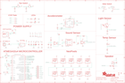

Contents
========

* [PRA3000 > Adafruit Circuit Playground PCB](#pra3000--adafruit-circuit-playground-pcb)
	* [Schematic](#schematic)
	* [PCB](#pcb)
	* [Interactive BOM](#interactive-bom)
	* [OOMP Parts](#oomp-parts)
	* [Images](#images)
	* [Tags](#tags)
  
![][im]
# PRA3000 > Adafruit Circuit Playground PCB

- ID: PROJ-ADAF-3000-STAN-01
- Hex ID: PRA3000
- Name: Adafruit
- Description: Adafruit
- Long Link: [http://oom.lt/PROJ-ADAF-3000-STAN-01](http://oom.lt/PROJ-ADAF-3000-STAN-01)
- Short Link: [http://oom.lt/PRA3000](http://oom.lt/PRA3000)

## Schematic
  

## PCB
  

## Interactive BOM

- Interactive BOM page: [ibom.html](https://htmlpreview.github.io/?https://github.com/oomlout/oomlout_OOMP_projects/blob/main/PROJ-ADAF-3000-STAN-01/kicad/bom/ibom.html)

## OOMP Parts
  

|OOMP ID|Name|Identifier|
| :---: | :---: | :---: |
|UNMATCHED-UNMATCHED-X-UNMATCHED-01||BATT, CN1, IC1, IC2, IC4, SP1, SWITCH, U1, U2, Y1|
|[CAPC-0603-X-NF100-V50](https://github.com/oomlout/oomlout_OOMP_parts/tree/main/CAPC-0603-X-NF100-V50/)|[SMD (0603) 100 nF Capacitor (Ceramic) 50v](https://github.com/oomlout/oomlout_OOMP_parts/tree/main/CAPC-0603-X-NF100-V50/)|[C1](https://github.com/oomlout/oomlout_OOMP_parts/tree/main/CAPC-0603-X-NF100-V50/)|
|[CAPC-0603-X-UF1-V25](https://github.com/oomlout/oomlout_OOMP_parts/tree/main/CAPC-0603-X-UF1-V25/)|[SMD (0603) 1 uF Capacitor (Ceramic) 25v](https://github.com/oomlout/oomlout_OOMP_parts/tree/main/CAPC-0603-X-UF1-V25/)|[C2, C3, C5, C6, C7, C9](https://github.com/oomlout/oomlout_OOMP_parts/tree/main/CAPC-0603-X-UF1-V25/)|
|[CAPC-0805-X-UF10-V10](https://github.com/oomlout/oomlout_OOMP_parts/tree/main/CAPC-0805-X-UF10-V10/)|[SMD (0805) 10 uF Capacitor (Ceramic) 10v](https://github.com/oomlout/oomlout_OOMP_parts/tree/main/CAPC-0805-X-UF10-V10/)|[C4, C8](https://github.com/oomlout/oomlout_OOMP_parts/tree/main/CAPC-0805-X-UF10-V10/)|
|DIOD-S123-X-UNMATCHED-01||D1, D2|
|[DIOD-S323-X-K4148-01](https://github.com/oomlout/oomlout_OOMP_parts/tree/main/DIOD-S323-X-K4148-01/)|[SMD (SOD-323) Diode](https://github.com/oomlout/oomlout_OOMP_parts/tree/main/DIOD-S323-X-K4148-01/)|[D4](https://github.com/oomlout/oomlout_OOMP_parts/tree/main/DIOD-S323-X-K4148-01/)|
|[LEDS-0805-R-STAN-01](https://github.com/oomlout/oomlout_OOMP_parts/tree/main/LEDS-0805-R-STAN-01/)|[SMD (0805) Red LED](https://github.com/oomlout/oomlout_OOMP_parts/tree/main/LEDS-0805-R-STAN-01/)|[L](https://github.com/oomlout/oomlout_OOMP_parts/tree/main/LEDS-0805-R-STAN-01/)|
|[LEDS-3535-RGB-K2812-01](https://github.com/oomlout/oomlout_OOMP_parts/tree/main/LEDS-3535-RGB-K2812-01/)|[SMD (3535) Smart Controller (WS2812B) RGB LED](https://github.com/oomlout/oomlout_OOMP_parts/tree/main/LEDS-3535-RGB-K2812-01/)|[LED1, LED2, LED3, LED4, LED5, LED6, LED7, LED8, LED9, LED10](https://github.com/oomlout/oomlout_OOMP_parts/tree/main/LEDS-3535-RGB-K2812-01/)|
|[LEDS-0805-G-STAN-01](https://github.com/oomlout/oomlout_OOMP_parts/tree/main/LEDS-0805-G-STAN-01/)|[SMD (0805) Green LED](https://github.com/oomlout/oomlout_OOMP_parts/tree/main/LEDS-0805-G-STAN-01/)|[PWR](https://github.com/oomlout/oomlout_OOMP_parts/tree/main/LEDS-0805-G-STAN-01/)|
|UNMATCHED-SO23-X-UNMATCHED-01||Q1|
|[RESE-0603-X-O220-01](https://github.com/oomlout/oomlout_OOMP_parts/tree/main/RESE-0603-X-O220-01/)|[SMD (0603) 22 Ohm Resistor](https://github.com/oomlout/oomlout_OOMP_parts/tree/main/RESE-0603-X-O220-01/)|[R1, R2](https://github.com/oomlout/oomlout_OOMP_parts/tree/main/RESE-0603-X-O220-01/)|
|[RESE-0603-X-O102-01](https://github.com/oomlout/oomlout_OOMP_parts/tree/main/RESE-0603-X-O102-01/)|[SMD (0603) 1k Ohm Resistor](https://github.com/oomlout/oomlout_OOMP_parts/tree/main/RESE-0603-X-O102-01/)|[R3, R5, R8](https://github.com/oomlout/oomlout_OOMP_parts/tree/main/RESE-0603-X-O102-01/)|
|[RESE-0603-X-O103-01](https://github.com/oomlout/oomlout_OOMP_parts/tree/main/RESE-0603-X-O103-01/)|[SMD (0603) 10k Ohm Resistor](https://github.com/oomlout/oomlout_OOMP_parts/tree/main/RESE-0603-X-O103-01/)|[R4, R6, R7, R10, R13, R14](https://github.com/oomlout/oomlout_OOMP_parts/tree/main/RESE-0603-X-O103-01/)|
|RESE-0603-X-O1003-01||R9|
|[RESE-0603-X-O203-01](https://github.com/oomlout/oomlout_OOMP_parts/tree/main/RESE-0603-X-O203-01/)|[SMD (0603) 20k Ohm Resistor](https://github.com/oomlout/oomlout_OOMP_parts/tree/main/RESE-0603-X-O203-01/)|[R11](https://github.com/oomlout/oomlout_OOMP_parts/tree/main/RESE-0603-X-O203-01/)|
|RESA-06038-X-O105X4-01||R15, R22|
|[RESE-0603-X-O101-01](https://github.com/oomlout/oomlout_OOMP_parts/tree/main/RESE-0603-X-O101-01/)|[SMD (0603) 100 Ohm Resistor](https://github.com/oomlout/oomlout_OOMP_parts/tree/main/RESE-0603-X-O101-01/)|[R21](https://github.com/oomlout/oomlout_OOMP_parts/tree/main/RESE-0603-X-O101-01/)|
|[BUTA-4628-X-STAN-01](https://github.com/oomlout/oomlout_OOMP_parts/tree/main/BUTA-4628-X-STAN-01/)|[SMD (4628) Pushbutton (Tactile)](https://github.com/oomlout/oomlout_OOMP_parts/tree/main/BUTA-4628-X-STAN-01/)|[RESET](https://github.com/oomlout/oomlout_OOMP_parts/tree/main/BUTA-4628-X-STAN-01/)|
|[BUTA-6060-X-STAN-01](https://github.com/oomlout/oomlout_OOMP_parts/tree/main/BUTA-6060-X-STAN-01/)|[SMD (6060) Pushbutton (Tactile)](https://github.com/oomlout/oomlout_OOMP_parts/tree/main/BUTA-6060-X-STAN-01/)|[SW1, SW2](https://github.com/oomlout/oomlout_OOMP_parts/tree/main/BUTA-6060-X-STAN-01/)|
|UNMATCHED-0402-X-UNMATCHED-01||THM1|
|[VREG-SO235-X-KAP2112K-V33D](https://github.com/oomlout/oomlout_OOMP_parts/tree/main/VREG-SO235-X-KAP2112K-V33D/)|[SMD (SOT-23-5) AP2112K Voltage Regulator 3.3v](https://github.com/oomlout/oomlout_OOMP_parts/tree/main/VREG-SO235-X-KAP2112K-V33D/)|[U3](https://github.com/oomlout/oomlout_OOMP_parts/tree/main/VREG-SO235-X-KAP2112K-V33D/)|

## Images
  
  

|bominteractivefront|bominteractiveback|kicadPcb3d|kicadPcb3dFront|kicadPcb3dBack|kicadSchem|eagleImage|eagleSchemImage|pcbdraw|pcbdrawback|
| :---: | :---: | :---: | :---: | :---: | :---: | :---: | :---: | :---: | :---: |
|||||||||||

## Tags

- hexID: PRA3000
- oompType: PROJ
- oompSize: ADAF
- oompColor: 3000
- oompDesc: STAN
- oompIndex: 01
- oompName: Adafruit Circuit Playground PCB
- sources: All source files from https://github.com/adafruit/Adafruit-Circuit-Playground-PCB (source licence details in srcLicense.md)
- linkBuyPage: http://www.adafruit.com/products/3000
- oompID: PROJ-ADAF-3000-STAN-01
- oompParts: BATT,UNMATCHED-UNMATCHED-X-UNMATCHED-01
- oompParts: C1,CAPC-0603-X-NF100-V50
- oompParts: C2,CAPC-0603-X-UF1-V25
- oompParts: C3,CAPC-0603-X-UF1-V25
- oompParts: C4,CAPC-0805-X-UF10-V10
- oompParts: C5,CAPC-0603-X-UF1-V25
- oompParts: C6,CAPC-0603-X-UF1-V25
- oompParts: C7,CAPC-0603-X-UF1-V25
- oompParts: C8,CAPC-0805-X-UF10-V10
- oompParts: C9,CAPC-0603-X-UF1-V25
- oompParts: CN1,UNMATCHED-UNMATCHED-X-UNMATCHED-01
- oompParts: D1,DIOD-S123-X-UNMATCHED-01
- oompParts: D2,DIOD-S123-X-UNMATCHED-01
- oompParts: D4,DIOD-S323-X-K4148-01
- oompParts: IC1,UNMATCHED-UNMATCHED-X-UNMATCHED-01
- oompParts: IC2,UNMATCHED-UNMATCHED-X-UNMATCHED-01
- oompParts: IC4,UNMATCHED-UNMATCHED-X-UNMATCHED-01
- oompParts: L,LEDS-0805-R-STAN-01
- oompParts: LED1,LEDS-3535-RGB-K2812-01
- oompParts: LED2,LEDS-3535-RGB-K2812-01
- oompParts: LED3,LEDS-3535-RGB-K2812-01
- oompParts: LED4,LEDS-3535-RGB-K2812-01
- oompParts: LED5,LEDS-3535-RGB-K2812-01
- oompParts: LED6,LEDS-3535-RGB-K2812-01
- oompParts: LED7,LEDS-3535-RGB-K2812-01
- oompParts: LED8,LEDS-3535-RGB-K2812-01
- oompParts: LED9,LEDS-3535-RGB-K2812-01
- oompParts: LED10,LEDS-3535-RGB-K2812-01
- oompParts: PWR,LEDS-0805-G-STAN-01
- oompParts: Q1,UNMATCHED-SO23-X-UNMATCHED-01
- oompParts: R1,RESE-0603-X-O220-01
- oompParts: R2,RESE-0603-X-O220-01
- oompParts: R3,RESE-0603-X-O102-01
- oompParts: R4,RESE-0603-X-O103-01
- oompParts: R5,RESE-0603-X-O102-01
- oompParts: R6,RESE-0603-X-O103-01
- oompParts: R7,RESE-0603-X-O103-01
- oompParts: R8,RESE-0603-X-O102-01
- oompParts: R9,RESE-0603-X-O1003-01
- oompParts: R10,RESE-0603-X-O103-01
- oompParts: R11,RESE-0603-X-O203-01
- oompParts: R13,RESE-0603-X-O103-01
- oompParts: R14,RESE-0603-X-O103-01
- oompParts: R15,RESA-06038-X-O105X4-01
- oompParts: R21,RESE-0603-X-O101-01
- oompParts: R22,RESA-06038-X-O105X4-01
- oompParts: RESET,BUTA-4628-X-STAN-01
- oompParts: SP1,UNMATCHED-UNMATCHED-X-UNMATCHED-01
- oompParts: SW1,BUTA-6060-X-STAN-01
- oompParts: SW2,BUTA-6060-X-STAN-01
- oompParts: SWITCH,UNMATCHED-UNMATCHED-X-UNMATCHED-01
- oompParts: THM1,UNMATCHED-0402-X-UNMATCHED-01
- oompParts: U1,UNMATCHED-UNMATCHED-X-UNMATCHED-01
- oompParts: U2,UNMATCHED-UNMATCHED-X-UNMATCHED-01
- oompParts: U3,VREG-SO235-X-KAP2112K-V33D
- oompParts: Y1,UNMATCHED-UNMATCHED-X-UNMATCHED-01
- rawParts: 3.3VTAP,SEWTAP-ALLIGATOR,SEWTAP-ALLIGATOR,SEWALLI,,,
- rawParts: 3V3TAP2,SEWTAP-ALLIGATOR,SEWTAP-ALLIGATOR,SEWALLI,,,
- rawParts: BATT,3-6VDC,CON_JST_PH_2PIN,JSTPH2,JST 2-Pin Right-Angle Connector,,
- rawParts: C1,0.1uF,CAP_CERAMIC0603_NO,0603-NO,Ceramic Capacitors,,
- rawParts: C2,1uF,CAP_CERAMIC0603_NO,0603-NO,Ceramic Capacitors,,
- rawParts: C3,1uF,CAP_CERAMIC0603_NO,0603-NO,Ceramic Capacitors,,
- rawParts: C4,10uF,CAP_CERAMIC0805-NOOUTLINE,0805-NO,Ceramic Capacitors,,
- rawParts: C5,1uF,CAP_CERAMIC0603_NO,0603-NO,Ceramic Capacitors,,
- rawParts: C6,1uF,CAP_CERAMIC0603_NO,0603-NO,Ceramic Capacitors,,
- rawParts: C7,1uF,CAP_CERAMIC0603_NO,0603-NO,Ceramic Capacitors,,
- rawParts: C8,10uF,CAP_CERAMIC0805-NOOUTLINE,0805-NO,Ceramic Capacitors,,
- rawParts: C9,1uF,CAP_CERAMIC0603_NO,0603-NO,Ceramic Capacitors,,
- rawParts: CN1,MicroB USB,USB_MICRO_20329_V2,4UCONN_20329_V2,USB Connectors,,
- rawParts: D1,SCHOTTKY (1A),DIODESOD-123,SOD-123,Diode,,
- rawParts: D2,SCHOTTKY (1A),DIODESOD-123,SOD-123,Diode,,
- rawParts: D4,1N4148,DIODESOD-323,SOD-323,Diode,,
- rawParts: D6,SEWTAP-ALLIGATOR,SEWTAP-ALLIGATOR,SEWALLI,,,
- rawParts: GND3TAP,SEWTAP-ALLIGATOR,SEWTAP-ALLIGATOR,SEWALLI,,,
- rawParts: GNDTAP,SEWTAP-ALLIGATOR,SEWTAP-ALLIGATOR,SEWALLI,,,
- rawParts: GNDTAP2,SEWTAP-ALLIGATOR,SEWTAP-ALLIGATOR,SEWALLI,,,
- rawParts: IC1,ATMEGA32U4-MU,ATMEGA32U4-MU,TQFN44_7MM,http://www.ladyada.net/library/eagle,,
- rawParts: IC2,LMV358MM,LMV358MM,MSOP08,Dual General Purpose, Low Voltage, Rail-to-Rail Output Operational Amplifiers,,
- rawParts: IC4,LIS3DH,ACCEL_LIS3DHTR,LGA16_3X3MM,LIS3DHTR 3-Axis Accelerometer with I2C/SPI Interface,,
- rawParts: IO9,SEWTAP-ALLIGATOR,SEWTAP-ALLIGATOR,SEWALLI,,,
- rawParts: IO10,SEWTAP-ALLIGATOR,SEWTAP-ALLIGATOR,SEWALLI,,,
- rawParts: IO12,SEWTAP-ALLIGATOR,SEWTAP-ALLIGATOR,SEWALLI,,,
- rawParts: L,RED,LED0805_NOOUTLINE,CHIPLED_0805_NOOUTLINE,LED,,
- rawParts: LED1,WS2812B3535,WS2812B3535,LED3535,,,
- rawParts: LED2,WS2812B3535,WS2812B3535,LED3535,,,
- rawParts: LED3,WS2812B3535,WS2812B3535,LED3535,,,
- rawParts: LED4,WS2812B3535,WS2812B3535,LED3535,,,
- rawParts: LED5,WS2812B3535,WS2812B3535,LED3535,,,
- rawParts: LED6,WS2812B3535,WS2812B3535,LED3535,,,
- rawParts: LED7,WS2812B3535,WS2812B3535,LED3535,,,
- rawParts: LED8,WS2812B3535,WS2812B3535,LED3535,,,
- rawParts: LED9,WS2812B3535,WS2812B3535,LED3535,,,
- rawParts: LED10,WS2812B3535,WS2812B3535,LED3535,,,
- rawParts: PWR,GREEN,LED0805_NOOUTLINE,CHIPLED_0805_NOOUTLINE,LED,,
- rawParts: Q1,MMBT2222,TRANSISTOR_NPNWIDE,SOT23-WIDE,NPN Transistor,,
- rawParts: R1,22,RESISTOR_0603_NOOUT,0603-NO,Resistors,,
- rawParts: R2,22,RESISTOR_0603_NOOUT,0603-NO,Resistors,,
- rawParts: R3,1K,RESISTOR_0603_NOOUT,0603-NO,Resistors,,
- rawParts: R4,10K,RESISTOR_0603_NOOUT,0603-NO,Resistors,,
- rawParts: R5,1K,RESISTOR_0603_NOOUT,0603-NO,Resistors,,
- rawParts: R6,10K,RESISTOR_0603_NOOUT,0603-NO,Resistors,,
- rawParts: R7,10K,RESISTOR_0603_NOOUT,0603-NO,Resistors,,
- rawParts: R8,1K,RESISTOR_0603_NOOUT,0603-NO,Resistors,,
- rawParts: R9,100K,RESISTOR_0603_NOOUT,0603-NO,Resistors,,
- rawParts: R10,10K,RESISTOR_0603_NOOUT,0603-NO,Resistors,,
- rawParts: R11,20K,RESISTOR_0603_NOOUT,0603-NO,Resistors,,
- rawParts: R13,10K,RESISTOR_0603_NOOUT,0603-NO,Resistors,,
- rawParts: R14,10K,RESISTOR_0603_NOOUT,0603-NO,Resistors,,
- rawParts: R15,1M,RESISTOR_4PACK_NO,RESPACK_4X0603_NO,Resistor Packs (4 resistors),,
- rawParts: R21,100,RESISTOR_0603_NOOUT,0603-NO,Resistors,,
- rawParts: R22,1M,RESISTOR_4PACK_NO,RESPACK_4X0603_NO,Resistor Packs (4 resistors),,
- rawParts: RESET,KMR2,SWITCH_TACT_SMT4.6X2.8,BTN_KMR2_4.6X2.8,SMT Tact Switches,,
- rawParts: RX,SEWTAP-ALLIGATOR,SEWTAP-ALLIGATOR,SEWALLI,,,
- rawParts: SCL,SEWTAP-ALLIGATOR,SEWTAP-ALLIGATOR,SEWALLI,,,
- rawParts: SDA,SEWTAP-ALLIGATOR,SEWTAP-ALLIGATOR,SEWALLI,,,
- rawParts: SP1,8MM,SPEAKER_BUZZER5MM,BUZZER_SMT_5MM,SPEAKER Source: BuerklinAdded PS12 (for part # PS1240 piezo) http://www.ladyada.net/library/pcb/eaglelibrary.html,,
- rawParts: SW1,EVQQ,SWITCH_TACT_SMT_EVQQ2_SMALL,EVQ-Q2_SMALLER,SMT Tact Switches,,
- rawParts: SW2,EVQQ,SWITCH_TACT_SMT_EVQQ2_SMALL,EVQ-Q2_SMALLER,SMT Tact Switches,,
- rawParts: SWITCH,EG1390,DPDT-EG1390,EG1390,,,
- rawParts: THM1,10K,RESISTOR_0402,_0402,Resistors,,
- rawParts: TP1,MISO,TESTPOINTROUND1.5MM,TESTPOINT_ROUND_1.5MM,Test Point,,
- rawParts: TP2,SCK,TESTPOINTROUND1.5MM,TESTPOINT_ROUND_1.5MM,Test Point,,
- rawParts: TP3,RST,TESTPOINTROUND1.5MM,TESTPOINT_ROUND_1.5MM,Test Point,,
- rawParts: TP4,MOSI,TESTPOINTROUND1.5MM,TESTPOINT_ROUND_1.5MM,Test Point,,
- rawParts: TX,SEWTAP-ALLIGATOR,SEWTAP-ALLIGATOR,SEWALLI,,,
- rawParts: U$2,FIDUCIAL,FIDUCIAL,FIDUCIAL_1MM,Fiducial Alignment Points,EXCLUDE,
- rawParts: U$3,FIDUCIAL,FIDUCIAL,FIDUCIAL_1MM,Fiducial Alignment Points,EXCLUDE,
- rawParts: U$6,FIDUCIAL,FIDUCIAL,FIDUCIAL_1MM,Fiducial Alignment Points,EXCLUDE,
- rawParts: U1,SPW2430,SPW2430HR5H-B,SPW2430HR5H-B,SPW2430HR5H-B - Silicon Microphone,,
- rawParts: U2,ALS-PT19-315C,LIGHT_ALS-PT19-315C,ALS-PT19-315C,ALS-PT19-315C - Analog Light Sensor,,
- rawParts: U3,AP2112K-3.3,VREG_SOT23-5,SOT23-5,SOT23-5 Fixed Voltage Regulators,,
- rawParts: VCC2,SEWTAP-ALLIGATOR,SEWTAP-ALLIGATOR,SEWALLI,,,
- rawParts: Y1,8MHz,RESONATORSMD,RESONATOR-SMD,Resonator,,

[im]: kicadPcb3d_450.png
