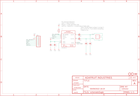

Contents
========

* [PRA3006 > Adafruit](#pra3006--adafruit)
	* [Schematic](#schematic)
	* [Interactive BOM](#interactive-bom)
	* [OOMP Parts](#oomp-parts)
	* [Images](#images)
	* [Tags](#tags)
  
![][im]
# PRA3006 > Adafruit

- ID: PROJ-ADAF-3006-STAN-01
- Hex ID: PRA3006
- Name: Adafruit
- Description: Adafruit
- Long Link: [http://oom.lt/PROJ-ADAF-3006-STAN-01](http://oom.lt/PROJ-ADAF-3006-STAN-01)
- Short Link: [http://oom.lt/PRA3006](http://oom.lt/PRA3006)

## Schematic
  

## Interactive BOM

- Interactive BOM page: [ibom.html](https://htmlpreview.github.io/?https://github.com/oomlout/oomlout_OOMP_projects/blob/main/PROJ-ADAF-3006-STAN-01/kicad/bom/ibom.html)

## OOMP Parts
  

|OOMP Parts|
| :---: |
|C1,CAPC-0805-X-NF100-V50,C1,0.1uF,CAP_CERAMIC0805-NOOUTLINE,0805-NO,Ceramic Capacitors,,|
|C2,CAPC-0805-X-UF10-V10,C2,10uF,CAP_CERAMIC0805-NOOUTLINE,0805-NO,Ceramic Capacitors,,|
|C4,CAPC-0805-X-UNMATCHED-01,C4,220pF,CAP_CERAMIC0805-NOOUTLINE,0805-NO,Ceramic Capacitors,,|
|C5,CAPC-0805-X-UNMATCHED-01,C5,220pF,CAP_CERAMIC0805-NOOUTLINE,0805-NO,Ceramic Capacitors,,|
|FB1,UNMATCHED-0805-X-UNMATCHED-01,FB1,Ferrite,FERRITE-0805NO,0805-NO,Ferrite Bead,,|
|FB2,UNMATCHED-0805-X-UNMATCHED-01,FB2,Ferrite,FERRITE-0805NO,0805-NO,Ferrite Bead,,|
|JP1,HEAD-I01-X-PI07-01,FID1,FIDUCIAL,FIDUCIAL,FIDUCIAL_1MM,Fiducial Alignment Points,EXCLUDE,|
|R1,RESE-0805-X-O105-01,FID2,FIDUCIAL,FIDUCIAL,FIDUCIAL_1MM,Fiducial Alignment Points,EXCLUDE,|
|U1,UNMATCHED-UNMATCHED-X-UNMATCHED-01,JP1,,HEADER-1X7THICKER,1X07_ROUND_76,PIN HEADER,,|
|X1,UNMATCHED-UNMATCHED-X-UNMATCHED-01,R1,1M,RESISTOR0805_NOOUTLINE,0805-NO,Resistors,,|

## Images
  
  

|kicadPcb3d|kicadPcb3dFront|kicadPcb3dBack|eagleImage|eagleSchemImage|
| :---: | :---: | :---: | :---: | :---: |
||||||

## Tags

- hexID: PRA3006
- oompType: PROJ
- oompSize: ADAF
- oompColor: 3006
- oompDesc: STAN
- oompIndex: 01
- oompName: Adafruit MAX98357 I2S Amp Breakout
- sources: All source files from https://github.com/adafruit/Adafruit-MAX98357-I2S-Amp-Breakout (source licence details in srcLicense.md)
- linkBuyPage: http://www.adafruit.com/products/3006
- oompID: PROJ-ADAF-3006-STAN-01
- oompParts: C1,CAPC-0805-X-NF100-V50
- oompParts: C2,CAPC-0805-X-UF10-V10
- oompParts: C4,CAPC-0805-X-UNMATCHED-01
- oompParts: C5,CAPC-0805-X-UNMATCHED-01
- oompParts: FB1,UNMATCHED-0805-X-UNMATCHED-01
- oompParts: FB2,UNMATCHED-0805-X-UNMATCHED-01
- oompParts: JP1,HEAD-I01-X-PI07-01
- oompParts: R1,RESE-0805-X-O105-01
- oompParts: U1,UNMATCHED-UNMATCHED-X-UNMATCHED-01
- oompParts: X1,UNMATCHED-UNMATCHED-X-UNMATCHED-01
- rawParts: C1,0.1uF,CAP_CERAMIC0805-NOOUTLINE,0805-NO,Ceramic Capacitors,,
- rawParts: C2,10uF,CAP_CERAMIC0805-NOOUTLINE,0805-NO,Ceramic Capacitors,,
- rawParts: C4,220pF,CAP_CERAMIC0805-NOOUTLINE,0805-NO,Ceramic Capacitors,,
- rawParts: C5,220pF,CAP_CERAMIC0805-NOOUTLINE,0805-NO,Ceramic Capacitors,,
- rawParts: FB1,Ferrite,FERRITE-0805NO,0805-NO,Ferrite Bead,,
- rawParts: FB2,Ferrite,FERRITE-0805NO,0805-NO,Ferrite Bead,,
- rawParts: FID1,FIDUCIAL,FIDUCIAL,FIDUCIAL_1MM,Fiducial Alignment Points,EXCLUDE,
- rawParts: FID2,FIDUCIAL,FIDUCIAL,FIDUCIAL_1MM,Fiducial Alignment Points,EXCLUDE,
- rawParts: JP1,,HEADER-1X7THICKER,1X07_ROUND_76,PIN HEADER,,
- rawParts: R1,1M,RESISTOR0805_NOOUTLINE,0805-NO,Resistors,,
- rawParts: U$9,MOUNTINGHOLE2.5,MOUNTINGHOLE2.5,MOUNTINGHOLE_2.5_PLATED,Mounting Hole,EXCLUDE,
- rawParts: U$10,MOUNTINGHOLE2.5,MOUNTINGHOLE2.5,MOUNTINGHOLE_2.5_PLATED,Mounting Hole,EXCLUDE,
- rawParts: U1,MAX98357A,AUDIOAMP_MAX98357,QFN16_3MM,MAX98357 - 3.2W I2S Mono Audio Amp,,
- rawParts: X1,,TERMBLOCK_1X2,TERMBLOCK_1X2-3.5MM,3.5mm Terminal block,,

[im]: kicadPcb3d_450.png
