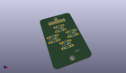
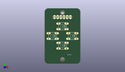
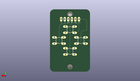
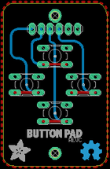
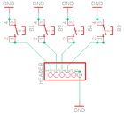

Contents
========

* [PRA3015 > Adafruit](#pra3015--adafruit)
	* [Schematic](#schematic)
	* [Interactive BOM](#interactive-bom)
	* [OOMP Parts](#oomp-parts)
	* [Images](#images)
	* [Tags](#tags)
  
![][im]
# PRA3015 > Adafruit

- ID: PROJ-ADAF-3015-STAN-01
- Hex ID: PRA3015
- Name: Adafruit
- Description: Adafruit
- Long Link: [http://oom.lt/PROJ-ADAF-3015-STAN-01](http://oom.lt/PROJ-ADAF-3015-STAN-01)
- Long Link: [http://oom.lt/PRA3015](http://oom.lt/PRA3015)

## Schematic
  
![][schem]
## Interactive BOM

- Interactive BOM page: [ibom.html](https://htmlpreview.github.io/?https://github.com/oomlout/oomlout_OOMP_projects/blob/main/PROJ-ADAF-3015-STAN-01/kicad/bom/ibom.html)

## OOMP Parts
  

|OOMP Parts|
| :---: |
|B1,UNMATCHED-UNMATCHED-UNMATCHED-UNMATCHED-UNMATCHED,B1,,10-XX,B3F-10XX,OMRON SWITCH,,B3F-1000,176432,36M3542,|
|B2,UNMATCHED-UNMATCHED-UNMATCHED-UNMATCHED-UNMATCHED,B2,,10-XX,B3F-10XX,OMRON SWITCH,,B3F-1000,176432,36M3542,|
|B3,UNMATCHED-UNMATCHED-UNMATCHED-UNMATCHED-UNMATCHED,B3,,10-XX,B3F-10XX,OMRON SWITCH,,B3F-1000,176432,36M3542,|
|B4,UNMATCHED-UNMATCHED-UNMATCHED-UNMATCHED-UNMATCHED,B4,,10-XX,B3F-10XX,OMRON SWITCH,,B3F-1000,176432,36M3542,|
|HEADER,UNMATCHED-UNMATCHED-UNMATCHED-UNMATCHED-UNMATCHED,HEADER,,PINHD-1X6,1X06,PIN HEADER,,,,,|

## Images
  
  

|kicadPcb3d|kicadPcb3dFront|kicadPcb3dBack|eagleImage|eagleSchemImage|
| :---: | :---: | :---: | :---: | :---: |
||||||

## Tags

- hexID: PRA3015
- oompType: PROJ
- oompSize: ADAF
- oompColor: 3015
- oompDesc: STAN
- oompIndex: 01
- oompName: Adafruit PiGRRL PCB
- sources: All source files from https://github.com/adafruit/Adafruit-PiGRRL-PCB (source licence details in srcLicense.md)
- linkBuyPage: http://www.adafruit.com/products/3015
- oompID: PROJ-ADAF-3015-STAN-01
- oompParts: B1,UNMATCHED-UNMATCHED-UNMATCHED-UNMATCHED-UNMATCHED
- oompParts: B2,UNMATCHED-UNMATCHED-UNMATCHED-UNMATCHED-UNMATCHED
- oompParts: B3,UNMATCHED-UNMATCHED-UNMATCHED-UNMATCHED-UNMATCHED
- oompParts: B4,UNMATCHED-UNMATCHED-UNMATCHED-UNMATCHED-UNMATCHED
- oompParts: HEADER,UNMATCHED-UNMATCHED-UNMATCHED-UNMATCHED-UNMATCHED
- rawParts: B1,,10-XX,B3F-10XX,OMRON SWITCH,,B3F-1000,176432,36M3542,
- rawParts: B2,,10-XX,B3F-10XX,OMRON SWITCH,,B3F-1000,176432,36M3542,
- rawParts: B3,,10-XX,B3F-10XX,OMRON SWITCH,,B3F-1000,176432,36M3542,
- rawParts: B4,,10-XX,B3F-10XX,OMRON SWITCH,,B3F-1000,176432,36M3542,
- rawParts: HEADER,,PINHD-1X6,1X06,PIN HEADER,,,,,

[im]: kicadPcb3d_450.png
[schem]: eagleSchemImage.png
