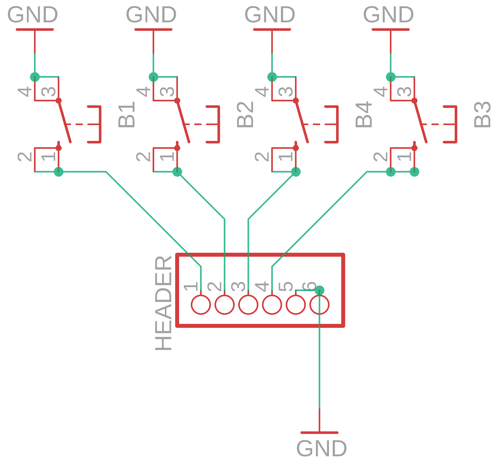
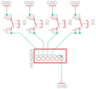

Contents
========

* [PRA3015 > Adafruit PiGRRL PCB](#pra3015--adafruit-pigrrl-pcb)
	* [Schematic](#schematic)
	* [PCB](#pcb)
	* [Interactive BOM](#interactive-bom)
	* [OOMP Parts](#oomp-parts)
	* [Images](#images)
	* [Tags](#tags)
  
![][im]
# PRA3015 > Adafruit PiGRRL PCB

- ID: PROJ-ADAF-3015-STAN-01
- Hex ID: PRA3015
- Name: Adafruit
- Description: Adafruit
- Long Link: [http://oom.lt/PROJ-ADAF-3015-STAN-01](http://oom.lt/PROJ-ADAF-3015-STAN-01)
- Short Link: [http://oom.lt/PRA3015](http://oom.lt/PRA3015)

## Schematic
  

## PCB
  

## Interactive BOM

- Interactive BOM page: [ibom.html](https://htmlpreview.github.io/?https://github.com/oomlout/oomlout_OOMP_projects/blob/main/PROJ-ADAF-3015-STAN-01/kicad/bom/ibom.html)

## OOMP Parts
  

|OOMP ID|Name|Identifier|
| :---: | :---: | :---: |
|UNMATCHED-UNMATCHED-X-UNMATCHED-01||B1, B2, B3, B4|
|[HEAD-I01-X-PI06-01](https://github.com/oomlout/oomlout_OOMP_parts/tree/main/HEAD-I01-X-PI06-01/)|[2.54 mm 6 Pin Header](https://github.com/oomlout/oomlout_OOMP_parts/tree/main/HEAD-I01-X-PI06-01/)|[HEADER](https://github.com/oomlout/oomlout_OOMP_parts/tree/main/HEAD-I01-X-PI06-01/)|

## Images
  
  

|bominteractivefront|bominteractiveback|kicadPcb3d|kicadPcb3dFront|kicadPcb3dBack|kicadSchem|eagleImage|eagleSchemImage|pcbdraw|pcbdrawback|
| :---: | :---: | :---: | :---: | :---: | :---: | :---: | :---: | :---: | :---: |
|||||||||||

## Tags

- hexID: PRA3015
- oompType: PROJ
- oompSize: ADAF
- oompColor: 3015
- oompDesc: STAN
- oompIndex: 01
- oompName: Adafruit PiGRRL PCB
- sources: All source files from https://github.com/adafruit/Adafruit-PiGRRL-PCB (source licence details in srcLicense.md)
- linkBuyPage: http://www.adafruit.com/products/3015
- oompID: PROJ-ADAF-3015-STAN-01
- oompParts: B1,UNMATCHED-UNMATCHED-X-UNMATCHED-01
- oompParts: B2,UNMATCHED-UNMATCHED-X-UNMATCHED-01
- oompParts: B3,UNMATCHED-UNMATCHED-X-UNMATCHED-01
- oompParts: B4,UNMATCHED-UNMATCHED-X-UNMATCHED-01
- oompParts: HEADER,HEAD-I01-X-PI06-01
- rawParts: B1,,10-XX,B3F-10XX,OMRON SWITCH,,B3F-1000,176432,36M3542,
- rawParts: B2,,10-XX,B3F-10XX,OMRON SWITCH,,B3F-1000,176432,36M3542,
- rawParts: B3,,10-XX,B3F-10XX,OMRON SWITCH,,B3F-1000,176432,36M3542,
- rawParts: B4,,10-XX,B3F-10XX,OMRON SWITCH,,B3F-1000,176432,36M3542,
- rawParts: HEADER,,PINHD-1X6,1X06,PIN HEADER,,,,,

[im]: kicadPcb3d_450.png
