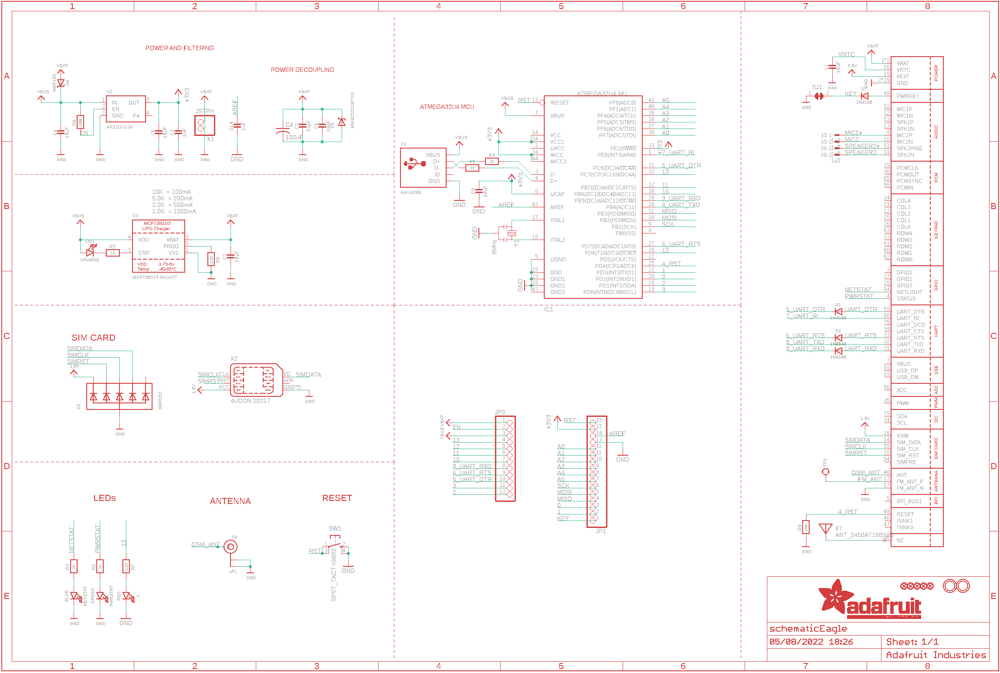
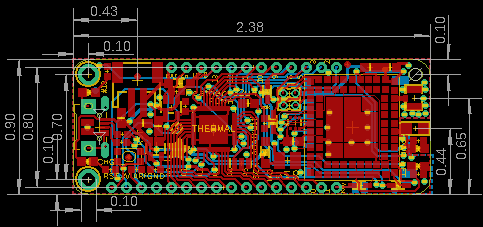
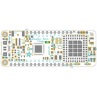
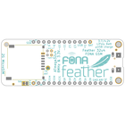
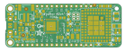
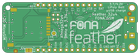

Contents
========

* [PRA3027 > Adafruit Feather 32u4 FONA PCB](#pra3027--adafruit-feather-32u4-fona-pcb)
	* [Schematic](#schematic)
	* [PCB](#pcb)
	* [Interactive BOM](#interactive-bom)
	* [OOMP Parts](#oomp-parts)
	* [Images](#images)
	* [Tags](#tags)
  
![][im]
# PRA3027 > Adafruit Feather 32u4 FONA PCB

- ID: PROJ-ADAF-3027-STAN-01
- Hex ID: PRA3027
- Name: Adafruit
- Description: Adafruit
- Long Link: [http://oom.lt/PROJ-ADAF-3027-STAN-01](http://oom.lt/PROJ-ADAF-3027-STAN-01)
- Short Link: [http://oom.lt/PRA3027](http://oom.lt/PRA3027)

## Schematic
  

## PCB
  

## Interactive BOM

- Interactive BOM page: [ibom.html](https://htmlpreview.github.io/?https://github.com/oomlout/oomlout_OOMP_projects/blob/main/PROJ-ADAF-3027-STAN-01/kicad/bom/ibom.html)

## OOMP Parts
  

|OOMP ID|Name|Identifier|
| :---: | :---: | :---: |
|[CAPC-0805-X-UF10-V10](https://github.com/oomlout/oomlout_OOMP_parts/tree/main/CAPC-0805-X-UF10-V10/)|[SMD (0805) 10 uF Capacitor (Ceramic) 10v](https://github.com/oomlout/oomlout_OOMP_parts/tree/main/CAPC-0805-X-UF10-V10/)|[C1, C3, C6, C8, C9](https://github.com/oomlout/oomlout_OOMP_parts/tree/main/CAPC-0805-X-UF10-V10/)|
|CAPC-0805-X-PF33-01||C2|
|CAPX-UNMATCHED-X-UF100-01||C4|
|CAPC-0805-X-PF10-01||C5|
|[CAPC-0603-X-UF1-V25](https://github.com/oomlout/oomlout_OOMP_parts/tree/main/CAPC-0603-X-UF1-V25/)|[SMD (0603) 1 uF Capacitor (Ceramic) 25v](https://github.com/oomlout/oomlout_OOMP_parts/tree/main/CAPC-0603-X-UF1-V25/)|[C7, C14](https://github.com/oomlout/oomlout_OOMP_parts/tree/main/CAPC-0603-X-UF1-V25/)|
|LEDS-0805-O-STAN-01||CHG|
|[DIOD-S323-X-K4148-01](https://github.com/oomlout/oomlout_OOMP_parts/tree/main/DIOD-S323-X-K4148-01/)|[SMD (SOD-323) Diode](https://github.com/oomlout/oomlout_OOMP_parts/tree/main/DIOD-S323-X-K4148-01/)|[D1, D3, D7, D9](https://github.com/oomlout/oomlout_OOMP_parts/tree/main/DIOD-S323-X-K4148-01/)|
|DIOD-SO363-X-UNMATCHED-01||D2|
|[DIOD-S123-X-KMBR120-01](https://github.com/oomlout/oomlout_OOMP_parts/tree/main/DIOD-S123-X-KMBR120-01/)|[SMD (SOD-123) MBR120 Diode](https://github.com/oomlout/oomlout_OOMP_parts/tree/main/DIOD-S123-X-KMBR120-01/)|[D4](https://github.com/oomlout/oomlout_OOMP_parts/tree/main/DIOD-S123-X-KMBR120-01/)|
|DIOD-S123-X-UNMATCHED-01||D5|
|UNMATCHED-UNMATCHED-X-UNMATCHED-01||IC1, U1, X1, X2, X3, X5, X6, X7, Y1|
|[HEAD-I01-X-PI16-01](https://github.com/oomlout/oomlout_OOMP_parts/tree/main/HEAD-I01-X-PI16-01/)|[2.54 mm 16 Pin Header](https://github.com/oomlout/oomlout_OOMP_parts/tree/main/HEAD-I01-X-PI16-01/)|[JP1](https://github.com/oomlout/oomlout_OOMP_parts/tree/main/HEAD-I01-X-PI16-01/)|
|[HEAD-I01-X-PI12-01](https://github.com/oomlout/oomlout_OOMP_parts/tree/main/HEAD-I01-X-PI12-01/)|[2.54 mm 12 Pin Header](https://github.com/oomlout/oomlout_OOMP_parts/tree/main/HEAD-I01-X-PI12-01/)|[JP3](https://github.com/oomlout/oomlout_OOMP_parts/tree/main/HEAD-I01-X-PI12-01/)|
|[LEDS-0805-R-STAN-01](https://github.com/oomlout/oomlout_OOMP_parts/tree/main/LEDS-0805-R-STAN-01/)|[SMD (0805) Red LED](https://github.com/oomlout/oomlout_OOMP_parts/tree/main/LEDS-0805-R-STAN-01/)|[L](https://github.com/oomlout/oomlout_OOMP_parts/tree/main/LEDS-0805-R-STAN-01/)|
|[LEDS-0805-L-STAN-01](https://github.com/oomlout/oomlout_OOMP_parts/tree/main/LEDS-0805-L-STAN-01/)|[SMD (0805) Blue LED](https://github.com/oomlout/oomlout_OOMP_parts/tree/main/LEDS-0805-L-STAN-01/)|[NETSTAT](https://github.com/oomlout/oomlout_OOMP_parts/tree/main/LEDS-0805-L-STAN-01/)|
|[LEDS-0805-G-STAN-01](https://github.com/oomlout/oomlout_OOMP_parts/tree/main/LEDS-0805-G-STAN-01/)|[SMD (0805) Green LED](https://github.com/oomlout/oomlout_OOMP_parts/tree/main/LEDS-0805-G-STAN-01/)|[PWRSTAT](https://github.com/oomlout/oomlout_OOMP_parts/tree/main/LEDS-0805-G-STAN-01/)|
|[RESE-0603-X-O102-01](https://github.com/oomlout/oomlout_OOMP_parts/tree/main/RESE-0603-X-O102-01/)|[SMD (0603) 1k Ohm Resistor](https://github.com/oomlout/oomlout_OOMP_parts/tree/main/RESE-0603-X-O102-01/)|[R1, R2, R3](https://github.com/oomlout/oomlout_OOMP_parts/tree/main/RESE-0603-X-O102-01/)|
|[RESE-0603-X-O220-01](https://github.com/oomlout/oomlout_OOMP_parts/tree/main/RESE-0603-X-O220-01/)|[SMD (0603) 22 Ohm Resistor](https://github.com/oomlout/oomlout_OOMP_parts/tree/main/RESE-0603-X-O220-01/)|[R4, R5](https://github.com/oomlout/oomlout_OOMP_parts/tree/main/RESE-0603-X-O220-01/)|
|RESE-0603-X-O1003-01||R6|
|[RESE-0603-X-O222-01](https://github.com/oomlout/oomlout_OOMP_parts/tree/main/RESE-0603-X-O222-01/)|[SMD (0603) 2.2k Ohm Resistor](https://github.com/oomlout/oomlout_OOMP_parts/tree/main/RESE-0603-X-O222-01/)|[R7, R8](https://github.com/oomlout/oomlout_OOMP_parts/tree/main/RESE-0603-X-O222-01/)|
|RESE-0603-X-UNMATCHED-01||R9|
|BUTA-UNMATCHED-X-STAN-01||SW1|
|UNMATCHED-SO235-X-UNMATCHED-01||U2, U3|
|CAPX-UNMATCHED-X-NF100-01||X4|

## Images
  
  

|bominteractivefront|bominteractiveback|kicadPcb3d|kicadPcb3dFront|kicadPcb3dBack|eagleImage|eagleSchemImage|pcbdraw|pcbdrawback|
| :---: | :---: | :---: | :---: | :---: | :---: | :---: | :---: | :---: |
||||||||||

## Tags

- hexID: PRA3027
- oompType: PROJ
- oompSize: ADAF
- oompColor: 3027
- oompDesc: STAN
- oompIndex: 01
- oompName: Adafruit Feather 32u4 FONA PCB
- sources: All source files from https://github.com/adafruit/Adafruit-Feather-32u4-FONA-PCB (source licence details in srcLicense.md)
- linkBuyPage: http://www.adafruit.com/products/3027
- oompID: PROJ-ADAF-3027-STAN-01
- oompParts: C1,CAPC-0805-X-UF10-V10
- oompParts: C2,CAPC-0805-X-PF33-01
- oompParts: C3,CAPC-0805-X-UF10-V10
- oompParts: C4,CAPX-UNMATCHED-X-UF100-01
- oompParts: C5,CAPC-0805-X-PF10-01
- oompParts: C6,CAPC-0805-X-UF10-V10
- oompParts: C7,CAPC-0603-X-UF1-V25
- oompParts: C8,CAPC-0805-X-UF10-V10
- oompParts: C9,CAPC-0805-X-UF10-V10
- oompParts: C14,CAPC-0603-X-UF1-V25
- oompParts: CHG,LEDS-0805-O-STAN-01
- oompParts: D1,DIOD-S323-X-K4148-01
- oompParts: D2,DIOD-SO363-X-UNMATCHED-01
- oompParts: D3,DIOD-S323-X-K4148-01
- oompParts: D4,DIOD-S123-X-KMBR120-01
- oompParts: D5,DIOD-S123-X-UNMATCHED-01
- oompParts: D7,DIOD-S323-X-K4148-01
- oompParts: D9,DIOD-S323-X-K4148-01
- oompParts: IC1,UNMATCHED-UNMATCHED-X-UNMATCHED-01
- oompParts: JP1,HEAD-I01-X-PI16-01
- oompParts: JP3,HEAD-I01-X-PI12-01
- oompParts: L,LEDS-0805-R-STAN-01
- oompParts: NETSTAT,LEDS-0805-L-STAN-01
- oompParts: PWRSTAT,LEDS-0805-G-STAN-01
- oompParts: R1,RESE-0603-X-O102-01
- oompParts: R2,RESE-0603-X-O102-01
- oompParts: R3,RESE-0603-X-O102-01
- oompParts: R4,RESE-0603-X-O220-01
- oompParts: R5,RESE-0603-X-O220-01
- oompParts: R6,RESE-0603-X-O1003-01
- oompParts: R7,RESE-0603-X-O222-01
- oompParts: R8,RESE-0603-X-O222-01
- oompParts: R9,RESE-0603-X-UNMATCHED-01
- oompParts: SW1,BUTA-UNMATCHED-X-STAN-01
- oompParts: U1,UNMATCHED-UNMATCHED-X-UNMATCHED-01
- oompParts: U2,UNMATCHED-SO235-X-UNMATCHED-01
- oompParts: U3,UNMATCHED-SO235-X-UNMATCHED-01
- oompParts: X1,UNMATCHED-UNMATCHED-X-UNMATCHED-01
- oompParts: X2,UNMATCHED-UNMATCHED-X-UNMATCHED-01
- oompParts: X3,UNMATCHED-UNMATCHED-X-UNMATCHED-01
- oompParts: X4,CAPX-UNMATCHED-X-NF100-01
- oompParts: X5,UNMATCHED-UNMATCHED-X-UNMATCHED-01
- oompParts: X6,UNMATCHED-UNMATCHED-X-UNMATCHED-01
- oompParts: X7,UNMATCHED-UNMATCHED-X-UNMATCHED-01
- oompParts: Y1,UNMATCHED-UNMATCHED-X-UNMATCHED-01
- rawParts: C1,10uF,CAP_CERAMIC_0805MP,_0805MP,Ceramic Capacitors,,,,,,
- rawParts: C2,33pF,CAP_CERAMIC0805-NOOUTLINE,0805-NO,Ceramic Capacitors,,,,,,
- rawParts: C3,10µF,CAP_CERAMIC0805-NOOUTLINE,0805-NO,Ceramic Capacitors,,,,,,
- rawParts: C4,100uF,C-USC1210,C1210,CAPACITOR, American symbol,,,,,,
- rawParts: C5,10pF,CAP_CERAMIC0805-NOOUTLINE,0805-NO,Ceramic Capacitors,,,,,,
- rawParts: C6,10µF,CAP_CERAMIC0805-NOOUTLINE,0805-NO,Ceramic Capacitors,,,,,,
- rawParts: C7,1uF,CAP_CERAMIC0603_NO,0603-NO,Ceramic Capacitors,,,,,,
- rawParts: C8,10µF,CAP_CERAMIC0805-NOOUTLINE,0805-NO,Ceramic Capacitors,,,,,,
- rawParts: C9,10uF,CAP_CERAMIC_0805MP,_0805MP,Ceramic Capacitors,,,,,,
- rawParts: C14,1uF,CAP_CERAMIC0603_NO,0603-NO,Ceramic Capacitors,,,,,,
- rawParts: CHG,ORANGE,LED0805_NOOUTLINE,CHIPLED_0805_NOOUTLINE,LED,,,,,,
- rawParts: D1,1N4148,DIODESOD-323,SOD-323,Diode,,,,,,
- rawParts: D2,SMF05C,TVSARRAY_5LANE,SOT363,Voltage Transient Suppressor Array,,,,,,
- rawParts: D3,1N4148,DIODESOD-323,SOD-323,Diode,,,,,,
- rawParts: D4,MBR120,DIODE-SCHOTTKYSOD-123,SOD-123,,,,,,,
- rawParts: D5,MMSZ5231BT1G,DIODE-ZENERSOD123,SOD-123,Zener Diode,,,,,,
- rawParts: D7,1N4148,DIODESOD-323,SOD-323,Diode,,,,,,
- rawParts: D9,1N4148,DIODESOD-323,SOD-323,Diode,,,,,,
- rawParts: IC1,ATMEGA32U4-MU,ATMEGA32U4-MU,TQFN44_7MM,http://www.ladyada.net/library/eagle,,,,,,
- rawParts: JP1,,HEADER-1X16ROUND,1X16_ROUND,PIN HEADER,,,,,,
- rawParts: JP3,,HEADER-1X12,1X12_ROUND,,,,,,,
- rawParts: L,RED,LED0805_NOOUTLINE,CHIPLED_0805_NOOUTLINE,LED,,,,,,
- rawParts: NETSTAT,BLUE,LED0805_NOOUTLINE,CHIPLED_0805_NOOUTLINE,LED,,,,,,
- rawParts: PWRSTAT,GREEN,LED0805_NOOUTLINE,CHIPLED_0805_NOOUTLINE,LED,,,,,,
- rawParts: R1,1K,RESISTOR_0603_NOOUT,0603-NO,Resistors,,,,,,
- rawParts: R2,1K,RESISTOR_0603_NOOUT,0603-NO,Resistors,,,,,,
- rawParts: R3,1K,RESISTOR_0603_NOOUT,0603-NO,Resistors,,,,,,
- rawParts: R4,22,RESISTOR_0603_NOOUT,0603-NO,Resistors,,,,,,
- rawParts: R5,22,RESISTOR_0603_NOOUT,0603-NO,Resistors,,,,,,
- rawParts: R6,100k,RESISTOR_0603_NOOUT,0603-NO,Resistors,,,,,,
- rawParts: R7,2.2K,RESISTOR_0603_NOOUT,0603-NO,Resistors,,,,,,
- rawParts: R8,2.2K,RESISTOR_0603_NOOUT,0603-NO,Resistors,,,,,,
- rawParts: R9,DNP,RESISTOR_0603_NOOUT,0603-NO,Resistors,,,,,,
- rawParts: SJ1,,SOLDERJUMPER_CLOSED,SOLDERJUMPER_CLOSEDWIRE,Solder Jumper - Closed,,,,,,
- rawParts: SW1,SPST_TACT-KMR2,SPST_TACT-KMR2,KMR2,SMT 6mm switch, EVQQ2 series,,,,,,
- rawParts: TP1,,TESTPOINTROUND1.5MM,TESTPOINT_ROUND_1.5MM,Test Point,,,,,,
- rawParts: U$18,FIDUCIAL,FIDUCIAL,FIDUCIAL_1MM,Fiducial Alignment Points,EXCLUDE,,,,,
- rawParts: U$23,FIDUCIAL,FIDUCIAL,FIDUCIAL_1MM,Fiducial Alignment Points,EXCLUDE,,,,,
- rawParts: U$31,MOUNTINGHOLE2.5,MOUNTINGHOLE2.5,MOUNTINGHOLE_2.5_PLATED,Mounting Hole,EXCLUDE,,,,,
- rawParts: U$32,MOUNTINGHOLE2.5,MOUNTINGHOLE2.5,MOUNTINGHOLE_2.5_PLATED,Mounting Hole,EXCLUDE,,,,,
- rawParts: U$34,FIDUCIAL,FIDUCIAL,FIDUCIAL_1MM,Fiducial Alignment Points,EXCLUDE,,,,,
- rawParts: U$35,FIDUCIAL,FIDUCIAL,FIDUCIAL_1MM,Fiducial Alignment Points,EXCLUDE,,,,,
- rawParts: U$42,FIDUCIAL,FIDUCIAL,FIDUCIAL_1MM,Fiducial Alignment Points,EXCLUDE,,,,,
- rawParts: U1,SIM800H/L,GSM_SIM800L,SIM800L,SIM800K Quad-Band GSM/GPRS Module,,,,,,
- rawParts: U2,AP2112-3.3K,VREG_SOT23-5,SOT23-5,SOT23-5 Fixed Voltage Regulators,,,,,,
- rawParts: U3,MCP73831T-2ACI/OT,MCP73831/2,SOT23-5,MCP73831/2 LIPO Charger,,,,,,
- rawParts: X1,JSTPH,CON_JST_PH_2PIN,JSTPH2,JST 2-Pin Right-Angle Connector,,,,,,
- rawParts: X2,4UCON 20217,SIM_MICRO,4UCONN_20217,Micro SIM Card Holder,,,,,,
- rawParts: X3,microUSB,USB_MICRO_20329_V2,4UCONN_20329_V2,USB Connectors,,,,,,
- rawParts: X4,uFL,ANTENNA_U.FL,U.FL,U.FL Antenna Connector,,,,,,
- rawParts: X5,1x2,87758-0216,87758-0216,2 Pin - 2mm Dual Row Single Wafer, Vertical T/H HDR,,,87758-0216,unknown,94M1513,
- rawParts: X6,1x2,87758-0216,87758-0216,2 Pin - 2mm Dual Row Single Wafer, Vertical T/H HDR,,,87758-0216,unknown,94M1513,
- rawParts: X7,ANT_2450AT18B100,ANTENNA_JOHANSON_2450AT18B100,ANT_2450AT18B100,Johanson 2.4GHz Chip Antenna (1206 Package),,,,,,
- rawParts: Y1,8MHz,RESONATORSMD,RESONATOR-SMD,Resonator,,,,,,

[im]: kicadPcb3d_450.png
